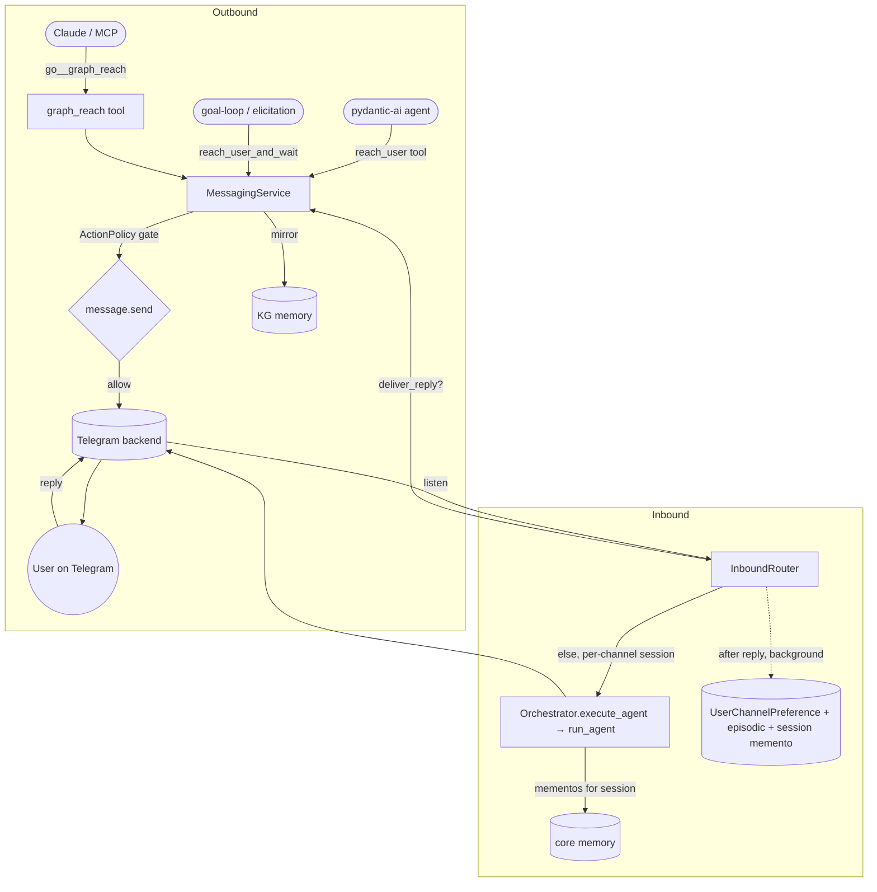

# Messaging reach — Claude & agents message the user (AU-ECO.messaging.messaging-reach-service-governed–4.54)

The **reach** capability lets Claude (over MCP) and the pydantic-ai graph agents
proactively message the operator on whatever channel they last used — Telegram, Slack,
Discord, and 14 other backends — and route the user's replies back into the graph. It
finishes the wiring of the pre-existing `CONCEPT:AU-ECO.messaging.native-backend-abstraction` messaging framework
(`agent_utilities/messaging/`), which shipped 17 backends, a registry, an inbound router,
and KG auto-ingest but had **no live caller**.

## What was added

| Concept | What | Where |
|---|---|---|
| AU-ECO.messaging.messaging-reach-service-governed | `MessagingService` — one core: connected backends, governed sends, routing | `messaging/service.py` |
| AU-ECO.messaging.last-active-channel-routing | Last-active channel state (durable `UserChannelPreference` node) | `messaging/service.py`, `messaging/router.py` |
| AU-ECO.mcp.graph-reach-mcp-tool | `graph_reach` MCP tool + `/graph/reach` REST twin | `mcp/tools/reach_tools.py` |
| AU-ECO.messaging.sending-reply-failed | Inbound router in the host daemon + real graph-agent reply (replaced the stub) | `gateway/daemon.py`, `messaging/router.py` |
| ECO-4.52 | Elicitation bridge — a blocked loop/agent question reaches the user and resumes on reply | `observability/approval_manager.py`, `messaging/service.py` |
| AU-ECO.messaging.universal-agent-reach-user | Universal `reach_user` agent tool | `tools/agent_tools.py`, `tools/tool_registry.py` |
| AU-ECO.messaging.messaging-ontology-shape-so | `MessagingChannel` ontology interface (owl:Class) | `knowledge_graph/ontology/interfaces.py` |

## How routing works (OpenClaw-style)

`reach_user(text)` delivers to the user's **last-active channel**: every inbound message
updates a durable `UserChannelPreference` node; `reach_user` reads the most recent one and
falls back to the configured default (`MESSAGING_DEFAULT_PLATFORM` /
`MESSAGING_DEFAULT_CHANNEL`) so a fresh system still works. Every send passes the
fail-closed **ActionPolicy** gate (`message.send`, default `auto_notify`) and is mirrored
into KG conversational memory (`kg_ingest`), so history is recallable cross-platform.

## Flow

```mermaid
flowchart TD
    subgraph Outbound
        Claude([Claude / MCP]) -->|go__graph_reach| Reach[graph_reach tool]
        Agent([pydantic-ai agent]) -->|reach_user tool| SVC
        Loop([goal-loop / elicitation]) -->|reach_user_and_wait| SVC
        Reach --> SVC[MessagingService]
        SVC -->|ActionPolicy gate| Gate{message.send}
        Gate -->|allow| Backend[(Telegram backend)]
        SVC -->|mirror| KG[(KG memory)]
        Backend --> User((User on Telegram))
    end
    subgraph Inbound
        User -->|reply| Backend
        Backend -->|listen| Router[InboundRouter]
        Router -->|deliver_reply?| SVC
        Router -->|else, per-channel session| Universal[Orchestrator.execute_agent → run_agent]
        Universal -->|mementos for session| Mem[(core memory)]
        Universal --> Backend
        Router -.->|after reply, background| Pref[(UserChannelPreference + episodic + session memento)]
    end
```

`graph-os` (the GraphOS MCP entrypoint) auto-starts the `InboundRouter` whenever a backend
token is configured (default-on, no opt-in flag) — as an always-on **co-service** of that
process (`agent_utilities.mcp.co_service_supervisor.start_co_services`, wired into
`mcp/kg_server.py`'s `mcp_server()`), sharing that process's already-verified
`GraphSession`/identity instead of minting a second one. `gateway/daemon.py` (the separate
KG host daemon, `graph-os-daemon`) deliberately does **not** run it, so the host's CPU-bound
maintenance (codebase ingestion, relevance sweeps) can never starve the inbound reply loop —
see [Deployment](#deployment) below. When the user's reply answers a question a loop
asked, `deliver_reply` resolves the waiting future and the message is **not** re-routed;
otherwise the chat turn runs the **universal graph agent**.

## The reply IS the universal graph agent (ECO-4.78)

Messaging is **thin transport**. An inbound chat turn is not handled by a bespoke
messaging-only reply path — it IS a run of the one universal orchestration pipeline
(`Orchestrator.execute_agent` → `run_agent`, `orchestration/`), session-scoped per channel
(`session = messaging:{platform}:{channel_id}`). That single path natively provides
everything the router used to hand-roll:

- **Continuity** comes from the **core memory**: `run_agent` primes each run with the recent
  compressed **mementos** for this session source (`get_recent_mementos`, `memento_source`),
  and after the reply the just-finished turn is compressed into a memento under the **same**
  source (background). So turn 2 sees turn 1 — without any messaging-specific recall query.
- **Dynamic capabilities** — the graph dynamically resolves specialists / skills / A2A /
  swarms and fleet tools; a request that needs e.g. GitHub reaches
  `graph_orchestrate(execute_agent)` for the github specialist, all governed by the
  fail-closed ActionPolicy gate (OS-5.24). No bespoke delegation code in the messaging layer.

The universal run is wrapped in a hard `MESSAGING_REPLY_TIMEOUT` (default 45s): a slow or
hung graph run must still answer, so on timeout/error the reply degrades to a **plain-chat
completion** (`_plain_chat_reply`). That fallback keeps the **local-default / `/claude`**
responder selection (AU-ECO.messaging.model-routed-inbound-responder) — every fallback reply is tagged with who answered
(`[local]` / `[claude]`) — and carries image attachments to the vision model (ECO-4.67).
`MESSAGING_AGENT` names which agent the universal path routes a chat turn to (default the
`messaging-assistant` identity); an unresolved name still flows through the full
orchestration graph, which is exactly the dynamic-delegation behaviour we want.

## Instinctive reactions (AU-ECO.messaging.messaging-renderer-core-reaction → core ECO-4.79/4.81)

The agent reacts to your messages with an emoji where the platform supports it — 👍 to
acknowledge a request, ❤️ for praise/thanks, etc. **As of ECO-4.79/4.81 the reaction logic is
no longer owned by messaging** — it is a first-class output of the universal orchestrator
(`orchestration/reactions.py`), so every entrypoint inherits it. Messaging is now a
**renderer**: the router's background step calls the core, model-agnostic decision
(`decide_reaction` → an `AgentReaction`) and `MessagingService.render_reaction()` paints it
via the backend's `send_reaction` (Telegram `setMessageReaction` is implemented; other
backends expose `send_reaction` and degrade gracefully where unsupported). The cheap tool-free
decision works even on local models that can't call tools; set `REACTIONS=0` to
disable. Full design + the renderer contract for the
other surfaces: [`reactions.md`](reactions.md).

## Voice & image input (ECO-4.67/4.68)

- **Voice (ECO-4.68):** a voice note / audio with no text is transcribed via the
  audio-transcriber Whisper backend (`transcribe_voice`, lazy-loaded, off the event loop)
  and the transcript flows through the normal path — so you can just talk. Opt-out
  `MESSAGING_VOICE=0`; model via `MESSAGING_VOICE_MODEL` (default `base`).
- **Image (ECO-4.67):** image attachments are downloaded and passed as inline
  `BinaryContent` to the **vision-capable** model (qwen confirmed), so you can upload a
  picture and ask about it. Images ride the same burst → one multimodal agent turn.

## Burst coalescing (ECO-4.63)

When you fire several messages in quick succession, the agent collapses them into **one
holistic reply with one LLM call** instead of answering each separately. A per-conversation
debounce (`BurstCoalescer`, `messaging/coalescer.py`) accumulates messages and flushes the
batch when you pause for `MESSAGING_BURST_WINDOW_S` (default 2.5s) or `MESSAGING_BURST_MAX_S`
(default 12s) elapses. Per-message side effects that must stay immediate — last-active
channel, KG history ingest, loop-reply delivery, `/commands` — run per message; only the
agent reply (and its single reaction) coalesce. `BurstCoalescer` is a shared core primitive
agent-terminal-ui reuses, so burst behavior is identical across surfaces.

## Conversation history / continuity (ECO-4.78)

Continuity is a property of the **core memory**, not a messaging-specific query. Because each
chat turn runs the universal path session-scoped per channel (above), `run_agent` primes the
run with the recent compressed **mementos** for that session source, and after the reply the
turn (user prompt + assistant reply) is compressed into a memento under the **same** source
(`compress_to_memento(source=session)`), off the reply path. The next turn of the channel
then inherits that continuity through the universal path's native memento priming — there is
no bespoke per-channel history query, no `channel_key` scaffolding, and no recall on the
reply path to stall the answer. The turn is also auto-ingested as **episodic** memory
(`kg_ingest`), which the agent's KG tools can pull **on demand** when a question needs deeper
recall.

## Universal commands (AU-ECO.messaging.single-inbound-command-dispatcher)

Commands are defined once in `agent_utilities/messaging/commands.py` (`COMMANDS`) — the
single source of truth shared by every platform and importable by agent-terminal-ui
(`command_specs()`). On connect the daemon calls `backend.register_commands(...)` on every
backend; each registers the menu where its platform supports a **runtime** command API
(Telegram `setMyCommands`) and no-ops where commands are set via app-manifest/admin
(Slack/Teams/Mattermost) or a separate interaction model (Discord). Regardless of menu
support, commands also work as **typed `/cmd` text on any backend** — the inbound handler
parses a leading `/cmd` and `handle_command` answers built-ins (`/help`, `/status`,
`/tools`); `/claude` and `/skill` fall through to the model/agent. Add a command once and
it appears everywhere.

## Multiple services at once

The router runs **every configured backend concurrently** — set tokens for any of
Telegram, Slack, Teams, Mattermost, Discord, … and the composed serving body
(`messaging/daemon.py`'s `_serve`, driven by `run_forever`) connects and listens on all of
them. Last-active routing stores `platform + channel` per user, so `reach_user` follows the
user to whichever service they last used; `graph_reach action=send` targets a specific
service explicitly.

## Deployment

Messaging ships as **one serving implementation** (`messaging/daemon.run_forever` +
`_serve`) reused by two callers:

1. **Bundled (default).** `graph-os` self-composes messaging as an always-on co-service
   the moment a real channel credential is present — no flag, no second process, no second
   secret. Detection (`co_service_supervisor.detect_composition` →
   `messaging.daemon.configured_platforms`) is a pure config read (installed backend +
   real token/app-id), so the same `AgentConfig` that already configures GraphOS MCP is the
   only place a channel is turned on. The co-service thread runs under the process's
   already-verified `GraphSession`/actor (`knowledge_graph.core.engine_tasks._authorized_background_thread`),
   so it inherits GraphOS MCP's working identity contract instead of independently minting
   one — this is what fixes the historical `mint_graph_session` "missing audience or policy
   revision" crash a separately-configured messaging deployment could hit if its own
   ConfigMap/Secret drifted from GraphOS MCP's.
2. **Standalone (`agent-utilities-messaging`), opt-in scale-out only.** The identical
   serving body also ships as its own console script for a deployment that wants to
   isolate chat load onto a dedicated host/pod. It is not the default topology, is not
   started by anything automatically, and must independently satisfy the same identity
   contract (a correctly configured audience + `KG_POLICY_VERSION`) if deployed — see
   `agent_utilities/messaging/daemon.py`'s `mint_process_identity`.

A deployment that previously ran messaging as its own always-on Deployment/service should
retire it once GraphOS MCP is redeployed with the bundling code. The step-by-step (not
auto-applied) cutover plan is held by the operator outside this public repository — it
narrates a real homelab topology (live hostnames, a real Keycloak realm/client-id) that
should not ship on GitHub — see the rendered `deploy/k8s/production-cell/` assets /
`deploy/swarm/graphos.stack.yml` for where channel tokens now live (the SAME
Secret/ConfigMap GraphOS MCP already reads).

**Replica caution.** A channel that long-polls for updates (Telegram without
`MESSAGING_WEBHOOK_BASE_URL` configured) opens one exclusive stream per bot token,
so running the bundling GraphOS MCP deployment at N>1 replicas will 409-conflict across
replicas sharing that token. Either configure the webhook mode (safe at any replica
count — any pod behind the load balancer can receive the push) or keep the
messaging-carrying deployment at a single replica.

## Configuration

| Setting | Purpose |
|---|---|
| `TELEGRAM_BOT_TOKEN` / `SLACK_BOT_TOKEN` / `MATTERMOST_TOKEN` / `MSTEAMS_APP_ID`… | Enable each backend (auto-detected; multiple may be set together) |
| `MESSAGING_DEFAULT_PLATFORM` | Default platform when no last-active channel (default `telegram`) |
| `MESSAGING_DEFAULT_CHANNEL` | Default channel id for `reach_user` fallback |
| `MESSAGING_AGENT` | Named agent the universal path routes a chat turn to (default the `messaging-assistant` identity; unresolved names still flow through the full orchestration graph) |
| `MESSAGING_CLAUDE_TRIGGER` | Prefix that routes the plain-chat fallback to Claude (default `/claude`) |
| `MESSAGING_CLAUDE_MODEL` | Anthropic model for the Claude route (default `claude-sonnet-4-6`) |
| `MESSAGING_LOCAL_MODEL` | Override the local responder model id |
| `MESSAGING_REPLY_TIMEOUT` | Seconds to wait for the universal graph run before degrading to the plain-chat fallback (default `45`) |
| `ANTHROPIC_API_KEY` | Required for the Claude route |
| `MATTERMOST_URL` / `MATTERMOST_TOKEN` / `MATTERMOST_BOT_USER` | Mattermost (ECO-4.90): server base URL, a Bot Account token, and the bot's username/id (optional — auto-resolved from the token). Inbound runs over the bot WebSocket (`posted` events); outbound posts via the bot REST API |
| `MCP_CLIENT_AUTH` / `OIDC_CLIENT_ID` / `OIDC_CLIENT_SECRET_REF` / `OIDC_AUDIENCE` / `OIDC_TOKEN_URL` | Fleet OIDC client-credentials — the daemon resolves the referenced secret in memory so spawned agents authenticate to the JWT-protected fleet. Never persist the resolved value (AU-ECO.messaging.make-fleet-credentials-present). |

### Mattermost as a first-class platform (ECO-4.90)

Mattermost is a thin, bidirectional adapter exactly like Telegram — the universal
orchestrator is still the ONE agent. **Inbound:** the bot's WebSocket event stream is
consumed (`posted` events), each post normalized into the shared `InboundEvent` the
`InboundRouter` routes; the bot's own posts are dropped (no echo loop). **Outbound:**
`reach_user`/`MessagingService` posts a Markdown reply via the bot REST API (a threaded
reply roots under the originating post id). Like Telegram, the WebSocket is started lazily
by `listen()` (not `connect()`), so a send-only client never opens a duplicate stream.

**Operator provisioning** (the bot account is created out-of-band): in the Mattermost
**System Console → Integrations → Bot Accounts**, enable bot accounts and *Add Bot
Account*; copy its **token** into `MATTERMOST_TOKEN` (store in OpenBao `apps/<service>`),
set `MATTERMOST_URL` to the server URL, then add the bot to the teams/channels it should
listen in and post to (or DM it). Install the extra with
`pip install agent-utilities[messaging-mattermost]`.

### Fleet delegation is native to the universal path (ECO-4.78)

Delegation needs no messaging-specific wiring. Because a chat turn runs the universal path
(`Orchestrator.execute_agent` → `run_agent`), the orchestration graph resolves and binds the
right specialists / skills / MCP fleet tools dynamically and offloads through
`graph_orchestrate(execute_agent)` for a spawned specialist — the same single delegation
core (and one governance/identity path) the rest of agent-utilities uses. A spawned
specialist's own fleet actions remain governed by the fail-closed ActionPolicy gate
(OS-5.24), and a nested spawn authenticates to the jwt-protected fleet via the daemon's
OIDC client-credentials (loaded into its env at startup, `_spawn_auth_headers`). **OpenBao
is the source of truth** for those creds — never a plaintext config/env file.
