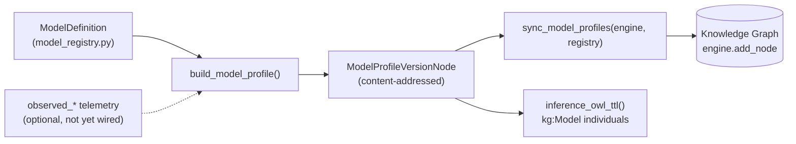
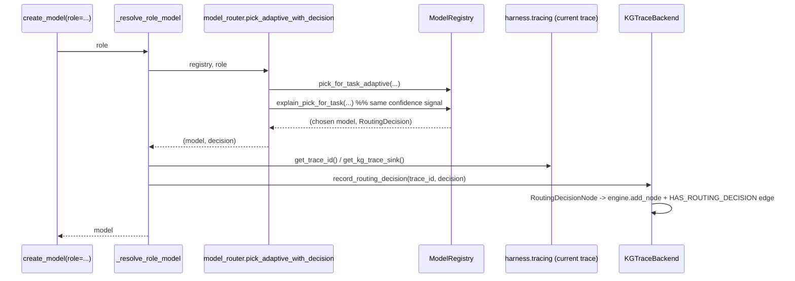

# Model Registry as Graph Resources + Rejected-Alternative Routing Provenance
(CONCEPT:AU-KG.ontology.model-profile-graph-resource / CONCEPT:AU-ORCH.routing.rejected-candidate-provenance / CONCEPT:AU-ORCH.adapter.openai-catalog-verification)

> The `ModelRegistry` already selects a model per task/role
> (`docs/architecture/sampling_profiles.md` covers the sibling sampling-profile axis). This
> closes two gaps: (1) a model's capability/cost/observability contract lived only in code/
> config, never as a graph-addressable resource with provenance; (2) the router picked a
> model but **discarded** what it rejected and why, so model choice could never become an
> evolution target — there was no counterfactual to learn from.

## Why

Skills, prompts, and specs already persist as content-addressed
`ArtifactVersionNode` subclasses (`SkillVersionNode`/`PromptVersionNode`/`SpecVersionNode`) —
first-class, queryable, lifecycle-tracked graph resources. Model definitions had no
equivalent: a `ModelDefinition` was a plain Pydantic object loaded from a registry file,
visible only through `GET /models`. And every routing decision
(`ModelRegistry.pick_for_task`/`pick_for_task_adaptive`) returned exactly one
`ModelDefinition` — the alternatives it walked past, and *why* each was rejected, were
never recorded anywhere.

## Model profiles as graph resources

`ModelProfileVersionNode` (`agent_utilities/models/knowledge_graph.py`) generalizes
`ArtifactVersionNode` to the model-routing vector, content-addressed on
`(provider, model_id, tier, cost, context_window, max_output_tokens)`
(`agent_utilities/models/model_profile.py::profile_version_hash`).

**Honesty contract**: every field is nullable/absent by default. `build_model_profile()`
populates a field ONLY from a real source — the `ModelDefinition` itself, a capability tag
that is a real positive signal (absence of a tag means *unknown*, never *false*), or an
`observed_*` kwarg a caller computed from real telemetry. Every field with no source is
recorded in `unsourced_fields` with a one-line reason (see `_NO_SOURCE_REASONS`) — never a
fabricated or plausible-looking default. Today that covers prompt/KV-cache behaviour,
per-domain quality, prefill/decode latency distributions, availability/error/throttle
history, privacy/residency eligibility, and local-serving hardware fields (see
`reports/deferred/lane-5.1-5.2.md` D-5.1-1..3 for the follow-up aggregation work each one
needs).

### Surfaces

Both reachable per *Two surfaces by default*, dispatching through the same
`_execute_tool` core:

- **MCP**: `ontology_model_profile(action="list"|"sync"|"get"|"owl")`
  (`agent_utilities/mcp/tools/ontology_tools.py`).
- **REST**: `GET /ontology/model-profiles`, `GET /ontology/model-profiles/{model_id}`,
  `POST /ontology/model-profiles/sync` (`agent_utilities/gateway/ontology_api.py`), plus the
  collapsed action-routed twin at `POST /ontology/model-profiles`
  (`ACTION_TOOL_ROUTES` in `kg_server.py`).

`list` never writes to the KG (a live projection from the active registry); `sync` upserts
one `ModelProfileVersionNode` per configured model (bounded — one write per configured
model, never per request); `get` reads the persisted node when synced, else falls back to
the live projection so the tool is useful before the first sync.

## Rejected-alternative routing provenance

`ModelRegistry.explain_pick_for_task()` (`agent_utilities/models/model_registry.py`) wraps
the existing `pick_for_task`/`pick_for_task_adaptive` — it **delegates the actual choice**
to them (so the explanation can never disagree with the live picker) and additionally scores
every candidate in the eligible pool: tag match, tier rank under the same
`_TIER_PRIORITY` table the picker uses, a derived score, and — for every non-chosen
candidate — a `rejection_reason` (missing required tag(s), or a worse tier rank for the
requested complexity). The result is bounded to `MAX_ROUTING_CANDIDATES` (8) regardless of
registry size, so persisting one decision per routing call never writes an unbounded dump.

`model_factory._resolve_role_model` (the same function every `create_model(role=...)` call
already used for role-based routing) now also calls `explain_pick_for_task` and, when a KG
trace sink is installed AND a trace is active, persists a `RoutingDecisionNode` attached to
the current trace via `RegistryEdgeType.HAS_ROUTING_DECISION`
(`KGTraceBackend.record_routing_decision`, mirroring `record_event`'s existing
Trace→Span/Generation attachment pattern). Recording is best-effort and a complete no-op
when no sink is wired (e.g. unit tests, zero overhead) — the SAME contract
`wrap_model_for_tracing` already uses.

## OpenAI catalogue verification + secret reference

The `openai` provider path in `create_model` (`_provider == "openai"`) previously trusted
`config.openai_api_key` (a plain literal) with no existence check on the configured
`model_id`. Two additive fixes, reusing existing conventions rather than new plumbing:

1. **`core/credentials.py`** gains a fourth, highest-precedence tier:
   `secret_ref > env > file > none`. A provider whose `AgentConfig` carries a
   `<provider>_api_key_ref` field (today: `openai_api_key_ref` /
   `OPENAI_API_KEY_REF`) resolves through the SAME `env://`/`vault://`/`secret://`
   convention already used elsewhere in this repo (e.g.
   `ONTOLOGY_RELEASE_SIGNING_PRIVATE_KEY_REF`), via
   `security.cli_secrets.resolve_runtime_secret_reference` — so an OpenBao-backed key never
   has to be a literal in the process environment. `create_model`'s `openai` branch falls
   back to `CredentialResolver().resolve("openai")` only when neither an explicit `api_key`
   nor the literal `OPENAI_API_KEY` is configured — the SAME resolver the `custom`/`proxy`
   provider path already called, so there is one canonical OpenAI credential source.
2. **`core/openai_catalog.py`** (`verify_openai_model`) calls the live
   `GET /v1/models/{id}` catalogue via `openai.AsyncOpenAI` (already a core dependency
   through `pydantic-ai-slim[openai]` — no new dependency) to confirm a configured model id
   actually exists, rather than assuming it. Wired into a new `agent-utilities-doctor` check,
   `openai_catalog` (static by default: credential-tier + configured-model-count only;
   `live=True` additionally probes the catalogue) — reachable via both the doctor CLI and
   `graph_configure(action="preflight")`.

**Credential-leak boundary**: `verify_openai_model` returns only a class-name-only `error`
(never `str(exc)`, since the `openai` SDK's exception messages can embed the request
URL/headers and therefore the credential); the doctor check reports only booleans/counts/
model ids, never the resolved key. `tests/unit/core/test_openai_catalog.py` proves this with
a fake exception whose message embeds a fake key and asserts the key never survives into the
result, independently re-checked against `PersistencePrivacyGuard` (the repo's `sk-...`
api-token pattern).

## Deferred

Full list in `reports/deferred/lane-5.1-5.2.md` (D-5.1-1..6): the telemetry-aggregation
pipeline behind `observed_*`, local-serving hardware fields on `ModelDefinition`, privacy/
residency declaration, and a pre-existing `KGTraceBackend`/`IntelligenceGraphEngine.add_node`
duck-type mismatch discovered (not introduced) while wiring `record_routing_decision`.
