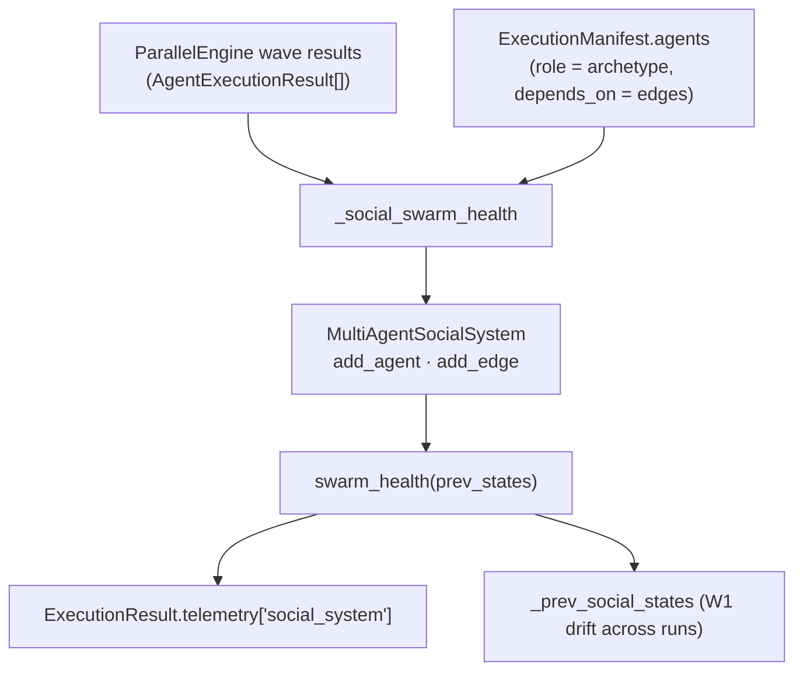

# Multi-Agent Social System (MASS)

> **CONCEPT:AU-ORCH.dispatch.kg-governed-agent-swarm** — KG-Governed Agent Swarm
> **Module:** `agent_utilities/graph/social_system.py` · **Driver:** `agent_utilities/graph/parallel_engine.py`
> **Source:** research-evolution plan b2-01 ("Social Theory Should Be a Structural Prior for Agentic AI")

## Overview

A flat worker pool treats sub-agents as interchangeable and evaluates them on an
aggregate mean — which collapses a team to a homogeneous median and hides
coordinated failure. MASS instead models the swarm as a **social system**
`S = (f, g, G)`:

- **f** — information-exchange: an agent's latent state → an emitted message;
- **g** — influence-dynamics: neighbor messages → a state update;
- **G** — the networked interaction structure the two run over.

From this the paper derives four *structural priors* a flat pool violates, each of
which `MultiAgentSocialSystem` makes first-class:

| Prior | What it means | API |
|---|---|---|
| **Strategic heterogeneity** | agents occupy distinct *archetype* roles; evaluate the distribution, not the mean | `archetype_distribution`, `heterogeneity` |
| **Network-constrained dependence** | an agent observes only its neighborhood `N(i)`, never a global broadcast | `observable_messages` |
| **Co-evolution** | activity reshapes the graph: `G(t+1)=h(G(t),{m})` | `co_evolve`, `degree_centrality` |
| **Distributional instability** | no stationary output distribution — track drift | `swarm_health` (W1) |

## Swarm-health snapshot (P1–P4)

`swarm_health(prev_states)` implements the paper's four null-hypothesis tests as a
single deterministic report:

| Test | Signal | Implementation |
|---|---|---|
| **P1** heterogeneity-by-degree | do high- vs low-degree agents differ? | mean-state gap across the degree median |
| **P2** topology variance | population state dispersion | variance of latent states |
| **P3** co-evolution slope | does connectivity drive state? | OLS slope of state on degree |
| **P4** drift | is the output distribution stationary? | Wasserstein-1 vs the previous run (`population_drift.wasserstein1`) |

Reusing `wasserstein1` keeps one drift detector shared with the evolution
population-health monitor (CONCEPT:AU-AHE.harness.evolutionary-aggregation).

## Live wiring

`ParallelEngine._social_swarm_health` builds the MASS from a finished wave: each
agent's **archetype = its role**, **latent state = success-weighted output
magnitude**, and the **interaction graph from the manifest's `depends_on` DAG
edges**. The snapshot is attached to `ExecutionResult.telemetry["social_system"]`
and the engine retains the previous run's state distribution to compute W1 drift
across runs. Best-effort: <2 agents or any error → no-op.

## Why it matters

- **Heterogeneity** lets routing preserve epistemic diversity instead of
  median-collapse on open-ended tasks.
- **Local observability** (`observable_messages`) scopes influence to the real team
  topology so it cannot be globally short-circuited (extends the ORCH-1.3
  visibility allow-list to graph neighborhoods).
- **Co-evolution** feeds centrality back into routing priority (OS-5.8).
- **Drift** turns "distributional instability" into an alarmable swarm-health signal
  — a conformity cascade or polarization shows up as rising W1.

## Related

- [Global Workspace Attention](global_workspace_attention.md) — winner selection over the same wave.
- Pillar 1: [Graph Orchestration](../pillars/1_graph_orchestration.md).
