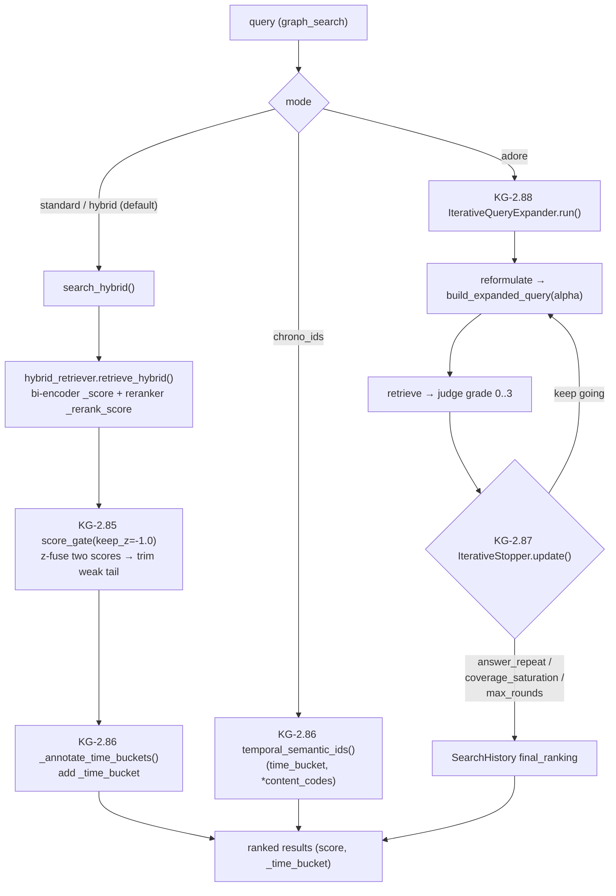
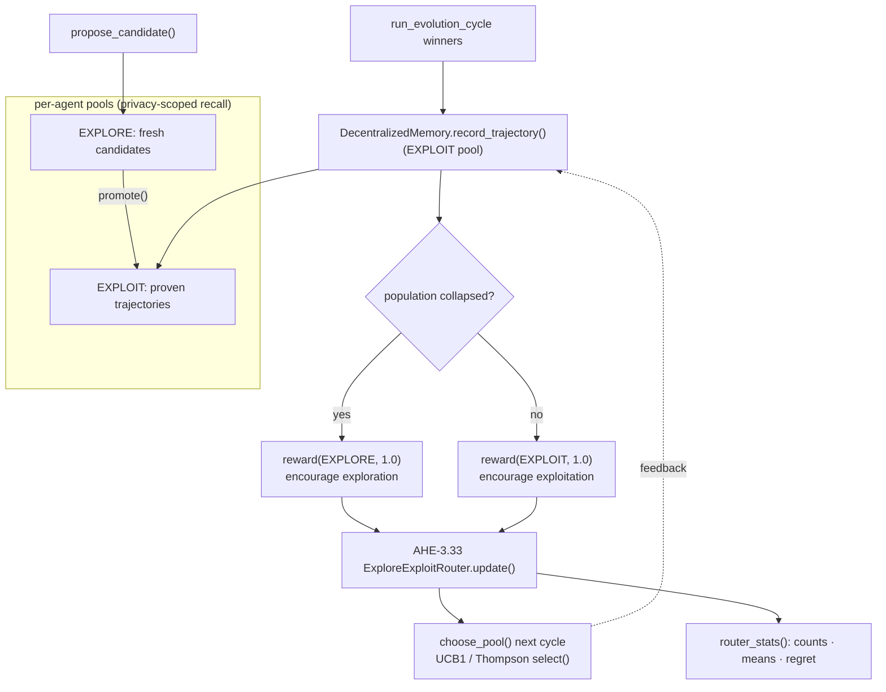
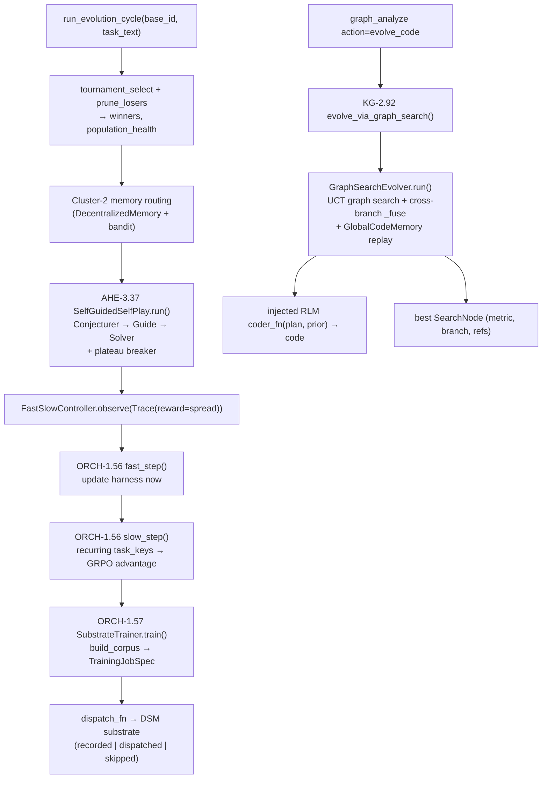
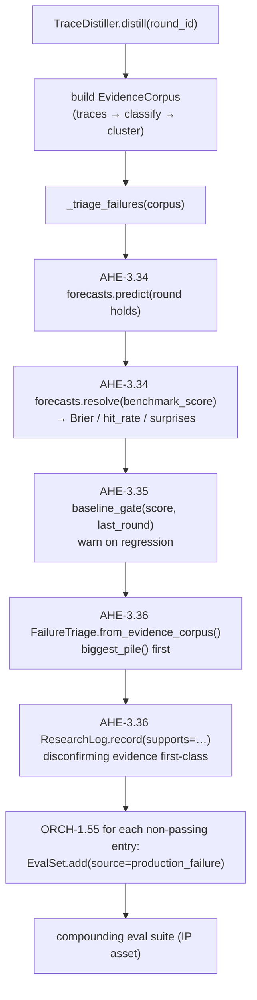
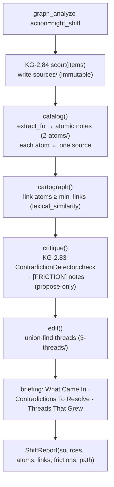
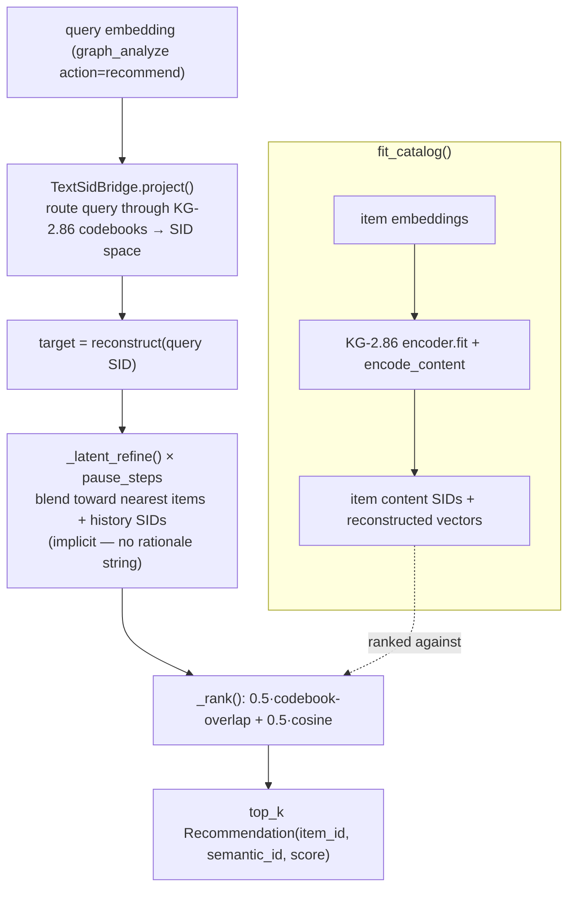
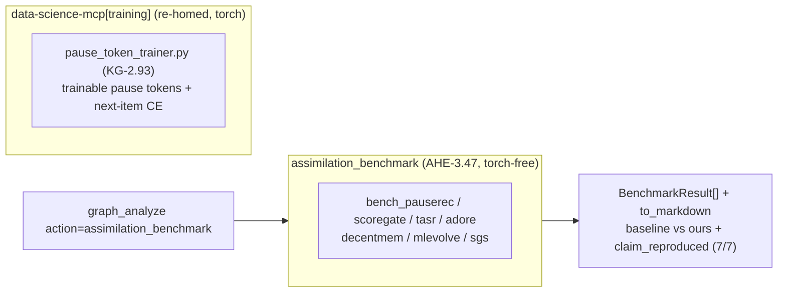

# Multi-Source Assimilation Program

> **17 shipped concepts** assimilated from **8 arXiv papers + 4 articles**, grouped into
> 6 clusters. Every concept is wired into the *one* epistemic-graph kernel through the
> *one* `LoopController`-style evolution/eval loops, surfaced through exactly two MCP
> tools (`graph_search` modes, `graph_analyze` actions).
> **Surfaces:** `agent_utilities/mcp/tools/query_tools.py` (`graph_search`) ·
> `agent_utilities/mcp/tools/analysis_tools.py` (`graph_analyze`).
> **Engine seams:** `knowledge_graph/orchestration/engine_query.py` (`search_hybrid`) ·
> `harness/agentic_evolution_engine.py` (`run_evolution_cycle`) ·
> `harness/continuous_evaluation_engine.py` (`TraceDistiller.distill`).

## Intro — what was assimilated, and the framing

This program took external research (retrieval gating, temporal semantic IDs, adaptive
stopping, iterative expansion, generative recommendation, decentralized agent memory,
self-play, graph-search code evolution, fast/slow training, eval-set optimization,
forecasting/calibration discipline, contradiction detection, and a night-shift research
swarm) and folded each one into the existing substrate rather than bolting on new
services. Three framing principles held throughout:

1. **One ontology / one graph.** Every new artifact is a typed addition over the single
   Evidence/Capability/Concept knowledge graph; the retrieval concepts annotate the same
   result dicts, and the night-shift swarm reuses the same contradiction primitive.
2. **One loop, two distillers.** Self-evolution concepts are wired into a single
   `run_evolution_cycle`; the enterprise/research-craft concepts are wired into a single
   `TraceDistiller.distill`. No concept ships its own scheduler.
3. **Epistemic-graph kernel, edges deterministic.** Most assimilated mechanisms are pure,
   dependency-injected, stdlib/numpy-only functions (no model, no network) so they run
   in the kernel; LLMs are used only at the edges (the ADORE judge, the graph-search
   coder, the night-shift extractor) and are always injectable for testing.

The five clusters below mirror how the code is organized.

---

## C4 Component view — the assimilation surface

How the two MCP surfaces reach the engine seams and the new modules, grouped by cluster.

```mermaid
flowchart TD
    subgraph SURFACES["MCP / REST surfaces"]
        GS["graph_search&nbsp;(query_tools.py)<br/>modes: adore · chrono_ids · rerank · hybrid"]
        GA["graph_analyze&nbsp;(analysis_tools.py)<br/>actions: recommend · evolve_code ·<br/>contradictions · night_shift"]
    end

    subgraph ENGINE["Engine seams"]
        SH["search_hybrid()<br/>engine_query.py"]
        AEE["AgenticEvolutionEngine.run_evolution_cycle()<br/>agentic_evolution_engine.py"]
        TD["TraceDistiller.distill()<br/>continuous_evaluation_engine.py"]
    end

    subgraph RET["Retrieval cluster"]
        SG["KG-2.85 score_gate.py<br/>+ neural_reranker.py"]
        CID["KG-2.86 temporal_semantic_id.py"]
        TASR["KG-2.87 adaptive_stopping.py"]
        ADORE["KG-2.88 iterative_expansion.py"]
        PR["KG-2.93 generative_recommender.py"]
    end

    subgraph MEM["Memory + bandit"]
        DM["KG-2.82 decentralized_memory.py"]
        RT["AHE-3.33 explore_exploit_router.py"]
    end

    subgraph EVO["Self-evolution"]
        SGS["AHE-3.37 self_guided_play.py"]
        GSE["KG-2.92 graph_search_evolution.py"]
        FST["ORCH-1.56 fast_slow_controller.py"]
        ST["ORCH-1.57 substrate_trainer.py"]
    end

    subgraph CRAFT["Eval / research-craft"]
        ESO["ORCH-1.55 eval_set_optimizer.py"]
        FB["AHE-3.34 forecasting.py"]
        BOG["AHE-3.35 baseline_overfit_gate.py"]
        RL["AHE-3.36 research_log.py"]
    end

    subgraph NIGHT["Night-shift"]
        CD["KG-2.83 contradiction_detector.py"]
        NSS["KG-2.84 night_shift.py"]
    end

    GS -->|"default-on"| SH
    GS -->|"mode adore"| ADORE
    GS -->|"mode chrono_ids"| CID
    GA -->|"recommend"| PR
    GA -->|"evolve_code"| AEE
    GA -->|"contradictions"| CD
    GA -->|"night_shift"| NSS

    SH --> SG
    SH --> CID
    ADORE --> TASR
    PR --> CID

    AEE --> SGS
    AEE --> DM
    AEE --> FST
    AEE --> GSE
    DM --> RT
    FST --> ST

    TD --> FB
    TD --> BOG
    TD --> RL
    TD --> ESO

    NSS --> CD
```

---

## Cluster 1 — Retrieval pipeline

All retrieval concepts live under `knowledge_graph/retrieval/`. `ScoreGate` and the
`ChronoID` time-bucket annotation are **default-on** inside `search_hybrid`; `adore`,
`chrono_ids`, and `recommend` are explicit modes/actions on top.

- **CONCEPT:KG-2.85 ScoreGate** — `retrieval/score_gate.py`. `score_gate(...)` fuses a
  bi-encoder `_score` and a cross-encoder `_rerank_score` via per-component
  z-standardization (`fuse_scores`), then keeps everything at/above `keep_z`
  (recall-safe: never below `min_results`, capped at `max_results`). The neural
  cross-encoder lives in `retrieval/neural_reranker.py` (`NeuralCrossEncoderReranker`,
  default model `cross-encoder/ms-marco-MiniLM-L-6-v2`) and is the auto-detected default
  scorer via `reasoning_reranker.py::_auto_scorer` (falls back to
  `LexicalRelevanceScorer` offline). `search_hybrid` calls it with `keep_z=-1.0`.
- **CONCEPT:KG-2.86 ChronoID** — `retrieval/temporal_semantic_id.py`.
  `TemporalSemanticIdEncoder` (`n_codebooks=2`, `codebook_size=64`, `n_time_buckets=16`)
  produces `(time_bucket, *content_codes)`. `time_bucket` is annotated default-on by
  `search_hybrid::_annotate_time_buckets`; full IDs are exposed via `graph_search`
  mode `chrono_ids`.
- **CONCEPT:KG-2.87 TASR** — `retrieval/adaptive_stopping.py`. `IterativeStopper.update`
  returns a `StopDecision` from three training-free signals in priority order:
  `answer_repeat` → `coverage_saturation` → `max_rounds`. It drives the ADORE loop.
- **CONCEPT:KG-2.88 ADORE** — `retrieval/iterative_expansion.py`.
  `IterativeQueryExpander.run` loops reformulate → `build_expanded_query` (alpha-repeat)
  → retrieve → graded-relevance judge (0..3) → `IterativeStopper.update`, returning a
  `SearchHistory`. Surfaced via `graph_search` mode `adore`.

---

## Cluster 2 — Memory + bandit

Wired into `agentic_evolution_engine.py::run_evolution_cycle` (the memory routing step).

- **CONCEPT:KG-2.82 DecentralizedMemory** — `harness/decentralized_memory.py`.
  `DecentralizedMemory` keeps, per agent, an `EXPLOIT` pool (proven trajectories) and an
  `EXPLORE` pool (fresh candidates), plus an append-only `_trace` of `Contribution`s.
  Key methods: `record_trajectory` (→ EXPLOIT), `propose_candidate` (→ EXPLORE),
  `choose_pool` (bandit-routed), `reward`, `promote` (EXPLORE→EXPLOIT),
  `recall` (privacy-scoped to the agent), `router_stats`.
- **CONCEPT:AHE-3.33 ExploreExploitRouter** — `harness/explore_exploit_router.py`.
  `ExploreExploitRouter(strategy="ucb1"|"thompson")`: `select()` / `update(arm, reward)` /
  `scores()` / `stats()` (with cumulative regret). The free function `ucb1_scores(...)`
  is the canonical UCB1 formula, kept as a parity reference to
  `epistemic_graph.quant.ucb1_scores`.

---

## Cluster 3 — Self-evolution

Wired into `agentic_evolution_engine.py`: the main `run_evolution_cycle` (self-play +
fast/slow + trainer) and the `evolve_via_graph_search` alternative (graph-search code
evolution), surfaced via `graph_analyze` action `evolve_code`.

- **CONCEPT:AHE-3.37 SGS self-play** — `harness/self_guided_play.py`. `SelfGuidedSelfPlay`
  runs Conjecturer → `Guide` (relevance/conciseness/naturalness gate) → Solver each
  round, raising difficulty on solved+accepted and breaking plateaus (`plateau_patience`)
  by perturbing difficulty; returns a `PlayReport` (solve_rate, accept_rate, plateaued).
- **CONCEPT:KG-2.92 MLEvolve graph-search** — `harness/graph_search_evolution.py`.
  `GraphSearchEvolver.run` does Monte-Carlo **graph** search (UCT with a progressive
  `exploration_schedule`), cross-branch `_fuse` nodes (reference edges that don't
  backprop), and a `GlobalCodeMemory` replay (`save`/`retrieve` by label/stage). The
  real RLM LLM coder is the injected `coder_fn(plan, prior_code) -> (plan, code)`.
- **CONCEPT:ORCH-1.56 FastSlowController** — `harness/fast_slow_controller.py`.
  `observe(Trace)` collects production traces; `fast_step()` updates the harness now;
  `slow_step()` finds recurring `task_key`s, computes a GRPO group advantage, and calls
  the `trainer_fn` — emitting `SlowUpdate`s. `swap_model` keeps learning across frontier
  swaps.
- **CONCEPT:ORCH-1.57 SubstrateTrainer** — `harness/substrate_trainer.py`. The fast/slow
  trainer: `build_corpus` turns recurring traces into a GRPO `corpus`, `train` assembles a
  `TrainingJobSpec` (`method="grpo"`, `mean_advantage`, `status` recorded/dispatched/
  skipped) and calls the injected `dispatch_fn` (the DSM substrate); `as_trainer_fn`
  adapts it to the controller.

---

## Cluster 4 — Eval / research-craft loop

All four are wired into `continuous_evaluation_engine.py::TraceDistiller.distill`, which
calls `_triage_failures(corpus)` in a fixed order: forecast → baseline-gate → triage →
eval-set-grow. The `ForecastBoard`, `ResearchLog`, and `EvalSet` are constructed once on
the distiller and persist across rounds (compounding IP).

- **CONCEPT:AHE-3.34 ForecastBoard** — `harness/forecasting.py`. `predict(...)` before a
  round, `resolve(...)` after; `brier_score()` (proper, lower=better), `hit_rate`,
  `calibration_curve`, `surprises`, `summary`.
- **CONCEPT:AHE-3.35 baseline/overfit gate** — `harness/baseline_overfit_gate.py`.
  `baseline_gate(candidate, baseline, min_lift)` rejects gains that don't clear the tuned
  baseline; `overfit_smoke_gate(loss_curve)` enforces single-batch loss collapse;
  `PreRunGate` composes both. In `distill` the baseline gate flags regressions vs the
  previous round.
- **CONCEPT:AHE-3.36 FailureTriage + ResearchLog** — `harness/research_log.py`.
  `FailureTriage.from_evidence_corpus` clusters failures into piles; `biggest_pile()`
  surfaces the largest to attack first. `ResearchLog.record(..., supports=...)` makes
  disconfirming evidence first-class (`disconfirming`, `contested`).
- **CONCEPT:ORCH-1.55 EvalSetOptimizer** — `rlm/eval_set_optimizer.py`. Each non-passing
  trace becomes an `EvalCase(source="production_failure")` added to the dedup-safe
  `EvalSet`; `optimize_round`/`compounding_loop` keep the suite monotonically growing —
  failures become permanent evals.

---

## Cluster 5 — Night-shift swarm

Surfaced via `graph_analyze` action `night_shift`; reuses the KG-2.83 contradiction
primitive as its Critic and an optional RLM extractor as its Cataloger.

- **CONCEPT:KG-2.83 ContradictionDetector** — `knowledge_graph/adaptation/contradiction_detector.py`.
  `lexical_similarity` (zero-infra Jaccard+bigram) pre-filters topically related claims;
  `opposes` flags opposing polarity (negation flip / antonym flip / numeric contradiction
  / frame flip). `ContradictionDetector.check` / `scan` return propose-only
  `FrictionFinding`s (never resolves). Also surfaced directly via `graph_analyze` action
  `contradictions`.
- **CONCEPT:KG-2.84 NightShiftSwarm** — `knowledge_graph/research/night_shift.py`.
  `NightShiftSwarm.run_shift` runs five stages over a markdown vault:
  `scout` (sources, read-only thereafter) → `catalog` (atomic notes via `extract_fn`,
  each tracing to a source) → `cartograph` (link each atom to ≥`min_links` peers) →
  `critique` (run ContradictionDetector → `[FRICTION]` notes, propose-only) →
  `edit` (cluster threads + write a morning **briefing**). Returns a `ShiftReport`.
  House rules: every atom comes from a source; never delete (retire instead).

---

## Cluster 6 — PauseRec generative recommender

- **CONCEPT:KG-2.93 PauseRec** — `knowledge_graph/retrieval/generative_recommender.py`.
  `ImplicitReasoningRecommender` adopts PauseRec's *mechanism* at inference time over the
  SIDs from the KG-2.86 `TemporalSemanticIdEncoder` (no backbone training). A query is
  bridged into SID space (`TextSidBridge.project` → shared codebooks), refined for a
  `pause_steps` latent budget (`_latent_refine` blends toward nearby catalog items +
  user history — no decoded rationale), then catalog items are ranked by
  codebook-overlap blended with cosine proximity. Surfaced via `graph_analyze` action
  `recommend`; `explain_budget()` documents that reasoning is implicit.

---

## Source → Concept → Surface mapping

| Source (paper / article) | Concept ID | Module | MCP / REST entry point |
|---|---|---|---|
| ScoreGate: Adaptive Chunk Selection via Dual-Score Statistical Fusion (arXiv 2606.x) | KG-2.85 | `knowledge_graph/retrieval/score_gate.py` (+ `neural_reranker.py`, `reasoning_reranker.py::_auto_scorer`) | `graph_search` — default-on inside `search_hybrid` (also `mode="rerank"`); MCP-only |
| Temporal Semantic IDs / ChronoID | KG-2.86 | `knowledge_graph/retrieval/temporal_semantic_id.py` | `graph_search` `mode="chrono_ids"` + default-on `_annotate_time_buckets`; MCP-only |
| TASR: Training-free Adaptive Stopping for Retrieval | KG-2.87 | `knowledge_graph/retrieval/adaptive_stopping.py` | drives ADORE; reached via `graph_search` `mode="adore"`; MCP-only |
| ADORE: iterative query expansion + graded relevance feedback | KG-2.88 | `knowledge_graph/retrieval/iterative_expansion.py` | `graph_search` `mode="adore"`; MCP-only |
| PauseRec: Implicit Reasoning for LLM-based Generative Recommendation (He et al., arXiv:2606.14142) | KG-2.93 | `knowledge_graph/retrieval/generative_recommender.py` | `graph_analyze` `action="recommend"`; MCP-only |
| Decentralized agent memory (exploit/explore pools + collaboration trace) | KG-2.82 | `harness/decentralized_memory.py` | inside `run_evolution_cycle` (not a direct tool action) |
| Explore/exploit bandit routing (UCB1 / Thompson) | AHE-3.33 | `harness/explore_exploit_router.py` (parity: `epistemic_graph.quant.ucb1_scores`) | inside `DecentralizedMemory` / `run_evolution_cycle` |
| SGS: self-guided self-play (Conjecturer/Solver/Guide) | AHE-3.37 | `harness/self_guided_play.py` | inside `run_evolution_cycle` |
| MLEvolve: Monte-Carlo graph-search code evolution | KG-2.92 | `harness/graph_search_evolution.py` | `graph_analyze` `action="evolve_code"` → `evolve_via_graph_search` |
| FastSlow: fast harness loop + slow weight loop | ORCH-1.56 | `harness/fast_slow_controller.py` | inside `run_evolution_cycle` |
| SubstrateTrainer: GRPO corpus → DSM training-job spec | ORCH-1.57 | `harness/substrate_trainer.py` | inside `FastSlowController.slow_step` (DSM dispatch) |
| EvalSet optimization (failures → new evals) | ORCH-1.55 | `rlm/eval_set_optimizer.py` | inside `TraceDistiller.distill` |
| ForecastBoard: predict-before-resolve calibration | AHE-3.34 | `harness/forecasting.py` | inside `TraceDistiller.distill` |
| Baseline / overfit pre-run gates | AHE-3.35 | `harness/baseline_overfit_gate.py` | inside `TraceDistiller.distill` |
| FailureTriage + ResearchLog (disconfirming evidence) | AHE-3.36 | `harness/research_log.py` | inside `TraceDistiller.distill` |
| ContradictionDetector (friction surface) | KG-2.83 | `knowledge_graph/adaptation/contradiction_detector.py` | `graph_analyze` `action="contradictions"`; MCP-only |
| NightShiftSwarm (vault scout→…→edit) | KG-2.84 | `knowledge_graph/research/night_shift.py` | `graph_analyze` `action="night_shift"`; MCP-only |

All entry points are exposed through FastMCP (`query_tools.py` / `analysis_tools.py`),
not REST; the legacy `graph_search_hybrid_endpoint` is deprecated.

---

## Deferred

- **FST gradient run (ORCH-1.56 / ORCH-1.57).** The fast/slow loop builds the GRPO corpus
  and emits a `TrainingJobSpec`, but the actual weight-update gradient run is dispatched to
  the **DSM** substrate on a **GB10** GPU host. The default `dispatch_fn` records-only
  (`status="recorded" | "skipped_no_substrate"`); the live GPU dispatch is deferred until
  the GB10 substrate is available.
- **Cross-encoder fine-tune (KG-2.85).** `NeuralCrossEncoderReranker` runs a stock
  distilled model (`cross-encoder/ms-marco-MiniLM-L-6-v2`); fine-tuning the reranker on
  our own graded-relevance traces is deferred.

## Empirical parity + training track (Round 5)

Parity is **measured**, not asserted: `harness/assimilation_benchmark.py` (`CONCEPT:AHE-3.47`)
runs each mechanism vs a baseline on a controlled, seeded, CPU-only task and reports the real lift
+ a `claim_reproduced` verdict — surfaced via `graph_analyze action='assimilation_benchmark'`.
**7/7 torch-free mechanisms reproduce their paper's claimed direction** (seed 0).

The PauseRec **training track** — the paper's actual **trainable `<pause>` tokens optimized by
gradient descent** (`CONCEPT:KG-2.93`) — was re-homed to **data-science-mcp**
(`data_science_mcp/training/pause_token_trainer.py`, reached over MCP) so agent-utilities core
stays torch-free (see [AGENTS.md](../../AGENTS.md) "Dependency discipline"). It measured
Recall@3 = 1.00 with vs 0.67 without the trained tokens (torch, CPU); full *scale* reproduction
(paper datasets + GPU training) remains GPU-gated. The **inference-time** deterministic adaptation
(`retrieval/generative_recommender.py`, `bench_pauserec`) is torch-free and stays in core.

