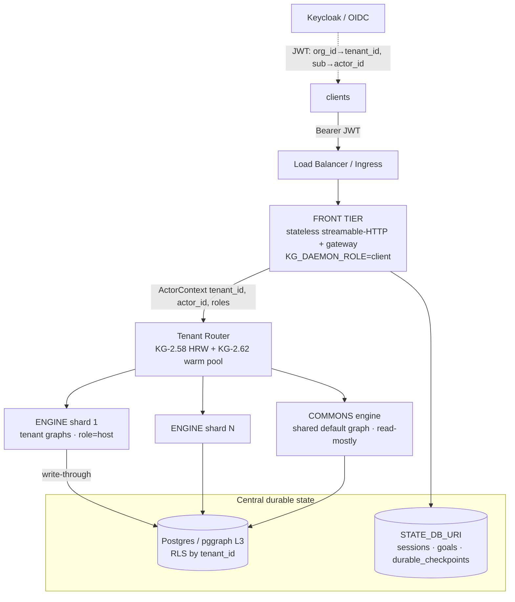
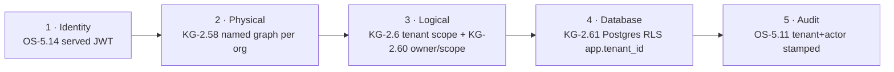
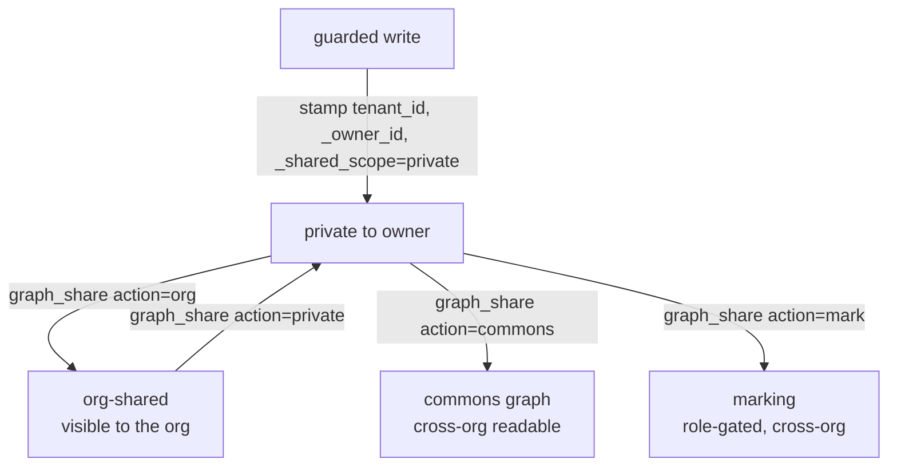

# Multi-Tenant graph-os over Streamable-HTTP

Serving `graph-os` as a **streamable-HTTP MCP surface for thousands of clients**:
hierarchical **org → user** isolation, **private-by-default** memory with an
explicit **commons / markings** sharing path, full **tenant-stamped audit**, and an
**elastic per-tenant engine pool** — all opt-in, so single-tenant/local behaviour
is byte-for-byte unchanged when the flags are off.

Concepts: **OS-5.14** (served identity), **KG-2.58** (tenant→named-graph→shard),
**KG-2.60** (org→user sharing + commons), **KG-2.61** (Postgres RLS), **KG-2.62**
(engine pool), **OS-5.10/5.11** (tenant-scoped fleet + audit). See also
[engine_sharding](engine_sharding.md), [company_brain_runtime](company_brain_runtime.md),
[state_externalization](state_externalization.md).

---

## Topology

One image (`graph-os`), three stateless tiers + central durable state. The cloud
(k8s) and homelab (Swarm) profiles differ only in replica counts and placement —
see [`deploy/`](../../deploy/README.md).

## The five isolation layers (defense in depth)

1. **Identity (OS-5.14).** `ActorIdentityMiddleware` mints `ActorContext{tenant_id,
   actor_id, roles}` from a validated JWT (`org_id→tenant_id`, `sub→actor_id`). The
   **served-security profile** (`apply_served_security_profile`) refuses to serve a
   network transport without `AUTH_JWT_JWKS_URI` (fail-loud, not fail-open) and turns
   on `KG_AUTH_REQUIRED` + `KG_BRAIN_ENFORCE`, so unauthenticated HTTP is rejected and
   the privileged `SYSTEM_ACTOR` fallback is unreachable over the network.
2. **Physical (KG-2.58 + KG-2.60).** Under enforcement, each org routes to its own
   named graph `tenant__<slug>__<base>` — **even on a single engine endpoint** (HRW
   over one endpoint is the identity). Cross-org data is physically separate.
3. **Logical (KG-2.6 + KG-2.60).** On a shared graph, `scope()` injects
   `n.tenant_id = <org>` (the simple, parseable predicate) and a Python-side
   `visible()` filter applies private-by-default owner/scope. Applied at the
   `query_cypher` MCP read chokepoint and `facade.query`.
4. **Database (KG-2.61).** Postgres Row-Level Security keyed on the per-session GUC
   `app.tenant_id` filters rows beneath everything else; `WITH CHECK` blocks
   cross-tenant writes. Apply [`deploy/postgres/tenant_rls.sql`](../../deploy/postgres/tenant_rls.sql).
5. **Audit (OS-5.10/5.11).** Every `RunTrace`, session, and correlation carrier is
   stamped `tenant_id`+`actor_id`+`correlation_id`; `/api/fleet/*` is tenant-scoped
   (an org admin sees its own org; a platform admin sees the fleet).

## Hierarchical org → user + commons sharing (KG-2.60)

The **default graph is the commons.** Data is **private to its owner by default**;
sharing is explicit — by **where** it is placed (promote into the commons graph) or
by **how** it is placed (a mandatory marking).

A reader sees: **own** (`_owner_id == me`) ∪ **org/commons-shared**
(`_shared_scope ∈ {org, commons}`) ∪ **unowned** (legacy/system) ∪ the **commons
graph**. Privileged (`admin`/`system`) actors are unrestricted.

Verbs (MCP tool `graph_share` / `POST /graph/share`):

| action | effect | mechanism |
|---|---|---|
| `org` | visible to the owner's org | in-place `_shared_scope='org'` |
| `commons` | cross-org readable | copy node into the commons graph |
| `mark` | role-gated cross-org | mandatory marking (KG-2.46) |
| `private` | restrict back to owner | `_shared_scope='private'` |

## Elastic per-tenant engine pool (KG-2.62)

`GRAPH_SERVICE_ENDPOINTS` fixes the shard set; the pool is the *elastic* layer within
a process: a bounded **warm set** of per-tenant engine clients (LRU), **hydrate on
miss**, and (when `KG_ENGINE_POOL_DROP_ON_EVICT` is set and L3 mirrors the data) an
engine-side **per-graph unload** to reclaim memory on eviction. Disabled by default
(`KG_ENGINE_POOL_SIZE=0` → per-use construction, today's behaviour).

## Configuration

| Flag | Default | Purpose |
|---|---|---|
| `KG_SERVED_PROFILE` | on | served fail-closed profile for network transports (`0` opts out, dev only) |
| `AUTH_JWT_JWKS_URI` / `_ISSUER` / `_AUDIENCE` | — | OIDC identity; **required** for the served profile |
| `KG_AUTH_REQUIRED` | off | reject unauthenticated HTTP (auto-on under served profile) |
| `KG_BRAIN_ENFORCE` | off | tenant scope + ACL + owner/scope enforcement (auto-on under served profile) |
| `KG_ACL_DEFAULT_ALLOW` | off | deny-on-missing-ACL when enforcing (fail-closed) |
| `KG_DEFAULT_GRAPH` | `__bus__` | the commons graph; tenants route to `tenant__<slug>__<this>` |
| `GRAPH_SERVICE_ENDPOINTS` | one socket | engine shard set (HRW routing) |
| `GRAPH_DB_URI` / `STATE_DB_URI` | — | L3 pggraph (apply RLS) / central session+checkpoint store |
| `KG_ENGINE_POOL_SIZE` | `0` | warm per-tenant engines (elastic pool); `0` = per-use |
| `KG_ENGINE_POOL_DROP_ON_EVICT` | off | unload the tenant graph from the engine on eviction (needs L3) |

## Tracking clients & their agents

"Which agents did client X spawn?" is a tenant-scoped query: the run-wide
`correlation_id` (OS-5.11) links every spawned agent's `RunTrace`, each stamped
`tenant_id`/`actor_id`; `/api/fleet/*` filters by the caller's tenant. External
side-effects carry `x-tenant-id`/`x-actor-id`/`x-correlation-id` so off-box writes
remain joinable to the originating client.

## Verification

Unit + integration: `tests/unit/knowledge_graph/test_tenant_sharing.py`,
`test_tenant_engine_pool.py`, `test_tenant_request_isolation.py`,
`test_fleet_supervisory.py`, `test_postgresql_backend.py`,
`tests/unit/core/test_request_identity.py`. Live: per-tenant named-graph isolation
verified against a running engine; Postgres RLS (isolation + commons + admin-bypass
+ `WITH CHECK`) verified against Postgres 16 with `deploy/postgres/tenant_rls.sql`.
