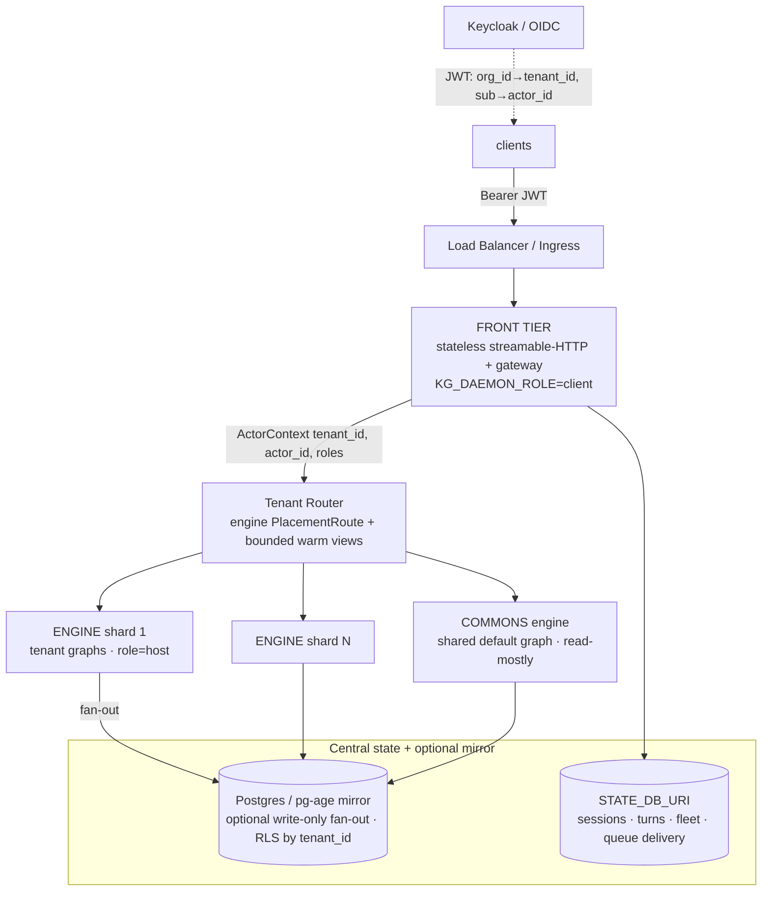
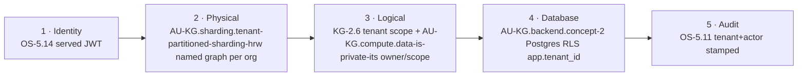
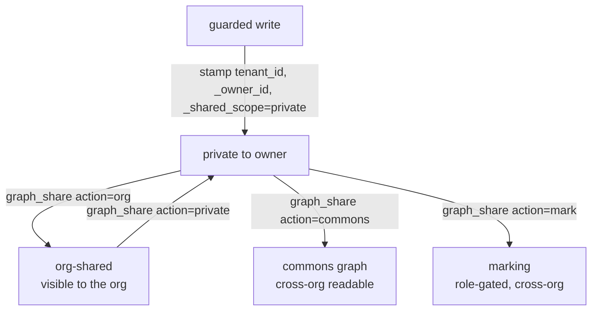

# Multi-Tenant graph-os over Streamable-HTTP

Serving `graph-os` as a **streamable-HTTP MCP surface for thousands of clients**:
hierarchical **org → user** isolation, **private-by-default** memory with an
explicit **commons / markings** sharing path, full **tenant-stamped audit**, and an
**elastic per-tenant engine pool** — all opt-in, so single-tenant/local behaviour
is byte-for-byte unchanged when the flags are off.

Concepts: **OS-5.14** (served identity), **AU-KG.sharding.tenant-partitioned-sharding-hrw** (tenant→named-graph→shard),
**AU-KG.compute.data-is-private-its** (org→user sharing + commons), **AU-KG.backend.concept-2** (Postgres RLS), **AU-KG.sharding.elastic-over-kg-shard**
(engine pool), **AU-OS.safety.ontological-guardrail/5.11** (tenant-scoped fleet + audit). See also
[engine_sharding](engine_sharding.md), [company_brain_runtime](company_brain_runtime.md),
[state_externalization](state_externalization.md).

---

## Topology

One image (`graph-os`), three stateless tiers + central durable state. The cloud
(k8s) and homelab (Swarm) profiles differ only in replica counts and placement —
see [`deploy/`](https://github.com/Knuckles-Team/agent-utilities/blob/main/deploy/README.md).

```mermaid
flowchart TD
    KC[Keycloak / OIDC] -.->|JWT: org_id→tenant_id, sub→actor_id| C[clients]
    C -->|Bearer JWT| LB[Load Balancer / Ingress]
    LB --> F["FRONT TIER<br/>stateless streamable-HTTP + gateway<br/>KG_DAEMON_ROLE=client"]
    F -->|ActorContext tenant_id, actor_id, roles| R["Tenant Router<br/>engine PlacementRoute + bounded warm views"]
    R --> E1["ENGINE shard 1<br/>tenant graphs · role=host"]
    R --> E2[ENGINE shard N]
    R --> CM["COMMONS engine<br/>shared default graph · read-mostly"]
    E1 -->|fan-out| MIRROR
    E2 --> MIRROR
    CM --> MIRROR
    F --> ST
    subgraph DURABLE [Central state + optional mirror]
      MIRROR[("Postgres / pg-age mirror<br/>optional write-only fan-out · RLS by tenant_id")]
      ST[("STATE_DB_URI<br/>sessions · turns · fleet · queue delivery")]
    end
```

## The five isolation layers (defense in depth)

```mermaid
flowchart LR
    A["1 · Identity<br/>OS-5.14 served JWT"] --> B["2 · Physical<br/>AU-KG.sharding.tenant-partitioned-sharding-hrw named graph per org"]
    B --> C["3 · Logical<br/>KG-2.6 tenant scope + AU-KG.compute.data-is-private-its owner/scope"]
    C --> D["4 · Database<br/>AU-KG.backend.concept-2 Postgres RLS app.tenant_id"]
    D --> E["5 · Audit<br/>OS-5.11 tenant+actor stamped"]
```

1. **Identity (OS-5.14).** `ActorIdentityMiddleware` mints `ActorContext{tenant_id,
   actor_id, roles}` from a validated JWT (`org_id→tenant_id`, `sub→actor_id`). The
   **served-security profile** (`apply_served_security_profile`) refuses to serve a
   network transport without a JWT validator, audience, and policy revision
   (fail-loud, not fail-open); unauthenticated HTTP is rejected and no implicit
   identity exists.
2. **Physical (AU-KG.sharding.tenant-partitioned-sharding-hrw + AU-KG.compute.data-is-private-its).** Each org routes to its own
   named graph `tenant__<slug>__<base>` — **even on a single engine endpoint**.
   The engine catalog owns physical placement; cross-org data is separate.
3. **Logical (KG-2.6 + AU-KG.compute.data-is-private-its).** On a shared graph, `scope()` injects
   `n.tenant_id = <org>` (the simple, parseable predicate) and a Python-side
   `visible()` filter applies private-by-default owner/scope. Applied at the
   `query_cypher` MCP read chokepoint and `facade.query`.
4. **Database (AU-KG.backend.concept-2).** Postgres Row-Level Security keyed on the per-session GUC
   `app.tenant_id` filters rows beneath everything else; `WITH CHECK` blocks
   cross-tenant writes. Apply [`deploy/postgres/tenant_rls.sql`](https://github.com/Knuckles-Team/agent-utilities/blob/main/deploy/postgres/tenant_rls.sql).
5. **Audit (AU-OS.safety.ontological-guardrail/5.11).** Every `RunTrace`, session, and correlation carrier is
   stamped `tenant_id`+`actor_id`+`correlation_id`; `/api/fleet/*` is tenant-scoped
   (an org admin sees its own org; a platform admin sees the fleet).

## Hierarchical org → user + commons sharing (AU-KG.compute.data-is-private-its)

The **default graph is the commons.** Data is **private to its owner by default**;
sharing is explicit — by **where** it is placed (promote into the commons graph) or
by **how** it is placed (a mandatory marking).

```mermaid
flowchart TD
    W[guarded write] -->|stamp tenant_id, _owner_id, _shared_scope=private| P[private to owner]
    P -->|graph_share action=org| O["org-shared<br/>visible to the org"]
    P -->|graph_share action=commons| K["commons graph<br/>cross-org readable"]
    P -->|graph_share action=mark| M["marking<br/>role-gated, cross-org"]
    O -->|graph_share action=private| P
```

A reader sees: **own** (`_owner_id == me`) ∪ **org/commons-shared**
(`_shared_scope ∈ {org, commons}`) ∪ **unowned** (legacy/system) ∪ the **commons
graph**. A verified `admin` is unrestricted by owner/scope visibility, while
tenant, session, and ACL boundaries remain mandatory.

Verbs (MCP tool `graph_share` / `POST /graph/share`):

| action | effect | mechanism |
|---|---|---|
| `org` | visible to the owner's org | in-place `_shared_scope='org'` |
| `commons` | cross-org readable | copy node into the commons graph |
| `mark` | role-gated cross-org | mandatory marking (AU-KG.ontology.redact-object-materialize-restricted) |
| `private` | restrict back to owner | `_shared_scope='private'` |

## Per-tenant graph views (AU-KG.sharding.elastic-over-kg-shard)

`GRAPH_SERVICE_ENDPOINTS` declares coordinator contacts. A process owns one engine transport;
tenant graphs are non-owning, session-routed views over that transport. A bounded
LRU may retain those lightweight views, but a miss or eviction never opens or closes
a socket/event-loop thread. Engine-side graph residency remains an engine capacity
decision rather than a client-lifecycle side effect.

## Configuration

| Flag | Default | Purpose |
|---|---|---|
| `AUTH_JWT_JWKS_URI` / `_ISSUER` / `_AUDIENCE` | — | OIDC identity; **required** for every network transport |
| `KG_POLICY_VERSION` | — | required immutable policy revision for verified sessions |
| *(baked-in, no flag)* graph authority | mandatory | verified session + tenant scope + explicit ACL + owner/scope filtering; missing policy infrastructure fails closed |
| `KG_AUTH_TOKEN_REF` / `KG_IDENTITY_OAUTH2` | — | exactly one stdio identity source: provisioned-token reference or OAuth2 client credentials |
| `KG_DEFAULT_GRAPH` | `__bus__` | the commons graph; tenants route to `tenant__<slug>__<this>` |
| `GRAPH_SERVICE_ENDPOINTS` | one socket | stable engine coordinator; placement is resolved from the engine catalog |
| `GRAPH_RAFT_GROUP_ENDPOINTS` | `{}` | explicit group-to-endpoint map for non-production topologies that expose groups separately; ambiguity fails closed |
| `GRAPH_DB_CONNECTION_PROFILE_REF` / `STATE_DB_URI` | — | Secret-backed pg-age mirror profile (apply RLS) / central session, fleet, and queue-delivery support store |
| `KG_ENGINE_POOL_SIZE` | `8` | bounded LRU warm set for retained graph views; it does not create per-tenant transports |
| `KG_ENGINE_POOL_DROP_ON_EVICT` | off | unload the tenant graph from the engine on eviction (needs a pg-age mirror) |

## Tracking clients & their agents

"Which agents did client X spawn?" is a tenant-scoped query: the run-wide
`correlation_id` (OS-5.11) links every spawned agent's `RunTrace`, each stamped
`tenant_id`/`actor_id`; `/api/fleet/*` filters by the caller's tenant. External
side-effects carry `x-tenant-id`/`x-actor-id`/`x-correlation-id` so off-box writes
remain joinable to the originating client.

## Verification

Unit + integration: `tests/unit/knowledge_graph/test_tenant_sharing.py`,
`test_tenant_engine_pool.py`, `test_tenant_request_isolation.py`,
`test_fleet_supervisory.py`, `test_postgresql_backend.py`,
`tests/unit/core/test_request_identity.py`. Live: per-tenant named-graph isolation
verified against a running engine; Postgres RLS (isolation + commons + admin-bypass
+ `WITH CHECK`) verified against Postgres 16 with `deploy/postgres/tenant_rls.sql`.
