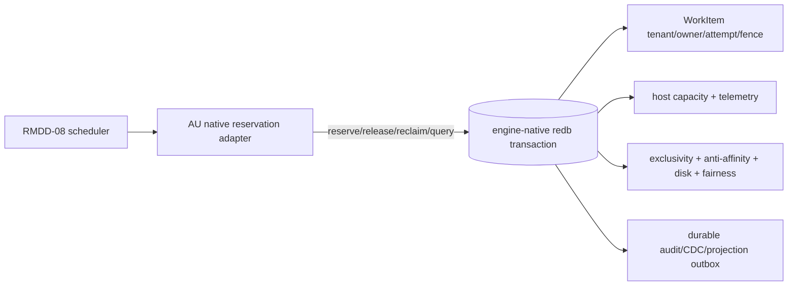

# Native WorkItem resource-reservation boundary

RMDD-27 keeps shared host admission in the engine-native WorkItem transaction.
Agent Utilities only validates the typed request and projects the result into the
RMDD-08 `WorkItemReservationPort`; it does not maintain a second lease, capacity
ledger, lock, JSON file, or queue.

## Immutable WorkItem extension

The existing `repository_request_v1` metadata is retained for RMDD-02 views and
is augmented at WorkItem creation with a nested `resource_reservation` record
(`schema_version: "1"`).  It carries the complete admission assertion:

- profile name/version, weighted CPU/memory/disk/process dimensions;
- concurrency key/limit, repository and branch exclusivity;
- repository identity, explicit branch (or the base reference mapping below),
  fairness group/cost;
- host labels, anti-affinity, target policies, disk policy/watermarks; and
- a `v1:<sha256>` immutable input fingerprint.

Opaque identifiers and target aliases are encoded before generic persistence
sanitisation.  Credentials, paths, command bodies, and raw payloads never enter
the extension.  The native authority rejects an absent, unknown, incomplete, or
future extension version; it never fills missing profile or exclusivity values
from caller assertions.

`branch` is an explicit contract field when supplied.  For legacy-compatible
non-exclusive work, the adapter records `base_ref` as the branch identity in the
extension and preserves the original `base_ref` separately.  A branch-exclusive
request without an explicit branch is refused, so a base-ref interpretation can
never silently authorize a different branch.  Existing WorkItems created before
the extension was populated remain readable but are not reservable until a
governed migration/reconciliation rewrites the extension; no local mirror may
backfill authority.

The profile version and limits are supplied by the reviewed RMDD-08 profile
contract.  Empty values are fail-closed markers, not defaults.  The engine
re-reads the extension and compares every immutable field before consuming host
capacity, inserting exclusivity keys, or adding fairness debt.

## Migration and rollback

Deploy the protocol/client/adapter dark first.  Populate the extension on newly
created WorkItems, shadow-query native status for pre-existing active rows, and
reconcile only with an exact native WorkItem fence.  Enable mutation by profile
after status and restart evidence pass.  Rollback stops new reserve calls,
releases/reclaims native tombstones through the same verbs, and disables the
capability; it never reconstructs held capacity from scheduler fixtures.
