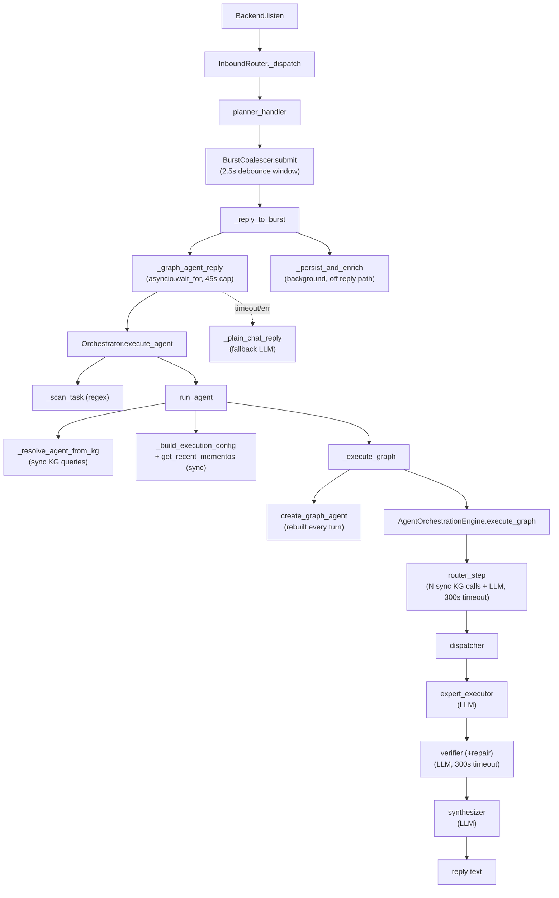
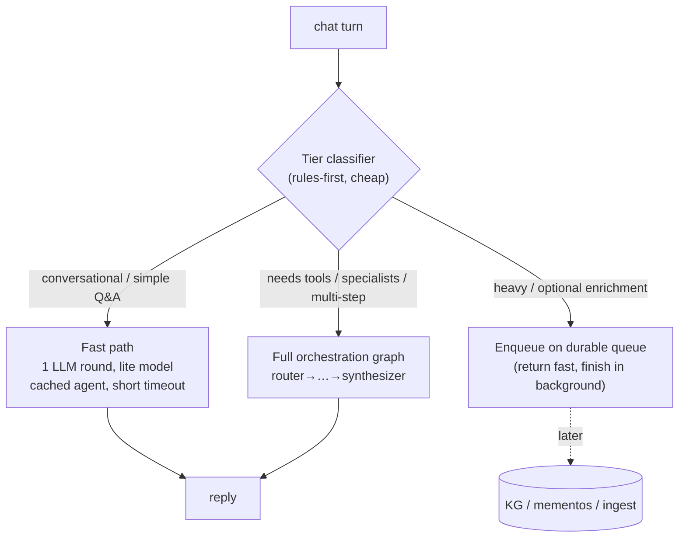
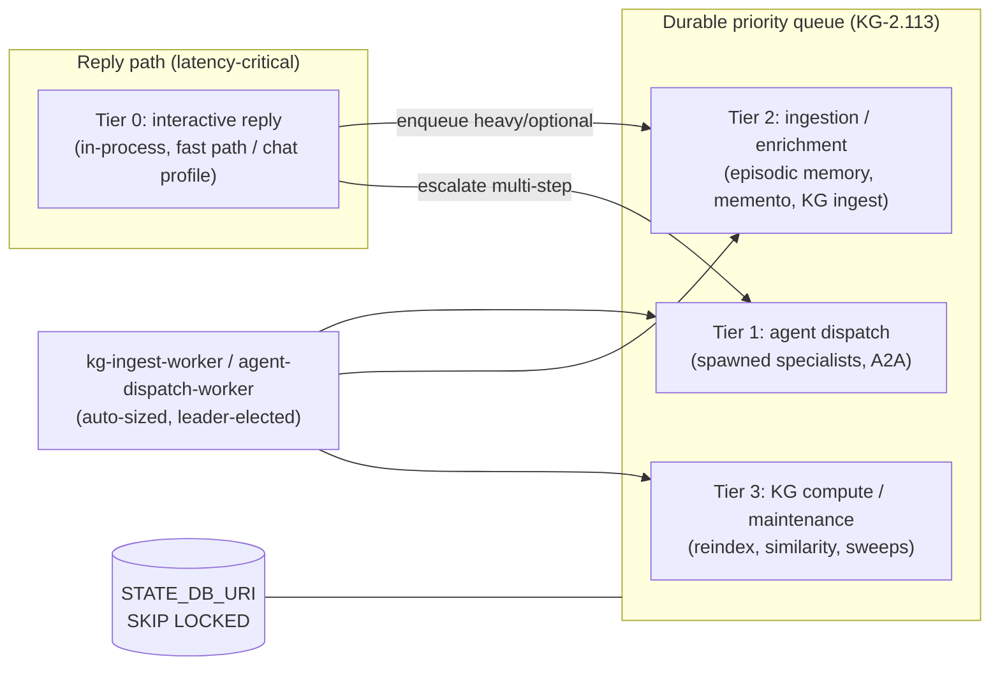

# Non-Blocking Hierarchical Execution

> **Status:** design + measured profiling. This document is the architecture
> output of a performance investigation into why a single simple chat turn on
> the consolidated messaging → universal-graph path (CONCEPT:ECO-4.78) took
> **> 90 seconds**. It records the measured root cause and proposes a universal,
> non-blocking, hierarchical task-queue model built on the *existing* durable
> queue / worker / leadership infrastructure — not a parallel system.
>
> CONCEPT:ORCH-1.21 · ECO-4.78 · KG-2.1 (fast path) · KG-2.55–2.57 (queues) ·
> ORCH-1.45 (queue dispatch) · KG-2.113 (priority queue) · OS-5.16–5.18 (state).

## 1. The hot path (as built)

A chat turn flows:

The **persist/enrich/memento-compress** work (ingest, episodic memory, the
per-session memento) is already correctly pushed off the reply path into a
background task (`_spawn_bg(_persist_and_enrich(...))`, CONCEPT:ECO-4.74). That
part is healthy. The latency is entirely in the **synchronous reply generation**
above it.

## 2. Measured per-stage breakdown

Fixed overhead measured directly in this repo (`AGENT_UTILITIES_TESTING=1`,
engine offline); LLM-round timings are bounded by the configured node timeouts
and gated on vLLM availability.

| Stage | Cost | Notes |
|---|---|---|
| Burst debounce (`MESSAGING_BURST_WINDOW_S`) | **+2.5 s** fixed | Every turn waits for the quiet window before the agent even starts. |
| Cold module import (`agent_runner` chain) | ~6.6 s **once** | First turn after process start only; warm = 0 ms. Not per-turn. |
| `memory/__init__` import chain | ~78 ms once | Pulls `optimization_engine` (synthesis/EWC/CKA). One-time. |
| `_scan_task` | µs | Pure regex — **and currently a no-op (bug, see §4)**. |
| `_resolve_agent_from_kg` | sync KG round-trips | 1–3 `backend.execute` calls on the async path (not `to_thread`). |
| `get_recent_mementos` | 1 sync KG query | On the async path; cheap query, but blocks the loop. |
| `create_graph_agent` (warm) | ~18–20 ms/turn | Rebuilt **every turn**: graph topology + `discover_agents()` + (when configured) `load_mcp_servers_from_config`. Cheap when `mcp_config`/`mcp_url` are `None` (the messaging default), but see §5. |
| Router pre-LLM KG discovery | **N+1 sync calls** | `find_agent_for_tool` **per query word**, plus `search_hybrid`, `find_relevant_policies`, `find_relevant_processes`, `find_matching_team_config`, `designate_specialists` — all synchronous, all on the event loop. |
| **Router LLM round** | up to **300 s** | `DEFAULT_GRAPH_ROUTER_TIMEOUT = 300`. |
| Dispatcher → expert → **verifier (+repair)** → synthesizer | each up to **300 s** | `DEFAULT_GRAPH_VERIFIER_TIMEOUT = 300`. Multiple **sequential** LLM rounds. |

### Root cause of the > 90 s

**A simple chat turn is run through the full multi-agent orchestration graph —
router → planner/dispatcher → expert → verifier(+repair) → synthesizer — which is
several *sequential* LLM rounds, each bounded by a 300-second node timeout, against
`DEFAULT_LLM_BASE_URL = http://vllm.arpa/v1`.** When vLLM is healthy this is still
multi-round latency far above a chat budget; when vLLM is slow/down (the GB10 power
fault, see the workspace memory), the first router round alone can stall for up to
300 s. The messaging layer caps the wait at `MESSAGING_REPLY_TIMEOUT = 45 s` and
then runs the **plain-chat fallback**, which makes *another* LLM call to the *same*
endpoint. The 2.5 s debounce + a stalled first round + cancellation unwind + a
fallback call against the same degraded endpoint is what pushed a single turn past
the 90 s observation cap.

The **fast path exists but is far too narrow**: `is_trivial_query` only matches
utterances of ≤ 6 words that start with a fixed greeting prefix
(`hello`/`hi`/`thanks`/`what can you`…). A normal simple question
("can you summarise this?", "what's the status of X?") does **not** qualify and
takes the full graph. So "simple chat" is exactly the case that is slow.

## 3. The two-tier latency problem, stated plainly

1. **Wrong default altitude.** Chat defaults to *full orchestration*. Full
   orchestration is correct for "do a multi-step task across specialists"; it is
   the wrong default for "answer this message". The universal path is right; its
   *default execution profile* is wrong for the chat entrypoint.
2. **Sync work on the async reply path.** KG resolution, memento priming, and the
   router's discovery calls are synchronous engine round-trips executed directly on
   the event loop, with no `to_thread` and no enqueue-and-return.

## 4. Bugs found while profiling

| Sev | Location | Bug | Fix |
|---|---|---|---|
| **Med (correctness)** | `orchestration/manager.py::_scan_task` | Guarded on `hasattr(self.scanner, "analyze")`; `PromptInjectionScanner` has no `analyze` (only `scan_text`/`scan_conversation`/`evaluate`). The prompt-injection gate on **every** `execute_agent`/`compile_workflow` silently never fired — dead security code. | **Fixed inline** — call `scanner.scan_text(task).is_malicious`. |
| Low | `orchestration/agent_runner.py::_build_execution_config` | Stray `print("DEBUG [agent_runner]: …")` on the spawn path → stdout noise (and a corruption risk for stdio-MCP transport). | **Fixed inline** — converted to `logger.debug`. |
| Arch | `_build_execution_config` / `_execute_graph` | `get_recent_mementos` and `_resolve_agent_from_kg` run synchronous backend calls on the async path. | Flagged (P1) — `to_thread` or pre-prime; see §6. |
| Arch | `graph/_router_impl.py` | `find_agent_for_tool` called **once per query word** (N+1), plus several more sync KG queries, before any LLM. | Flagged (P1/P2) — batch into one engine call / offload to Rust; see §7. |
| Arch | `graph/builder.py::create_agent` | Full graph topology + `discover_agents()` rebuilt on **every** turn; no per-config cache. | Flagged (P1) — cache the built graph; see §6. |

> Only the two clearly-trivial, clearly-correct fixes were applied inline. The
> architectural items are flagged for a reviewed implementation pass.

## 5. `mcp_config` / fleet-probe note

For the messaging assistant, `_build_execution_config` sets `mcp_config=""` and
`mcp_url=""`, so `create_agent` does **not** call `load_mcp_servers_from_config`
and does **not** probe the fleet — good. But any caller that *does* pass an
`mcp_config` (the full graph default is `DEFAULT_MCP_CONFIG`/`DEFAULT_MCP_URL`,
both `None` today) would, per-turn, run `shutil.which` per server + secrets-client
lookups + construct every fleet toolset, and the graph executor would then
`enter_async_context` (connect) each one with a 60 s per-server timeout. This is a
latent O(fleet) probe on the build path that must never reach the chat path.

## 6. Proposed architecture — fast path vs. full orchestration

The universal path stays the **one** path; we make it *tiered* so a turn pays only
for the altitude it needs.

### 6.1 Fast path vs full-orchestration path (P0)

- **Widen the fast-path classifier.** Replace the 6-word greeting allow-list with
  an intent/altitude classifier that is **rules-first** (length, presence of an
  imperative/tool keyword, presence of an attachment, an explicit `/`-command) and
  only escalates to the full graph when the turn genuinely needs tools, specialists,
  or multi-step planning. The fast path runs **one** LLM round on the lite model
  with a **chat-budget timeout** (e.g. 20–30 s, not 300 s).
- **Per-entrypoint execution profile.** `execute_agent` gains an execution profile
  (`chat` vs `task`) that selects fast-path-eligible, `router_timeout` /
  `verifier_timeout` (chat = tens of seconds), and max rounds. The messaging
  entrypoint passes `chat`. This is the *Universal capability* contract: built once
  in the orchestrator, inherited by every entrypoint, rendered per-medium.
- **Align the timeouts.** `MESSAGING_REPLY_TIMEOUT` (45 s) must be ≥ the chat-profile
  node budget, and the chat-profile node budget must be far below 300 s, so a turn
  resolves *inside* the graph instead of being killed and re-tried via plain-chat.
- **Remove the double-LLM tax.** The plain-chat fallback should fire only on a true
  graph error, not as the routine outcome of a 45 s timeout that beat a 300 s round.

### 6.2 Memento priming — pre-prime per session (P0/P1)

`get_recent_mementos(source=session, limit=3)` runs synchronously inside
`_build_execution_config` on the reply path. Make it never block the turn:

- **Session memento cache.** Keep a small per-session LRU cache
  `{session → (mementos, fetched_at)}`. `_build_execution_config` reads the cache
  (zero I/O on the hot path).
- **Background refresh.** The existing `_persist_and_enrich` background task already
  *writes* the new memento after each turn — have it also **refresh the cache** for
  that session in the same background pass. So turn *N+1* reads turn *N*'s memento
  from memory, never from a blocking query.
- **Cold-start.** On a cache miss, fetch via `to_thread` (off the loop) and populate;
  a first turn with no prior mementos simply primes with nothing.
- **Where it lives.** A `SessionMementoCache` in `knowledge_graph/memory/` (core, so
  every entrypoint inherits it), keyed by the same `memento_source` the universal
  path already threads.

### 6.3 Cache the built graph (P1)

`create_graph_agent` rebuilds the entire topology + runs `discover_agents()` every
turn. The topology is a pure function of `(tag_prompts, routing config)`. Cache the
built `Graph` keyed by a hash of that config (invalidated when discovery changes),
so a turn reuses a warm graph. Toolset *connections* stay per-run; only the
*structure* is cached.

## 7. Non-blocking hierarchical task-queue model (P1/P2)

Build on the **existing** durable infrastructure — do not invent a new system:

- `core/state_store.py` — `STATE_DB_URI` durable checkpoints/sessions/queues with
  `SELECT … FOR UPDATE SKIP LOCKED` claims (OS-5.16–5.18).
- `TASK_QUEUE_BACKEND` fail-loud queue backends (KG-2.55–2.57) +
  `compute_ingest_worker_count()` auto-sizing (`core/engine_tasks.py`).
- `AGENT_DISPATCH_BACKEND=queue` + `orchestration/agent_dispatch*.py` (ORCH-1.45),
  drained by the `kg-ingest-worker` / `agent-dispatch-worker` console scripts.
- The hardened priority queue (KG-2.113): buckets 0–3, equality-claim, scheduled /
  blocked / eta, retry → backoff → dead_letter, promotion sweep.
- `core/leadership.py` advisory-lock daemon leadership (OS-5.18).

### Tiers (who enqueues, who drains, backpressure)

- **Tier 0 (reply)** runs *in-process* on the chat profile and returns fast. It
  **enqueues** everything optional (Tier 2/3) and only **escalates** to Tier 1 when
  the turn truly needs orchestration.
- **Tiers 1–3** are the durable priority queue, drained by the existing workers
  (leader-elected via `core/leadership.py`, auto-sized via
  `compute_ingest_worker_count()`). Priority bucket = tier.
- **Backpressure** is the queue's existing claim/retry/backoff/dead-letter machinery
  (KG-2.113); the reply path never blocks on a full queue — it enqueues and returns.
- The **chat reply stays fast** because the only synchronous work on Tier 0 is one
  LLM round (or the cached fast-path); memory writes, ingestion, memento compression,
  enrichment, and any heavy compute are Tier 2/3 work that the workers drain.

This is exactly the shape `_persist_and_enrich` already realises ad-hoc with
`_spawn_bg`; the proposal is to **route that background work through the durable
queue** instead of a process-local `asyncio.create_task` set, so it survives
restarts and is leader-coordinated rather than duplicated per gateway.

## 8. Rust-offload targets (P2)

The engine client (`knowledge_graph/core/graph_compute.py`) already exposes
`semantic_search`, `pagerank`, `degree_centrality_all`, `connected_components`,
`get_blast_radius`, `get_shortest_path`, and `vf2_subgraph_match`. Python is
re-implementing compute the engine can do:

| Python compute | Where | Offload to engine |
|---|---|---|
| numpy brute-force cosine ranker | `retrieval/capability_index.py` (`backend == "numpy"`) | `semantic_search` (ANN) — already the HNSW path; make numpy a last-resort only. |
| `np.argsort(-sims)` / `np.linalg.norm` ranking | `retrieval/generative_recommender.py` | engine top-k similarity + ranking. |
| Router `find_agent_for_tool` **per word** (N+1) | `graph/_router_impl.py` | one engine call: batch the keyword set → matched agents in a single round-trip; fold into `semantic_search`/capability designation. |
| `find_relevant_policies` / `find_relevant_processes` / `search_hybrid` (sequential, sync) | `graph/_router_impl.py` | one combined discovery query; run via the engine and `to_thread` until then. |
| autocut / hyde re-sort in Python | `retrieval/autocut.py`, `retrieval/hyde_planner.py` | engine-side scored ordering where the candidate set is already in the graph. |

Surface needed: a single `discover(query, k)` engine-client method that returns
matched agents + hybrid hits + policy/process matches in **one** round-trip, so the
router's pre-LLM discovery is one async call instead of N synchronous ones.

## 9. Prioritized roadmap

**P0 — latency (chat answers fast):**
1. Widen the fast-path classifier (rules-first intent/altitude) — most simple turns
   take one lite-model round. (§6.1)
2. Add a `chat` execution profile with chat-budget node timeouts; align
   `MESSAGING_REPLY_TIMEOUT` so turns resolve inside the graph, not via the
   plain-chat fallback; stop the routine double-LLM tax. (§6.1)
3. Session memento cache + background refresh so priming never blocks. (§6.2)

**P1 — non-blocking:**
4. Cache the built graph per routing-config. (§6.3)
5. `to_thread`-wrap (or pre-prime) the remaining sync KG calls on the reply path:
   `_resolve_agent_from_kg`, router discovery. (§4)
6. Route `_persist_and_enrich` background work through the durable priority queue
   (Tiers 1–3) instead of process-local `asyncio` tasks. (§7)

**P2 — Rust-offload:**
7. One-round-trip engine `discover()` to replace the router N+1 + sequential sync
   queries. (§8)
8. Demote the numpy cosine/argsort rankers to last-resort; route similarity/ranking
   through `semantic_search`. (§8)

Each P0 item is independently shippable and each maps to a measured finding in §2.

## 10. Trivial fixes applied in this change

- `manager.py::_scan_task` — call the real `scan_text(...).is_malicious` (the gate
  was silently dead). **Behavioral fix:** the scanner now actually runs (regex,
  microseconds) on `execute_agent`/`compile_workflow`.
- `agent_runner.py` — stray `print(...)` → `logger.debug(...)`.

These are the only inline changes; all larger optimizations above are flagged for a
reviewed implementation pass.
