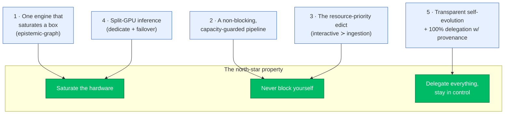
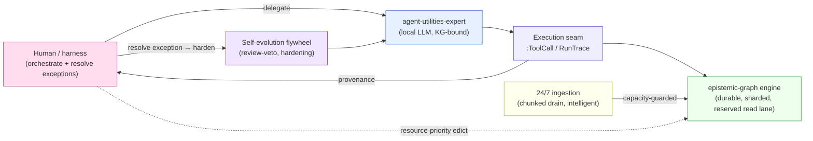

# North-Star Architecture — one saturating engine, a non-blocking pipeline, and 100% delegation

> **What this page is.** A single map of the platform's defining architecture program: the
> set of changes that together make agent-utilities + the epistemic-graph engine a system
> that **saturates the hardware it runs on, never blocks itself, and runs as much work as
> possible on the local LLM + graph-os while a human/harness orchestrates and resolves
> exceptions.** Each capability has its own deep page; this overview ties them into one
> coherent story and links out. Read this first, then drill into the page for the part you
> care about.

The program has **five pillars**. They are not independent features — they reinforce each
other into one property: *the platform ingests, reasons, and acts continuously, at full
hardware utilization, without any one workload starving another, and with every delegated
action fully visible.*

---

## Pillar 1 — One engine that saturates a box (the durable, scalable core)

The Rust **epistemic-graph** engine is now a durable **source of truth** by default and is
engineered to use *all* the cores/RAM of whatever it runs on, from a Raspberry Pi to a
64-core box to an HA cluster — while staying responsive under a write firehose.

- **Durable by default.** redb-authoritative single-writer-per-file with commit-before-ack,
  read-through-safe eviction, and back-pressure (never drop). An acked write survives a
  `kill -9`. (`CONCEPT:AU-KG.backend.backend-modes/2.187/2.191`)
- **Parallel durable writes.** The **K-way sharded durable writer** (`CONCEPT:EG-KG.backend.sharded-k-way-durable`) runs
  K independent `graph-<n>.redb` files / writer threads so a many-core box commits on K
  cores in parallel instead of serializing every tenant onto one core. The **per-graph write
  coalescer** (`CONCEPT:EG-KG.sharding.per-graph-write-coalescer`) collapses N concurrent single-op writes to one hot graph
  into ⌈N/batch⌉ lock acquisitions, and **adaptive group-commit micro-linger**
  (`CONCEPT:EG-KG.backend.adaptive-linger-coalesce`) folds concurrent awaiting writers into one fsync.
- **Reads never wait on writes.** MVCC **snapshot reads off the writer** (`CONCEPT:EG-KG.storage.snapshot-read-off-writer`)
  serve from `begin_read()` concurrently with the single writer, and **parallel cross-shard
  read fan-out** (`CONCEPT:AU-KG.backend.roadmap-f-parallel-cross`) reads K shards in parallel — a read never forces a
  group-commit or routes through a writer thread.
- **Scales pi → node → cluster.** **openraft 0.10 multi-Raft** for HA (`CONCEPT:AU-KG.ontology.manage-arbitrary-273`)
  and the **elastic M3 spine** — tenant catalog, online resharding, rebalancer, cold-tenant
  offload, BLOB streaming (`CONCEPT:EG-KG.sharding.atomic-shard-swap..043`) — let the same engine grow horizontally.

→ **Read:** [Engine Scaling Program (M1/M2/M3)](https://knuckles-team.github.io/epistemic-graph/architecture/scaling-program/)
(epistemic-graph repo) and its sub-docs (`engine.md`, `write-coalescer.md`,
`m2-raft-status.md`, `m3-resharding.md`, `tiers.md`).

---

## Pillar 2 — A non-blocking, capacity-guarded ingestion pipeline

Ingestion runs **24/7** over 80+ repos plus enterprise/research feeds. The program makes
that firehose *cooperative*: it can run at full tilt without ever monopolizing the engine
write path, the worker pool, or the shared LLM.

- **Chunked async drain** (`CONCEPT:AU-KG.ontology.single-source-full-drain/2.302`): one big `source_sync(mode=full)` is
  decomposed into paginated, capacity-guarded **wave-tasks** instead of one long blocking
  call, with a `source_drain` status tool to watch progress.
  → [Chunked Async Drain](chunked-async-drain.md)
- **Intelligent ingestion** — native auto-classification of code into typed KG nodes
  (`CONCEPT:AU-KG.ingest.over-same-tree-fan/2.285`), fast commit-history → graph + `code_evolution`
  (`CONCEPT:AU-KG.ingest.normal-codebase-ingest-also/2.283`), batch+concurrent embedding throughput (`CONCEPT:AU-KG.ingest.applying-agents-md-batch/2.281`),
  the ingestion **tail** optimizations — big-repo split, per-task watchdog timeouts,
  interactive-slot reservation, tail observability (`CONCEPT:AU-KG.compute.lane-bound-task–289`) — and batched
  classified-document writes (`CONCEPT:AU-KG.ingest.writes-go`).
  → [Intelligent Ingestion](intelligent-ingestion.md)
- The lane/throughput substrate it rides on (lanes, tick-collapse, bulk ops) is in
  [Ingestion Throughput](ingestion_throughput.md).

The engine-side guarantee that pairs with this is the **EG-KG.coordination.reserved-read-lane reserved read-admission
lane**: an interactive MCP read/query is *never* shed BUSY behind the ingestion write
firehose. → [Reserved Read Lane](https://knuckles-team.github.io/epistemic-graph/architecture/reserved-read-lane/)
(epistemic-graph repo).

---

## Pillar 3 — The resource-priority edict (interactive work outranks ingestion)

The edict is the cross-cutting rule that makes "ingest 24/7" and "orchestrate
interactively" coexist: a single **PriorityClass** ordering — `INTERACTIVE` >
`ORCHESTRATION` ≥ `HYDRATION` > `BACKGROUND_INGESTION` — is enforced at every shared
contention point. The **PriorityModelGate** reserves capacity on the shared LLM so
background ingestion can never starve interactive orchestration (`CONCEPT:AU-ORCH.scheduling.resource-priority-edict/1.99`,
`KG-2.293`). End-to-end, it pairs with the engine's EG-KG.coordination.reserved-read-lane reserved read lane so the
guarantee holds from the model server down to the durable store.

→ **Read:** [Resource-Priority Edict](resource-priority-edict.md)

---

## Pillar 4 — Split-GPU inference (dedicate + guard + fail over)

Heavy inference is spread across GPUs so embeds and generation don't fight, and so no
endpoint can OOM a shared card:

- **LLM/embedding server-capacity guard** (`CONCEPT:AU-ORCH.dispatch.embedding-fanout/1.103`, `AU-KG.compute.same-semantics-as`): a
  per-endpoint `server_ceiling` (the model *server's* real capacity, not the local host's)
  and a **joint `GPU_CONCURRENCY_BUDGETS` / `gpu_group`** so multiple endpoints sharing one
  physical GPU share one budget — the fix for the GB10 OOM where independent per-endpoint
  caps summed past GPU memory — plus a capacity-aware circuit breaker.
  → [LLM Server-Capacity Guard](llm-server-capacity-guard.md)
- **Embedding failover + split-GPU architecture** (`CONCEPT:AU-KG.enrichment.each-call-resolves-active/2.300`): GR1080 runs
  Infinity embeddings (Pascal needs Infinity + FP32), GB10 runs the qwen LLM; embeds fail
  over GR1080 → GB10 with **capacity-guard inheritance** so a failover can't OOM the
  fallback GPU.
  → [Distributed Multi-GPU Concurrency](distributed_gpu_concurrency.md)

---

## Pillar 5 — Transparent self-evolution + 100% delegation with provenance

The platform is built so the **local LLM + graph-os do the work** and the human/harness
**orchestrates and resolves exceptions**. Three things make that safe:

- **The orchestration execution seam** (`CONCEPT:AU-ORCH.execution.execution-seam-closure/96/97`, `KG-2.296`): an ingested
  workflow/skill resolves to a runnable DAG executed on the local LLM, returning a `run_id`
  handle, with **per-tool-call `:ToolCall` / `RunTrace` provenance** written to the
  epistemic-graph — so every delegated run is fully visible and steerable. This is the
  delegation keystone. → [Orchestration Execution Seam](orchestration-execution-seam.md)
- **The agent-utilities-expert** (`CONCEPT:AU-ORCH.dispatch.builtin-agent-templates/1.101`): a native, KG-bound,
  dispatchable expert persona with live MCP toolset binding — the default delegate target
  for ecosystem work, grounding its answers via graph-os instead of hallucinating.
  → [agent-utilities-expert](agent-utilities-expert.md)
- **The delegation-first operating model** itself — the three delegation routes, the full
  `engine_<domain>` MCP/REST surface delegates can reach (`CONCEPT:AU-ECO.mcp.full-api-mcp-surface`), and the
  read-RunTrace → find-why → fix-gap → re-delegate → **harden** loop.
  → [Delegation-First Operating Model](delegation-first-operating-model.md)
- **Troubleshooting** (`CONCEPT:AU-KG.retrieval.kg-4`): a per-layer diagnose playbook surfaced as a
  `troubleshoot` context provider, so the system self-diagnoses across engine / ingestion /
  model server / MCP / config before escalating. → [Troubleshooting](troubleshooting.md)
- **The self-evolution flywheel** (`CONCEPT:AU-KG.research.evolutionstate-live-surface-per/2.291/2.292`, `AU-OS.config.autonomous-spec-develop-off`,
  `AHE-3.71/72/73`, `AU-KG.retrieval.assimilated-from-mragent/2.276`): a transparent, steerable distill→develop→evolve loop
  with a live `EvolutionState` + saturation gauge, propose-and-hold spec proposals behind a
  review/veto gate, the per-agent hardening loop that turns a resolved exception into a
  durable improvement, and the MRAgent memory-reconstruction + selective-reward-erasure
  substrate. → [Self-Evolution Flywheel](self-evolution-flywheel.md)
- **Standard private repos + CI** genesis provisions for an operator
  (`CONCEPT:AU-OS.deployment.standard-repo-templates/5.75`). → [Standard Private Repos + CI](../guides/genesis-private-repos.md)

---

## How the pillars compose (one loop)

The edict (Pillar 3) keeps ingestion (Pillar 2) from starving interactive delegation
(Pillar 5) on the shared engine + GPUs (Pillars 1, 4); provenance (Pillar 5) makes the
delegation auditable; the hardening loop (Pillar 5) feeds every resolved exception back into
the expert so the autonomous system handles more next time. The trajectory is to orchestrate
**off the harness** entirely — the human becomes the backstop, not the executor.

## See also

- The canonical working discipline: agent-utilities `AGENTS.md` → *"Delegate to the KG +
  graph-os"* and *"Query the code KG before you grep"*.
- Engine internals: the epistemic-graph repo `AGENTS.md` (Durability model) +
  [`scaling-program.md`](https://knuckles-team.github.io/epistemic-graph/architecture/scaling-program/).
