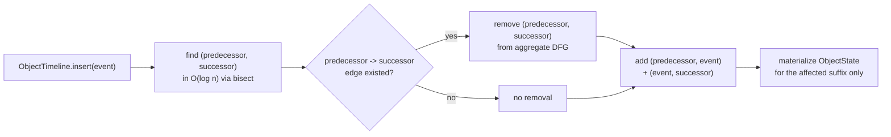
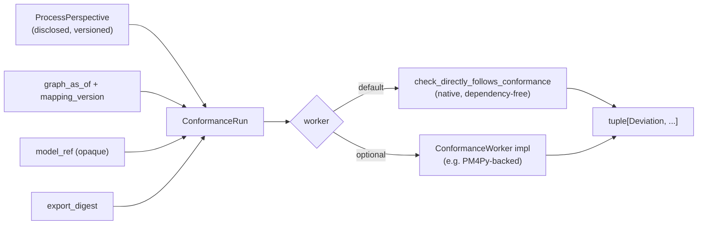

# Incremental object-centric derivation + conformance checking

Two governed additions on top of the [Governed JSON-OCEL exchange](governed_ocel.md):
maintaining derived object-centric state incrementally as events arrive
out of order, and checking observed behavior against a reference model
without conflating that check with the discovery step that produced the model.

## Incremental derivation (CONCEPT:AU-KG.mining.incremental-object-centric-derivation)

`agent_utilities/knowledge_graph/ingestion/object_centric_derivation.py`
maintains, per object, an ordered event index keyed by
`(occurred_at, sequence_tiebreaker, event_id)` — the same total order the
static `event_log_adapter` projection uses. An arriving or corrected event
only ever affects the ONE predecessor/successor pair it lands between:

- **`ObjectTimeline`** — a sorted per-object event list; `insert`/`remove`
  return the old/new neighbors in a single bounded lookup.
- **Bounded DFG update** — `IncrementalObjectCentricDeriver.ingest_event`
  removes at most one aggregate edge and adds at most two, never rebuilding
  the whole directly-follows graph.
- **`ObjectState` without invention** — `_known_attributes_as_of` takes the
  most recent `TemporalAttributeValue` at or before an event's timestamp per
  attribute name; an attribute with no recorded revision yet is simply absent
  from the materialized state, never defaulted or interpolated.
- **`Watermark`** — tracks `max_seen - allowed_lateness`; an event older than
  the watermark is a correction, not an ordinary arrival, and bumps
  `IncrementalObjectCentricDeriver.generation`.
- **Derivation generation** — every correction (a late arrival, or a
  re-`correct_event` on an already-known event id) advances `generation`
  exactly once, so a `ConformanceRun` (below) can be pinned to "derived state
  as of generation N" for reproducibility.

Replay determinism: `IncrementalObjectCentricDeriver` reaches the same
aggregate DFG and the same final `ObjectState` for one object regardless of
whether its events arrived strictly in order or with a late insertion
(`tests/unit/knowledge_graph/test_object_centric_derivation.py`).

## Discovery vs conformance, formally separated (CONCEPT:AU-KG.mining.process-conformance-checking)

Process **mining** discovers a model from observed traces. Process
**conformance** checks whether SOME traces fit a GIVEN model. Conflating them —
a "conformance score" that re-discovers its reference model from the same data
it is checking — can never find a deviation by construction.
`agent_utilities/knowledge_graph/ingestion/process_conformance.py` keeps that
boundary structural:

- **`ConformanceRun`** freezes the five things a result depends on:
  `perspective`, `graph_as_of`, `mapping_version`, `model_ref` (an opaque
  reference to the model being checked — never re-derived from the run
  itself), and `export_digest`. `run_digest()` hashes exactly those five
  fields — two runs with the same digest are reproducible to the same result
  regardless of `run_id`/`worker`/`created_at`.
- **`Deviation`** is one typed, positioned mismatch
  (`unexpected_transition` / `unexpected_start` / `unexpected_end`), never a
  bare pass/fail boolean.
- **`check_directly_follows_conformance`** is the native, dependency-free
  default worker: every observed adjacent activity pair must be an edge the
  reference model's `allowed_edges` actually contains (bounded footprint/local
  conformance — not a claim to full alignment-based conformance).
- **`ConformanceWorker`** is a structural `Protocol` an optional heavier
  analytics library (PM4Py or otherwise) may satisfy to compute `Deviation`s
  for an already-frozen run — a pluggable compute backend, never the
  authority over what was checked or against what.
  `run_conformance_check` always returns the SAME `run` object it was given.

## No undisclosed flattening

Classical single-case flattening (one trace per object) is only reachable
through `event_log_adapter.project_object_centric_events`/
`project_object_centric_slice`, and both now take a **required, keyword-only**
`ProcessPerspective` — see
[Classical flattening is always a disclosed perspective](governed_ocel.md#classical-flattening-is-always-a-disclosed-perspective).
There is no bare-string `object_type` code path left in either the adapter or
`graph_mine(action="process")`, so undisclosed flattening is a structural
(`TypeError`/`ValueError`) impossibility, not a policy choice —
`tests/unit/knowledge_graph/test_event_log_adapter.py::test_undisclosed_flattening_is_structurally_impossible`.
