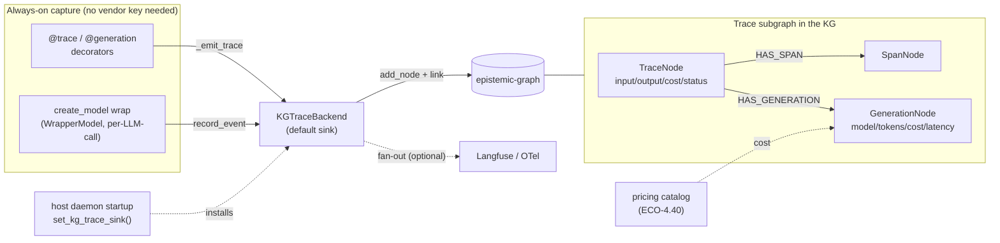
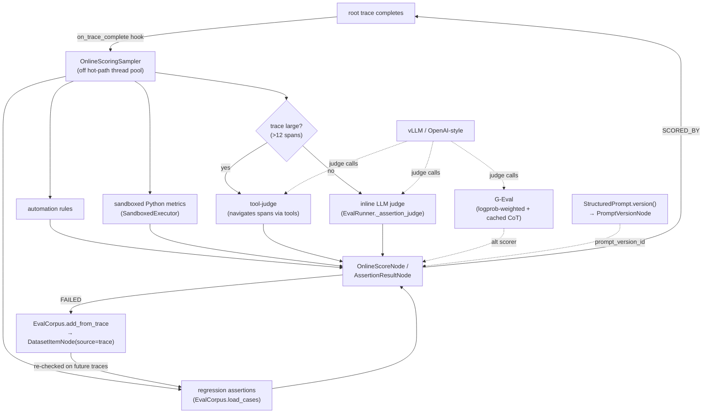
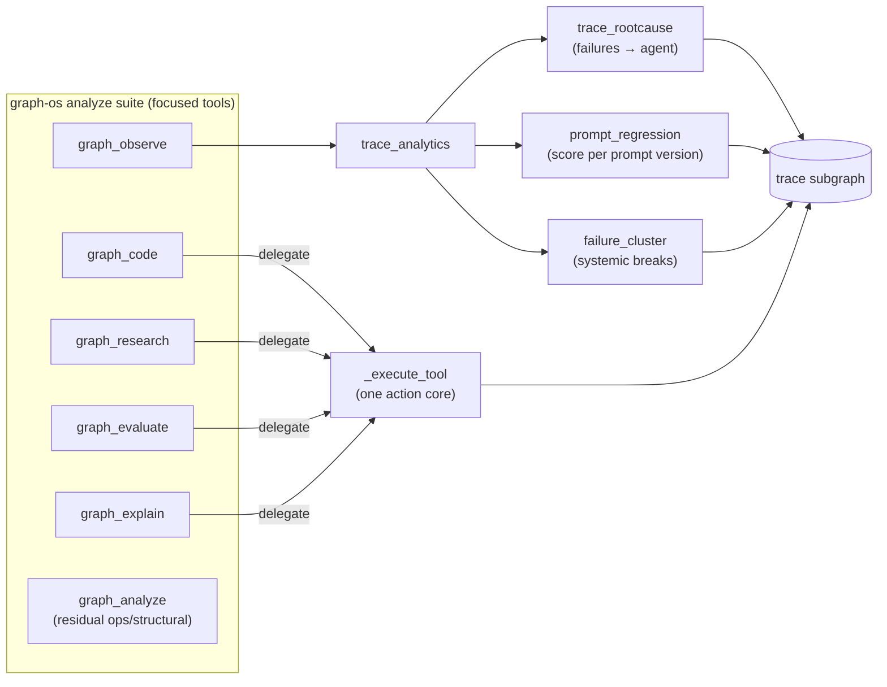

# Observability — Metrics, Logs, Traces, Alerts

How every MCP service **and** every Portainer stack's container is monitored,
built on the existing LGTM stack (`services/lgtm/`).

## Topology

```
                    ┌──────────── Prometheus (15s) ──────────┐
 node-exporter ─────┤  hosts (global, every node)            │
 cAdvisor ──────────┤  containers (global, every container)  │── rules.yml ─► Alertmanager ─► Mattermost
 MCP /metrics ──────┤  mcp-fleet (file-SD, 52 targets)       │
 blackbox /health ──┤  blackbox-mcp (synthetic probe)        │
                    └────────────────┬───────────────────────┘
                                     ▼
 promtail (docker SD) ─► Loki        Grafana (grafana.arpa, Keycloak OIDC)
 app traces ─► Tempo + Langfuse      provisioned datasources + dashboards
```

| Signal | Collector | Store | Notes |
|--------|-----------|-------|-------|
| Host metrics | node-exporter (global) | Prometheus | CPU/mem/disk/net per node |
| Container metrics | cAdvisor (global) | Prometheus | per-container, labelled `com.docker.stack.namespace` |
| MCP app metrics | each MCP `GET /metrics` | Prometheus | per-tool count/latency/error (CONCEPT:OS-5.23) |
| Synthetic health | blackbox-exporter | Prometheus | `GET /health` per MCP |
| Logs | promtail (docker SD) | Loki | container stdout/stderr, labelled stack/service |
| Traces | OTEL | Tempo + Langfuse | Langfuse for LLM traces |

## Per-MCP metrics (one change, whole fleet)

`create_mcp_server` mounts an unauthenticated `GET /metrics` and a
`ToolMetricsMiddleware` recording, per server:

- `agent_utilities_mcp_tool_calls_total{tool,outcome}`
- `agent_utilities_mcp_tool_duration_seconds_bucket{tool}` (histogram)
- `agent_utilities_mcp_tool_in_flight`

These are the server-side complement to the multiplexer's `agent_utilities_mcp_child_*`
metrics. All metrics no-op without the optional `metrics` extra.

## Scrape coverage (auto-maintained)

`scripts/gen_prometheus_mcp_targets.py` reads `deploy/mcp-fleet.registry.yml` and
writes `services/lgtm/targets/mcp-fleet.json` — one target per MCP at
`<stack>_<service>:8000` with `stack`/`service` labels. Two Prometheus jobs reuse
that file-SD: `mcp-fleet` (scrape `/metrics`) and `blackbox-mcp` (rewrite each
target into a `/health` probe). Re-run the generator on fleet change.

## Dashboards (provisioned as code)

`scripts/gen_grafana_dashboards.py` emits three dashboards into
`services/lgtm/grafana/provisioning/dashboards/json/`:

- **MCP Fleet Overview** — every stack up/probe/req/error/p95 + per-stack
  container CPU/mem (the "all Portainer stacks" view).
- **MCP Per-Service** — templated by `$stack`: tool rate/latency/errors,
  in-flight, container CPU/mem, and a Loki logs panel.
- **Host & Infra** — node-exporter CPU/mem/disk per host.

Datasources (Prometheus/Loki/Tempo) are provisioned in
`grafana/provisioning/datasources/`.

## Alerts

`services/lgtm/rules.yml` groups (→ Alertmanager → Mattermost):

- **infra-availability** — `InstanceDown` (non-MCP jobs).
- **mcp-fleet** — `McpServiceDown`, `McpProbeFailed`, `McpHighToolErrorRate`,
  `McpHighToolLatencyP95`, `McpChildBreakerOpen`.
- **containers** — `ContainerOOMKilled`, `ContainerHighMemory`, `ContainerRestarting`.
- **hosts** — `HostHighCpu`, `HostHighMemory`, `HostLowDisk`.

## What lights up when

The config is in git; activation is two deploys:

1. **Redeploy the LGTM stack** → the new jobs, blackbox, promtail, dashboards and
   rules go live.
2. **Rebuild the agent-utilities image** (or mount its source) → MCP `/metrics`
   starts returning data; until then `mcp-fleet` targets read "down" (the
   `McpServiceDown` rule has a 10-minute fuse to stay quiet during the rollout).

## KG-native agent observability & evaluation (Graphiti + Opik absorption)

The LGTM stack above is *infrastructure* observability (host/container/fleet metrics,
logs, synthetic health). Complementary to it is **KG-native application observability +
evaluation** — every agent run is captured as a first-class graph subgraph and scored by
the same engine, so traces are *queryable and reasoned over* rather than buried in an
opaque store (the moat over Opik's ClickHouse). Concepts: OS-5.68 (capture),
AHE-3.64/3.65/3.66/3.67/3.68 (online-scoring / G-Eval / tool-judge / sandboxed metrics /
dataset-prompt loop), KG-2.257 (moat queries).

### 1. Always-on capture → the trace subgraph



### 2. Online-scoring + evaluation (one judge path for prod + regression)



### 3. Moat queries + the focused graph-os tool suite

Because traces/scores/generations/prompt-versions are KG nodes, the engine answers
questions an opaque trace store cannot — exposed through **focused, intent-scoped MCP
tools** (the `graph_analyze` 30-action wall was split so an agent selects by intent):



> Engine-side wirings (Track A bi-temporal `AS OF`, Track C1 hybrid search / rerankers,
> Track C2 dedup) are documented in the epistemic-graph repo
> (`docs/uql.md`, `docs/architecture/engine.md`).
