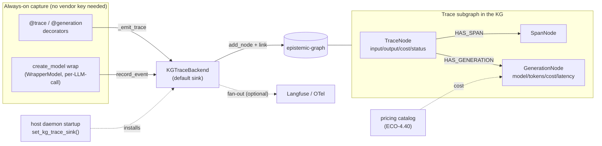
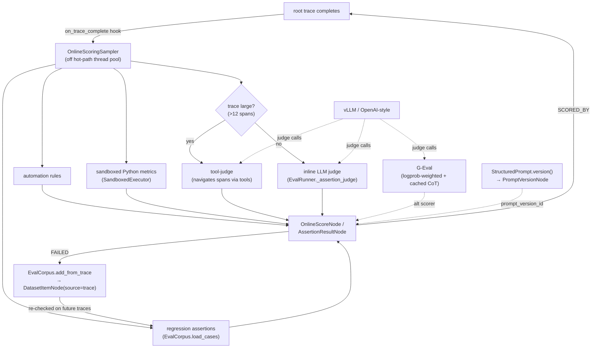
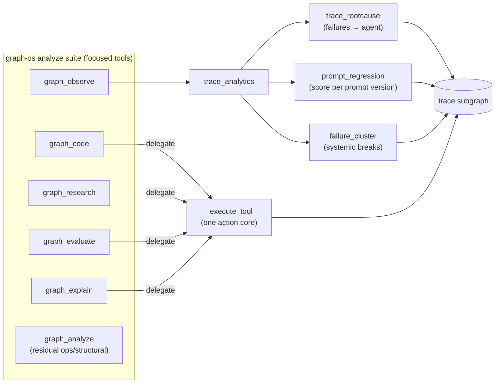

# Observability — Metrics, Logs, Traces, Alerts

How MCP services and deployed workloads expose bounded operational signals.

## Topology

```
                    ┌──────────── Prometheus (15s) ──────────┐
 node-exporter ─────┤  hosts (global, every node)            │
 cAdvisor ──────────┤  containers (global, every container)  │── rules.yml ─► Alertmanager ─► Mattermost
 MCP /metrics ──────┤  mcp-fleet (generated file-SD targets) │
 blackbox /health ──┤  blackbox-mcp (synthetic probe)        │
                    └────────────────┬───────────────────────┘
                                     ▼
 promtail (docker SD) ─► Loki        Grafana (grafana.example, Keycloak OIDC)
 app traces ─► Tempo + Langfuse      provisioned datasources + dashboards
```

| Signal | Collector | Store | Notes |
|--------|-----------|-------|-------|
| Host metrics | node-exporter (global) | Prometheus | CPU/mem/disk/net per node |
| Container metrics | cAdvisor (global) | Prometheus | per-container, labelled `com.docker.stack.namespace` |
| MCP app metrics | each MCP `GET /metrics` | Prometheus | per-tool count/latency/error (CONCEPT:AU-OS.observability.no-op-without-metrics) |
| Synthetic health | blackbox-exporter | Prometheus | `GET /health` per MCP |
| Logs | promtail (docker SD) | Loki | container stdout/stderr, labelled stack/service |
| Traces | OTEL | Tempo + Langfuse | Langfuse for LLM traces |

Self-hosted Langfuse uses the same runtime TLS-profile resolver as every other
outbound integration. Certificate material, proxy details, endpoints, and keys
remain behind AgentConfig refs; content capture is off. See
[Failure-Driven Evolution: self-hosted trust](failure_driven_evolution.md#self-hosted-trust-and-the-native-mcp-server)
for native MCP registration, doctor validation, and the distinction between
configuration readiness and a live traced-request certification.

When `ENABLE_OTEL=true`, the `graph-os` entry point activates the same
metadata-only `setup_otel()` pipeline used by served agents before it constructs
the MCP server. A configured OTLP endpoint wins; otherwise a complete canonical
Langfuse credential-reference pair derives the deployment's
`/api/public/otel` endpoint and HTTP Basic authorization in memory. The OTLP TLS
profile is selected by endpoint origin, so the Langfuse trust profile is reused
for that origin regardless of whether authorization came from the canonical key
pair or a purpose-specific OTLP header reference. HTTPS is mandatory except for
the exact canonical loopback hosts.

Pipeline health is an authenticated contract, not a socket check: for a
Langfuse-origin exporter, diagnostics perform a bounded metadata-only trace-list
read and require a successful response with the expected shape. Authentication
failures and arbitrary `4xx` responses are failures. Generic collectors have no
portable authenticated read endpoint and are reported as unproven rather than
being inferred healthy from an HTTP status.

### Standalone OTLP exporter — gen_ai/epistemic span attrs (X2)

A SECOND, independent trace pipeline — `agent_utilities.observability.
TelemetryEngine` — is configured PURELY by the standard OTel env vars
(`OTEL_EXPORTER_OTLP_ENDPOINT` / `OTEL_SERVICE_NAME` / `OTEL_TRACES_EXPORTER`,
falling back to the engine's own `EPISTEMIC_GRAPH_OBS_ADDR` collector), with no
dependency on `ENABLE_OTEL` or Logfire. It exists for a plain OTLP collector
(e.g. this cluster's k8s LGTM stack, where a Grafana Alloy DaemonSet ingests
traces into Tempo) that needs no Langfuse-style Basic-Auth header pair. Both
pipelines can run at once (harmless, just duplicated export); unset env vars on
either leave it a clean, zero-overhead no-op — today's behavior.

`opentelemetry-sdk` + the OTLP/HTTP exporter are import-guarded everywhere;
install the `agent-utilities[otel]` extra for this pipeline alone, or
`[logfire]`/`[serving]` (which already carry both transitively).

Triggered once at process bootstrap — `mcp/kg_server.py`'s `mcp_server()` and
`server/app.py`'s `app_factory()` — never per-request. What it exports:

- **One span per `run_agent` execution** (`orchestration/agent_runner.py`,
  `graph.run`) — `gen_ai.system`, `gen_ai.request.model`, `gen_ai.usage.
  input_tokens`/`output_tokens` (graph-execution path), `gen_ai.response.
  tool_call_count`.
- **One span per engine RPC** (`knowledge_graph/core/graph_compute.py`'s
  `_SessionRoutedAsyncClient._send`, the sole choke point for every RPC) —
  `engine.method` + `engine.graph` only, never the request `params`.
- **Epistemic attrs on whichever span is active** during retrieval/context
  assembly (`knowledge_graph/core/epistemic_row.py`, `knowledge_graph/
  retrieval/context_compiler.py`) — `epistemic.confidence`/`status`/
  `contradiction_count`/`policy_labels`.

Redaction is structural, not content-filtered: attributes are names/ids/counts
only (a plain model identifier or controlled-vocabulary policy tag, never
prompt text or row content); a run/agent id is always an opaque
`persistence_reference` hash, and the query is stamped only as `query_length`.
See `reports/wave3/otel-env-fragment.yaml` (workspace-root `reports/`, not
committed to this repo) for the prepared, unapplied k8s env fragment.

## Per-MCP metrics (one change, whole fleet)

`create_mcp_server` mounts `GET /metrics` locally and a
`ToolMetricsMiddleware` recording, per server. On a non-loopback listener the
route is registered only when `MCP_METRICS_TOKEN_REF` resolves; the scraper must
send that bearer. The route is absent when the reference is unavailable.

- `agent_utilities_mcp_tool_calls_total{tool,outcome}`
- `agent_utilities_mcp_tool_duration_seconds_bucket{tool}` (histogram)
- `agent_utilities_mcp_tool_in_flight`

These are the server-side complement to the multiplexer's `agent_utilities_mcp_child_*`
metrics. All metrics no-op without the optional `metrics` extra.

## Scrape coverage (auto-maintained)

`scripts/gen_prometheus_mcp_targets.py` reads `deploy/mcp-fleet.registry.yml` and
writes `services/lgtm/targets/mcp-fleet.json` — one target per MCP at
`<stack>_<service>:8000` with `stack`/`service` labels. Two Prometheus jobs reuse
that file-SD: `mcp-fleet` (scrape `/metrics`) and `blackbox-mcp` (rewrite each
target into a `/health` probe). Re-run the generator on fleet change.

## Dashboards (provisioned as code)

`scripts/gen_grafana_dashboards.py` emits three dashboards into
`services/lgtm/grafana/provisioning/dashboards/json/`:

- **MCP Fleet Overview** — every stack up/probe/req/error/p95 + per-stack
  container CPU/mem (the "all Portainer stacks" view).
- **MCP Per-Service** — templated by `$stack`: tool rate/latency/errors,
  in-flight, container CPU/mem, and a Loki logs panel.
- **Host & Infra** — node-exporter CPU/mem/disk per host.

Datasources (Prometheus/Loki/Tempo) are provisioned in
`grafana/provisioning/datasources/`.

## Alerts

`services/lgtm/rules.yml` groups (→ Alertmanager → Mattermost):

- **infra-availability** — `InstanceDown` (non-MCP jobs).
- **mcp-fleet** — `McpServiceDown`, `McpProbeFailed`, `McpHighToolErrorRate`,
  `McpHighToolLatencyP95`, `McpChildBreakerOpen`.
- **containers** — `ContainerOOMKilled`, `ContainerHighMemory`, `ContainerRestarting`.
- **hosts** — `HostHighCpu`, `HostHighMemory`, `HostLowDisk`.

## What lights up when

The config is in git; activation is two deploys:

1. **Redeploy the LGTM stack** → the new jobs, blackbox, promtail, dashboards and
   rules go live.
2. **Rebuild the agent-utilities image** (or mount its source) → MCP `/metrics`
   starts returning data; until then `mcp-fleet` targets read "down" (the
   `McpServiceDown` rule has a 10-minute fuse to stay quiet during the rollout).

## KG-native agent observability & evaluation (Graphiti + Opik absorption)

The LGTM stack above is *infrastructure* observability (host/container/fleet metrics,
logs, synthetic health). Complementary to it is **KG-native application observability +
evaluation** — every agent run is captured as a first-class graph subgraph and scored by
the same engine, so traces are *queryable and reasoned over* rather than buried in an
opaque store (the moat over Opik's ClickHouse). Concepts: AU-OS.config.model-factory-passthrough (capture),
AU-AHE.harness.receives-trace-id-must/3.65/3.66/3.67/3.68 (online-scoring / G-Eval / tool-judge / sandboxed metrics /
dataset-prompt loop), AU-KG.ingest.observability-queries-opik-cannot (moat queries).

### 1. Always-on capture → the trace subgraph


```mermaid
flowchart LR
    subgraph capture["Always-on capture (no vendor key needed)"]
        dec["@trace / @generation\ndecorators"]
        mw["create_model wrap\n(WrapperModel, per-LLM-call)"]
    end
    dec -->|"_emit_trace"| sink
    mw -->|"record_event"| sink["KGTraceBackend\n(default sink)"]
    daemon["host daemon startup\nset_kg_trace_sink()"] -.installs.-> sink
    sink -->|"add_node + link"| kg[("epistemic-graph")]
    sink -. fan-out (optional) .-> lf["Langfuse / OTel"]
    subgraph tracegraph["Trace subgraph in the KG"]
        T["TraceNode\ninput/output/cost/status"]
        S["SpanNode"]
        G["GenerationNode\nmodel/tokens/cost/latency"]
        T -->|HAS_SPAN| S
        T -->|HAS_GENERATION| G
    end
    kg --- tracegraph
    pricing["pricing catalog\n(ECO-4.40)"] -.cost.-> G
```

### 2. Online-scoring + evaluation (one judge path for prod + regression)


```mermaid
flowchart TD
    T["root trace completes"] -->|on_trace_complete hook| pool["OnlineScoringSampler\n(off hot-path thread pool)"]
    pool --> sel{"trace large?\n(>12 spans)"}
    sel -->|yes| tj["tool-judge\n(navigates spans via tools)"]
    sel -->|no| ij["inline LLM judge\n(EvalRunner._assertion_judge)"]
    pool --> rules["automation rules"]
    pool --> regs["regression assertions\n(EvalCorpus.load_cases)"]
    pool --> metrics["sandboxed Python metrics\n(SandboxedExecutor)"]
    rules & regs & metrics --> verdict
    tj & ij --> verdict["OnlineScoreNode /\nAssertionResultNode"]
    verdict -->|SCORED_BY| T
    verdict -->|FAILED| corpus["EvalCorpus.add_from_trace\n→ DatasetItemNode(source=trace)"]
    corpus -->|re-checked on future traces| regs
    geval["G-Eval\n(logprob-weighted + cached CoT)"] -.alt scorer.-> verdict
    pv["StructuredPrompt.version()\n→ PromptVersionNode"] -.prompt_version_id.-> verdict
    llm["vLLM / OpenAI-style"] -.judge calls.-> tj & ij & geval
```

### 3. Moat queries + the focused graph-os tool suite

Because traces/scores/generations/prompt-versions are KG nodes, the engine answers
questions an opaque trace store cannot — exposed through **focused, intent-scoped MCP
tools** (the `graph_analyze` 30-action wall was split so an agent selects by intent):


```mermaid
flowchart LR
    subgraph tools["graph-os analyze suite (focused tools)"]
        gobs["graph_observe"]
        gcode["graph_code"]
        gres["graph_research"]
        gev["graph_evaluate"]
        gexp["graph_explain"]
        gana["graph_analyze\n(residual ops/structural)"]
    end
    gcode & gres & gev & gexp -->|delegate| core["_execute_tool\n(one action core)"]
    gobs --> ta["trace_analytics"]
    ta --> q1["trace_rootcause\n(failures → agent)"]
    ta --> q2["prompt_regression\n(score per prompt version)"]
    ta --> q3["failure_cluster\n(systemic breaks)"]
    q1 & q2 & q3 --> kg[("trace subgraph")]
    core --> kg
```

> Engine-side wirings (Track A bi-temporal `AS OF`, Track C1 hybrid search / rerankers,
> Track C2 dedup) are documented in the epistemic-graph repo
> (`docs/uql.md`, `docs/architecture/engine.md`).
