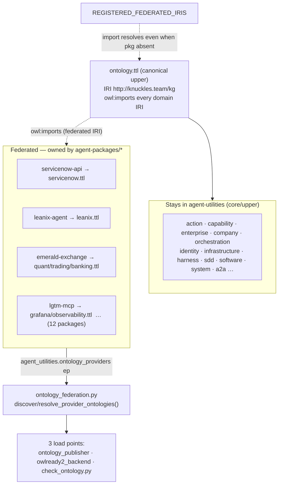

# Ontology Federation & Package Migration

> Domain ontologies live in the **agent-package that owns their domain**, not in the
> agent-utilities wheel — federated back into the canonical ontology by IRI.
> Concepts: `AU-KG.ontology` (loader/discovery) and `AU-KG.ontology.package-federation-migration`
> (the ~14-package migration). Catalog of what lives where: [`ontology_library.md`](ontology_library.md).

## The idea

The knowledge graph is **one** ontology library: a canonical upper ontology
(`knowledge_graph/ontology.ttl`, IRI `http://knuckles.team/kg`) that `owl:imports` a domain
module per vertical. Those domain modules do **not** all have to ship inside agent-utilities.
Any fleet package can contribute its own `owl:Ontology` module — the same "third federation leg"
pattern used for skills and prompts — so, e.g., the ServiceNow ontology lives in
`servicenow-api`, the LeanIX ontology in `leanix-agent`, and the finance ontologies in
`emerald-exchange`. The canonical file keeps its `owl:imports` edge unchanged; when the owning
package is installed its `.ttl` is discovered and folded in, and when it is absent the import is
a tolerated superset no-op.



## Mechanism

1. **The entry-point.** Each owning package declares, in its `pyproject.toml`:
   ```toml
   [project.entry-points."agent_utilities.ontology_providers"]
   <package-name> = "<module>.ontology"
   ```
   and ships `"ontology/**"` in its package-data. The `<module>/ontology/` directory holds the
   `.ttl` file(s) (one package may carry several, e.g. `emerald_exchange/ontology/` has
   `quant.ttl`, `trading.ttl`, `banking.ttl`) plus a data-only `__init__.py`.

2. **Discovery.** `knowledge_graph/core/ontology_federation.py` resolves every
   `agent_utilities.ontology_providers` entry-point to its data dir via `iter_provider_dirs`
   (the same resolver skills/prompts use) and flattens to each concrete `*.ttl` (+ `shapes/*.ttl`):
   - `discover_provider_ontologies()` — live entry-point discovery.
   - `resolve_provider_ontologies()` — XDG-first (the unified tree written by
     `agent-utilities install`), falling back to live discovery.

3. **The three load points** all consume that discovery so a federated module behaves exactly
   like a bundled one:
   - `core/ontology_publisher.collect_bundled_ontology_graph()` — Stardog/Fuseki publish.
   - `backends/owl/owlready2_backend._register_local_imports()` — pre-parse for the live reasoner.
   - `scripts/check_ontology.py` — the valid/connected/SHACL gate.

4. **`REGISTERED_FEDERATED_IRIS`** (in `ontology_federation.py`) is the ledger of IRIs the
   canonical bundle may `owl:imports` even when the owning package is **not** installed. Without
   it, `check_ontology` would flag the import as dangling in a provider-less base install. Every
   migrated domain has one entry here.

5. **Runtime.** `graph_ontology action=sync_packages` (MCP + REST) drives
   `OntologyLifecycle.load` over the discovered providers; uninstalling a package removes its
   contribution for free via `entry_points()`.

## What has been migrated

15 domain ontologies moved out of the wheel into 12 owning packages (concept
`AU-KG.ontology.package-federation-migration`):

| Domain(s) | Owning package |
|---|---|
| servicenow | `servicenow-api` *(original pilot)* |
| leanix | `leanix-agent` |
| erpnext | `erpnext-agent` |
| archimate | `archimate-mcp` |
| egeria | `egeria-mcp` |
| quant, trading, banking | `emerald-exchange` |
| legal | `legal-peripherals-mcp` |
| media | `jellyfin-mcp` |
| grafana, observability | `lgtm-mcp` |
| social | `postiz-agent` |
| feed | `freshrss-agent` |
| wellness | `wger-agent` |
| database | `sql-mcp` |

**Stays in core** (import root / shared vocab — moving would break OWL-RL closure):
`ontology.ttl`, `action`, `capability`, `enterprise`, `company`, `company_infra`,
`orchestration`, `sdd`, `software`, `system`, `a2a`, `harness`, `identity`, `infrastructure`.
**Homeless** (kept in core until an owner is named): `calendar`, `personal`, `hr`, `medical`,
`government`, `energy_geopolitics`, `trm`.

> Note: `ontology_company.ttl` (core) `owl:imports` the `banking` and `legal` IRIs, so both are
> registered in `REGISTERED_FEDERATED_IRIS` — a core module importing a now-federated IRI is
> fine, exactly what the registry is for.

## Migrating a new domain (the recipe)

1. **Pre-flight — check for shared vocab.** `grep` the domain IRI across all `.ttl` files. If
   anything **other than** the canonical `ontology.ttl` imports it, that importer is shared
   vocab: either keep the module in core, or migrate it *and* ensure the importer resolves via
   `REGISTERED_FEDERATED_IRIS` (as done for banking/legal).
2. **Create the package module:** `<pkg>/<module>/ontology/<x>.ttl` (IRI
   `http://knuckles.team/kg/<x>` **unchanged**) + a data-only `ontology/__init__.py`.
3. **Wire pyproject:** add the `agent_utilities.ontology_providers` entry-point (key =
   `[project].name`) and `"ontology/**"` to package-data.
4. **Register the IRI:** add it to `REGISTERED_FEDERATED_IRIS` in `ontology_federation.py`.
5. **Delete from core:** remove `knowledge_graph/ontology_<x>.ttl`; move its row from the
   "Domain modules" table to the "Federated" table in
   [`ontology_library.md`](ontology_library.md).
6. **Keep the canonical import edge** (`ontology.ttl` still `owl:imports http://knuckles.team/kg/<x>`).
7. **Make it atomic** — add-to-package + register-IRI + delete-from-core in one change — so
   `check_ontology.py` stays green throughout (the federation loader makes provider ttls a
   superset; a file deleted from core but not yet registered fails the gate).

## Verify

```bash
# with the package NOT installed — canonical imports still resolve via REGISTERED_FEDERATED_IRIS
python scripts/check_ontology.py -v            # OK — N ontologies valid, connected, documented

# with the package installed
graph_ontology action=sync_packages            # loads provider ttls
graph_ontology action=list                     # the migrated IRI now appears
```

Both the pilot (`servicenow`) and this 15-domain batch keep `check_ontology -v` green with and
without the owning packages installed.
