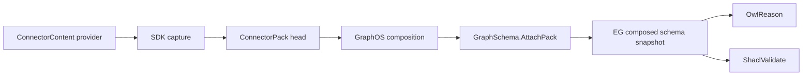

# Ontology package composition

Epistemic-graph is the sole active ontology and SHACL authority. Fleet
components own source content, the connector SDK captures it, GraphOS composes
it, and EG commits it as a graph-scoped `GraphSchema` source.


```mermaid
flowchart LR
  Provider["ConnectorContent provider"] --> Capture["SDK capture"]
  Capture --> Pack["ConnectorPack head"]
  Pack --> GraphOS["GraphOS composition"]
  GraphOS --> Attach["GraphSchema.AttachPack"]
  Attach --> EG["EG composed schema snapshot"]
  EG --> Reason["OwlReason"]
  EG --> Validate["ShaclValidate"]
```

## Ownership contract

- EG owns immutable core sources, composition, reasoning, validation, source
  limits, and the composed digest.
- Each component owns only its packaged ontology or shape bytes and exposes one
  public `ConnectorContent` provider.
- The SDK captures providers independently and preserves their connector
  identity, content digest, and pack head.
- GraphOS provisions each provider through the generic SDK workflow and attaches
  the resulting pack. It does not merge one component's content into another.
- AU never discovers entry points, walks local imports, or interprets Turtle in
  the serving path.

AU's provider is:

```python
from agent_utilities.content import agent_utilities_content

provider = agent_utilities_content()
```

Its canonical operational-shape resource is
`agent_utilities/ontology/shapes/governance.shapes.ttl`. Core ADR,
Capability, Policy, and Tool shapes remain immutable EG sources. GraphOS owns
its runtime consent and scheduling shapes in its own pack.

## Adding component-owned semantic content

1. Put the source beneath the owning package's `ontology/` directory.
2. Expose that package through a `ConnectorContent` factory; do not add an AU
   loader or EG DTO wrapper.
3. Add exact-byte, semantic-digest, and ownership tests.
4. Let GraphOS call the SDK's generic provisioning workflow.
5. Require the EG `GraphSchemaCommitted` receipt before readiness.

Use `GraphSchemaList` to inspect `core_sources`, `dynamic_sources`, the immutable
catalog digest, and the composed digest. Reasoning consumers must retain the
returned `schema_digests`; governance validation must omit caller-supplied
`shapes` and require the same-snapshot digest receipt.

## Residual hybrid-reasoner debt

The remaining AU domain ontology corpus and OWL bridge are a bounded migration
wave, not a second root contract. They remain only until EG proves the required
mixed-DL and property entailments and the coordinated deletion lands. New
semantic sources must use the package-composition path above.
