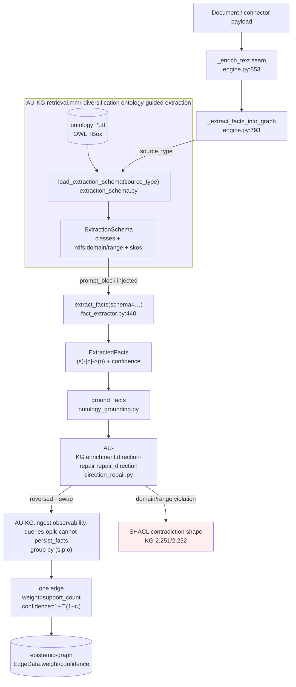
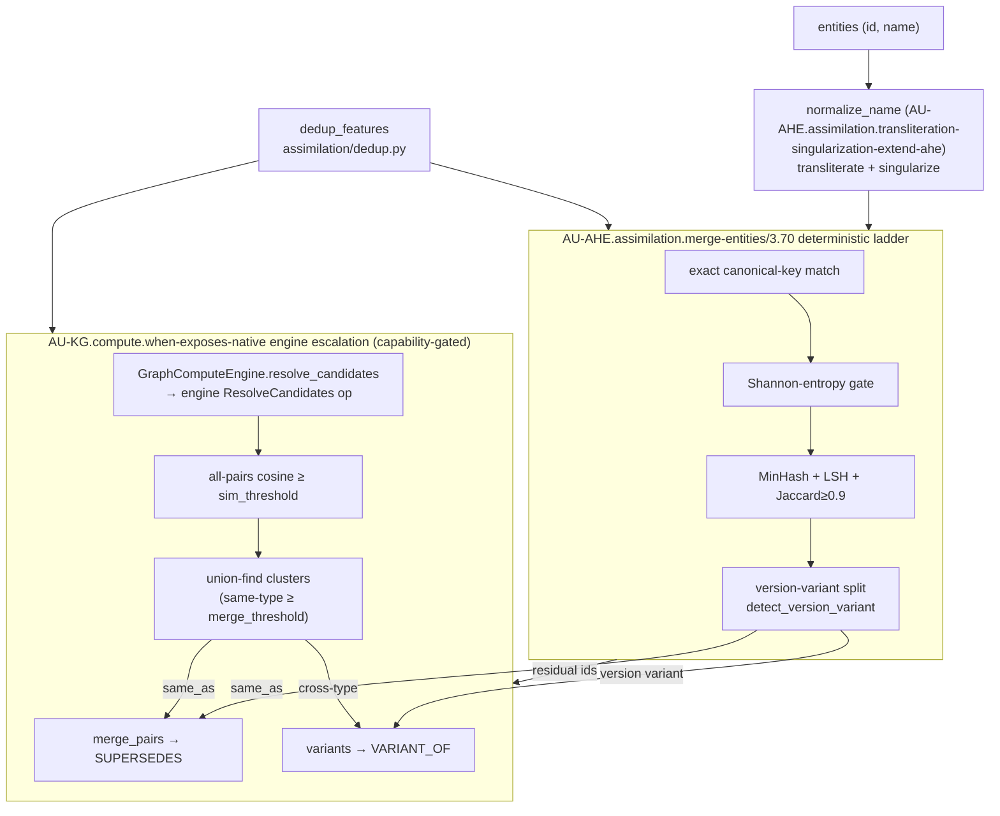
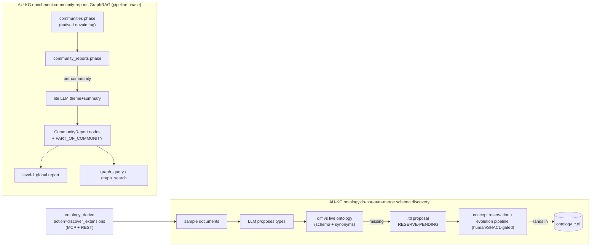

# Ontology-Guided Ingestion & Entity Resolution

> Exceeds the `sift-kg` document→knowledge-graph pipeline while synergizing with our
> OWL/RDF ontology. Concepts: **AU-KG.retrieval.mmr-diversification** (ontology-guided extraction), **AU-KG.enrichment.direction-repair**
> (direction repair), **AU-KG.ingest.observability-queries-opik-cannot** (confidence/support-count weighting), **AU-AHE.assimilation.transliteration-singularization-extend-ahe**
> (dedup-ladder extensions + variant split), **AU-KG.enrichment.community-reports** (community summarization),
> **AU-KG.ontology.do-not-auto-merge** (schema discovery), **AU-KG.compute.when-exposes-native** (engine ResolveCandidates op).
> Comparative analysis: `workspace/reports/sift-kg-comparative-analysis-2026-06-26.md`.

This page documents how the ingestion/extraction path was upgraded so that extraction
is **driven by the OWL ontology** (not free-form), edges are **oriented + corroboration-
weighted**, entities are **resolved with transliteration/singularization + a variant
split**, communities are **summarized into queryable reports**, and the ontology
**self-extends** from the corpus — with a native Rust engine op as the scale tier.

## Where each piece lives

| Concept | What | File |
|---|---|---|
| AU-KG.retrieval.mmr-diversification | OWL TBox → extraction schema, injected into the LLM prompt | `extraction/extraction_schema.py`, `fact_extractor.py`, `ingestion/engine.py:793` |
| AU-KG.enrichment.direction-repair | Relation-direction repair via `rdfs:domain/range` | `extraction/direction_repair.py` |
| AU-KG.ingest.observability-queries-opik-cannot | Product-complement confidence + support-count edge weight | `fact_extractor.py:persist_facts` |
| AU-AHE.assimilation.transliteration-singularization-extend-ahe | Transliteration + singularization + version-variant split | `assimilation/entity_resolution.py`, `assimilation/dedup.py` |
| AU-KG.enrichment.community-reports | GraphRAG community summarization phase | `pipeline/phases/community_reports.py` |
| AU-KG.ontology.do-not-auto-merge | Ontology-aware schema discovery → `.ttl` proposals | `extraction/schema_discovery.py`, `mcp/tools/ontology_tools.py` |
| AU-KG.compute.when-exposes-native | Native `ResolveCandidates` engine op + escalation | `epistemic-graph` `algorithms.rs`/`protocol.rs`/`graph_ops.rs`, `core/graph_compute.py` |

## End-to-end ingestion flow

Key change: grounding + direction-repair now run **before** persist (extract → ground+repair
→ persist → annotate), so edges land oriented and node `ontology_type` annotations match the
persisted orientation. `schema=None` (non-prose content, or rdflib absent on the lean serving
plane per KG-2.242) falls back to the unchanged free-vocab path — no regression.

## Entity resolution: ladder + variant split + engine escalation

The native engine op (`epistemic-graph` `algorithms::resolve_candidates`) is **read/propose
only** — it returns `MergeProposal{canonical, members, score, kind}` and never mutates; the
Python side decides what to apply via `BatchUpdate`. It is the scale tier the ladder's
*residual* escalates into, replacing an O(N²) client-side embedding pass.

## Community summarization + schema discovery

Community reports become first-class nodes, so global-theme questions answer from
report-grounded nodes through the **existing** `graph_query`/`graph_search` surface — no new
store. Schema discovery never auto-merges a `.ttl` (a new top-level ontology file is a build
break); it emits a *proposal* with `RESERVE-PENDING` placeholders for the evolution loop.

## Why this exceeds sift-kg

- **Schema source.** sift-kg injects a flat YAML schema; we inject the **formal OWL TBox**
  (`owl:Class` + `rdfs:domain/range` + skos labels) and keep OWL reasoning + post-hoc
  grounding downstream — generation-time guidance *and* reasoning.
- **Direction repair** reuses `reasoning.rs infer_domain_range` (no new engine op) and routes
  violations into the existing contradiction/SHACL machinery (KG-2.251/2.252).
- **Resolution** runs the deterministic ladder (AU-AHE.assimilation.merge-entities) extended with transliteration +
  singularization + a variant split, and escalates to a **native Rust** clustering op rather
  than sift-kg's per-pair LLM/networkx resolution.
- **Community reports** are queryable graph nodes (GraphRAG), not a static narrative file.
- **Discovery** proposes **ontology extensions** into the evolution pipeline, closing the
  loop sift-kg's flat YAML cannot.

## Verification

Unit suites (all green): `test_extraction_schema.py`, `test_direction_repair.py`,
`test_persist_facts_aggregation.py`, `test_entity_resolution_variants.py`,
`test_assimilation_dedup.py`, `test_community_reports.py`, `test_schema_discovery.py`; Rust
`algorithms::resolve_candidates_tests` (4). Live E2E (per the ingestion-validation protocol):
restart graph-os → `source_sync(source=<domain corpus>, mode=delta)` → verify edges carry
canonical OWL types + `support_count`/`weight`, direction satisfies domain/range,
CommunityReport nodes answer a global-theme query, and re-run shows `skipped_unchanged>0`.

**Human-gated (deferred):** engine rebuild + image push + R820 swarm redeploy to serve the
`ResolveCandidates` op live; B-proposed ontology classes await review + concept reservation.
