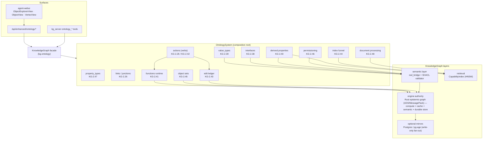

# Architecture: The Unified Ontology System

> How the agent-utilities ontology layer is composed, how it binds to the
> `KnowledgeGraph` facade, the surfaces it exposes (MCP tools + `/api/enhanced/
> ontology/*` + operator UI), and the OWL/SHACL substrate underneath it.
>
> Comparison to the system this mirrors: [`../comparative_analysis_palantir_aip.md`](../comparative_analysis_palantir_aip.md).
> Source captures: [`../reference/palantir-foundry/`](../reference/palantir-foundry/README.md).

## 1. Composition root — `OntologySystem`

`OntologySystem` (`agent_utilities/knowledge_graph/ontology/__init__.py`) is the
single object that composes the ontology primitives. It holds the six
**import-populated** registries plus the live-graph-bound services:

| Member | Type | CONCEPT | Role |
|---|---|---|---|
| `property_types` | `dict[str, PropertyType]` | KG-2.47 | Type vocabulary → node-table DDL + write-path coercion. |
| `value_types` | `dict[str, ValueType]` | KG-2.39 | Constrained semantic types → SHACL/OWL, gate writes. |
| `interfaces` | `InterfaceRegistry` | KG-2.38 | Abstract shapes, conformance, programmatic targeting. |
| `links` | `LinkTypeRegistry` | KG-2.26 | Typed links + reified M:N junction objects. |
| `function_registry` / `functions` | `FunctionRegistry` / `FunctionRuntime` | KG-2.41 | Typed, versioned, audited Functions (PLAIN/ON_OBJECTS/QUERY). |
| `derived_registry` / `derived` | `DerivedPropertyRegistry` / `DerivedPropertyEngine` | KG-2.40 | Read-time computed props (FUNCTION/CYPHER/SPARQL/EMBEDDING). |
| `edits` | `EditLedger` | KG-2.43 | Durable bitemporal edit ledger + revert + writeback. |
| `index_funnel` | `ObjectIndexFunnel` | KG-2.44 | Batch + streaming index sync into the live `CapabilityIndex`. |
| (factories) | `ObjectSet` | KG-2.45 | Static/dynamic object sets, search-around, aggregate, pivot. |
| (functions) | permissioning helpers | KG-2.46 | Markings, redaction, restricted views, entailment propagation. |
| (method) | `DocumentProcessor` | KG-2.48 | Media → chunk → embed → first-class `Chunk` objects. |

The **verbs** live alongside in `knowledge_graph/actions/` (`OntologyAction`,
`KG-2.25` core + `KG-2.42` action-type extension): typed parameters, submission
criteria, function-backing, notification/webhook side effects, batched +
permission-gated + audited + KG-persisted execution.

Every registry ships **real built-ins at import** (base/geo/vector property types;
`EmailAddress`/`URL`/`ISOCurrencyCode`/`Percentage` value types; `HasProvenance`/
`Locatable`/`GeoTracked` interfaces with live implementers; `authored` link +
`agent_skill` junction; `object.summarize`/`numeric.aggregate` functions; built-in
derived properties) — it is never an empty shell.

## 2. Binding to the `KnowledgeGraph` facade

`KnowledgeGraph` (`knowledge_graph/facade.py`) exposes the system lazily as
`kg.ontology` (the `ontology` property). Construction passes the **live facade**
into `OntologySystem(graph=self)`, so the object-aware paths resolve against the
real layers:

- **Functions-on-Objects** (`ObjectFunctionContext`) read properties and traverse
  links through the facade's engine authority.
- **Derived properties** dispatch `CYPHER`/`SPARQL` through the facade + the OWL
  semantic layer and `EMBEDDING` through the retrieval plane.
- **Interface targeting** (`resolve_target`) and **conformance** use the live
  type catalog.
- The **edit ledger** writes durable `object_edit` nodes via the live store; the
  **index funnel** maintains the *same* `CapabilityIndex` that `kg.designate()`
  consumes (one index, not two).

Binding is defensive: any import failure resolves `kg.ontology` to `None` rather
than raising, matching the other layer accessors.

## 3. The OWL/SHACL substrate (semantic layer)

The ontology layer sits on the facade's semantic layer:

- **Value types** compile to a reusable SHACL `sh:PropertyShape` and a named OWL
  `rdfs:Datatype` restricted by XSD facets (`value_types.py` → `value_types_shapes_ttl`
  / `value_types_owl_ttl` / `write_value_shapes_ttl`).
- **Interfaces** project to OWL: an implementing object-type class is asserted
  `rdfs:subClassOf` the interface class and `sh:node` its shape (`interfaces.py`
  → `Interface.to_owl`).
- The **SHACL validator** (`core/shacl_validator.py`) quarantines nodes that
  violate a shape before they persist; the **OWL bridge** (`core/owl_bridge.py`,
  `OWLBridge` promote → reason (HermiT/owlready2) → downfeed) materializes inferred
  facts back onto the graph. This is what makes **derived/CYPHER/SPARQL props,
  interface conformance, and entailment-aware marking propagation** reasoned rather
  than hand-maintained.

## 4. Surfaces

### 4.1 MCP tools (`mcp/kg_server.py`)
Thin handlers reaching the live `kg.ontology`:
`ontology_property_types`, `ontology_value_types`, `ontology_interface`,
`ontology_function`, `ontology_derive`, `ontology_link_materialize`,
`ontology_sampling_profile` (list/describe/resolve/set/evolve/owl — task-aware LLM
sampling profiles, CONCEPT:KG-2.94, see
[Task-Aware Sampling Profiles](sampling_profiles.md)) (plus
edit / permissioning / document-processing handlers in the same registration block).

### 4.2 REST (`agent-webui` `api_extensions.py`, `/api/enhanced/ontology/*`)
Object-type & schema reads (`object-types`, `property-types`, `interfaces`,
`interfaces/{name}/implementers`); object-set ops (`object-set/search`,
`search-around`, `pivot`, `aggregate`, `save`, `list`); actions (`actions`,
`object-set/action`); per-object (`object/{id}`, `object/{id}/edit`,
`object/{id}/revert`); functions/derived/documents (`function/invoke`, `derive`,
`document/process`); configurable views (`object-view/{type}` GET/POST).

### 4.3 Operator UI (`agent-webui` React views)
- **`ObjectExplorerView.tsx`** — Foundry Object Explorer parity: search/filter,
  aggregate, search-around pivot, bulk actions, saved object sets.
- **`ObjectView.tsx`** — Foundry Object Views parity: properties, links, actions,
  edit/revert; standard vs configurable layout.
- **`VertexView.tsx`** — Foundry Vertex parity: graph visualization over
  search-around traversal and object/link reads.

## 5. Architecture diagram

## 6. Live-path invariants (Wire-First)

- `kg.ontology` returns the bound `OntologySystem`; the registries it exposes are
  the **same module-level singletons** the MCP/REST handlers import — no parallel copies.
- The index funnel maintains the **one** `CapabilityIndex` that `kg.designate()`
  ranks against; it does not create a second index.
- Actions invoke the **bound** `FunctionRuntime` and write through the **bound**
  `EditLedger`, so an action's effects are durable, audited KG nodes.
- Permissioning `enforce`/`restricted_view` run on the read path; marking
  propagation traverses real graph edges via the semantic layer.

---

*Anchored to the live modules under `knowledge_graph/ontology/`, `knowledge_graph/
actions/`, `knowledge_graph/facade.py`, `mcp/kg_server.py`, and the agent-webui
ontology surfaces. Re-audit when the composition root or surfaces change.*
