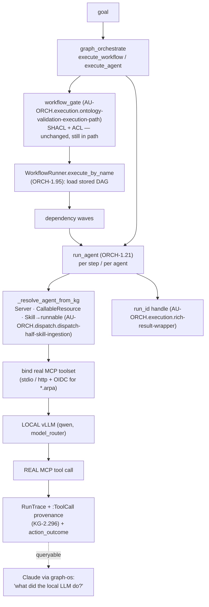

# Orchestration Execution Seam — ingested capability → executed by a local LLM

> CONCEPT:AU-ORCH.execution.execution-seam-closure · AU-ORCH.dispatch.dispatch-half-skill-ingestion · AU-ORCH.execution.rich-result-wrapper · KG-2.296
> The keystone that turns the ingested-but-dormant capability substrate into a working
> "ingested skill/workflow → executed by a local LLM via real MCP tools" loop, with full
> per-tool-call visibility in the epistemic-graph. Closes the highest-leverage gap from
> `reports/northstar-gap-orchestration-ontology-2026-06-28.md`.

## The seam, before and after

The substrate already had every part — the step executor (`WorkflowRunner`), the
tool-binding loop (`run_agent`, ORCH-1.21), the model router, the SHACL/ACL gate
(AU-ORCH.execution.ontology-validation-execution-path), and the ingested DAGs (KG-2.97) — but they were **not connected**. Three
wires close it:

| Gap | Before | After (this change) |
|---|---|---|
| **ORCH-1.95** `execute_workflow` ignored the stored DAG | `Orchestrator.execute_workflow` → `AgentOrchestrationEngine` ran one generic `dynamic_worker` | routes to `WorkflowRunner.execute_by_name`, which loads the stored `WorkflowDefinition`/`WorkflowStep` DAG and runs **each step via `run_agent`** on the local LLM, in dependency-wave order |
| **AU-ORCH.dispatch.dispatch-half-skill-ingestion** ingested skills weren't executable | a `:Skill` (or cold `AGENT_SKILL`) node was search corpus only | `_resolve_agent_from_kg` hydrates the skill's instruction body as the system prompt + its `USES_TOOL` tools, and binds it into a runnable `CallableResource (AGENT_SKILL)` (reusing the `persist_as_runnable` shape via `persist_skill_as_runnable`) |
| **KG-2.296** tool calls weren't visible | only a run-level `RunTrace` was written | every tool call the local LLM makes is persisted as a `:ToolCall` node linked `RunTrace -[:MADE_TOOL_CALL]-> :ToolCall` (tool, server, sanitized args, result/error, sequence) and feeds `action_outcome` (AU-AHE.evaluation.action-outcome-feedback) |
| **AU-ORCH.execution.rich-result-wrapper** a delegation wasn't trackable | `execute_agent` returned a bare string | the MCP `execute_agent`/`execute_workflow` surfaces now also return a `run_id` handle — query its RunTrace + ToolCalls over graph-os |

## Flow



## Governance, model, visibility

- **Governance preserved.** The AU-ORCH.execution.ontology-validation-execution-path SHACL shape gate + the OS-5.14 permissioning ACL
  run in the `graph_orchestrate` handler *before* `Orchestrator.execute_workflow` is called —
  unchanged. `run_agent` keeps the ActionPolicy + OIDC service-account auth for `*.arpa`
  servers.
- **Local LLM by default.** Steps run through `run_agent` → `create_agent` with the configured
  default chat model (the GB10 qwen vLLM) — the standard model-router path, so priority-aware
  admission can tag these runs ORCHESTRATION/INTERACTIVE and they are never stuck behind
  ingestion enrichment.
- **Full visibility.** Reuses the existing `KGTraceBackend`/RunTrace + `action_outcome`
  (AU-AHE.evaluation.action-outcome-feedback). Query a delegated run:
  ```cypher
  MATCH (t:RunTrace {id:'trace:<run_id>'})-[:MADE_TOOL_CALL]->(tc:ToolCall)
  RETURN tc.tool_name, tc.server, tc.args, tc.status, tc.result_preview ORDER BY tc.sequence
  ```

## Why this is the delegation keystone

The platform's operating model (see
[`delegation-first-operating-model.md`](delegation-first-operating-model.md)) is that
**the local LLM + graph-os do the work** and Claude/the harness **orchestrates and
resolves exceptions**. That model is only *safe* if a delegated run is (a) actually
executed by the local model against real tools — not a stub — and (b) **fully visible
and steerable** after the fact. This seam is exactly what makes both true:

- It turns an **ingested-but-dormant capability** (a `:Skill`, a `WorkflowDefinition`
  DAG, an `AgentTemplate` persona) into something a local LLM **runs**, with its real
  MCP toolset bound. Before the seam, `execute_workflow` quietly ran a generic
  `dynamic_worker` and an ingested skill was search-corpus only — "delegation" couldn't
  truly hand off the stored capability.
- It writes **per-tool-call provenance** (`:ToolCall` under the run's `RunTrace`) so the
  orchestrator can answer *"what did the local LLM actually do?"* with a graph query —
  the prerequisite for the harness's *resolve-exceptions* job. When a delegated run
  fails or returns an ungrounded answer, you read its `RunTrace`/`:ToolCall` chain to
  see which tool, with what args, returned what, find **why**, fix the gap, and
  re-delegate.

In one line: this seam closes the loop from *"ingested capability"* to *"executed by a
local LLM, fully visible and steerable."* Everything in the delegation-first model rests
on it.

## The workflow path in depth — `execute_workflow` → `WorkflowRunner` DAG

`graph_orchestrate action=execute_workflow` (the MCP tool, REST twin
`/graph/orchestrate`) dispatches — after the AU-ORCH.execution.ontology-validation-execution-path SHACL + ACL gate — into
`Orchestrator.execute_workflow` (`orchestration/manager.py`). That method now routes to
`WorkflowRunner.execute_by_name` (`workflows/runner.py`) instead of the old generic
fallback, and returns the `WorkflowResult` as a dict carrying the **`run_id`**
(`payload["run_id"] = result.session_id`).

`WorkflowRunner.execute_by_name` resolves the workflow name to its **stored DAG** — the
`WorkflowDefinition` + `WorkflowStep` nodes (the KG-2.97 `WorkflowStore` shape, optionally
carrying a `(:WorkflowDefinition)-[:REALIZES]->(:BusinessProcess)` edge) — and hands it to
`_execute_plan_via_agents` (CONCEPT:AU-ORCH.execution.execution-seam-closure). That function:

1. Resolves each step's `(agent_name, task)` from the canonical `WorkflowStep` shape.
2. Computes **dependency waves** — steps with satisfied dependencies run **concurrently**
   as one wave; a dependency cycle / dangling dep degrades gracefully to running the
   remainder as a single wave rather than deadlocking.
3. Runs each step via **`run_agent(step.id, step.task, engine=…)`** — the *existing*
   ORCH-1.21 executor on the local LLM, not a new one — so every step gets the same
   real-MCP-toolset resolution, the same model-router/local-vLLM binding, and the same
   `RunTrace` + `:ToolCall` provenance write as a standalone `execute_agent`.
4. Threads a completed wave's results into dependent steps' context.

So a workflow is just *N* governed `run_agent` invocations in dependency order, each
fully traced. (The change also fixed a real `AttributeError` — `AgentExecutionResult` has
no `.task` — that previously crashed the manifest path after steps ran.)

## Skills-as-runnable (AU-ORCH.dispatch.dispatch-half-skill-ingestion) in depth

Before the seam, a `:Skill` node (or a cold `AGENT_SKILL`) was only ever *retrieved* —
it could be searched and cited but not **executed**. `_resolve_agent_from_kg`
(`orchestration/agent_runner.py`) now makes an ingested skill **directly dispatchable**:

- It hydrates the skill's **instruction body as the system prompt** and its
  `USES_TOOL` edges as the bound tools.
- It binds the result into a runnable `CallableResource (AGENT_SKILL)` via
  **`persist_skill_as_runnable`**, which reuses the existing `persist_as_runnable` node
  shape. A bare `:Skill` gets a `resource:<id>` sibling plus a `BINDS_RUNNABLE` edge, so
  the *next* resolution of that skill name is a pure property read (no re-hydration).

The net effect: `graph_orchestrate action=execute_agent agent=<skill-name>` runs the
ingested skill on the local LLM with its declared tools — an ingested capability becomes
an executable one, with no separate registration step.

## The `run_id` handle (AU-ORCH.execution.rich-result-wrapper) — what the caller gets back

The MCP `execute_agent` / `execute_workflow` surfaces return a **`run_id`** handle so a
delegation is trackable. In `run_agent`, when the caller opts into the rich wrapper
(`return_mermaid=True` — the MCP `execute_agent` path — or when a message channel was
opened), the return is a JSON object that **always** carries `run_id`:

```json
{ "output": "<the agent's answer>", "run_id": "run:1a2b3c4d", "mermaid": "…", "channel_id": "…" }
```

Internal callers (`return_mermaid=False`) keep the **bare-string** contract bit-for-bit —
the handle is additive, never a breaking change. `run_id` (`run:<hex>`) is the key to the
run's `RunTrace` (`trace:<run_id>`) and the prerequisite for async / streaming / live
steering of a delegated run.

## `:ToolCall` provenance (KG-2.296) — fields and how it's written

Every tool call the local LLM makes is persisted as a first-class `:ToolCall` node
linked `(:RunTrace)-[:MADE_TOOL_CALL]->(:ToolCall)`. The pipeline:

1. **Extraction** — `_extract_tool_calls` reads the pydantic-ai message history
   (`run_result.all_messages()`): a `ToolCallPart` opens a call, its paired
   `ToolReturnPart` (matched on `tool_call_id`) carries the result, and a
   `RetryPromptPart` carries a tool error. It is version-tolerant (matches on part
   class-name / `part_kind`) so a pydantic-ai bump can never break the run path, and
   best-effort (a result without an iterable history yields `[]`).
2. **Sanitization** — `_sanitize_tool_args` renders args as compact JSON and **redacts
   secret-shaped keys** (`password`, `secret`, `token`, `api_key`, `authorization`,
   `bearer`, `credential`, `private_key`, …), bounding the size to 2 KB.
3. **Persistence** — `_persist_tool_calls` writes one `ToolCall` node per call. It uses
   `engine.link_nodes(...)` (backend-first / durable) for the `MADE_TOOL_CALL` edge —
   not the best-effort `add_edge` compute-cache path — so the provenance survives in the
   epistemic-graph for graph-os traversal queries. A provenance write **never fails the
   run** (best-effort).

Each `:ToolCall` node (id `toolcall:<run>:<i>`) carries:

| Field | Meaning |
|---|---|
| `run_id` | the owning run (`run:<hex>`) |
| `agent_name` | the agent/skill/server that made the call |
| `server` | the MCP server the tool lives on |
| `tool_name` | the tool invoked |
| `args` | sanitized, secret-redacted JSON of the arguments |
| `result_preview` | first 2 KB of the tool's return |
| `error` | the tool error (from a `RetryPromptPart`), if any |
| `status` | `ok` / `error` (derived from `error`) |
| `sequence` | the call's order within the run |
| `timestamp` | UTC ISO-8601 |

Each call also feeds **`action_outcome` (AU-AHE.evaluation.action-outcome-feedback)** via
`FeedbackService.record_action_outcome("tool:<tool_name>", success=…)`, so the capability
reward-EMA densifies on the tools that actually worked — **visibility and learning from
the same seam**. Both `RunTrace` and `:ToolCall` are also identity-stamped
(`_stamp_run_identity`: tenant/actor + correlation id) so the audit trail answers "which
tenant/actor ran this" as a scoped graph query.

### Query a delegated run over graph-os

Given a `run_id`, the orchestrator inspects exactly what the local LLM did:

```cypher
MATCH (t:RunTrace {id:'trace:<run_id>'})-[:MADE_TOOL_CALL]->(tc:ToolCall)
RETURN tc.tool_name, tc.server, tc.args, tc.status, tc.result_preview, tc.error
ORDER BY tc.sequence
```

This is the same provenance the **`troubleshoot` context provider** (AU-KG.retrieval.kg-4, see
[`troubleshooting.md`](troubleshooting.md)) pulls as its app-trace layer when a delegated
run fails.

## Proof

`scripts/dev_orchestration_seam_e2e.py` is the live e2e: it stands up a local read-only
stdio MCP server, then proves goal → ingested skill/workflow → `run_agent`/`WorkflowRunner`
on the local vLLM → a real MCP `health_probe` tool call → `:ToolCall` provenance + `run_id`.
Validated live against the running engine + the qwen vLLM (real host load average returned;
`:ToolCall` nodes queryable; `execute_workflow` ran the stored step, not `dynamic_worker`).

## Still aspirational (the next prize)

This closes the *execution* seam. The deeper ontology-reasoned **composition** (GAP 3–4 of the
analysis) — materializing the cross-capability typed edges (`Skill -:usesTool-> Tool -^PROVIDES-
Server`, `Agent -:usesModel-> LanguageModel`) and a goal→plan composer that *reasons over* them
to assemble `{skill + tools + prompt + model}` — is the next step, and is only useful now that
a composed plan can actually be run. The per-step executor inside the workflow path is
`run_agent`; the manifest/swarm path (`ParallelEngine`) still defaults to a foreign model and
binds tools by tag rather than resolving MCP servers — aligning it to the local vLLM +
`run_agent` resolution is a follow-up.
```
