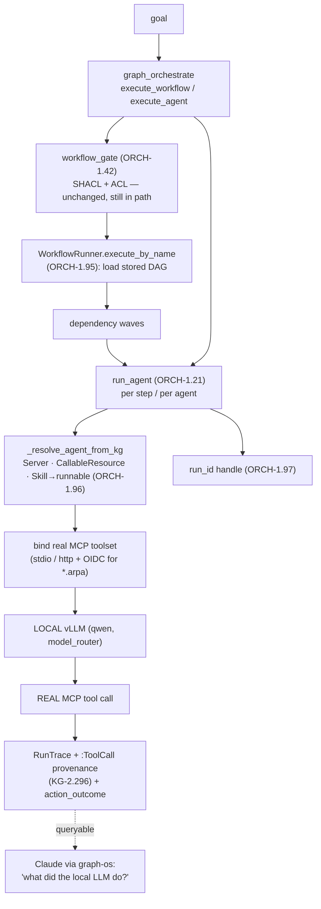

# Orchestration Execution Seam — ingested capability → executed by a local LLM

> CONCEPT:ORCH-1.95 · ORCH-1.96 · ORCH-1.97 · KG-2.296
> The keystone that turns the ingested-but-dormant capability substrate into a working
> "ingested skill/workflow → executed by a local LLM via real MCP tools" loop, with full
> per-tool-call visibility in the epistemic-graph. Closes the highest-leverage gap from
> `reports/northstar-gap-orchestration-ontology-2026-06-28.md`.

## The seam, before and after

The substrate already had every part — the step executor (`WorkflowRunner`), the
tool-binding loop (`run_agent`, ORCH-1.21), the model router, the SHACL/ACL gate
(ORCH-1.42), and the ingested DAGs (KG-2.97) — but they were **not connected**. Three
wires close it:

| Gap | Before | After (this change) |
|---|---|---|
| **ORCH-1.95** `execute_workflow` ignored the stored DAG | `Orchestrator.execute_workflow` → `AgentOrchestrationEngine` ran one generic `dynamic_worker` | routes to `WorkflowRunner.execute_by_name`, which loads the stored `WorkflowDefinition`/`WorkflowStep` DAG and runs **each step via `run_agent`** on the local LLM, in dependency-wave order |
| **ORCH-1.96** ingested skills weren't executable | a `:Skill` (or cold `AGENT_SKILL`) node was search corpus only | `_resolve_agent_from_kg` hydrates the skill's instruction body as the system prompt + its `USES_TOOL` tools, and binds it into a runnable `CallableResource (AGENT_SKILL)` (reusing the `persist_as_runnable` shape via `persist_skill_as_runnable`) |
| **KG-2.296** tool calls weren't visible | only a run-level `RunTrace` was written | every tool call the local LLM makes is persisted as a `:ToolCall` node linked `RunTrace -[:MADE_TOOL_CALL]-> :ToolCall` (tool, server, sanitized args, result/error, sequence) and feeds `action_outcome` (AHE-3.62) |
| **ORCH-1.97** a delegation wasn't trackable | `execute_agent` returned a bare string | the MCP `execute_agent`/`execute_workflow` surfaces now also return a `run_id` handle — query its RunTrace + ToolCalls over graph-os |

## Flow



## Governance, model, visibility

- **Governance preserved.** The ORCH-1.42 SHACL shape gate + the OS-5.14 permissioning ACL
  run in the `graph_orchestrate` handler *before* `Orchestrator.execute_workflow` is called —
  unchanged. `run_agent` keeps the ActionPolicy + OIDC service-account auth for `*.arpa`
  servers.
- **Local LLM by default.** Steps run through `run_agent` → `create_agent` with the configured
  default chat model (the GB10 qwen vLLM) — the standard model-router path, so priority-aware
  admission can tag these runs ORCHESTRATION/INTERACTIVE and they are never stuck behind
  ingestion enrichment.
- **Full visibility.** Reuses the existing `KGTraceBackend`/RunTrace + `action_outcome`
  (AHE-3.62). Query a delegated run:
  ```cypher
  MATCH (t:RunTrace {id:'trace:<run_id>'})-[:MADE_TOOL_CALL]->(tc:ToolCall)
  RETURN tc.tool_name, tc.server, tc.args, tc.status, tc.result_preview ORDER BY tc.sequence
  ```

## Proof

`scripts/dev_orchestration_seam_e2e.py` is the live e2e: it stands up a local read-only
stdio MCP server, then proves goal → ingested skill/workflow → `run_agent`/`WorkflowRunner`
on the local vLLM → a real MCP `health_probe` tool call → `:ToolCall` provenance + `run_id`.
Validated live against the running engine + the qwen vLLM (real host load average returned;
`:ToolCall` nodes queryable; `execute_workflow` ran the stored step, not `dynamic_worker`).

## Still aspirational (the next prize)

This closes the *execution* seam. The deeper ontology-reasoned **composition** (GAP 3–4 of the
analysis) — materializing the cross-capability typed edges (`Skill -:usesTool-> Tool -^PROVIDES-
Server`, `Agent -:usesModel-> LanguageModel`) and a goal→plan composer that *reasons over* them
to assemble `{skill + tools + prompt + model}` — is the next step, and is only useful now that
a composed plan can actually be run. The per-step executor inside the workflow path is
`run_agent`; the manifest/swarm path (`ParallelEngine`) still defaults to a foreign model and
binds tools by tag rather than resolving MCP servers — aligning it to the local vLLM +
`run_agent` resolution is a follow-up.
```
