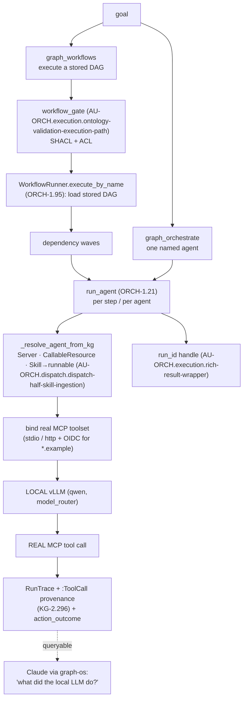

# Orchestration Execution Seam — ingested capability → executed by a local LLM

> CONCEPT:AU-ORCH.execution.execution-seam-closure · AU-ORCH.dispatch.dispatch-half-skill-ingestion · AU-ORCH.execution.rich-result-wrapper · KG-2.296
> The keystone that turns the ingested-but-dormant capability substrate into a working
> "ingested skill/workflow → executed by a local LLM via real MCP tools" loop, with full
> per-tool-call visibility in the epistemic-graph. Closes the highest-leverage gap from
> `reports/northstar-gap-orchestration-ontology-2026-06-28.md`.

## The seam, before and after

The substrate already had every part — the step executor (`WorkflowRunner`), the
tool-binding loop (`run_agent`, ORCH-1.21), the model router, the SHACL/ACL gate
(AU-ORCH.execution.ontology-validation-execution-path), and the ingested DAGs (KG-2.97) — but they were **not connected**. Three
wires close it:

| Gap | Before | After (this change) |
|---|---|---|
| **ORCH-1.95** `execute_workflow` ignored the stored DAG | `Orchestrator.execute_workflow` → `AgentOrchestrationEngine` ran one generic `dynamic_worker` | routes to `WorkflowRunner.execute_by_name`, which loads the stored `WorkflowDefinition`/`WorkflowStep` DAG and runs **each step via `run_agent`** on the local LLM, in dependency-wave order |
| **AU-ORCH.dispatch.dispatch-half-skill-ingestion** ingested skills weren't executable | a `:Skill` (or cold `AGENT_SKILL`) node was search corpus only | `_resolve_agent_from_kg` hydrates the skill's instruction body as the system prompt + its `USES_TOOL` tools, and binds it into a runnable `CallableResource (AGENT_SKILL)` (reusing the `persist_as_runnable` shape via `persist_skill_as_runnable`) |
| **KG-2.296** tool calls weren't visible | only a run-level `RunTrace` was written | every tool call the local LLM makes is persisted as a privacy-guarded `:ToolCall` linked `RunTrace -[:USED_TOOL]-> :ToolCall` (tool, content digests/counts, status, sequence) and feeds `action_outcome` (AU-AHE.evaluation.action-outcome-feedback) |
| **AU-ORCH.execution.rich-result-wrapper** a delegation wasn't trackable | agent output lacked a public handle | `graph_orchestrate` and `graph_workflows` return a `run_id` handle — query its RunTrace + ToolCalls over graph-os |

## Flow


```mermaid
flowchart TD
    G[goal] --> O["graph_orchestrate<br/>one named agent"]
    G --> WF["graph_workflows<br/>execute a stored DAG"]
    WF --> GATE["workflow_gate (AU-ORCH.execution.ontology-validation-execution-path)<br/>SHACL + ACL"]
    GATE --> WR["WorkflowRunner.execute_by_name<br/>(ORCH-1.95): load stored DAG"]
    WR --> WAVE["dependency waves"]
    WAVE --> RA["run_agent (ORCH-1.21)<br/>per step / per agent"]
    O --> RA
    RA --> RES["_resolve_agent_from_kg<br/>Server · CallableResource · Skill→runnable (AU-ORCH.dispatch.dispatch-half-skill-ingestion)"]
    RES --> BIND["bind real MCP toolset<br/>(stdio / http + OIDC for *.example)"]
    BIND --> LLM["LOCAL vLLM (qwen, model_router)"]
    LLM --> TOOL["REAL MCP tool call"]
    TOOL --> TRACE["RunTrace + :ToolCall provenance<br/>(KG-2.296) + action_outcome"]
    RA --> RID["run_id handle (AU-ORCH.execution.rich-result-wrapper)"]
    TRACE -.queryable.-> CLAUDE["Claude via graph-os:<br/>'what did the local LLM do?'"]
```

## Governance, model, visibility

- **Governance preserved.** The AU-ORCH.execution.ontology-validation-execution-path SHACL shape gate + the OS-5.14 permissioning ACL
  run in the `graph_workflows` handler *before* `Orchestrator.execute_workflow` is called.
  `run_agent` keeps the ActionPolicy + OIDC service-account auth for `*.example`
  servers.
- **Local LLM by default.** Steps run through `run_agent` → `create_agent` with the configured
  default configured chat model — the standard model-router path, so priority-aware
  admission can tag these runs ORCHESTRATION/INTERACTIVE and they are never stuck behind
  ingestion enrichment.
- **Full visibility.** Reuses the existing `KGTraceBackend`/RunTrace + `action_outcome`
  (AU-AHE.evaluation.action-outcome-feedback). Query a delegated run:
  ```cypher
  MATCH (t:RunTrace {id: $trace_id})-[:USED_TOOL]->(tc:ToolCall)
  RETURN tc.tool_name, tc.status, tc.args_digest, tc.result_digest
  ORDER BY tc.sequence
  ```

## Why this is the delegation keystone

The platform's operating model (see
[`delegation-first-operating-model.md`](delegation-first-operating-model.md)) is that
**the local LLM + graph-os do the work** and Claude/the harness **orchestrates and
resolves exceptions**. That model is only *safe* if a delegated run is (a) actually
executed by the local model against real tools — not a stub — and (b) **fully visible
and steerable** after the fact. This seam is exactly what makes both true:

- It turns an **ingested-but-dormant capability** (a `:Skill`, a `WorkflowDefinition`
  DAG, an `AgentTemplate` persona) into something a local LLM **runs**, with its real
  MCP toolset bound. Before the seam, `execute_workflow` quietly ran a generic
  `dynamic_worker` and an ingested skill was search-corpus only — "delegation" couldn't
  truly hand off the stored capability.
- It writes **per-tool-call provenance** (`:ToolCall` under the run's `RunTrace`) so the
  orchestrator can answer *"what did the local LLM actually do?"* with a graph query —
  the prerequisite for the harness's *resolve-exceptions* job. When a delegated run
  fails or returns an ungrounded answer, you read its `RunTrace`/`:ToolCall` chain to
  see which tool failed and correlate its opaque payload digests, find **why**, fix the
  gap, and re-delegate without retaining raw payloads.

In one line: this seam closes the loop from *"ingested capability"* to *"executed by a
local LLM, fully visible and steerable."* Everything in the delegation-first model rests
on it.

## The workflow path in depth — `execute_workflow` → `WorkflowRunner` DAG

`graph_workflows action=execute` (the MCP tool, REST twin
`/api/graph/workflows`) dispatches — after the AU-ORCH.execution.ontology-validation-execution-path SHACL + ACL gate — into
`Orchestrator.execute_workflow` (`orchestration/manager.py`). That method now routes to
`WorkflowRunner.execute_by_name` (`workflows/runner.py`) and returns the
`WorkflowResult` as a dict carrying the **`run_id`**
(`payload["run_id"] = result.session_id`).

`WorkflowRunner.execute_by_name` resolves the workflow name to its **stored DAG** — the
`WorkflowDefinition` + `WorkflowStep` nodes (the KG-2.97 `WorkflowStore` shape, optionally
carrying a `(:WorkflowDefinition)-[:REALIZES]->(:BusinessProcess)` edge) — and hands it to
`_execute_plan_via_agents` (CONCEPT:AU-ORCH.execution.execution-seam-closure). That function:

1. Resolves each step's `(agent_name, task)` from the canonical `WorkflowStep` shape.
2. Computes **dependency waves** — steps with satisfied dependencies run **concurrently**
   as one wave; a dependency cycle / dangling dep degrades gracefully to running the
   remainder as a single wave rather than deadlocking.
3. Runs each step via **`run_agent(step.id, step.task, engine=…)`** — the *existing*
   ORCH-1.21 executor on the local LLM, not a new one — so every step gets the same
   real-MCP-toolset resolution, the same model-router/local-vLLM binding, and the same
   `RunTrace` + `:ToolCall` provenance write as a standalone `execute_agent`.
4. Threads a completed wave's results into dependent steps' context.

So a workflow is just *N* governed `run_agent` invocations in dependency order, each
fully traced. (The change also fixed a real `AttributeError` — `AgentExecutionResult` has
no `.task` — that previously crashed the manifest path after steps ran.)

## Skills-as-runnable (AU-ORCH.dispatch.dispatch-half-skill-ingestion) in depth

Before the seam, a `:Skill` node (or a cold `AGENT_SKILL`) was only ever *retrieved* —
it could be searched and cited but not **executed**. `_resolve_agent_from_kg`
(`orchestration/agent_runner.py`) now makes an ingested skill **directly dispatchable**:

- It hydrates the skill's **instruction body as the system prompt** and its
  `USES_TOOL` edges as the bound tools.
- It binds the result into a runnable `CallableResource (AGENT_SKILL)` via
  **`persist_skill_as_runnable`**, which reuses the existing `persist_as_runnable` node
  shape. A bare `:Skill` gets a `resource:<id>` sibling plus a `BINDS_RUNNABLE` edge, so
  the *next* resolution of that skill name is a pure property read (no re-hydration).

The net effect: `graph_orchestrate agent=<skill-name>` runs the
ingested skill on the local LLM with its declared tools — an ingested capability becomes
an executable one, with no separate registration step.

## The `run_id` handle (AU-ORCH.execution.rich-result-wrapper) — what the caller gets back

The MCP `graph_orchestrate` / `graph_workflows` surfaces return a **`run_id`** handle so a
delegation is trackable. In `run_agent`, when the caller opts into the rich wrapper
(`return_mermaid=True` — the MCP `execute_agent` path — or when a message channel was
opened), the return is a JSON object that **always** carries `run_id`:

```json
{ "output": "<the agent's answer>", "run_id": "run:0123456789abcdef0123456789abcdef", "mermaid": "…", "channel_id": "…" }
```

Internal callers (`return_mermaid=False`) keep the **bare-string** contract bit-for-bit —
the handle is carried by the MCP result contract. `run_id` is exactly `run:` plus
32 lowercase hexadecimal characters generated from 128 CSPRNG bits. Short or
alternate forms are rejected. It is the key to the run's opaque canonical
`RunTrace` (resolved by the status action) and the prerequisite for async,
streaming, and live steering of a delegated run.

## `:ToolCall` provenance (KG-2.296) — fields and how it's written

Every tool call the local LLM makes is persisted as a first-class `:ToolCall` node
linked `(:RunTrace)-[:USED_TOOL]->(:ToolCall)`. The pipeline:

1. **Extraction** — `_extract_tool_calls` reads the pydantic-ai message history
   (`run_result.all_messages()`): a `ToolCallPart` opens a call, its paired
   `ToolReturnPart` (matched on `tool_call_id`) carries the result, and a
   `RetryPromptPart` carries a tool error. It is version-tolerant (matches on part
   class-name / `part_kind`) so a pydantic-ai bump can never break the run path, and
   best-effort (a result without an iterable history yields `[]`).
2. **Transient normalization** — `_sanitize_tool_args` renders args as compact JSON,
   redacts secret-shaped keys, and bounds the value used for target extraction and
   digest construction. This normalized payload is not durable graph content.
3. **Privacy boundary and persistence** — `_persist_tool_calls` delegates property
   construction to `trace_ontology.tool_call_properties`, which runs the persistence
   privacy guard and stores only opaque content digests and character counts. It writes
   one `ToolCall` node per call and uses
   `engine.link_nodes(...)` (backend-first / durable) for the `USED_TOOL` edge —
   not the best-effort `add_edge` compute-cache path — so the provenance survives in the
   epistemic-graph for graph-os traversal queries. A provenance write **never fails the
   run** (best-effort).

Each `:ToolCall` node (id `toolcall:<opaque-run-ref>:<i>`) carries:

| Field | Meaning |
|---|---|
| `run_id` | the owning opaque canonical trace id |
| `tool_name` | the tool invoked |
| `args_digest`, `args_character_count` | opaque digest and size of the transient, secret-redacted arguments |
| `result_digest`, `result_character_count` | opaque digest and size of the tool return |
| `error_digest`, `error_character_count` | opaque digest and size of the tool error |
| `status` | `ok` / `error` (derived from `error`) |
| `sequence` | the call's order within the run |
| `timestamp` | UTC ISO-8601 |

Each call also feeds **`action_outcome` (AU-AHE.evaluation.action-outcome-feedback)** via
`FeedbackService.record_action_outcome("tool:<tool_name>", success=…)`, so the capability
reward-EMA densifies on the tools that actually worked — **visibility and learning from
the same seam**. Both `RunTrace` and `:ToolCall` are also identity-stamped
(`_stamp_run_identity`: opaque tenant/actor/correlation references) so the audit trail answers
the scoped attribution question without persisting raw identity strings.

### Query a delegated run over graph-os

Given a public `run_id`, first call the orchestrator status action and use its returned
opaque `trace_id`:

```cypher
MATCH (t:RunTrace {id: $trace_id})-[:USED_TOOL]->(tc:ToolCall)
RETURN tc.tool_name, tc.status,
       tc.args_digest, tc.args_character_count,
       tc.result_digest, tc.result_character_count,
       tc.error_digest, tc.error_character_count
ORDER BY tc.sequence
```

This is the same provenance the **`troubleshoot` context provider** (AU-KG.retrieval.kg-4, see
[`troubleshooting.md`](troubleshooting.md)) pulls as its app-trace layer when a delegated
run fails.

## Proof

`agent-utilities-validate-skills` is the distribution-owned live execution proof. It
uses synthetic read-only tasks against an already deployed GraphOS endpoint,
validates direct and delegated local-model behavior, queries canonical trace
metadata through the mounted Langfuse MCP child, and writes only opaque evidence
references. It never materializes or persists a local executable or filesystem path.

## Still aspirational (the next prize)

This closes the *execution* seam. The deeper ontology-reasoned **composition** (GAP 3–4 of the
analysis) — materializing the cross-capability typed edges (`Skill -:usesTool-> Tool -^PROVIDES-
Server`, `Agent -:usesModel-> LanguageModel`) and a goal→plan composer that *reasons over* them
to assemble `{skill + tools + prompt + model}` — is the next step, and is only useful now that
a composed plan can actually be run. The per-step executor inside the workflow path is
`run_agent`; the manifest/swarm path (`ParallelEngine`) still defaults to a foreign model and
binds tools by tag rather than resolving MCP servers — aligning it to the local vLLM +
`run_agent` resolution is a follow-up.
```
