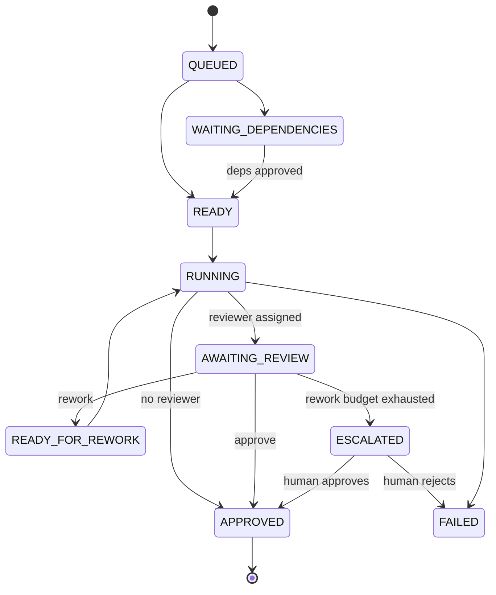
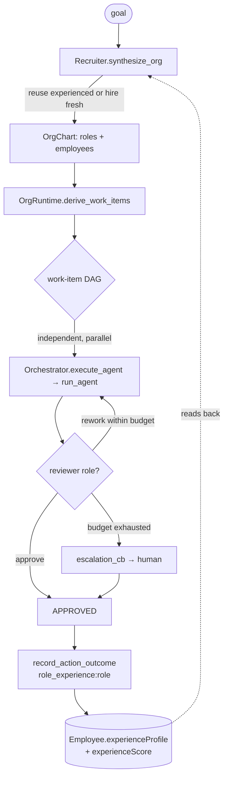

# Runtime Org Dynamics — Recruiter, Work-Item DAG, Self-Grown Staff

The company ontology (`ontology_company.ttl`) models the **static** org
STRUCTURE — `:Company` / `:Department` / `:AgentRole` / `:Employee`. This
subsystem adds the missing runtime DYNAMICS, ported (shape, not code) from
OpenOPC's "One-Person Company" (autonomous AI-native company)
`layer2_organization`. It is built as a **workflow over the existing
orchestrator** (`Orchestrator.execute_agent` → `run_agent`) — **not** a new
service (the one-core rule).

Three concept-anchored capabilities, all in
`agent_utilities/orchestration/org_runtime.py`:

| Capability | Concept | What it does |
|---|---|---|
| Recruiter / org-synthesis | `AU-ORCH.org.recruiter` | From a goal, draft an org chart (departments → roles) and **fill** each role — reuse an experienced `:Employee` if one exists, else hire a fresh template. Instantiates/reuses `:AgentRole`/`:Employee` KG nodes. |
| Work-item DAG + kanban phases | `AU-ORCH.org.work-item-dag` | Derive a `:WorkItem` DAG, run independent items in parallel and dependents once predecessors are approved, drive each through kanban `OrgPhase`s under a `ManagerMode` (execute/delegate/review/integrate/rework), and escalate beyond-team blockers to a human. |
| Self-Grown experience | `AU-AHE.org.role-experience` | Each item's outcome is written back through the AHE reward loop (`FeedbackService.record_action_outcome` with a `role_experience:<role>` action id), growing the `:Employee`'s `experienceProfile`/`experienceScore` — which the next recruiter run reads back. |

## Ontology additions (`ontology_company.ttl`)

`:WorkItem` (BFO process) + `:ownedByRole` / `:reviewedByRole` /
`:dependsOnWorkItem` / `:staffsRole` object properties + `:workItemPhase`,
`:workItemManagerMode`, `:kanbanColumn`, and the `:Employee` datatype properties
`:experienceProfile`, `:experienceScore`, `:seniority`.

## Kanban phase state machine

Columns project as `todo` (queued/ready/waiting/rework), `in_progress`
(running), `in_review` (awaiting_review/escalated), `done`
(approved/failed/cancelled).

## End-to-end flow

The escalation seam (`OrgRuntime.escalation_cb`) defaults to marking the item
`ESCALATED` and recording the blocker (never silently auto-approves); a
deployment supplies its own callback (e.g. one that opens an approval through
`orchestration/action_policy.py`) to actually reach a human.

## Surfaces (MCP + REST, in lockstep)

Both actions dispatch through the shared `graph_orchestrate` action core:

- `graph_orchestrate(action='synthesize_org', task=<goal>)` — REST twin
  `POST /graph/orchestrate/synthesize-org`.
- `graph_orchestrate(action='run_org', task=<goal>)` — REST twin
  `POST /graph/orchestrate/run-org`.

Optional `dependencies` JSON carries `{"domains": [...]}`.

## Self-Grown reward write-back

`record_role_experience` is invoked by the `role_experience:<role_id>` branch of
`FeedbackService.record_action_outcome` — the same reward substrate that trains
routing (`model_route:`) and the autonomy ramp (`trust:`). It accrues
successes / partials / failures + per-domain counts into a JSON
`experienceProfile`, recomputes a scalar `experienceScore`
(`successes + 0.5·partials − 0.25·failures + 0.5·domain-breadth`), and re-bands
`seniority`. The recruiter reads `experienceScore` when it decides reuse vs hire,
closing the loop.
