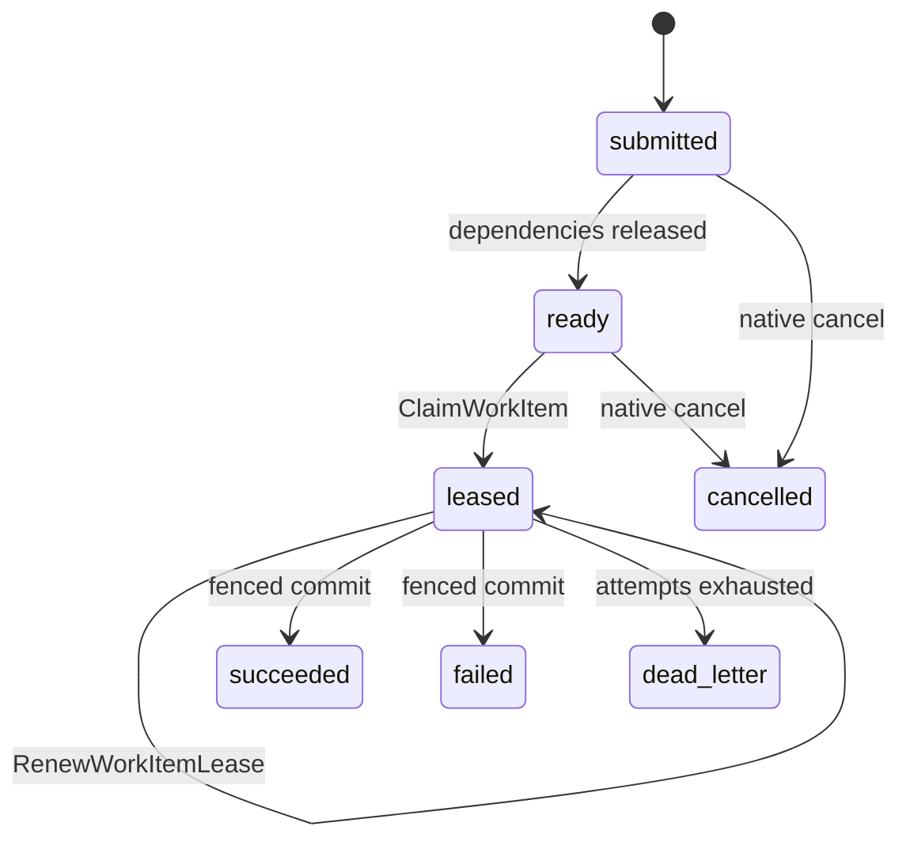
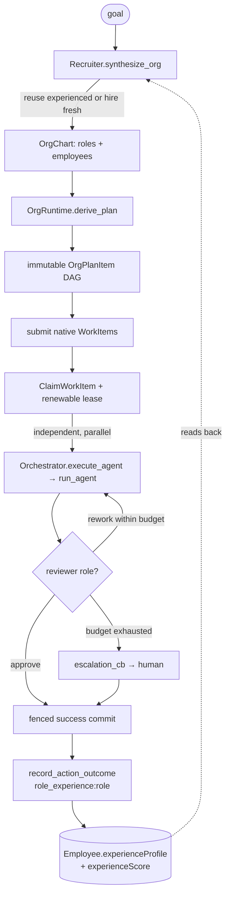

# Runtime Org Dynamics — Recruiter, Work-Item DAG, Self-Grown Staff

The company ontology (`ontology_company.ttl`) models the **static** org
STRUCTURE — `:Company` / `:Department` / `:AgentRole` / `:Employee`. This
subsystem adds the missing runtime DYNAMICS, ported (shape, not code) from
OpenOPC's "One-Person Company" (autonomous AI-native company)
`layer2_organization`. It is built as a **workflow over the existing
orchestrator** (`Orchestrator.execute_agent` → `run_agent`) — **not** a new
service (the one-core rule).

Three concept-anchored capabilities, all in
`agent_utilities/orchestration/org_runtime.py`:

| Capability | Concept | What it does |
|---|---|---|
| Recruiter / org-synthesis | `AU-ORCH.org.recruiter` | From a goal, draft an org chart (departments → roles) and **fill** each role — reuse an experienced `:Employee` if one exists, else hire a fresh template. Instantiates/reuses `:AgentRole`/`:Employee` KG nodes. |
| Native WorkItem DAG | `AU-ORCH.org.work-item-dag` | Derive immutable `OrgPlanItem` definitions, submit their dependency graph as native `:WorkItem` records, and execute only under engine-issued claims, renewable leases, fencing, and terminal commits. `ManagerMode` is turn-local context, not another lifecycle. |
| Self-Grown experience | `AU-AHE.org.role-experience` | Each item's outcome is written back through the AHE reward loop (`FeedbackService.record_action_outcome` with a `role_experience:<role>` action id), growing the `:Employee`'s `experienceProfile`/`experienceScore` — which the next recruiter run reads back. |

## Ontology additions (`ontology_company.ttl`)

`:WorkItem` remains the shared BFO process class for the platform's one native
work-state authority. The org ontology adds `:staffsRole` and the `:Employee`
datatype properties `:experienceProfile`, `:experienceScore`, and `:seniority`.
It does not define organization-specific WorkItem phases or transition fields.

## Sole native WorkItem lifecycle

```mermaid
stateDiagram-v2
    [*] --> submitted
    submitted --> ready: dependencies released
    ready --> leased: ClaimWorkItem
    leased --> leased: RenewWorkItemLease
    leased --> succeeded: fenced commit
    leased --> failed: fenced commit
    submitted --> cancelled: native cancel
    ready --> cancelled: native cancel
    leased --> dead_letter: attempts exhausted
```

Review and rework happen while the same claimant owns the renewable lease.
They do not add states or properties to the durable WorkItem. A human escalation
callback returns a decision to the live claimant; the claimant alone commits
success/failure. An unclaimable dependency deadlock is cancelled through the
native WorkItem authority.

## End-to-end flow

```mermaid
flowchart TD
    Goal([goal]) --> Recruiter[Recruiter.synthesize_org]
    Recruiter -->|reuse experienced or hire fresh| Chart[OrgChart: roles + employees]
    Chart --> Derive[OrgRuntime.derive_plan]
    Derive --> Plan[immutable OrgPlanItem DAG]
    Plan --> Submit[submit native WorkItems]
    Submit --> Claim[ClaimWorkItem + renewable lease]
    Claim -->|independent, parallel| Exec[Orchestrator.execute_agent → run_agent]
    Exec --> Review{reviewer role?}
    Review -->|approve| Done[fenced success commit]
    Review -->|rework within budget| Exec
    Review -->|budget exhausted| Human[escalation_cb → human]
    Human --> Done
    Done --> WB["record_action_outcome<br/>role_experience:role"]
    WB --> Profile[("Employee.experienceProfile<br/>+ experienceScore")]
    Profile -.reads back.-> Recruiter
```

The escalation seam (`OrgRuntime.escalation_cb`) never writes WorkItem state and
defaults to failing closed. A deployment may supply a callback that opens an
approval through `orchestration/action_policy.py`; the native lease holder then
commits the decision through `CommitWorkItemResult`.

## Surfaces (MCP + REST, in lockstep)

Both actions dispatch through the focused `graph_agents` core:

- `graph_agents(action='synthesize_org', task=<goal>)` — REST twin
  `POST /api/graph/agents`.
- `graph_agents(action='run_org', task=<goal>)` — the same REST twin.

Optional `options_json` carries `{"domains": [...]}`.

## Self-Grown reward write-back

`record_role_experience` is invoked by the `role_experience:<role_id>` branch of
`FeedbackService.record_action_outcome` — the same reward substrate that trains
routing (`model_route:`) and the autonomy ramp (`trust:`). It accrues
successes / partials / failures + per-domain counts into a JSON
`experienceProfile`, recomputes a scalar `experienceScore`
(`successes + 0.5·partials − 0.25·failures + 0.5·domain-breadth`), and re-bands
`seniority`. The recruiter reads `experienceScore` when it decides reuse vs hire,
closing the loop.
