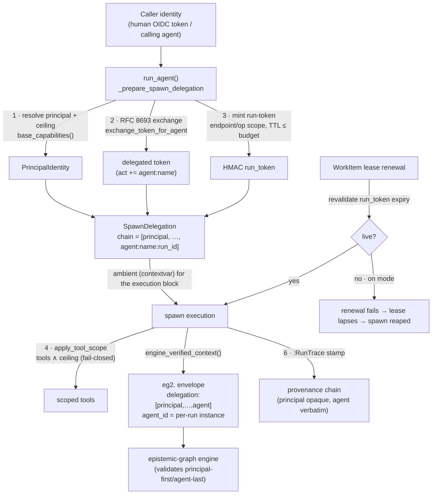

# Per-Agent On-Behalf-Of Identity

`CONCEPT:AU-OS.identity.per-agent-on-behalf-delegation` · W2.1 / ADR-4

Every delegated or spawned agent used to run as **one fixed service account** — the graph
could not tell which human or service ultimately caused a write, and a spawn inherited far more
authority than its caller. Three delegation primitives already existed but were **disconnected**:

1. **RFC 8693 token exchange** (`agent_utilities/mcp/delegated_auth.py`) — never invoked for spawns.
2. The engine envelope's **validated-but-unused `delegation` chain** (`epistemic_graph/client.py`
   `validate_request_context`) — always emitted empty.
3. **HMAC run-scoped tokens** (`agent_utilities/security/run_token.py`) — with a forgeable,
   PID-derived fallback signing secret.

W2.1 wires them into **one pipeline per spawned agent instance** so a spawn carries its real
caller chain end to end, can never exceed its principal, and dies bounded-time after the caller
is revoked. The hub is `agent_utilities/security/delegation.py`.

## The pipeline

### The six decisions (ADR-4)

| # | Decision | Where |
|---|----------|-------|
| 1 | **Exchange** — append `agent:<name>` to the token's `act` chain | `delegated_auth.exchange_token_for_agent` |
| 2 | **Envelope chain** — `delegation:[principal,…,agent:<name>:<run_id>]`, per-run `agent_id` | `session.engine_verified_context` |
| 3 | **Run scope** — per-spawn HMAC token, endpoint/op allowlist, TTL ≤ budget; **PID fallback removed**, fail-closed when on | `run_token`, `delegation.mint_spawn_run_token` |
| 4 | **Ceiling** — `invoker_allowed_tools ∧ base_capabilities()`; a full denial fails **closed** | `graph/executor.apply_tool_scope` |
| 5 | **OIDC binding** — exchanged token rides the envelope's `oidc_token` field | *deferred — needs an eg-client field (issue W2.1-1)* |
| 6 | **Provenance + revocation** — chain on `:RunTrace`; lease renewal revalidates expiry | `agent_runner._stamp_run_identity`, `work_item.heartbeat` |

The **agent-instance identity** is `agent:<name>:<run_id>` — per-run, so two concurrent spawns of
the same agent are distinct principals in the chain and in provenance. Nested spawns extend the
same `[principal, …]` array rather than starting fresh.

## Rollout — `ENABLE_DELEGATED_IDENTITY = off | warn | on`

Shipped default is **`warn`** (observe before enforce). The mode is read live, so a deployment
flips `warn` → `on` after a clean soak with no code change.

| Mode | Chain on the wire | Ceiling | Run-token secret | Lease revocation | Provenance chain |
|------|-------------------|---------|------------------|------------------|------------------|
| `off` | legacy (empty) | none | ephemeral OK | none | not stamped |
| `warn` | legacy (empty) | **logged, not enforced** | ephemeral OK (never fails startup) | logged, still renews | stamped |
| `on` | `[principal,…,agent]` | **enforced (fail-closed)** | **required — startup fails without it** | **enforced (renewal fails on expiry)** | stamped |

`warn` computes the whole pipeline and logs every decision that *would* change — denied tools, the
chain, a would-be-failed renewal — while legacy identity stays in force. Every identity decision
(including a `warn`-mode "would deny") is a first-class log line.

## Configuration

| Variable | Default | Meaning |
|----------|---------|---------|
| `ENABLE_DELEGATED_IDENTITY` | `warn` | Rollout posture (`off`/`warn`/`on`). |
| `AGENT_UTILITIES_TOKEN_SECRET` | — | Run-token HMAC signing secret. **Required when `on`** (resolve from the secrets backend, e.g. OpenBao `apps/agent-utilities/*`); the daemon refuses to boot without it (`gateway/daemon.start_host_daemon` → `run_token.require_token_secret`). In `off`/`warn` a random per-process ephemeral is used — never the removed, forgeable PID-derived secret. |

## Keycloak prerequisite (for the `on` flip)

The `graph-os` confidential client must have **standard token exchange** enabled to perform the
RFC 8693 on-behalf-of exchange, and a mapper to emit the `act` claim. This realm step is
**documented but not executed** in the W1.10 Keycloak staging checklist (`reports/wave1/`, §11).
Absent it, the exchange 400s and delegation gracefully stays legacy — so it is a prerequisite only
for `on`, not for the shipped `warn` default.

## Deferred: cryptographic OIDC binding (decision 5)

The exchanged token is minted and provenance-tracked, but it cannot yet ride the `eg2.` envelope's
`oidc_token` field: the Python engine client's `RequestContextClaims` has no such field and rejects
unknown claims. `SpawnDelegation.oidc_token` already carries the token, ready to forward once the
eg client gains the optional field (tracked as issue **W2.1-1**). Until then the delegated
principal is bound via the HMAC `delegation` chain, which the engine validates wire-correct.
