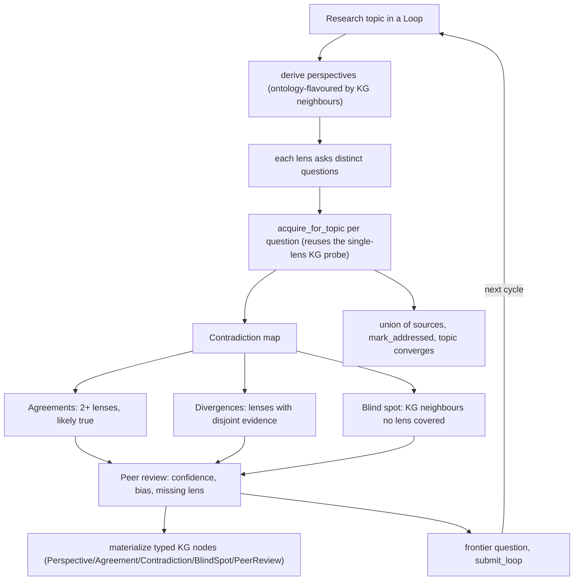

# Perspectival Inquiry — STORM made native

> Concepts: **AU-KG.research.perspectival-inquiry** (engine), **AU-KG.research.contradiction-agreement-blind-spot** (contradiction/agreement/blind-spot
> structures), **AU-KG.research.peer-review-self-critique** (peer-review self-critique). Code:
> `knowledge_graph/research/perspective.py`, wired into
> `knowledge_graph/research/search.py` + `research/loop_controller.py`, surfaced via
> `research/ara/service.py` (`action=inquire`).

Stanford's **STORM** (NAACL 2024) showed that researching a topic from several distinct
expert *lenses* — each asking different questions — then mapping where they disagree,
produces markedly more organized and broader coverage than a single prompt. Its one known
weakness is the lack of self-critique.

We make that pattern **the default behaviour of the research fan-out**, not a separate
tool. Where the loop used to take one semantic probe of the topic name
(`acquire_for_topic`), it now fans the *same* probe across questions asked from multiple
perspectives (`acquire_for_topic_perspectival`), derives a contradiction/agreement/
blind-spot map, and runs a peer-review whose *frontier question* is submitted back as the
next research loop — closing the loop STORM left open. The whole engine is **deterministic
and KG-grounded** (an `llm_fn` is optional, only enriching question phrasing), so it runs
on the cheap zero-infra cycle.

## Flow

## Phases

1. **Perspectives** — `PerspectiveEngine.derive_perspectives` returns distinct lenses
   (practitioner / academic / skeptic / economist / historian), with their rationale
   annotated by the topic's KG neighbour types (ontology-flavoured grounding).
2. **Fan-out** — each lens's questions are answered by `acquire_for_topic` (the existing
   single-lens probe, reused per question), giving each lens a source set.
3. **Contradiction map** — sources ≥2 lenses share are **agreements** ("likely true");
   lenses with disjoint sets are **divergences**; the topic's KG-neighbour types no
   source covers are the **blind spot**.
4. **Peer review** — per-source confidence from corroboration (1–10), the dominant lens
   (bias check), the missing lens, and a **frontier question** (about the blind spot or
   missing lens) submitted as the next research loop.

The inquiry materializes as typed KG nodes (`research_inquiry`, `perspective`,
`agreement`, `contradiction`, `blind_spot`, `peer_review` with `asks_from` / `agrees_with`
/ `reviews` edges; ontology classes ⊑ `:Concept`), so it is graph-queryable next to the
topic it addresses.

## Surfaces (two by default)

- **Native (default-on):** `LoopController` research cycle + `_advance_research` call
  `acquire_for_topic_perspectival` — every research run is multi-perspective, no flag.
- **MCP:** `research_artifact` tool, `action=inquire` (`topic=…`).
- **REST:** `POST /api/research/inquire` (`topic`, `materialize`).
- **On-demand skill:** the `multi_perspective_inquiry` workflow-skill (delegates to the
  engine via `research_artifact action=inquire` — never re-implements the prompts).

## Why deterministic

The single-lens path is *subsumed*, not kept beside it (no legacy). The fan-out reuses the
existing bounded embed + semantic search per question, so an unreachable embedding endpoint
degrades in seconds and the path falls back to the direct single-lens probe — behaviour
never regresses. Lens count and questions are bounded, keeping the added cost a small
multiple of the prior single probe.
