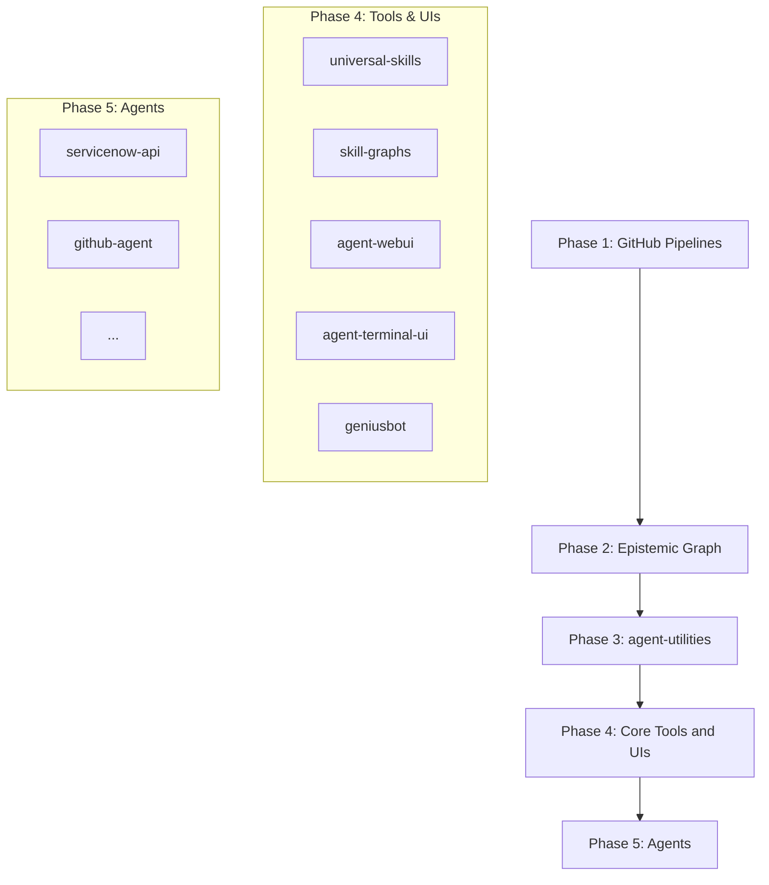

# Phased Dependency Release Architecture

## Overview
- **Concept ID**: `CONCEPT:RM-TOPOLOGY`

To avoid circular dependency updates and update propagation issues inside the agent ecosystem, we utilize a topologically ordered phased release mechanism in the `repository-manager`.

## Topological Ordering and Phase Rules

1. **Phase 1: GitHub Pipelines** (`pipelines`)
   - Pipelines are the base orchestration infrastructure. They contain workflow actions and continuous integration setups.

2. **Phase 2: Epistemic Graph** (`epistemic-graph`)
   - The primary Rust-backed semantic intelligence backend. It does not depend on downstream Python libraries but is a core dependency of `agent-utilities`.

3. **Phase 3: agent-utilities** (`agent-utilities`)
   - The central library containing base Pydantic AI agent definitions, RLM/GEPA optimizers, and knowledge graph persistence layers. It depends on `epistemic-graph`.

4. **Phase 4: Core Tools and UIs** (`universal-skills`, `skill-graphs`, `agent-webui`, `agent-terminal-ui`, `geniusbot`)
   - High-level tools and user interfaces that consume the unified interfaces exposed by `agent-utilities`. By placing these in Phase 4, we ensure that they are bumped after `agent-utilities` has been released, allowing them to pull the latest published dependency from PyPI or local packages.

5. **Phase 5: Agents** (Individual agent-packages)
   - Specialized execution runtimes that rely on base tools, skills, and utilities.

## Circular Dependency Mitigation

> [!IMPORTANT]
> To prevent earlier phases from incorrectly adopting dependencies from later phases (creating circular reference loops), the `repository-manager` enforces a **Topological Phase Filter**.

- When a package in a given Phase $P$ is bumped:
  - We locate all other packages in the workspace.
  - If a package belongs to an earlier Phase $P' < P$, the `repository-manager` **will skip** updating its `pyproject.toml` dependency definition.
  - This ensures that a library like `agent-utilities` (Phase 3) will never attempt to lock onto a specific version of an agent (Phase 5) or tool (Phase 4), enforcing a clean unidirectional dependency graph.

## Release Timers

During the `phased_push` workflow, each phase is pushed to the remote repository followed by a configurable per-phase cooldown period (the `wait_minutes` key on each phase in the push config; e.g. `wait_minutes: 12`). This delay allows packages to finish building, publishing, and being registered on PyPI before downstream phases begin processing. When a phase pushes 0 commits, the wait is skipped automatically.
