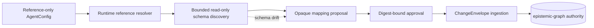

# Privacy-safe external graph ingestion

GraphQL APIs, Neo4j/openCypher, Apache AGE, LadybugDB, and remote
epistemic-graph instances enter through one governed external-source lifecycle.
Durable `AgentConfig` contains neutral aliases, bounded policy values, and
secret references only. Endpoints, credentials, queries, variables, TLS
material, and customized source ontologies remain outside the repository.



## Reference-only declaration

`EXTERNAL_GRAPH_CONNECTORS` is a list of typed
`ExternalGraphConnectorConfig` objects. A GraphQL document source looks like:

```json
{
  "EXTERNAL_GRAPH_CONNECTORS": [
    {
      "name": "external-catalog",
      "source_alias": "domain-knowledge",
      "backend": "graphql",
      "connection_profile_ref": "vault://external/catalog-connection",
      "mapping_policy_ref": "vault://external/catalog-mapping",
      "auth_profile_ref": "vault://external/catalog-auth",
      "tls_profile_ref": "vault://external/catalog-tls",
      "variables_ref": "vault://external/catalog-variables",
      "ingest_operation": "entity_document",
      "discovery_max_types": 200,
      "discovery_max_depth": 6,
      "ingest_max_records": 1000,
      "require_approval": true,
      "schema_drift_policy": "fail_closed"
    }
  ]
}
```

The connection reference resolves only the transport location. Authentication,
TLS, mapping/query policy, and operation variables use separate references so a
single combined profile cannot accidentally cross trust boundaries. Public MCP
and REST actions accept the connection alias, bounded options, an approved
operation alias, and an optional `variables_ref`; they reject inline endpoints,
headers, credentials, queries, mappings, variables, and certificate paths.

## Discovery and approval

The lifecycle is the same for GraphQL and property graphs:

1. `discover_connection_schema` performs a bounded read-only inspection.
2. `propose_connection_mapping` compares the discovered schema with the native
   ontology and stores only privacy-safe schema and mapping digests.
3. `approve_connection_mapping` binds operator approval to the exact schema and
   policy digests.
4. `external_graph_doctor` reports redacted discovery, approval, schema-drift,
   and runtime mapping-policy-drift readiness.
5. `ingest_connection` rediscovers the source, fails closed on drift, and
   applies approved records through native `ChangeEnvelope` transactions.

Discovery never approves its own output. A partial discovery cannot produce an
approved profile unless the connector's bounded-probe policy explicitly defines
that completeness contract. Schema or policy changes require a new proposal and
approval.

## GraphQL transport rules

Connection, mapping-policy, and auth references must resolve to the exact
current formats `graphql-connection/v1`, `graphql-document-policy/v1`, and
`graphql-auth/v1`, respectively. Missing or unknown versions fail closed in
doctor and at runtime. Connector TLS references are parsed through the shared
TLS-profile resolver; a nonempty but malformed trust document is not ready.

GraphQL documents are parsed with the GraphQL AST. Exactly one query operation
is allowed; mutations, subscriptions, unsupported definitions, unapproved
introspection, excessive token/depth shapes, and unbounded discovery probes are
rejected. Keyword matching is only defense in depth, never the authority.

The production transport reads bounded bytes before JSON decoding. Redirect,
response, page, entity, section, document, character, and timeout budgets are
enforced across the whole operation. Injected transports must return the same
bounded raw-byte contract and are restricted to isolated tests. Upstream error
messages and response rows are never copied into public errors or traces.

Mapping policies may define several approved operations, including domain- or
lifecycle-shaped documents, without compiling a customer's schema into Agent
Utilities. Variables are selected from `variables_ref` by operation alias.
Optional-field fallbacks and partial-error handling must be explicit policy;
they are not inferred from one environment.

## Property-graph transport rules

Neo4j/openCypher over Bolt, Apache AGE/openCypher, LadybugDB/Kuzu-compatible,
and remote epistemic-graph adapters discover labels/types, properties,
relationships, and supported capabilities through backend-specific read-only
adapters. Generated mapping proposals select privacy-safe property allowlists
and ontology candidates.

The direct property-graph path cannot read a source until the fixed
`external_graph` native activation contract passes the signed
connector-manifest gate. The bundle pins the actual importer module and contains
its deterministic critical local dependency closure; a governance, envelope,
privacy, configuration, or registry dependency change therefore invalidates the
fingerprint too. It contains no source-specific profile or ontology. Doctor
exposes only the gate's ready/not ready state; it never returns the manifest
location or verification details.

Every import query is structurally validated as a single bounded read. The
adapter enforces driver-side or streaming row caps and stops as soon as the cap
is exceeded. Mutating clauses, procedures outside the discovery allowlist,
mirror-role writes, and responses that ignore the bound are rejected. Edges are
accepted only when both endpoints passed the node privacy gate.

`AgentConfig` owns the bounded property-graph sync policy: page size, maximum
pages, per-row and cumulative bytes, nesting depth, collection size,
`auto`/`cdc`/`snapshot` mode, deletion reconciliation, and explicit empty snapshot
authority. That policy is part of the approved mapping digest. A backend with a
snapshot token may page inside one repeatable source snapshot. A tokenless backend
uses one `max_records + 1` sentinel read per query and never composes independent
offset reads. Complete source-native CDC is used when the adapter exposes it;
otherwise deterministic snapshot comparison emits tombstones. Missing mapped
identities, changed snapshot tokens, structural-budget violations, incomplete or
failed reads, and unexpectedly empty results never delete records or advance an
authoritative source snapshot.

The approved runtime mapping-policy document is canonically hashed without
persisting its contents. Doctor and ingestion resolve and re-hash the same ref;
any change fails closed until a new proposal is approved. Each property-graph
upsert also receives an HMAC material version covering its sanitized properties
and outgoing links. Native idempotency therefore skips unchanged records but
does not lose an edge-only delta. GraphQL uses its native version-map checkpoint
to emit only changed envelopes, and the engine advances that checkpoint only
after the whole batch succeeds.

## Identity, ACL, and trace privacy

The runtime profile supplies a private HMAC key used to derive stable opaque
source identities. Raw upstream IDs, personal names, account identifiers,
endpoints, database names, query text, host names, and local filesystem paths do
not enter graph properties, checkpoints, reports, or Langfuse metadata.

`PersistencePrivacyGuard` sanitizes approved values before materialization.
Missing access evidence becomes `ExternalAccess.quarantined()`; no profile can
turn an unknown ACL into public access. Each envelope carries tenant,
classification, retention, legal hold, mapping version, provenance digest, and
engine-owned cursor evidence. The engine commits graph rows, policy, lineage,
cursor, and outbox effects atomically.

TLS verification is mandatory. A source may use system trust or a referenced
named TLS profile containing private CA, mTLS, and proxy policy. Certificate
material is resolved into a private runtime location and is never persisted in
`AgentConfig` or documentation.
