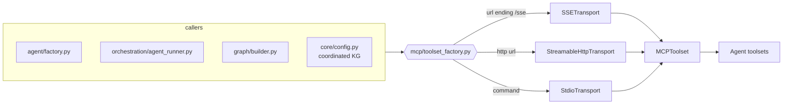

# Pydantic AI v2 migration

`agent-utilities` (and the fleet that inherits from it) runs on **Pydantic AI v2**
(`pydantic-ai-slim>=2.0.0,<3.0.0`, `pydantic-graph>=2.0.0,<3.0.0`). This page records the
v2-specific changes so the architecture docs stay in sync with the code.

## Why it was a real migration, not a rename

The framework was already on the v1 **capabilities** API, and our model factory builds *typed*
`Model` objects (never `provider:model` strings), so the headline prefix changes
(`openai:`→Responses, `grok:`→`xai:`, gemini-module removal) don't affect us. But v2 *removed*
several APIs we used, which required real changes:

| Removed in v2 | Replacement | Where |
|---|---|---|
| `MCPServerSSE` / `MCPServerStreamableHTTP` / `MCPServerStdio` / `FastMCPToolset` | unified `MCPToolset` + transports | `mcp/toolset_factory.py`, agent factory, agent_runner, graph builder/executor, core config |
| `pydantic_ai.mcp.load_mcp_servers` | `load_mcp_toolsets` | `graph/executor.py`, `core/config.py` |
| `pydantic_graph.persistence` (package) + `Graph.run(persistence=)` | our own `BaseStatePersistence` (write-only snapshot stores) | `core/checkpoint/manager.py` |
| `Agent.to_a2a()` | `fasta2a.pydantic_ai.agent_to_a2a` | `server/app.py` |
| `pydantic_graph.beta.*` | promoted to top-level `pydantic_graph` | guarded imports across `graph/*`, `orchestration/engine.py` |
| `stream.usage()` (method) | `stream.usage` (property) | `graph/_router_impl.py`, `graph/executor.py` |
| `RunUsage.request_tokens` / `response_tokens` | `input_tokens` / `output_tokens` | `graph/state.py`, `observability/token_tracker.py` |

Behavior change adopted: **`end_strategy` default `early` → `graceful`** (set explicitly on the
agent factory). Function tools requested alongside an output/deferred tool now run; side-effecting
tools stay safe because the `tool_guard` `ApprovalRequiredToolset` turns them into
`DeferredToolRequests` that never auto-run before human approval.

## The one MCP construction path

v2 collapses every MCP client onto `MCPToolset`. `agent_utilities/mcp/toolset_factory.py` is the
**single** place that turns a connection spec into a toolset, so SSL `verify` + request `timeout`
(threaded through the transport's `httpx_client_factory`) live in exactly one place.

## Packaging / extras

- Base `agent` / `agent-headless` extras: `pydantic-ai-slim[mcp,openai,anthropic,ag-ui,ui,web,cli]`
  (`fastmcp`→`mcp`; the removed `a2a` extra → a direct `fasta2a[pydantic-ai]>=0.6.1` dependency;
  `anthropic` added as a default-bundle provider). Per-provider opt-in extras (`agent-google`,
  `agent-groq`, `agent-mistral`, `agent-anthropic`, `agent-huggingface`) unchanged in shape.
- `agent-webui` narrowed from the full `pydantic-ai` meta to `pydantic-ai-slim[ui]` (it uses the v2
  `Agent.to_web()`).

## Native protocol adapters vs. our plugins

v2's native UI/protocol adapters live in `pydantic_ai.ui`: **AG-UI** (`ag_ui`) and **Vercel AI**
(`vercel_ai`), plus `Agent.to_web()` (browser chat) and `Agent.to_cli()` (interactive terminal
chat). These are **not** ACP. Zed's **Agent Client Protocol** is still provided by our external
plugin (`protocols/acp_adapter.py` + `acp_providers.py` on `pydantic-acp` + `acpkit`).

> **Known limitation:** the current `pydantic-acp` (0.9.7) hard-pins `pydantic-ai-slim==1.106.0`,
> so the `acp` extra cannot be co-installed with v2. ACP is **not** part of the `serving` extra, so
> graph-os is unaffected; the `acp` extra is unusable on v2 until `pydantic-acp` ships a
> v2-compatible release. Track and re-enable then.
