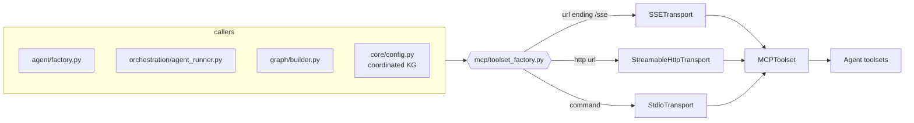

# Pydantic AI v2 migration

`agent-utilities` (and the fleet that inherits from it) runs on **Pydantic AI v2**
(`pydantic-ai-slim>=2.14.1,<3.0.0`, `pydantic-graph>=2.14.1,<3.0.0`). This page records the
v2-specific changes so the architecture docs stay in sync with the code.

## Why it was a real migration, not a rename

The framework was already on the v1 **capabilities** API, and our model factory builds *typed*
`Model` objects (never `provider:model` strings), so the headline prefix changes
(`openai:`→Responses, `grok:`→`xai:`, gemini-module removal) don't affect us. But v2 *removed*
several APIs we used, which required real changes:

| Removed in v2 | Replacement | Where |
|---|---|---|
| `MCPServerSSE` / `MCPServerStreamableHTTP` / `MCPServerStdio` / `FastMCPToolset` | unified `MCPToolset` + transports | `mcp/toolset_factory.py`, agent factory, agent_runner, graph builder/executor, core config |
| `pydantic_ai.mcp.load_mcp_servers` | `load_mcp_toolsets` | `graph/executor.py`, `core/config.py` |
| `pydantic_graph.persistence` (package) + `Graph.run(persistence=)` | our own `BaseStatePersistence` (write-only snapshot stores) | `core/checkpoint/manager.py` |
| `Agent.to_a2a()` | `fasta2a.pydantic_ai.agent_to_a2a` | `server/app.py` |
| `pydantic_graph.beta.*` | promoted to top-level `pydantic_graph` | guarded imports across `graph/*`, `orchestration/engine.py`; `iter_graph` retains an `EndMarker` fallback for supported pre-promotion 2.x environments while the production lock resolves Pydantic AI 2.21 |
| `stream.usage()` (method) | `stream.usage` (property) | `graph/_router_impl.py`, `graph/executor.py` |
| `RunUsage.request_tokens` / `response_tokens` | `input_tokens` / `output_tokens` | `graph/state.py`, `observability/token_tracker.py` |

Behavior change adopted: **`end_strategy` default `early` → `graceful`** (set explicitly on the
agent factory). Function tools requested alongside an output/deferred tool now run; side-effecting
tools stay safe because the `tool_guard` `ApprovalRequiredToolset` turns them into
`DeferredToolRequests` that never auto-run before human approval.

## The one MCP construction path

v2 collapses every MCP client onto `MCPToolset`. `agent_utilities/mcp/toolset_factory.py` is the
**single** place that turns a connection spec into a toolset, so SSL `verify` + request `timeout`
(threaded through the transport's `httpx_client_factory`) live in exactly one place.

```mermaid
flowchart LR
    subgraph callers[callers]
      F[agent/factory.py]
      R[orchestration/agent_runner.py]
      B[graph/builder.py]
      C["core/config.py<br/>coordinated KG"]
    end
    callers --> H{{mcp/toolset_factory.py}}
    H -->|url ending /sse| SSE[SSETransport]
    H -->|http url| HTTP[StreamableHttpTransport]
    H -->|command| STDIO[StdioTransport]
    SSE --> MT[MCPToolset]
    HTTP --> MT
    STDIO --> MT
    MT --> AG[Agent toolsets]
```

## Packaging / extras

- Base `agent` / `agent-headless` extras: `pydantic-ai-slim[mcp,openai,anthropic,ag-ui,ui,web,cli]`
  (`fastmcp`→`mcp`; the removed `a2a` extra → a direct `fasta2a[pydantic-ai]>=0.6.1` dependency;
  `anthropic` added as a default-bundle provider). Per-provider opt-in extras (`agent-google`,
  `agent-groq`, `agent-mistral`, `agent-anthropic`, `agent-huggingface`) unchanged in shape.
- `agent-webui` narrowed from the full `pydantic-ai` meta to `pydantic-ai-slim[ui]` (it uses the v2
  `Agent.to_web()`).
- `[dynamic-workflow]` is an opt-in `pydantic-ai-harness[dynamic-workflow]>=0.14.0,<0.15.0`
  integration. Its GraphOS adapter compiles reviewed declarations into `GraphPlan` and then
  `ExecutionManifest`; it does not expose the upstream sandbox as a second execution plane.

## 2.20 reconciliation

The reconciled 2.20 refresh adds OpenAI Responses `reasoning.context` support for GPT-5.4/5.5/5.6,
preserves arbitrary usage fields through serialization, and makes bare MCP errors recoverable.
The adapter's model menus are declarative per-delegation metadata; the canonical model registry
remains the authority that resolves actual provider configuration.

The production/all-extras lock now resolves on Pydantic AI 2.21.0. The former
`pydantic-acp`/`acpkit` stack capped `pydantic-ai-slim` at 2.16.0 and made the
Harness DynamicWorkflow and ACP extras mutually unsatisfiable. Both capabilities
now come from Pydantic AI Harness 0.14.0 and share one compatible dependency line.

## Native ergonomics wired (synergy)

Two v2-native capabilities are wired into the agent factory as **opt-in** synergy (opt-in
because both are expensive / behavior-changing; our richer custom systems — KG memory,
ontological guardrails, multi-tier Monty sandbox, multiplexer, held-turns — stay):

- **`Thinking(effort=)`** — native provider extended thinking, added to every built agent when
  `create_agent(thinking_effort='low'|'medium'|'high')` or the `AGENT_THINKING_EFFORT` config
  setting is set (default off). It runs natively where the provider supports reasoning and
  no-ops elsewhere, and composes with the per-call sampling profile (which still threads the
  vLLM `enable_thinking` knob via `extra_body`).
- **`defer_tool_loading=True`** (`create_agent` arg) — wraps agent-local toolsets in v2's
  `DeferredLoadingToolset` so they appear as a compact catalog and load on demand, cutting
  prompt bloat for tool-heavy agents. Orthogonal to the cross-process multiplexer
  (`find_tools`/`load_tools`).

v2 also **auto-injects `ToolSearch` and a pending-message-drain (mid-run steering) capability**
natively — both visible in every built agent's `root_capability` tree.

## Native protocol adapters vs. our plugins

v2's native UI/protocol adapters live in `pydantic_ai.ui`: **AG-UI** (`ag_ui`) and **Vercel AI**
(`vercel_ai`), plus `Agent.to_web()` and `Agent.to_cli()`. ACP is a separate,
editor-facing stdio JSON-RPC adapter from
`pydantic_ai_harness.experimental.acp`; it is unrelated to Code Mode.

### Harness ACP boundary

`agent-utilities[acp]` installs `pydantic-ai-harness[acp]>=0.14,<0.15`.
Editors launch `agent-utilities-acp` as a subprocess. Harness provides streamed
text/thinking, rich filesystem/shell tool presentation, deferred-tool approval,
per-workspace sessions, cancellation, model selection, usage limits, and ACP
capability negotiation. `FileAcpSessionStore` supplies durable conversation
restore with validated atomic files.

ACP is not mounted at `/acp`: neither Harness nor the retired adapter is an ASGI
application. Harness 0.14 also does not implement ACP session modes, fork, or
resume. Ask/plan/execute semantics, graph checkpoints, and plan provenance remain
Graph-OS/Pydantic Graph responsibilities and are passed through the graph wrapper's
session-scoped dependencies.

The graph adapter consumes the governed MCP fleet already attached to Graph-OS.
Client-offered MCP process definitions are rejected instead of silently trusted;
they must first pass the normal Graph-OS connector configuration, permission, and
tool-contract path.
