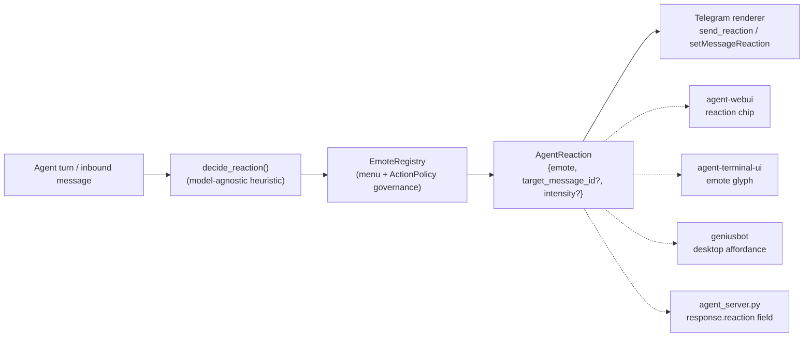

# Reactions / Emotes — a system-wide orchestrator output

> **Status:** core + messaging renderer **done** (this slice). The other frontend
> renderers (webui / terminal-ui / geniusbot / `agent_server.py`) are specified here as a
> thin contract for their (separate) repos. CONCEPT:ECO-4.79 / ECO-4.80 / ECO-4.81.

Reactions used to be a **messaging-only** feature: the instinctive-reaction heuristic, the
available-emoji menu, and the Telegram `setMessageReaction` call all lived inside
`messaging/` (CONCEPT:ECO-4.60). That made "react with 👍" impossible for any other surface
to inherit — exactly the per-surface sprawl the
[*Universal capability — ONE core, thin entrypoints*](entrypoint-unification.md) rule forbids.

This change promotes reactions to a **first-class output of the universal orchestrator**, so
every entrypoint inherits it natively and renders it for its medium.

## The core (built once, in `agent_utilities/orchestration/reactions.py`)



| Piece | Concept | What it is |
|---|---|---|
| `AgentReaction` | ECO-4.79 | The structured output a turn emits: `{emote, target_message_id?, intensity?}`. Optional + lightweight — no reaction ⇒ `None`. `to_dict()` / `from_dict()` serialize it for envelopes and renderers. |
| `EmoteRegistry` | ECO-4.80 | The **one** menu of available emotes + the governance gate (`allows(emote, actor, context)`), reusing the `ActionPolicy` decision point (`reaction` kind). No per-surface emote list. |
| `decide_reaction()` | ECO-4.79 | The instinctive, **model-agnostic** decision (a tool-free completion, bounded to 10 s) — moved out of `messaging/router.py` so every entrypoint shares one heuristic. Opt out with `REACTIONS=0` (legacy `MESSAGING_REACTIONS=0` still honored). |

## The renderer contract (the ONLY per-surface code)

A renderer is a function that takes a core `AgentReaction` and paints it for its medium. It
contains **no decision logic** — the orchestrator already decided.

```python
async def render_reaction(reaction: AgentReaction, *, context) -> bool:
    """Paint reaction.emote on this medium; return True if rendered."""
```

The reaction is delivered to a renderer as the dict form (`AgentReaction.to_dict()`), which is
stable across process / repo boundaries:

```json
{ "emote": "👍", "target_message_id": "100", "intensity": 0.6 }
```

| Entrypoint | Status | What it implements |
|---|---|---|
| **messaging (Telegram, …)** | ✅ done | `MessagingService.render_reaction(platform, channel_id, reaction)` → `react()` → backend `send_reaction` → Telegram `setMessageReaction`. The router's `_react_in_background` now calls the **core** `decide_reaction` and renders the result (CONCEPT:ECO-4.81). Other backends (Slack `reactions.add`, …) expose `send_reaction` and degrade gracefully where the emote is unsupported. |
| **`agent-webui`** | ▢ stub (separate repo) | Render `reaction.emote` as an **emoji reaction chip** on the assistant message; map `intensity` to chip emphasis if present. Read the `reaction` field off the turn's response (below). No emote list of its own — the menu is `EmoteRegistry.available()`. |
| **`agent-terminal-ui`** | ▢ stub (separate repo) | Render an **inline emote glyph / reaction line** next to the turn (e.g. a dim ` 👀` suffix). `target_message_id` is usually `None` here (standalone glyph). |
| **`geniusbot`** | ▢ stub (separate repo) | Surface a **desktop reaction affordance** (a small emoji badge on the message bubble / a toast). |
| **`agents/*/…/agent_server.py`** | ▢ stub (separate repo) | Add an optional **`reaction`** field to the A2A/HTTP response envelope carrying `AgentReaction.to_dict()`; clients (webui/geniusbot) render it. The orchestrator populates it when a turn reacts. |

### Rules every renderer follows

1. **No decision, no menu.** The renderer never decides *whether* or *which* to react and
   never hard-codes an emote list — it renders what the core produced and reads the menu from
   `EmoteRegistry.available()`.
2. **Degrade, never error.** An emote a medium can't render maps to its nearest supported one
   or is dropped. A reaction is cosmetic — it must never block or fail the actual turn.
3. **Governance is the core's.** Whether a principal may react is decided by
   `EmoteRegistry.allows(...)` (ActionPolicy `reaction` kind) — the renderer does not
   re-check permissions.

## Definition of done

A new emote, a new governance rule, or a change to the reaction heuristic lands in **one
place** (`orchestration/reactions.py`) and shows up correctly on chat, web, terminal,
desktop, and API **with no per-surface change**. If a reaction change means editing N
entrypoints, it's in the wrong layer.

## Follow-ups (separate repos — not in this slice)

- `agent-webui`: reaction chip component + read `reaction` off the response envelope.
- `agent-terminal-ui`: inline emote glyph renderer.
- `geniusbot`: desktop reaction affordance.
- `agents/*` (`agent_server.py`): add the `reaction` response-envelope field + have the
  orchestrator populate it when a turn reacts (the field is defined here; the wiring into the
  A2A response shape lives in those packages).
