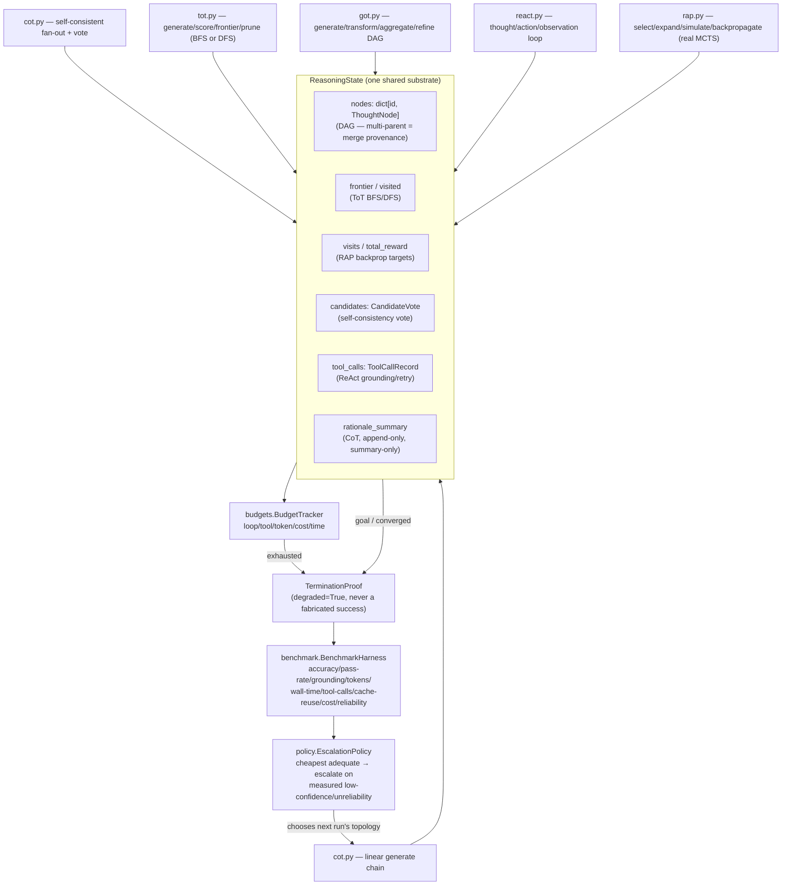

# Reasoning Algorithms as Versioned Graph Topologies

> **Concept:** `CONCEPT:AU-ORCH.planning.reasoning-graph-topologies` — CoT, self-consistent
> CoT, ToT (BFS/DFS), GoT, ReAct, and RAP are graph topologies (node contracts + edge/routing
> functions) over ONE shared state, not separate agent frameworks.
>
> **Related:** `CONCEPT:AU-ORCH.planning.rap-mcts-backpropagation` (real MCTS backprop) ·
> `CONCEPT:AU-AHE.evaluation.reasoning-topology-benchmark` (the unified benchmark harness) ·
> `CONCEPT:AU-ORCH.routing.topology-escalation-policy` (cheapest-adequate-first router) ·
> [`agent_utilities/graph/reasoning/`](../../agent_utilities/graph/reasoning/).

## Why

"Graph Engineering: A Unified Framework for Language Agent System Design" (arXiv:2505.24354)
observes that CoT / ToT / GoT / ReAct / RAP are usually implemented as separate, incompatible
frameworks, when they are actually the same primitive — a DAG of typed thought nodes, a set of
edge/routing functions that drive dynamic branching and loops, and a shared state store that
carries frontier/visited/candidate/MCTS statistics (including tree-search backpropagation).
`agent_utilities/graph/reasoning/` ports that thesis: one `ReasoningState` substrate
(`state.py`), six topology implementations that read/write it, a versioned/content-addressed
topology resource (`topology.py`), a budget+termination contract every topology obeys
(`budgets.py`), a unified benchmark harness (`benchmark.py`), and a cost-aware escalation
policy (`policy.py`).

## Prior art (survey — don't duplicate)

Before this package, none of the six topologies existed as a named, reusable resource. The
closest existing building blocks, reused rather than reimplemented:

| Existing capability | Reused by |
|---|---|
| `agent_utilities.graph.test_time_diversity` (VPO diverse fan-out + MMR best-of-k) | `.cot`'s self-consistent variant (diversity-aware pruning seam) |
| `agent_utilities.harness.graph_search_evolution.GraphSearchEvolver` (real UCT + backprop MCTS for code/ML-algorithm evolution search, MLEvolve arXiv:2606.06473) | `.rap`'s algorithmic shape (UCT selection + full-path backprop), generalized off the code-evolution specifics |
| `agent_utilities.security.execution_stability_engine.DoomLoopDetector` | `.react`'s grounding/termination detection |
| `agent_utilities.graph.reactive.budget.BudgetGuard` (time/token/cost) | `.budgets.BudgetTracker` (adds loop-count + tool-call-count, the two axes it doesn't cover) |
| `agent_utilities.graph.topology_engine.TopologyEngine` (KG-tracked team-topology resource + EMA outcome update) | `.topology`'s `register_topology`/`record_topology_outcome` (same pattern, reasoning-topology resource kind) |
| `agent_utilities.models.knowledge_graph.ArtifactVersionNode` (content-addressed, versioned, evolvable artifact — the same contract skills/prompts/specs already use) | `ReasoningTopologyVersionNode`, the KG-modeled topology resource |

## The shared-state thesis

## The versioned topology resource

Each topology module publishes exactly one `TopologySpec` (`topology.py`): a content-addressed
digest over its name/version/node-contracts/state-schema/budgets/termination-conditions, a
`topology_id` (`topology:<name>:<digest>`), and `to_node()` — the same content-addressed,
versioned-artifact contract this repo already uses for skills and specs
(`ArtifactVersionNode` → `ReasoningTopologyVersionNode`). `register_topology`/
`record_topology_outcome` write/update it in the KG with the exact best-effort,
engine-optional pattern `TopologyEngine` already uses for team-composition topologies (an
`add_node` at registration, an EMA `reward` update after each run) — reused, not duplicated.
Checkpoint (memento) semantics are uniform across all six: `ReasoningState.to_memento()` /
`from_memento()` serializes the whole run, so a budget-halted run resumes exactly where it
stopped rather than losing partial progress.

## RAP: real backpropagation, not an approximation

`rap.py`'s `_backpropagate` walks the **full** parent chain
(`ReasoningState.path_to_root`) from the simulated node to the root, incrementing `visits`
and `total_reward` on **every** ancestor. A common "simplified" MCTS/RAP port credits only
the immediate parent (or only the leaf), which silently breaks UCT above the first level —
a deep, high-value line never changes selection at the root or mid-tree, and the search
degenerates into flat rollouts. `tests/unit/graph/reasoning/test_rap.py::
test_backpropagation_updates_every_ancestor` builds a 3-level chain, backpropagates a reward
from the depth-3 leaf, and asserts every one of the four ancestors (leaf → root) was
credited — not just the immediate parent.

## Truthfulness contract

Every `run_*` entry point returns `(ReasoningState, TerminationProof)`. `TerminationProof.
as_report()` reports `success` as `False` whenever `degraded=True` — a budget-halted,
truncated run is **never** reported as a clean success, and the partial `ReasoningState` is
always returned rather than discarded. `BenchmarkHarness.stats().accuracy` and `.reliability`
apply the same rule at the aggregate level: a degraded-but-correct run still counts toward
the looser `pass_rate` but never toward `accuracy`/`reliability`.

## Deferred

See `reports/deferred/waves1-5-gate.md` (D-W15-1..3) for the recorded dependency on the parallel budget/repair
lane and the not-yet-built MCP/REST live entrypoint for this package.
