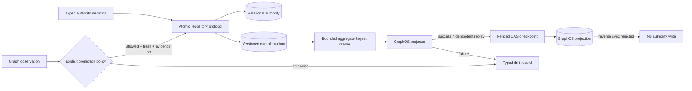

# Relational authority and registry read model

The platform has three relational domains with different responsibilities. The
machine-readable contract is
[`agent_utilities/governance/relational_authority.json`](../../agent_utilities/governance/relational_authority.json);
the executable drift/security gate is
[`scripts/security/check_relational_authority.py`](../../scripts/security/check_relational_authority.py).
This ADR records the ownership decision so a convenient mirror cannot quietly
become a second authority.

```mermaid
flowchart LR
    Probe[Governed fleet discovery] -->|resolve exact grant when OAuth-gated| Broker[Process-owned OAuth broker]
    Probe -->|verified local visibility when non-OAuth| Local[Process-owned tenant-local binding]
    Broker -->|grant-scoped write binding| Engine[(Epistemic Graph SQL\nfleet catalog)]
    Local -->|tenant-local write binding| Engine
    Engine -->|tenant + (local OR principal + grant) scoped read| Registry[Read-only registry API]
    Runtime[Usage recorder] -->|authoritative write| Usage[(Usage store)]
    Sessions[Session/dispatch lifecycle] -->|authoritative write| State[(State store)]
    Usage --> UsageView[Derived usage read models]
    State --> FleetView[Derived fleet topology]
    Registry --> RegistryView[Derived registry pages]
    Usage -. no dual write .- Engine
    State -. no dual write .- Engine
```

## Decisions

* The engine-native `fleet_catalog_tables` projection is the sole writer for
  `mcp_servers`, `mcp_server_discovery`, `mcp_tools`, `mcp_prompts`,
  `mcp_resources`, and `skills`. Desired server registration remains
  tenant-scoped and separate. Every observed/derived row carries an explicit
  `discovery_authority_kind`: OAuth-gated rows carry the server-verified
  discovery subject and a stable authorization-grant digest; non-OAuth/local
  rows carry the process-owned `tenant_local` visibility contract with empty
  principal/grant fields. The OAuth digest is minted by the process-owned
  `RemoteOAuthBroker` only after exact token resolution and covers tenant,
  verified subject, provider, protected resource/audience, normalized granted
  scopes, broker key version, and a broker-owned grant revision. Session
  roles/scopes/policy and caller payload fields are never substituted for this
  identity, and bearer/refresh material is never persisted in catalog rows or
  fingerprints; OAuth row identity includes that digest. Legacy rows without
  a recognized authority kind are unavailable, never relabelled public. The
  registry API reads these rows; it does not probe MCP children or write
  catalog state. Existing installations require an additive fleet-catalog
  migration for the three binding columns before discovery writes resume; until
  then, the reader returns `503 unavailable` for legacy rows and the writer
  does not emit unbound derived rows. No compatibility fallback treats old rows
  as global.
* `usage_store` owns usage facts (`sessions`, `messages`, `tool_calls`,
  `usage_events`, pricing, and its sync metadata). Its summary/breakdown/search
  responses are derived read models and cannot write back to the engine catalog
  or operational state.
* `state_store` owns operational session, turn, and dispatch-worker lifecycle
  facts. Goal lifecycle remains on engine-native WorkItem/Loop state. Fleet
  topology is a derived view of state rows.
* SQLite is a bounded single-host/default substrate. Its advisory lock is a
  no-op and it cannot provide cross-host coordination or RLS. Postgres state
  connections carry `app.tenant_id` before SQL; a failed tenant binding is a
  checkout failure, never an unscoped read. Engine-native catalog isolation is
  likewise applied before registry filters, sorting, pagination, or counts.
* No domain may dual-write another domain's fields. The JSON map lists every
  prohibited write domain and the gate requires that list to cover all peers.

## Registry read contract

`GET /api/registry/{servers,discoveries,tools,prompts,resources,skills}` is a typed,
read-only surface over the engine catalog. A verified `GraphSession` with
`kg:read`, an authenticated principal, and a non-empty tenant is required.
The tenant plus disjoint visibility predicate is established while reading the
catalog before caller `q` filters, ranking, cursor application, totals, or
response shaping: tenant-local rows are visible only within the verified
tenant, while OAuth rows additionally require the verified principal and one
of the process-owned broker's current grant fingerprints. All currently
authorized broker grant fingerprints are bound into cursors, so a
refresh/re-consent rotation or grant removal cannot reuse an older page token;
local visibility never widens the OAuth branch.
Rows are sorted by stable `(name, id)` keys. Cursors are opaque HMAC-bound to
tenant, principal, grant set, kind, and filter; tampering or replay under
another scope is rejected. Limits are bounded and malformed/injection-like filters are treated as
literal text. Malformed catalog rows, model shapes, scope fields, or bounded
read responses return an explicit `503 unavailable` state, never an empty
successful page. Endpoint URLs are reduced to scheme and host only: opaque path
segments may carry bearer/API credentials. Missing or denied resources use
generic responses and do not reveal another tenant's rows. The centralized
gateway mounts the existing remote OAuth surface under the same explicit
prefix (`register_remote_oauth_routes(app, prefix=prefix)`), keeping callback
registration and gateway routing aligned.

Run the focused gate with:

```bash
python3 scripts/security/check_relational_authority.py
```

## Transactional outbox and GraphOS projection

Control-plane state that is authoritative outside GraphOS uses the typed
`agent_utilities.control_plane.projection` seam.  A repository commits the
authoritative mutation and exactly one versioned `OutboxEnvelope` in the same
transaction.  The envelope contains a stable aggregate/event identity, a
monotonic per-aggregate sequence, exact SHA-256 digests, a bounded redacted
summary and (for deletion) a digest-only tombstone.  It never contains a
secret, grant, argument, result, private evidence or raw body.



Projection is downstream-only.  The projector applies an event before moving
its checkpoint, so an unavailable GraphOS adapter cannot mutate or falsely
advance relational state.  A retry with the same event identity is accepted as
an idempotent replay; a different event at the same sequence, an out-of-order
event, or a sequence gap is rejected and remains visible as drift.  Fencing
terms are carried by checkpoints and adapter calls, while keyset limits keep a
large catalog from becoming an unbounded materialization.

Rebuild resets only the selected GraphOS scope and its cursor, then replays the
immutable outbox from sequence zero in order.  Tombstone cleanup is separately
bounded and allowed only after the checkpoint has passed the tombstone.  A
GraphOS observation cannot reverse-sync into authority: the only exception is
the explicit `promote_graph_observation` path, which requires an enabled,
allowlisted policy, a fresh observation, and an opaque evidence reference.
