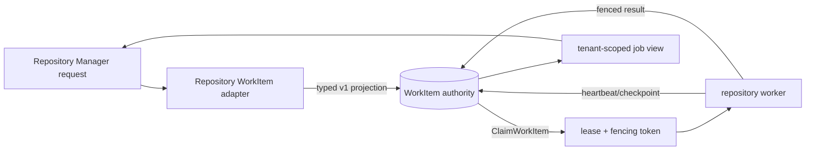

# Repository-development WorkItem authority

`AU-ORCH.org.repository-workitem-authority` is the Agent Utilities adapter for
Repository Manager's v1 development contract. It makes repository jobs ordinary
engine-native `WorkItem` records instead of introducing a repository-local queue,
database, or task state machine.

## Boundary

The adapter accepts the frozen JSON-shaped request without importing the
Repository Manager package. It carries only repository identity, immutable base
and configuration digests, lane/candidate/generation correlations, target alias,
authenticated tenant/owner/session references, the complete immutable C-03
resource request, and dependency IDs. Worktree paths, command bodies,
credentials, and log content remain outside
the WorkItem metadata and are represented by opaque payload, result, log, or
artifact references.

The C-03 projection preserves weighted admission inputs (`cpu_weight`,
`memory_mib`, `disk_mib`, and `process_slots`), host labels and anti-affinity,
preferred/required inventory targets, queue deadlines, and disk low/high
watermarks. These values are privacy-safe metadata, participate in the
immutable input digest, and are returned unchanged in both the tenant-scoped
view and terminal result. RMDD-02 stores the request only; reservation and
scheduler policy remain downstream concerns.

The strict RMDD priority (0..10,000) is retained in the extension record and
views. Native WorkItem admission has four queue buckets, so the adapter clamps
that value to the representable 0..3 bucket without changing the persisted
contract value. Queue deadlines are also projected to the native
`deadline_unix` field.

C-01 consent is retained with the request. Release and workspace-push jobs
require the frozen `allow_push` plus risk acknowledgement/marker and engage
the native consent gate; branch landing remains a separate local-fence
operation. Repair engages that gate only when
`allow_destructive_cleanup` is explicitly set. Opaque metadata fields are
encoded before generic persistence privacy sanitization so card-shaped refs,
aliases, labels, and correlations round-trip exactly without weakening the
sanitizer.

Repository job kinds are registered in
`agent_utilities.orchestration.repository_work_item`:

| Operation family | Durable WorkItem kind |
|---|---|
| `lane.allocate`, `lane.check` | `repository.lane.allocate`, `repository.lane.check` |
| `repository`, `validation`, `build`, `merge`, `release` | `repository.operation`, `repository.validation`, `repository.build`, `repository.merge`, `repository.release` |
| `candidate.submit`, `generation.certify`, `branch.land` | `repository.candidate.submit`, `repository.generation.certify`, `repository.branch.land` |
| `workspace.validate`, `workspace.bump`, `workspace.push`, `repair` | `repository.workspace.validate`, `repository.workspace.bump`, `repository.workspace.push`, `repository.repair` |

Each kind uses the same WorkItem lifecycle and native queue admission.

## Idempotency and scope

The public `rmjob:<uuid>` and durable
`workitem:repository_manager:<uuid>` handles are derived from the authenticated
tenant scope plus the client idempotency key. Submission uses the engine's
atomic `create_node_if_absent` primitive. A concurrent duplicate reads the
winner's immutable request digest; an identical request returns the existing
handle, while changed input raises a conflict and cannot overwrite the winner.

Dependencies are persisted as WorkItem IDs. A job with unresolved parents stays
`submitted` and therefore cannot consume a worker lease; the native terminal
commit releases downstream jobs atomically when all parents succeed. A failed or
cancelled parent intentionally leaves its child `submitted` for a reconcile or
repair decision rather than silently treating a failed prerequisite as success.
Admission also performs a fenced readiness reconciliation after each reverse
dependency index append, closing the interleaving where a parent succeeds after
child creation but before the child is indexed. Dependencies must already be
durable WorkItems in the same authenticated tenant; missing and cross-tenant
references are rejected without revealing which condition occurred.

`reconcile_repository_work_items` is an idempotent restart path. Repository
listing and next-item claiming invoke it to backfill missing parent reverse
indexes and recompute dependency counts before workers can observe or claim a
child. A claim for one job also repairs that target directly, so a bounded
oldest-first listing cannot hide a newer crash-window child behind historical
terminal jobs. This covers a process stop after durable child creation but
before edge indexing.

## Fences and restart behavior

Claim, renewal, checkpoint, retry, cancellation, and terminal commit all delegate
to the existing native WorkItem verbs. The adapter never writes a second lease,
status, or result record. A fresh Repository Manager process reconstructs its
status from the same durable WorkItem row. A stale owner, epoch, or fencing token
cannot checkpoint or publish a result.

The adapter does not mint authentication: its MCP/REST caller must provide a
verified tenant context (and the native authority may bind that tenant). Reads
require that verified scope; caller-supplied tenant values cannot override a
bound authority. Repository row
queries use that same authority as submit/get, and filter by the registered
repository kind set before applying repository/lane/candidate/generation/
correlation filters. Metadata filters are evaluated page by page with a bounded
`(created_at, id)` keyset cursor until enough matches or exhaustion, so an old
nonmatching prefix cannot hide a newer job. This keeps unrelated orchestration
work out of repository job listings and prevents a tenant or actor from reading
another scope's jobs.

## Downstream contract

RMDD-05 can project these records to FastMCP task operations; RMDD-06 can build
the Repository Manager application service; RMDD-08 can schedule by `kind`,
`resource_class`, priority, fairness group, and dependency readiness. None of
those consumers may create a second job table or infer lifecycle state from a
filesystem, Docket, Redis, or an in-memory future.
