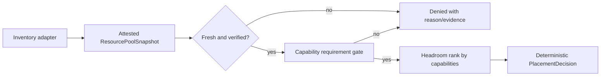

# Resource-pool capability authority

`CONCEPT:AU-OS.resource-pool-authority` is the agent-utilities boundary for
placing work on heterogeneous hardware.  It is deliberately a typed authority
contract, not a host scanner or a scheduler implementation.

## Contract

An inventory adapter publishes a frozen `ResourcePoolSnapshot` containing:

- CPU architecture/ISA (including explicit `avx2`), CPU headroom, and RAM
  allocatable/reserved/used values;
- GPU device count, memory, runtime, driver reference, and optional MIG profiles;
- generic disk capacity/IOPS and separately asserted NVMe device/IOPS capability;
- network ingress, egress, and latency;
- energy power envelope and operator-published cost estimate.

Every measurement has a truthful state: `known`, `absent`, `unknown`,
`unsupported`, or `stale`.  A non-`known` measurement has no numeric value and is
never treated as zero.  Known accounting obeys:

```text
used <= reserved <= allocatable
```

Snapshots carry observed/expiry timestamps and an opaque attestation/signature
reference.  The attestation's subject digest must match the canonical capability
vector; changing the CPU ISA, GPU runtime, storage, or headroom invalidates the
binding.  Placement accepts only fresh snapshots with a verified attestation.

References are bounded opaque identifiers.  The contract has no hostname,
credential, raw telemetry, signature value, or private payload field.

## Deterministic placement

`place(requirement, snapshots, now=...)` sorts candidates by their capability
headroom and uses the snapshot digest only as a stable tie-breaker.  Input order
and hostnames do not influence the result.  A denied result exposes bounded
machine-readable reasons and per-snapshot evidence; stale, forged, unsupported,
or unknown capability state fails closed.



The GR1080-shaped fixture demonstrates the boundary: 8 CPU, roughly 22 GiB
allocatable RAM, and one CUDA GPU are known, while NVMe is explicitly absent.  A
generic large-build requirement needing 32 GiB RAM and NVMe is denied with both
`insufficient_memory` and `nvme_unavailable`; the GPU does not make the machine
qualify by implication.

The module does not start workloads or mutate inventory.  A runtime adapter may
use the selected opaque pool reference after separately applying its lease,
authorization, and actuation contracts.
