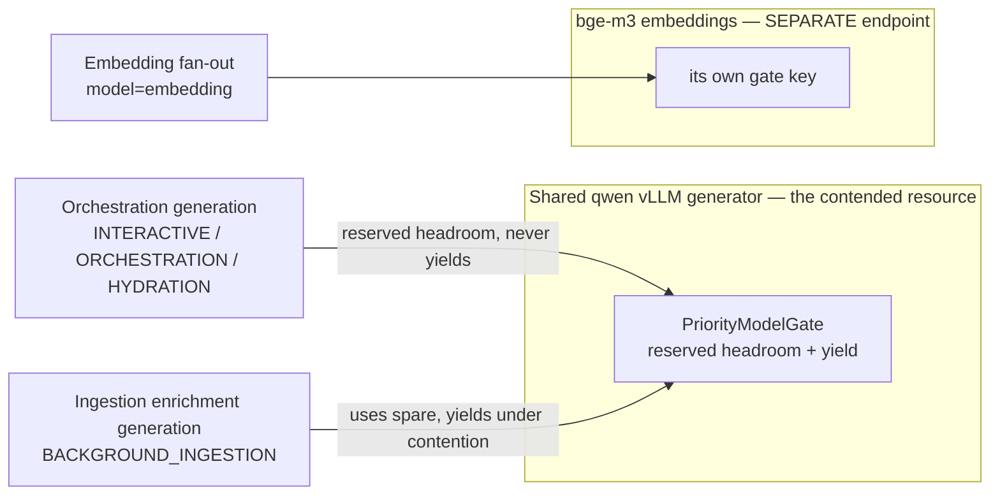

# Resource-Priority Edict — interactive over ingestion, end to end

> **CONCEPT:ORCH-1.98** (the priority class + carrier) ·
> **CONCEPT:ORCH-1.99** (the priority-aware shared-LLM admission gate) ·
> **CONCEPT:KG-2.293** (cross-component propagation)

## The edict (the law)

Ingestion and orchestration share the **same** LLM (the qwen vLLM generator), the
**same** epistemic-graph engine, and the **same** agent-utilities runtime — but
they must never bottleneck each other. Interactive / orchestration work (a live
Claude or end-user query, a skill / workflow execution, cron-driven orchestration)
is **always** prioritised over background ingestion of documents / codebases /
research papers — **dynamically**, with **no blocking**:

- background work **yields** to higher-priority work while it is actively
  contending, and
- background work uses the **spare capacity** when nothing higher contends
  (dynamic scaling — it is never starved to zero, never deadlocked).

The one explicit exception is **initial skill + MCP hydration** — foundational
bootstrap (the toolset must load before anything can orchestrate), so it is
**HIGH, not deprioritised**.

## The one priority class (single source of truth)

`agent_utilities/core/resource_priority.py` defines the `PriorityClass` enum — the
single vocabulary every reserved lane keys off (lower rank = higher priority):

| Class | Rank | Meaning |
|---|---|---|
| `INTERACTIVE` | 0 | a live Claude / end-user request (an MCP / REST interactive call) |
| `ORCHESTRATION` | 1 | a skill / workflow execution, incl. cron-driven orchestration |
| `HYDRATION` | 1 | initial skill + MCP-server ingestion — the foundational exception, **not** deprioritised |
| `BACKGROUND_INGESTION` | 3 | documents, codebases, research-paper ingest, enrichment — yields to all above |

An **untagged** call defaults to high (`ORCHESTRATION`-level), so the system is
fully additive: only an explicitly `BACKGROUND_INGESTION`-scoped call ever yields.

## Contention map

- **qwen vLLM generator** — SHARED by orchestration generation **and** ingestion
  enrichment. This is the gate that matters; admission is enforced per generator
  model key.
- **bge-m3 embeddings** — a SEPARATE endpoint, so it gets a SEPARATE gate key and
  never contends with the generator. Because the gate is keyed per model, this
  separation is automatic — embedding fan-out is gated only against other
  embedding fan-out.

## How it is enforced — three reserved lanes, one currency

One interactive request gets a worker slot **and** an engine read **and** an LLM
slot ahead of background ingestion, because all three reserved lanes key off the
**same** `PriorityClass` (via the same lane taxonomy):

| Tier | Mechanism | Reserved floor |
|---|---|---|
| **Host worker** | `knowledge_graph/core/worker_scheduler.py` `AdmissionPolicy` (CONCEPT:KG-2.289) | `interactive_floor()` — a worker count non-interactive lanes can never claim |
| **Engine read** | epistemic-graph reserved read lane (EG-044) | a read slot kept for interactive reads under a write-storm |
| **Shared LLM** | `core/resource_priority.py` `PriorityModelGate` (CONCEPT:ORCH-1.99) | `reserve` permits kept free for interactive/orchestration/hydration |

The LLM gate, for one generator model:

1. **Hard capacity** — at most `capacity` calls in flight (subsumes the plain
   per-model semaphore; same width).
2. **Reserved headroom** — background ingestion may occupy at most
   `capacity - reserve` permits, **always**, so `reserve` permits are free for a
   higher-priority call to land *immediately*, even under a saturating background
   fan-out (the non-blocking guarantee). `reserve` is auto-sized
   (`round(capacity × 0.34)`, floored at 1 for any real pool, 0 for a single-permit
   gate) — overridable with `KG_LLM_PRIORITY_RESERVE`.
3. **Active-contention yield** — while any higher-priority call is *waiting* (a
   burst exceeding the reserve), background admission is refused outright so the
   high-priority backlog drains first. Background is only ever throttled *while
   interactive is actively contending*; otherwise it scales up into the headroom
   (dynamic scaling, never starved to zero).

It also passes the vLLM request `priority` field (lower = sooner, matching the
rank) via `extra_body`, so a server started with `--scheduling-policy priority`
honours it server-side too. The client-side gate is the always-on enforcement
regardless of server config.

## Propagation (the carrier)

A request's priority flows from its entry point to the LLM call, the worker claim,
and the engine access via a context-var carrier — there is no parallel system:

- **Entry point → class.** `priority_scope(PriorityClass.X)` binds the ambient
  priority for a `with` block:
  - an MCP/REST interactive call → `INTERACTIVE`
  - `graph_orchestrate` execute → `ORCHESTRATION`
  - a codebase/document ingest task → `BACKGROUND_INGESTION`
  - the skill/MCP hydration path → `HYDRATION`
- **Worker task body.** `_execute_claimed_task` tags each task's whole execution
  with `priority_for_task_type(task_type)` (derived from the **same** lane taxonomy
  as the worker `AdmissionPolicy`), set inside the worker thread because
  contextvars do not cross threads. So an ingestion task's enrichment LLM calls run
  as `BACKGROUND_INGESTION` and yield, while an on-pool `queries` task
  (conversation/kg_memory) runs `INTERACTIVE`.
- **The LLM gate.** `map_concurrent` / `map_concurrent_sync` consult
  `current_priority()` and route a tagged fan-out through the `PriorityModelGate`;
  untagged fan-out keeps the plain per-model semaphore (zero behaviour change).
- **Cross-process / engine.** `observability/correlation.py` carries the class on
  the `x-resource-priority` header in `current_carrier()` / `inject()`, and restores
  it in `bind_carrier()`, so a spawned child agent and any outbound engine read
  (the EG-044 read lane) inherit the entry point's priority.

`HYDRATION_TASK_TYPES` (default `{"skill_workflows"}`) overrides the background lane
mapping so foundational hydration is HIGH even though its corpus ingest is bulky.

## Why no blocking / no deadlock

The queues are separated and non-dependent: background never holds a lock the
high-priority path needs, and the reserved headroom guarantees a high-priority call
can always land a permit without waiting for a background release. Background is
"backed off" (refused admission while a high call waits), never blocked to zero
permanently — the instant no higher-priority call is contending it resumes into the
headroom. This is the operator's "always responsiveness + dynamic scaling between
the two" expressed as code.
