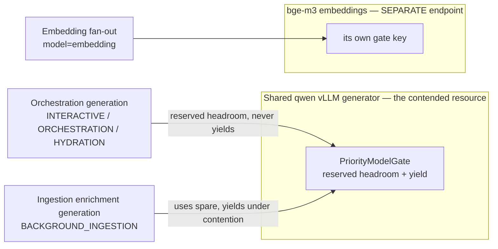
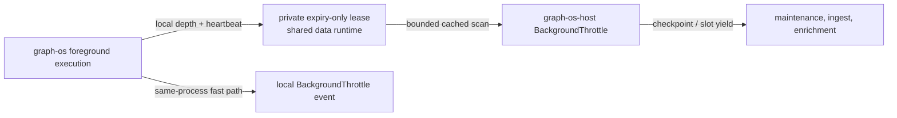
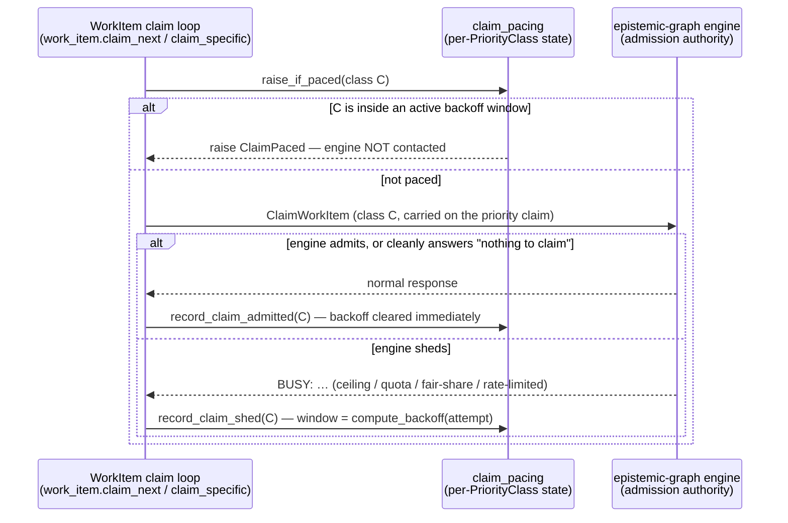

# Resource-Priority Edict — interactive over ingestion, end to end

> **CONCEPT:AU-ORCH.scheduling.resource-priority-edict** (the priority class + carrier) ·
> **CONCEPT:AU-ORCH.scheduling.also-fold-vllm-scheduler** (the priority-aware shared-LLM admission gate) ·
> **CONCEPT:AU-KG.compute.priority-class-propagation** (cross-component propagation)

## The edict (the law)

Ingestion and orchestration share the **same** LLM (the qwen vLLM generator), the
**same** epistemic-graph engine, and the **same** agent-utilities runtime — but
they must never bottleneck each other. Interactive / orchestration work (a live
Claude or end-user query, a skill / workflow execution, cron-driven orchestration)
is **always** prioritised over background ingestion of documents / codebases /
research papers — **dynamically**, with **no blocking**:

- background work **yields** to higher-priority work while it is actively
  contending, and
- background work uses the **spare capacity** when nothing higher contends
  (dynamic scaling — it is never starved to zero, never deadlocked).

The one explicit exception is **initial skill + MCP hydration** — foundational
bootstrap (the toolset must load before anything can orchestrate), so it is
**HIGH, not deprioritised**.

## The one priority class (single source of truth)

`agent_utilities/core/resource_priority.py` defines the `PriorityClass` enum — the
single vocabulary every reserved lane keys off (lower rank = higher priority):

| Class | Rank | Meaning |
|---|---|---|
| `INTERACTIVE` | 0 | a live Claude / end-user request (an MCP / REST interactive call) |
| `ORCHESTRATION` | 1 | a skill / workflow execution, incl. cron-driven orchestration |
| `HYDRATION` | 1 | initial skill + MCP-server ingestion — the foundational exception, **not** deprioritised |
| `BACKGROUND_INGESTION` | 3 | documents, codebases, research-paper ingest, enrichment — yields to all above |

An **untagged** call defaults to high (`ORCHESTRATION`-level), so the system is
fully additive: only an explicitly `BACKGROUND_INGESTION`-scoped call ever yields.

## Contention map


```mermaid
flowchart LR
  subgraph shared[Shared qwen vLLM generator — the contended resource]
    GATE["PriorityModelGate<br/>reserved headroom + yield"]
  end
  ORCH["Orchestration generation<br/>INTERACTIVE / ORCHESTRATION / HYDRATION"] -->|reserved headroom, never yields| GATE
  ENRICH["Ingestion enrichment generation<br/>BACKGROUND_INGESTION"] -->|uses spare, yields under contention| GATE
  subgraph separate[bge-m3 embeddings — SEPARATE endpoint]
    EGATE[its own gate key]
  end
  EMB["Embedding fan-out<br/>model=embedding"] --> EGATE
```

- **qwen vLLM generator** — SHARED by orchestration generation **and** ingestion
  enrichment. This is the gate that matters; admission is enforced per generator
  model key.
- **bge-m3 embeddings** — a SEPARATE endpoint, so it gets a SEPARATE gate key and
  never contends with the generator. Because the gate is keyed per model, this
  separation is automatic — embedding fan-out is gated only against other
  embedding fan-out.

## How it is enforced — three reserved lanes, one currency

One interactive request gets a worker slot **and** an engine read **and** an LLM
slot ahead of background ingestion, because all three reserved lanes key off the
**same** `PriorityClass` (via the same lane taxonomy):

| Tier | Mechanism | Reserved floor |
|---|---|---|
| **Host worker** | `knowledge_graph/core/worker_scheduler.py` `AdmissionPolicy` (CONCEPT:AU-KG.compute.interactive-lane-floor) | `interactive_floor()` — a worker count non-interactive lanes can never claim |
| **Engine read** | epistemic-graph reserved read lane (EG-KG.coordination.reserved-read-lane) | a read slot kept for interactive reads under a write-storm |
| **Shared LLM** | `core/resource_priority.py` `PriorityModelGate` (CONCEPT:AU-ORCH.scheduling.also-fold-vllm-scheduler) | `reserve` permits kept free for interactive/orchestration/hydration |

### Split-process foreground handoff

`BackgroundThrottle` is the cooperative checkpoint used by host maintenance,
ingestion, and enrichment loops.  A foreground graph execution enters it through
`orchestration.engine._foreground_execution`.  In a split deployment those calls
run in `graph-os` while the background loops run in `graph-os-host`, so the
foreground signal is also published as a short-lived lease below the shared
`AGENT_UTILITIES_DATA_DIR/runtime/foreground-leases/` root.  Each foreground
process writes one random-named, expiry-only record, refreshes it in the
background, and removes it on normal completion.  A host reads at most 128
private regular files per bounded cache interval; malformed, symlinked,
world-readable, or expired records are ignored.  Consequently a crashed client
stops pausing the host after the TTL, while normal local nesting remains a fast
in-process event check.


```mermaid
flowchart LR
  FG["graph-os foreground execution"] -->|local depth + heartbeat| LEASE["private expiry-only lease\nshared data runtime"]
  LEASE -->|bounded cached scan| HOST["graph-os-host BackgroundThrottle"]
  HOST -->|checkpoint / slot yield| BG["maintenance, ingest, enrichment"]
  FG -->|same-process fast path| LOCAL["local BackgroundThrottle event"]
```

The LLM gate, for one generator model:

1. **Hard capacity** — at most `capacity` calls in flight (subsumes the plain
   per-model semaphore; same width).
2. **Reserved headroom** — background ingestion may occupy at most
   `capacity - reserve` permits, **always**, so `reserve` permits are free for a
   higher-priority call to land *immediately*, even under a saturating background
   fan-out (the non-blocking guarantee). `reserve` is auto-sized
   (`round(capacity × 0.34)`, floored at 1 for any real pool, 0 for a single-permit
   gate) — overridable with `KG_LLM_PRIORITY_RESERVE`.
3. **Active-contention yield** — while any higher-priority call is *waiting* (a
   burst exceeding the reserve), background admission is refused outright so the
   high-priority backlog drains first. Background is only ever throttled *while
   interactive is actively contending*; otherwise it scales up into the headroom
   (dynamic scaling, never starved to zero).

It also passes the vLLM request `priority` field (lower = sooner, matching the
rank) via `extra_body`, so a server started with `--scheduling-policy priority`
honours it server-side too. The client-side gate is the always-on enforcement
regardless of server config.

### The admission arithmetic (the testable core)

The whole gate reduces to one pure predicate — `PriorityModelGate._can_admit(is_high)`
in `core/resource_priority.py` — evaluated under a single lock against three
counters (`_active` in-flight, `_high_waiters` waiting high-priority callers,
and the fixed `capacity`/`reserve`):

```python
def _can_admit(self, is_high: bool) -> bool:
    if self._active >= self.capacity:      # 1. hard cap — nobody exceeds capacity
        return False
    if is_high:                            # 2. high-priority lands as long as a permit exists
        return True
    if self._high_waiters > 0:             # 3a. background yields while ANY high call waits
        return False
    return self._active < (self.capacity - self.reserve)  # 3b. else background uses spare headroom
```

`is_high` is `priority.is_interactive_floor` — `True` for INTERACTIVE,
ORCHESTRATION **and** HYDRATION (everything that is *not* BACKGROUND_INGESTION),
mirroring the host scheduler's interactive-lane reservation. A high call only ever
waits behind *other high calls competing for the same `capacity`*; it is never
blocked by background, because background can occupy at most `capacity - reserve`.
The async face (`acquire`/`release`, an `asyncio.Condition`) and the sync face
(`acquire_sync`/`release_sync`, a `threading.Condition`) share the one counter set
and one mutex, so an async orchestration call and a sync enrichment call contend on
the **same** gate. A high waiter increments `_high_waiters` *before* it blocks, so
rule 3a sheds background the instant interactive starts contending — not after it
has already acquired.

## Cluster-wide backpressure — engine admission is authority, Python pacing is cooperative (W2.4 + W2.9)

> **CONCEPT:AU-ORCH.scheduling.claim-pacing-backpressure** (W2.9 — cluster-wide backpressure
> unification) · engine-side: **CONCEPT:EG-KG.coordination.backpressure-busy-signal** (W2.4, `epistemic-graph`
> `src/server/qos.rs`, out of this repo's edit boundary — read-only reference).

The three reserved lanes above all *admit into agent-utilities' own processes* (LLM
generator, worker pool, plus the engine's reserved interactive read lane already
referenced in the table). The **engine itself** also runs an independent admission
gate on every request it serves — a **fourth** lane, and the one whose internals live
in the `epistemic-graph` repo, not this one:

- **Baseline (always on, every engine version).** `EPISTEMIC_GRAPH_MAX_INFLIGHT` caps
  total concurrent requests; anything over it is shed `BUSY: server at capacity,
  retry with backoff`.
- **Opt-in per-class QoS (`EPISTEMIC_GRAPH_QOS`, W2.4, `src/server/qos.rs`).** When a
  build carries it, admission is classified by the **SAME** `PriorityClass` this file
  documents (the wire `priority` claim — `RequestContextClaims.priority`, mapped by
  `QosClass::from_priority_claim`) and shed **lowest class first**
  (`Interactive > Orch > Hydration > Ingest`) under a per-class ceiling, plus a
  per-principal token bucket, fair-share, and hard quota. An absent/untagged claim
  resolves to `Orch` — the identical "untagged = high, never starved" default this
  file's edict already uses for the LLM/worker/read lanes.

The engine's admission decision is **authoritative**: agent-utilities never grants
itself extra capacity, retries past what the engine shed as if it hadn't happened, or
second-guesses which class the engine chose to shed. What agent-utilities *does* do
(`agent_utilities/orchestration/claim_pacing.py`, W2.9) is behave as a **cooperative
participant**. The WorkItem claim loop (`orchestration/work_item.py`'s
`claim_specific`/`claim_next` — the sole two "claiming" entry points every caller
already shares, so this is native with zero per-caller wiring) remembers, **per
`PriorityClass`**, that a class was just shed and stops attempting new claims of that
class for a computed window (exponential backoff, capped, jittered — reusing
`orchestration/resilience.compute_backoff`, the same curve every other retry policy in
this codebase uses) instead of immediately re-issuing the identical request the engine
just refused.


```mermaid
sequenceDiagram
    participant W as WorkItem claim loop<br/>(work_item.claim_next / claim_specific)
    participant P as claim_pacing<br/>(per-PriorityClass state)
    participant E as epistemic-graph engine<br/>(admission authority)

    W->>P: raise_if_paced(class C)
    alt C is inside an active backoff window
        P-->>W: raise ClaimPaced — engine NOT contacted
    else not paced
        W->>E: ClaimWorkItem (class C, carried on the priority claim)
        alt engine admits, or cleanly answers "nothing to claim"
            E-->>W: normal response
            W->>P: record_claim_admitted(C) — backoff cleared immediately
        else engine sheds
            E-->>W: BUSY: … (ceiling / quota / fair-share / rate-limited)
            W->>P: record_claim_shed(C) — window = compute_backoff(attempt)
        end
    end
```

Two properties fall out of this split:

- **Per-class, not global.** Pacing state is keyed by `PriorityClass`, mirroring the
  engine's own per-class ceilings — an `INTERACTIVE` claim loop is never paced by a
  `BACKGROUND_INGESTION` flood's backoff (disjoint state, disjoint dict entries). This
  extends the edict's "one interactive request gets a worker slot **and** an engine
  read **and** an LLM slot ahead of background ingestion" to "**and** an engine
  WorkItem claim, ahead of a backed-off ingestion class."
- **Deploy-order independent (unlike the claim itself).** Shed detection is on the
  wire message prefix (`BUSY: …`, `claim_pacing.is_busy_shed`), not a W2.4-specific
  exception type — no dedicated `EngineBusyError`/`ResourceExhaustedError` class
  exists in `epistemic_graph.client` today, so pacing works against **any** engine
  version. A pre-W2.4 engine's undifferentiated baseline cap still benefits: au paces
  by its own notion of which class it was attempting, independent of whether the
  engine can tell classes apart. The **wire `priority` claim itself** is the one piece
  with a real deploy-ordering constraint (register **W2.4-2**,
  `GraphSession.engine_verified_context()`): every `RequestContextClaims` engine
  struct is `#[serde(deny_unknown_fields)]`, so an engine that predates W2.4 rejects
  the **entire** request the instant `priority` is present — not just the new field.
  Every engine reachable from a session must already carry a W2.4 build before an
  agent-utilities build that sets the claim is deployed against it. Pacing itself
  carries no such constraint; the claim does.

The pacing policy (`claim_pacing.DEFAULT_CLAIM_PACING_POLICY`, a `ResiliencePolicy`
instance) is deliberately **data, not an environment knob** — per this codebase's
configuration discipline, a sensible universal default exists (a much shorter base
delay than a WorkItem's own post-failure retry backoff: pacing governs "how soon may I
even attempt to claim again", not "how long does a failed unit of work wait"), so
tuning it means editing the policy instance, not adding a `KG_*`/`GRAPH_*` flag.

## Configuration knobs

The edict is **Native-by-default**: it is always on, auto-sized, and needs no
configuration to work. Every knob below is an override, not a requirement.

| Knob | Default | Meaning |
|---|---|---|
| `KG_LLM_PRIORITY_RESERVE` (env) | unset → auto | Absolute number of permits reserved for high-priority calls. When set, wins over the fraction; clamped to `[0, capacity-1]`. |
| `KG_LLM_PRIORITY_RESERVE_FRACTION` (env) | `0.34` | Auto-size fraction: `reserve = max(1, min(round(capacity × fraction), capacity-1))`. A single-permit gate (`capacity ≤ 1`) reserves `0`. |
| `HYDRATION_TASK_TYPES` (module constant) | `{"skill_workflows"}` | Task types forced to `HYDRATION` (HIGH) regardless of their ingestion lane — the foundational-bootstrap exception. |
| `MODEL_MAX_CONCURRENCY` (env) | `512` | Adaptive ramp ceiling. The gate's `capacity` is the model's resolved capacity (`resolve_capacity`), itself clamped at `server_ceiling` (ORCH-1.102). |

`reserve` is **not** a separate config surface from capacity: the gate is cached per
`(model_key, capacity)`, so a capacity change (an adaptive ramp, a config reload)
yields a fresh gate whose `reserve` is re-derived. The gate's `capacity` is sized to
the model's **`server_ceiling`** when reached from the fan-out helpers (`map_concurrent` /
`map_concurrent_sync` pass `capacity=server_ceiling(model)`), so the priority edict
and the server-capacity guard ([`llm-server-capacity-guard.md`](llm-server-capacity-guard.md))
are the **same** gate: *priority decides the order within the ceiling; the ceiling
decides the max.*

## Operating notes — when orchestration feels starved

The edict's job is that an interactive/orchestration call never waits behind
background ingestion. If orchestration *does* feel slow while ingestion is running,
check these in order:

1. **Is the call actually tagged high?** An untagged context resolves to
   `ORCHESTRATION` (high) via `_effective`, so the default is safe — but if a worker
   task body runs under `priority_for_task_type(task_type)` and that task type maps
   to a background lane, its LLM calls are `BACKGROUND_INGESTION` and *should* yield.
   Confirm the entry point wraps the work in `priority_scope(PriorityClass.INTERACTIVE
   / ORCHESTRATION)`. The carrier rides the `x-resource-priority` header
   (`observability/correlation.py`) across process and engine hops, so a spawned child
   agent inherits the class — verify it is present on the outbound call.
2. **Is the slowness the LLM gate or somewhere else?** The gate only governs the
   **shared qwen generator**. If the wait is on an engine read it is the EG-KG.coordination.reserved-read-lane reserved
   read lane; if it is on a worker slot it is the host `AdmissionPolicy` (AU-KG.compute.interactive-lane-floor).
   All three key off the same `PriorityClass`, so a misclassified call starves all
   three — fix the class, not the individual lane.
3. **Is `reserve` too small for the interactive burst?** `reserve` guarantees that
   many high calls can land *immediately*; a burst larger than `reserve` still drains
   ahead of background (rule 3a refuses background while any high call waits), but the
   excess high calls queue behind each other for a permit. If a steady interactive
   burst exceeds the reserve, raise `KG_LLM_PRIORITY_RESERVE` or the model's
   `server_ceiling` (more total permits) — never lower it.
4. **Is background actually yielding?** Background is *refused admission* while a high
   call waits and capped at `capacity - reserve` otherwise; it is never blocked to
   zero. If ingestion has stalled to nothing, that is a different problem (a tripped
   circuit breaker, AU-ORCH.routing.load-shedding-backoff, or an empty queue) — not the edict starving it.

## Propagation (the carrier)

A request's priority flows from its entry point to the LLM call, the worker claim,
and the engine access via a context-var carrier — there is no parallel system:

- **Entry point → class.** `priority_scope(PriorityClass.X)` binds the ambient
  priority for a `with` block:
  - an MCP/REST interactive call → `INTERACTIVE`
  - `graph_orchestrate` execute → `ORCHESTRATION`
  - a codebase/document ingest task → `BACKGROUND_INGESTION`
  - the skill/MCP hydration path → `HYDRATION`
- **Worker task body.** `_execute_claimed_task` tags each task's whole execution
  with `priority_for_task_type(task_type)` (derived from the **same** lane taxonomy
  as the worker `AdmissionPolicy`), set inside the worker thread because
  contextvars do not cross threads. So an ingestion task's enrichment LLM calls run
  as `BACKGROUND_INGESTION` and yield, while an on-pool `queries` task
  (conversation/kg_memory) runs `INTERACTIVE`.
- **The LLM gate.** `map_concurrent` / `map_concurrent_sync` consult
  `current_priority()` and route a tagged fan-out through the `PriorityModelGate`;
  untagged fan-out keeps the plain per-model semaphore (zero behaviour change).
- **Cross-process / engine.** `observability/correlation.py` carries the class on
  the `x-resource-priority` header in `current_carrier()` / `inject()`, and restores
  it in `bind_carrier()`, so a spawned child agent and any outbound engine read
  (the EG-KG.coordination.reserved-read-lane read lane) inherit the entry point's priority.

`HYDRATION_TASK_TYPES` (default `{"skill_workflows"}`) overrides the background lane
mapping so foundational hydration is HIGH even though its corpus ingest is bulky.

## Why no blocking / no deadlock

The queues are separated and non-dependent: background never holds a lock the
high-priority path needs, and the reserved headroom guarantees a high-priority call
can always land a permit without waiting for a background release. Background is
"backed off" (refused admission while a high call waits), never blocked to zero
permanently — the instant no higher-priority call is contending it resumes into the
headroom. This is the operator's "always responsiveness + dynamic scaling between
the two" expressed as code.
