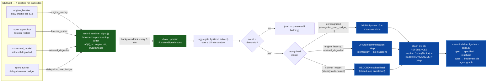

# Runtime-Reliability Loop — detect → signal → gap → heal

> A minimal, honest spine that makes **graph-os's own runtime failures** visible to the
> **existing** self-improvement machinery. The reward/failure-analyzer flywheel keys off
> **agent-run quality** (reward, `failure_analyzer`) and **LLM spans** — so a class of
> RUNTIME failures that never became a *run* stayed invisible. This loop is the intake that
> turns four already-emitted runtime signals into the SAME canonical `:Gap` every other
> discovery track folds into.
> Concepts: **AU-OS.observability.runtime-reliability-signal** (the hot-path-safe signal
> intake) and **AU-AHE.harness.runtime-reliability-loop** (the analyzer + reconciler that
> extends the gap flywheel with a fifth `SOURCE_RUNTIME` track).

This page documents ONLY the runtime-reliability extension. For the flywheel it plugs into
read [The Self-Evolution Flywheel](self-evolution-flywheel.md) (distill → develop → evolve)
and [Failure-Driven Evolution](failure_driven_evolution.md) (how production failures enter
the loop as addressable gaps). This loop reuses that spine wholesale — the canonical
`:Gap` (`knowledge_graph/research/gaps.py`), its lifecycle (`open → specified → resolved`),
and the consolidated maintenance scheduler — and adds nothing parallel to it.

---

## 1. Motivation (grounded)

A human had to manually trace and fix runtime failures the self-improvement stack never
noticed, because they were **slow or dead, not wrong**, and never produced a graded run:

| Failure this session | Why it was invisible |
|---|---|
| A messaging poller dying on a Telegram `getUpdates` 409 | Never became a *run* — no reward, no `RunTrace`. |
| A retrieval blocking the event loop → SIGKILL | A k8s restart, not a run. |
| An O(N) retrieval perf regression | Slow, not wrong → no reward penalty. |
| Engine write-contention | A latency symptom with no owning run. |

The **detection** signals for all four now exist (added this session) as WARN logs +
metrics — they were just never wired into the improvement loop:

- `knowledge_graph/core/engine_breaker.py` — `ENGINE_REQUEST_LATENCY` + the "slow engine call" WARN.
- `messaging/router.py` — the self-healing listener supervisor (`_supervise_backend`).
- `core/contextual_model.py` — the bounded-compile retrieval-degradation WARN.
- `orchestration/agent_runner.py` — the `run_summary` + the wall-clock budget.

This loop is the wire.

## 2. The loop

### The one invariant: emit is zero-risk to the hot path

`record_runtime_signal(kind, subject, detail)`
(`observability/runtime_signals.py`) is the entire hot-path cost: build a privacy-safe
dict (numbers only) and append it to a **bounded ring buffer** (`maxlen=512`) under a short
lock. There is **no engine contact** — an `engine_latency` signal is emitted *because* the
engine is contended; writing to it synchronously from the hot path would compound the very
failure being recorded. Every exception is swallowed: a dropped signal, never a raised one,
never a stalled caller. **All** engine I/O — persisting `:RuntimeSignal` nodes and reading
them back over a window — happens later, off the hot path, from the background tick.

## 3. How it extends the flywheel (reuse, not parallel)

| Reused existing piece | How this loop plugs in |
|---|---|
| Canonical `:Gap` schema (`research/gaps.py`) | Adds one `source` value — `SOURCE_RUNTIME` — beside `failure/research/skill/audit`. `submit_gap` / `open_gaps` / `mark_gap_resolved` used verbatim. |
| Gap lifecycle `open → specified → resolved` | Flywheel + recommendation gaps are born `open`; a listener-restart heal is born `open` then immediately `resolved` (a visible closed loop). |
| Consolidated maintenance scheduler (`engine_tasks.py`) | A new `_tick_runtime_reliability` registered via `_maint(...)` at **background priority (bucket 3)**, native/default-on, beside `anomaly_consumer` / `tms_revalidation`. |
| Signal store surface | `:RuntimeSignal` nodes written via the same `engine.add_node` / `engine.query_cypher` surface `gaps.py` uses — backend-agnostic, mockable, no `native_ingest` contract coupling. |
| Ingested code (`:Code` nodes) + `resolve_anchors` (`retrieval/code_context.py`) | Every runtime gap resolves its fix-site symbol + subject to real ingested code and carries `file:line` references + `(:Code)-[:EVIDENCES]->(:Gap)` edges (see §3.5). |

Nothing here is a parallel system: the analyzer is one more gap-opener, the scheduler entry
is one more background tick, the signal is one more evidence type.

## 3.5 Code references — the golden egg

The ecosystem's own source (agent-utilities, epistemic-graph, universal-skills) is ingested
into the KG via tree-sitter/AST + code embeddings as `:Code` nodes carrying
`file_path` / `line` / `name`. So a runtime gap does not just describe a symptom in prose —
it points at the **exact ingested code the fix concerns, with line numbers**, and links to
it. That is what turns a detected runtime pattern into a first-class input to the
**standardized evolution path** — `Gap → spec → implement via the agent graph` — with real,
traversable targets a downstream implementer (or a human reviewer) can open directly.

For every gap it opens, `_submit_runtime_gap` (`research/runtime_reliability.py`):

1. Resolves the per-kind **fix-site symbol** (e.g. `_supervise_backend`,
   `_compiled_evidence_and_bundle_bounded`) and the signal **subject** (the slow op / failing
   backend / over-budget agent) against ingested `:Code` via
   `resolve_anchors(engine, query=…)` → real `{symbol, file, line}` citations.
2. Attaches them as `code:<file>:<line> (<symbol>)` evidence **and** links each resolved
   node to the gap with the **existing** `(:Code)-[:EVIDENCES]->(:Gap)` provenance edge — the
   same edge the failure analyzer / anomaly consumer already write — so the anchor is
   traversable from the gap by the SAME machinery the SDD/implementer path walks.
3. **Always** falls back to the drift-free `code:<file> (<symbol>)` fix-site reference when
   that symbol's code is not (yet) ingested — line numbers come from the KG, never
   hard-coded, so a suggested-change reference cannot drift.

The line-number resolution is drift-free by construction: the file+symbol is stable in
source, and the line is read live from the ingested `:Code` node, not baked into this
module.

## 4. Disposition policy (conservative by design)

The reconciler (`research/runtime_reliability.py`) is **recommendation-only or already-safe
— it never mutates prod**:

- **`listener_restart`** — ALREADY auto-healed by the messaging supervisor. Recorded as a
  *resolved* heal (a closed-loop annotation, deduped so a recurring restart is noted once),
  not open work.
- **`engine_latency` / `retrieval_degraded`** — a config/perf **recommendation** `:Gap`
  ("consider batching/caching this op", "review the retrieval budget"), left open for a
  human / the flywheel. No auto-tuning.
- **`delegation_over_budget` + any unknown kind** — a plain investigate `:Gap` handed to
  the flywheel/SDD. No known-safe action, so it is not auto-actioned.

All gaps dedupe against already-open gaps (`open_gaps`) so a persistent pattern is one gap,
not a per-tick storm.

## 5. Thresholds & cadence (named constants, not env knobs)

Per configuration discipline these are auto-sized module constants, not a new flag family:

| Constant | Value | Where |
|---|---|---|
| Buffer bound | 512 signals | `runtime_signals._MAX_BUFFERED_SIGNALS` |
| Aggregation window | 15 min | `runtime_signals._DEFAULT_WINDOW_S` |
| Tick cadence | 3 min | `engine_tasks._RUNTIME_RELIABILITY_INTERVAL` |
| Pattern threshold (per kind) | latency 5 · restart/degrade/over-budget 3 | `runtime_reliability._MIN_COUNT` |
| Over-budget fraction | 0.8 × 300 s wall-clock | `agent_runner._DELEGATION_BUDGET_WARN_FRACTION` |
| KG retention (best-effort prune) | 8 × window | `runtime_reliability._RETENTION_S` |

## 6. Honest scope — what this is, and what it is not

**Implemented (detect → gap → code-anchored recommend/annotate):** the four emission sites;
the hot-path-safe signal buffer + `:RuntimeSignal` persistence/read; the windowed analyzer
that opens `SOURCE_RUNTIME` gaps; the conservative reconciler (resolved-heal for the
already-safe class, recommendation gaps for the perf classes); **code references (`file:line`
+ `EVIDENCES` edges to ingested `:Code`) on every gap**; the background scheduler wiring.

**NOT implemented (roadmap — do not assume it exists):**

- **Driving the gap to an implemented change.** This loop *feeds* the existing evolution
  pipeline (`Gap → spec → implement via the agent graph`) with code-anchored gaps; it does
  not itself generate the spec or run the implementer. That the anchored gap flows all the
  way to a committed diff depends on the flywheel's own spec/implement stages, which are
  out of this loop's scope (it is the intake, not the whole pipeline).
- **Full auto-remediation.** Nothing here mutates prod. Heals are *annotations* of a heal
  the supervisor already performed; recommendations are *proposals*. Turning a recommendation
  into an actuated change is a separate, governed step (the `ActionPolicy` seam that
  `observability/incidents.py` documents) and is out of scope.
- **A reliability-reward optimizer.** Runtime reliability does not yet feed the reward-EMA /
  shape-policy the way run quality does; a runtime pattern opens a gap, it does not (yet)
  re-weight routing.
- **Incident-brain causal integration.** `:RuntimeSignal` is not yet correlated with the
  cross-layer `:Incident` / ops-causal `:Claim` graph (`observability/incidents.py`); a
  runtime pattern and a hardware/OS incident on the same subject are still separate.
- **Hard KG retention.** The prune is best-effort where the backend supports `DETACH DELETE`;
  otherwise nodes age out of *analysis* via the window and rely on general KG hygiene.

This loop deliberately does the smallest honest thing: it makes runtime failures **visible
to the flywheel that already exists**, and stops short of claiming autonomy it does not have.
