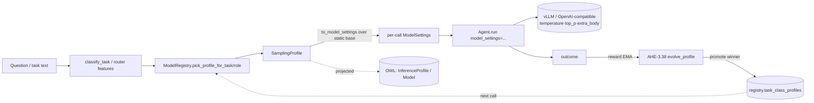
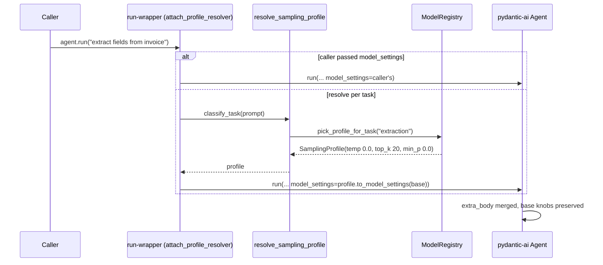
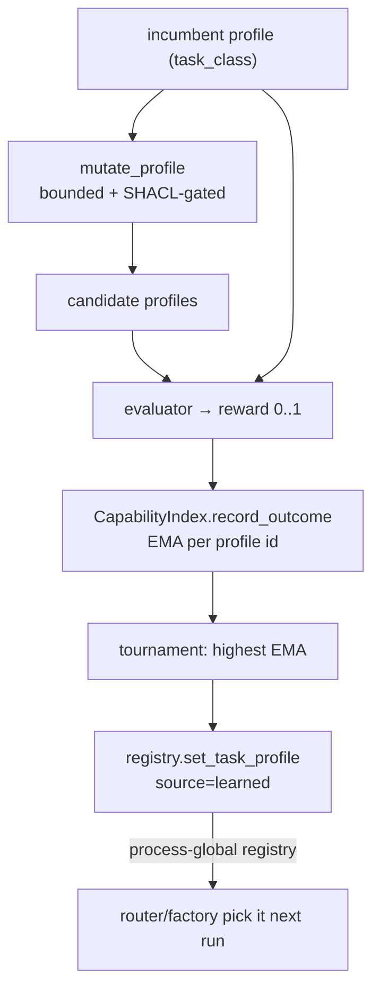
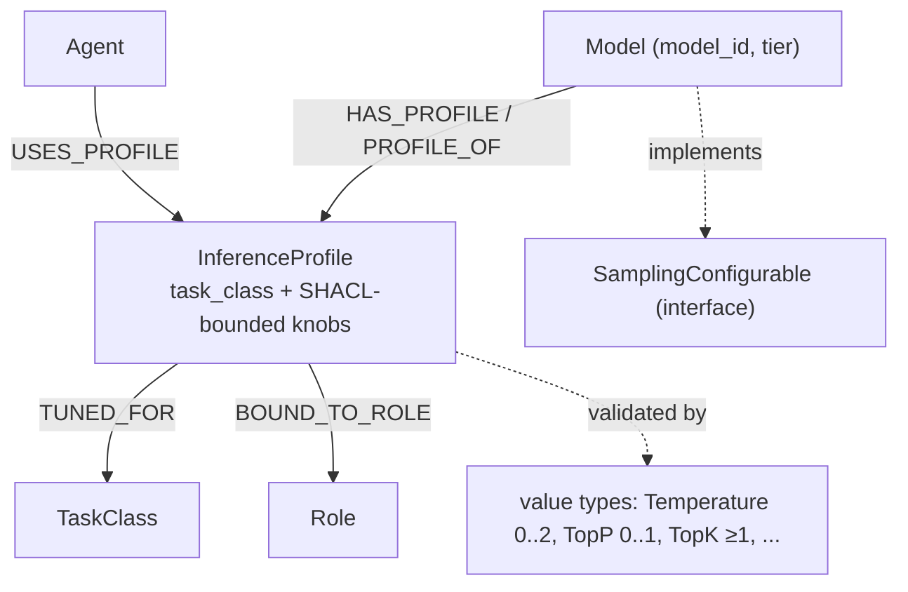

# Task-Aware Sampling Profiles (CONCEPT:AU-ORCH.routing.sampling-profile-selection / AHE-3.38 / KG-2.94–2.96)

> The router already decides **which model** answers a question. Sampling profiles
> decide **how to sample from it** — temperature, top_p, top_k, min_p,
> repetition_penalty, max_tokens, penalties — *per question*, chosen by task class,
> evolved from outcomes, and mapped into the one OWL/RDF ontology.

## Why

Model selection was dynamic (`AdaptiveAgentRouter`, `ModelRegistry` role routing,
RLM depth tiers) but the *inference parameters* were **static**: a single
`ModelSettings` was built once at agent construction
(`agent/factory.py`) from `core/config.py` defaults (temperature 0.7, top_p 1.0)
and never overridden per call. A deterministic extraction task and an open-ended
brainstorm were sampled identically. vLLM already accepts per-request knobs via the
OpenAI-compatible `extra_body` (proven in `knowledge_graph/extraction/fact_extractor.py`),
but nothing threaded them dynamically, and neither models nor parameters existed in
the ontology. This closes all three gaps without disturbing the static default — the
old behaviour becomes the *floor* a profile merges over.

## The shape: one value object, four flows

A **`SamplingProfile`** (`agent/sampling_profile.py`) bundles the per-call knobs.
Every knob is optional; `None` means *inherit the agent's base setting*. It moves
through the system exactly the way model selection already does:

## Layer A — per-call threading (CONCEPT:AU-ORCH.routing.sampling-profile-selection)

`SamplingProfile.to_model_settings(base)` builds the per-call override **from** the
agent's static base settings — because pydantic-ai *replaces* (does not deep-merge)
per-call `model_settings`, an unset knob must inherit the base value. The vLLM-only
knobs (`top_k`/`min_p`/`repetition_penalty`) are **dict-merged** into `extra_body`,
so pre-existing keys (e.g. RLM's `chat_template_kwargs`) survive.

`attach_profile_resolver(agent, base)` wraps the agent's `run`/`run_sync`/`run_stream`
in `factory.create_agent`, so **every** call resolves a profile from the prompt unless
the caller passes an explicit `model_settings`. `DEFAULT_PROFILE` (all-`None`) reproduces
today's behaviour exactly, guaranteeing zero change when no specific profile is resolved.

RLM (`rlm/repl.py`) threads a depth-tiered profile explicitly: the root is the strong
proposer (`rlm-proposer` → reasoning profile), recursive sub-calls are deterministic
executors (`rlm-executor` → code profile).

## Layer B — task-aware selection (CONCEPT:AU-ORCH.routing.sampling-profile-selection)

`ModelRegistry` (`models/model_registry.py`) carries curated `task_class_profiles`
(module constants — no env flags) and `pick_profile_for_task` / `pick_profile_for_role`
mirroring the existing `pick_for_task` / `pick_for_role` (ORCH-1.27) tier-fallback
semantics, so **selecting a model and selecting a profile share one task-class key**.
The `AdaptiveAgentRouter` populates `RoutingDecision.sampling_profile` from the
TF-IDF task features it already computes (no new feature extraction).

Hand-tuned seeds (evolution refines them in place):

| Task class | temperature | top_p | extra knobs | Intent |
|---|---|---|---|---|
| `code` | 0.1 | 0.9 | top_k 20, min_p 0 | one right answer |
| `extraction` | 0.0 | 0.8 | top_k 20, min_p 0 | deterministic |
| `judge` | 0.0 | 1.0 | — | stable verdicts |
| `reasoning` | 0.6 | 0.95 | — | balanced |
| `plan` | 0.4 | 0.9 | — | structured |
| `generate` | 0.7 | 1.0 | — | natural prose |
| `brainstorm` | 1.0 | 1.0 | presence_penalty 0.3 | spread |
| `default` | (inherit) | (inherit) | — | zero-change fallback |

## Layer C — evolution (CONCEPT:AU-AHE.harness.evolvable-sampling-profiles)

The `VariantPool` (AHE-3.2) docstring always named "mutating configuration parameters
(temperature, …)" as a parametric dimension — now it is a live loop. `evolve_profile`
mutates the incumbent (Gaussian jitter on floats, ±step on ints, clamped to bounds and
**SHACL-gated** via `sampling_profile_violations`), scores each candidate by the
capability-reward EMA (`CapabilityIndex.record_outcome`), and tournament-promotes the
winner into `registry.task_class_profiles` — which Layer B reads on the next route.
**No new RL machinery**: it reuses the existing reward EMA and tournament.

## Layer D — ontology mapping (CONCEPT:AU-KG.ontology.sampling-profile-coupling / 2.95 / 2.96)

Models, profiles, and the sampling knobs are first-class in the one OWL/RDF ontology
(reached only via `kg.ontology`), so OWL reasoning can extrapolate which profile fits
a task class from how related models/roles are tuned.

- **Value types (KG-2.94, `ontology/value_types.py`)** — `Temperature` [0,2], `TopP`/`MinP`
  [0,1], `TopK`/`MaxTokens` (int ≥1), `RepetitionPenalty` (>0), `PresencePenalty`/
  `FrequencyPenalty` [-2,2]. Each compiles to a runtime validator + SHACL property shape
  + OWL datatype restriction. `sampling_profile_violations()` is the governance gate a
  profile passes before it is promoted (C) or set (E).
- **Interfaces (KG-2.94, `ontology/interfaces.py`)** — `InferenceProfile` (shape) and
  `SamplingConfigurable` (a `Model` object type implements it, declaring a `HAS_PROFILE`
  link). `inference_owl_ttl()` projects the registry's models + profiles to OWL.
- **Links (AU-KG.ontology.typed-ontology-links-binding, `ontology/links.py`)** — `HAS_PROFILE`/`PROFILE_OF`, `TUNED_FOR`,
  `BOUND_TO_ROLE`, `USES_PROFILE`.

## Layer E — two surfaces

The shared action core (`mcp/tools/ontology_tools.py::ontology_sampling_profile`) is
reachable identically over MCP and REST (parity-mapped in
`kg_server.ACTION_TOOL_ROUTES` → `/ontology/sampling-profiles`, with granular GET twins
in `gateway/ontology_api.py`):

| `action` | Effect |
|---|---|
| `list` | every effective task-class profile (curated ∪ learned) |
| `describe` | the profile served for one task class |
| `resolve` | the profile that would be picked for a prompt / role (inspection) |
| `set` | write a profile (rejected if `sampling_profile_violations` is non-empty) |
| `evolve` | run one mutate→score→promote round for a task class |
| `owl` | the OWL projection of models + profiles |

## How to use it

- **It just happens.** Every factory-built agent resolves a task-aware profile per call;
  callers who need a fixed profile pass `model_settings=` explicitly and win.
- **Inspect:** `ontology_sampling_profile action=resolve task_text="…"` (MCP) or
  `GET /api/ontology/sampling-profiles/{task_class}` (REST).
- **Tune by hand:** `ontology_sampling_profile action=set task_class=code profile_json='{"temperature":0.05,"top_k":10}'`.
- **Let it learn:** `ontology_sampling_profile action=evolve task_class=code` (the daemon
  evolution tick can drive this as outcomes accumulate).

## Configuration

No new environment variables. Task-class profiles are module constants seeded in
`model_registry._DEFAULT_TASK_PROFILES`; learned overrides live in the process-global
registry (`load_active_registry` / `reset_active_registry`) and, where a registry file
is configured (`config.model_registry_path`), round-trip through it.

## Code paths

- `agent_utilities/agent/sampling_profile.py` — `SamplingProfile`, `to_model_settings`,
  `DEFAULT_PROFILE`, `classify_task`, `resolve_sampling_profile`, `attach_profile_resolver`.
- `agent_utilities/agent/factory.py` — wires `attach_profile_resolver` onto every agent.
- `agent_utilities/rlm/repl.py` — depth-tiered profile threading.
- `agent_utilities/models/model_registry.py` — `task_class_profiles`,
  `pick_profile_for_task/role`, `set_task_profile`, `load_active_registry`,
  `inference_owl_ttl`.
- `agent_utilities/graph/adaptive_agent_router.py` — `RoutingDecision.sampling_profile`.
- `agent_utilities/harness/variant_pool.py` — `mutate_profile`, `evolve_profile`.
- `agent_utilities/knowledge_graph/ontology/{value_types,interfaces,links}.py` —
  value types + `sampling_profile_violations`, `InferenceProfile`/`SamplingConfigurable`/
  `Model`, typed links.
- `agent_utilities/mcp/tools/ontology_tools.py`, `agent_utilities/mcp/kg_server.py`,
  `agent_utilities/gateway/ontology_api.py` — the two surfaces.

## Relationship to other concepts

- Sits beside **ORCH-1.27** (role-specialized model routing) — the same role/task-class
  key now also selects *how* to sample, not just *which* model.
- Reuses **AHE-3.2** (`VariantPool` tournament) and the **KG-2.6** capability reward EMA
  (`CapabilityIndex.record_outcome`) as the evolution substrate — see
  [What can be evolved](evolvable_surface.md).
- Extends the **KG-2.38/2.39/2.26** ontology layers (interfaces / value types / links)
  per the one-ontology principle: every new artifact becomes OWL the reasoner can traverse.
