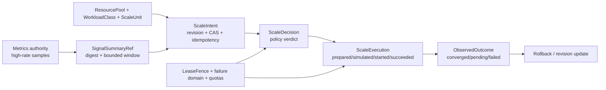

# Scaling Authority Contract (NE-164)

**Status:** accepted AU authority boundary; runtime actuation and cross-repository
wiring are follow-on work.

**Concept:** `AU-OS.scaling.reactive-replica-autoscaling`

## Decision

Autoscaling is governed by a typed, revisioned authority contract.  The
contract is implemented in
`agent_utilities.orchestration.scaling_authority` and is intentionally separate
from metric collection, graph persistence, and runtime actuation.  It gives
those layers one vocabulary and one set of fail-closed invariants:

- `ResourcePool` declares capacity, allocation, reserved headroom, quota,
  failure domain, and offline recovery policy.
- `WorkloadClass` binds a tenant/workload, cadence, concurrency, and quota to a
  resource pool.
- `ScaleUnit` declares the elastic unit's floor, ceiling, headroom, tenant
  quota, failure domain, maintenance window, rollback policy, dependencies, and
  controller mode.
- `SignalSummaryRef` is a digest-addressed, bounded pointer to an external
  metrics summary.  Raw samples, query expressions, and high-rate telemetry do
  not enter graph-facing records.
- `ScaleIntent` is a revision/CAS- and idempotency-bound desired change.
  `ScaleDecision`, `ScaleExecution`, and `ObservedOutcome` preserve the
  decision, actuation, and convergence evidence as one lifecycle chain.
- `LeaseFence` identity must remain unchanged over the lifecycle.  A stale
  revision or changed fence is rejected rather than merged optimistically.

The contract version is explicit (`schema_version: "1"`) and all records are
closed (`extra="forbid"`) and immutable after validation.  Additive evolution
requires a new contract version and compatibility fixtures.

## Four independent control cadences

The system must not collapse all scaling into one autoscaler tick:

| Cadence | Authority | Graph lifecycle records |
| --- | --- | --- |
| `engine_local` | In-process admission, write coalescing, and back-pressure | No |
| `shard_placement` | Placement, rebalancing, and shard movement | Yes |
| `service_replica` | Service replicas or a delegated HPA/KEDA controller | Yes |
| `agent_topology` | Bounded agent/team topology changes | Yes |

Only the latter three are graph-owned scaling lifecycles.  Engine-local
admission remains a low-latency implementation concern; it cannot create a
`ScaleIntent`.  High-rate measurements remain with the metrics/telemetry
authority.  The graph receives only a bounded summary reference and lifecycle
evidence, never one node or mutation per sample.

## Exactly one replica writer

Each `ScaleUnit` has exactly one registered controller with
`writes_replicas: true`.  A registration is either:

- `native`: the AU authority owns the desired replica field; no HPA/KEDA
  controller is declared; or
- `delegated`: the explicitly named `hpa` or `keda` controller owns the
  replica field and AU records intents, policy decisions, and observations.

Observation-only registrations are allowed, but they must declare the same
mode and delegated controller as the unit.  Two writers, or a native writer
and a delegated writer for the same unit, are rejected before actuation.  This
is the anti-oscillation boundary: a reconciler and an autoscaler cannot drive
independent desired states for one unit.

## Safety invariants

The authority rejects records that would violate any of these bounds:

- `min_replicas <= desired_replicas <= max_replicas`;
- unit and workload quotas cover their floors and do not exceed pool capacity
  after reserved headroom; `max_units` remains a hard replica/concurrency
  ceiling and `burst_units` is an explicitly bounded admission reserve;
- unit maximum plus unit headroom fits within pool capacity after pool
  headroom;
- references resolve to known pools, workloads, units, and failure domains;
- self-dependencies and indirect dependency cycles are absent;
- an offline failure domain with `hold` recovery cannot accept a new intent;
- maintenance windows use an explicit queue/deny policy;
- terminal execution states carry completion evidence; simulated execution
  never claims completed actuation; failures carry a bounded failure code;
- rollback operations carry their target replica count and outcomes retain
  rollback evidence.

The `ScaleIntent` validator is a policy/input gate, not an actuator.  The
runtime must re-check the authority revision, lease/fence, quota, hardware
headroom, maintenance policy, and controller ownership immediately before any
mutating operation.  Failure or loss of the authority lease fails closed;
offline `failover`/`shed` behavior requires a later placement/recovery policy
to produce a new revision rather than silently reusing stale intent state.

## Authenticated signal boundary (NE-165)

`orchestration.scaling_signal_authority` provides the bounded read seam used by
signal adapters.  It carries source identity, service/tenant/unit scope,
normalized signal kind, aggregation, sample and event timestamps, freshness,
confidence, and opaque evidence references.  The vocabulary is deliberately
finite: `cpu`, `ram`, `gpu`, `kv_cache`, `disk`, `network`, `token`, `request`,
`latency`, `queue`, and `shard`.

Every read is a digest-bound batch query with an explicit timeout, window,
page size, maximum item count, and snapshot cursor.  A deployment may tighten
the global caps but cannot loosen them.  Backend adapters must stream stable
pages; the authority stores only one bounded page and a bounded replay guard,
so a million-resource catalog is paginated rather than materialized.

The provider rejects non-finite or negative values, stale/future samples,
missing timestamps, scope changes, source/attestation mismatches, query
credential material, query-digest mismatches, malformed cursors, and replayed
or out-of-order source sequences.  Missing data returns an empty page and is
never converted to zero.  The default opaque-reference authenticator exists
for deterministic fixtures; deployments should inject a cryptographic source
verifier through the `SignalAuthenticator` seam.

High-rate samples remain in the metrics path.  `SignalPage.graph_projection()`
and `SignalSummary.graph_projection()` contain only bounded metadata.  Exact
query text is retained in `SignalDecisionEvidence` together with its digest,
snapshot, and window; graph-facing records receive summary evidence rather
than one mutation per sample.

## Follow-on boundaries

This AU slice supplies the common typed authority and deterministic contract
fixtures.  It does not change Kubernetes manifests, HPA/KEDA resources,
epistemic-graph production code, metric backends, or live fleet controllers.
Follow-on work must preserve the one-writer rule and the four cadence
separation while adding durable outbox/replay, signal authority, and runtime
actuation.  A dry-run or simulated execution must remain visibly simulated and
must not be reported as scaled.
