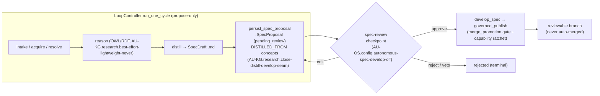
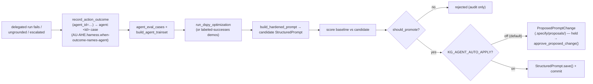

# The Self-Evolution Flywheel — transparent, steerable, governed

> The 24/7 propose-only Loop engine that mines the ecosystem corpus for improvements,
> distils them into reviewable specs, and develops the approved ones — made **legible
> mid-flight** (you can see what it is doing and why), **steerable** (you can reprioritize,
> pause, and veto), and **governed** (nothing lands without a human/Claude gate).
> Concepts: **AU-KG.research.evolutionstate-live-surface-per / AU-KG.research.saturation-gauge-aggregates-four / AU-KG.research.close-distill-develop-seam / AU-OS.config.autonomous-spec-develop-off** (flywheel transparency +
> review-veto) and **AHE-3.71 / AU-AHE.harness.when-outcome-names-agent / AU-AHE.harness.callers-feed-back-per** (the per-agent hardening loop),
> plus **AU-KG.retrieval.assimilated-from-mragent / AU-KG.memory.generation-scoped-selective-reward** (the memory substrate the loop reasons over).

This page is the operator-facing view of the flywheel. For the broader feedback-loop
architecture it sits inside, read
[Self-Improving Reasoning Substrate](self_improving_reasoning_substrate.md) (route →
reason → measure → learn) and [Failure-Driven Evolution](failure_driven_evolution.md)
(how production failures enter the loop as addressable gaps). This page does **not**
re-derive those; it documents the **transparency + steering + governance** layer that
was added on top, and the AHE-3.71/72/73 hardening cycle that makes "every exception you
resolve hardens the system" literally true.

---

## 1. The flywheel: distill → develop → evolve

The whole flywheel is **one** propose-only cycle driven by
`LoopController.run_one_cycle` in
`agent_utilities/knowledge_graph/research/loop_controller.py`. A single controller
advances **every** active `Loop` (research / develop / skill) through one hot path —
there is no separate goal-runner or research-runner. The research path composes the
existing primitives into one cycle that makes the KG self-improving **without
auto-merging anything**:

```
intake  → active Loops (research topics with no ADDRESSED_BY; AU-KG.research.these-properties-carry)
acquire → semantically related sources per topic (research/search)
resolve → ADDRESSES edges source→topic so the loop converges
reason  → OWL/RDF reasoning over the ecosystem, harvest extrapolations (AU-KG.research.best-effort-lightweight-never)
distill → SpecDraft markdown into .specify/specs/kg-distilled/ (gated)
synth   → a TeamSpec/AgentSpec proposal persisted to the KG
```

Every artifact a cycle emits is a **DRAFT / proposal** — spec markdown under
`.specify/` and KG proposal nodes. No code execution, no PR merge, no edits outside
`.specify/`. The cycle is exposed on-demand via `graph_loops` / `graph_orchestrate`
(and the REST twin) and runs continuously via a throttled daemon tick / the unified
scheduler's `self_evolution` schedule.

### The distill → develop seam that was broken (and the fix)

Historically the cycle's **distill** stage wrote SDD markdown into `.specify/` and
stopped there. The **develop / code** path (`change_publisher.governed_publish` →
AU-AHE.harness.promotion-governance-validator–3.24) consumes *promoted proposal nodes*, not those `.md` files — so the two
tracks were **disjoint**: a distilled spec was a dead-end file nothing could develop.

`LoopController._distill_specs` now closes that seam (CONCEPT:AU-KG.research.close-distill-develop-seam). After
`write_spec_drafts` writes the markdown, each draft is persisted as a first-class,
queryable `:SpecProposal` node via
`spec_proposals.persist_spec_proposal`, linked `DISTILLED_FROM` its source concepts so
the *why* is traversable. The spec is then fed — **only after approval** — into the
*existing* promotion pipeline as the proposal that pipeline already consumes (no new
code-gen path). On the execute side, `LoopController._advance_develop` detects a
spec-bound develop Loop (one carrying a `spec_id`) and routes it into
`spec_proposals.develop_spec` → `governed_publish`, where the `merge_promotion`
human-approval gate (OS-5.24) and the capability-ratchet regression gate (AU-AHE.evaluation.capability-benchmark-regression-ratchet)
stay on the path. So "distill specs → develop **those** specs" finally flows end to end,
governance intact.



---

## 2. Transparency: live EvolutionState + the saturation gauge

> "You cannot steer what you cannot see." The observation plane every steering action
> hangs off. Concepts: **AU-KG.research.evolutionstate-live-surface-per** (live state + per-stage beacon), **AU-KG.research.saturation-gauge-aggregates-four**
> (saturation gauge). Module:
> `agent_utilities/knowledge_graph/research/evolution_state.py`.

### The per-stage progress beacon (AU-KG.research.evolutionstate-live-surface-per)

The deployed loop used to persist an `EvolutionCycle` audit node **only at finalize** —
so until a cycle finished it was opaque, and an operator could not see "what is it
mining / distilling / developing right now, and why". `StageBeacon` fixes that. One
beacon is created per `run_one_cycle`, and `beacon.enter(stage)` is called at **every**
stage boundary (`_stage()` in `loop_controller.py` calls it before running each stage),
upserting a single mutable `:EvolutionBeacon` node (id `evolution:beacon`). So a
mid-cycle `graph_loops(action="state")` reports exactly which loop and stage is live,
what it is acting on, and *why* (the `focus_query` / the open gaps it is mining). Every
beacon write is best-effort — instrumentation never aborts the cycle. `read_beacon()`
reads that one node back (an O(1) read, not a scan).

### The aggregated read (AU-KG.research.evolutionstate-live-surface-per)

`read_evolution_state(engine)` is the operator's "make it transparent so I can steer"
surface. It folds into **one** legible read:

- **`beacon`** — the live stage + rationale (from `read_beacon`).
- **`velocity`** — the AU-AHE.sdd.recursive-improvement-instrumentation-aggregating `ImprovementVelocity` verdict (`improving` / `steady` /
  `stalling` / `idle`) from `improvement_ledger.improvement_velocity`: is the loop still
  improving, how fast, and is it emitting code or only prose?
- **`open_gaps`** — the recent per-cycle `open_gaps` trend (`_open_gaps_trend` reads the
  `EvolutionCycle` audit nodes' metadata).
- **`ingestion_coverage`** — the AU-OS.deployment.flagging-repos ingestion-coverage % (how much of our corpus is
  ingested) via `deployment.doctor._check_ingestion_coverage`.
- **`specs`** — the distilled-spec backlog counts + a pending sample
  (`spec_proposals.specs_summary`).
- **`saturation`** — the gauge below.
- **`steering`** — a built-in cheat-sheet of the exact tool calls to pause, reprioritize,
  review a spec, or acquire more corpus.

### The saturation gauge (AU-KG.research.saturation-gauge-aggregates-four)

`saturation_gauge(...)` folds the signals that **already exist** into **one 0..1
reading** of "how mined-out is the current corpus":

| Component | Weight | Meaning |
|---|---|---|
| `velocity` | 0.4 | AU-AHE.sdd.recursive-improvement-instrumentation-aggregating verdict: `stalling`→1.0, `steady`→0.5, `improving`/`idle`→0.0 |
| `coverage` | 0.3 | AU-OS.deployment.flagging-repos ingestion coverage fraction (unknown ⇒ neutral 0.5) |
| `gaps` | 0.3 | `open_gaps` trend: still shrinking fast ⇒ low; flat/rising ⇒ high |

`gauge = 0.4·velocity + 0.3·coverage + 0.3·gaps`. It is **saturated** when
`gauge ≥ SATURATION_THRESHOLD` (the module constant `0.66`). The gauge is computed every
cycle in `LoopController._finalize_metrics` (the hot-loop path skips the coverage probe
for speed) and on every `read_evolution_state` read.

Crucially, when the gauge is high **and** velocity is `stalling`, it sets
`request_more=True` and emits a queryable `:EvolutionSaturationSignal`
(`emit_saturation_signal`) carrying a recommendation — **but it never auto-fetches.**
Acquiring more research / cloning more codebases is left as a *steerable decision* for
Claude/the human (enable discovery, run background research, or add to the breadth
corpus). This is the deliberate boundary: the loop tells you it is mined out; **you**
decide to feed it.

### How it is surfaced (the "steerable" half)

Both surfaces dispatch into the same core (the *Two surfaces by default* contract):

- **MCP:** `graph_loops(action="state")` → `read_evolution_state`;
  `graph_loops(action="specs", status=…)` → the spec backlog;
  `graph_loops(action="review", spec_id=…, decision=…)` → the veto gate. Registered in
  `agent_utilities/mcp/tools/state_tools.py`.
- **REST:** the `/graph/loops` twin.

So the harness can query live `EvolutionState`, see the current stage and the saturation
reading, and steer — which is exactly what the AGENTS.md *"Evolving / managing the
ecosystem → review-veto"* directive asks of the orchestrator.

---

## 3. Governance: spec proposals + the review/veto gate (AU-KG.research.close-distill-develop-seam / AU-OS.config.autonomous-spec-develop-off)

> The propose-and-hold checkpoint that keeps a 24/7 auto-coder safe. Module:
> `agent_utilities/knowledge_graph/research/spec_proposals.py`.

A distilled `:SpecProposal` moves through a lifecycle, and **`pending_review` is the
default landing state** — review-first, not act-first:

```
pending_review ──approve──▶ approved ──develop──▶ developing ──▶ published
      │  ▲                                                  └──▶ reverted (ratchet regression)
      │  └──edit (merge changes, hold again)
      └──reject / veto ──▶ rejected (terminal)
```

`review_spec(engine, spec_id, decision, …)` is the explicit human/Claude decision point:

- **`approve`** → status `approved`, an `ActionDecision` audit is recorded under the
  `spec_promotion` ActionPolicy tier (`_audit_spec_decision`), and (by default) a
  `develop` Loop is **bound** to the spec (`_bind_develop_loop` submits
  `loop:develop:<spec_id>` and stamps `spec_id` on it) so it enters the develop pipeline
  and is visible + steerable in `graph_loops`.
- **`reject` / `veto`** → status `rejected` — the veto terminal; it never develops.
- **`edit`** → merge `edits` (title/problem/approach/value/target_file) and keep it in
  `pending_review` for another look.

The approved spec is shaped by `_spec_to_proposal` into exactly the dict the promotion
path already consumes, so an approved spec **is** a valid proposal — `develop_spec`
runs the existing `code_synthesis → change_synthesis → validate_in_sandbox →
change_publisher → capability_ratchet` path, which itself queues a **reviewable branch**
(never an auto-merge) behind the `merge_promotion` gate.

### Propose-and-hold is the default; auto-advance is opt-in

The 24/7 loop only auto-advances a spec when **two** things are deliberately relaxed:

1. **`KG_LOOP_AUTO_DEVELOP`** (`config.kg_loop_auto_develop`, default `False`) — when on,
   `_distill_specs` calls `auto_advance_specs` after persisting the drafts.
2. The **`spec_promotion` ActionPolicy tier** — which itself defaults to
   `approval_required` in `deploy/action-policy.default.yml`
   (`{kind: spec_promotion, target: "*", tier: approval_required}`).

`auto_advance_specs` consults the OS-5.24 ActionPolicy per pending spec; an *allowed*
verdict (an operator who relaxed that tier) approves + binds a develop Loop, otherwise
the spec stays `pending_review` and a human approval is queued. **Acquisition is never
auto-run; this only governs develop.** So a fresh spec sits in `pending_review` until a
human/Claude approves it — review-first by default, exactly as a 24/7 auto-coder needs.

---

## 4. The AHE-3.71/72/73 hardening loop — one exception → a durable hardening

> The mechanism that makes "every exception you resolve **hardens** the system" real,
> end-to-end for **one** agent. Modules:
> `agent_utilities/harness/evolve_agent.py`,
> `agent_utilities/harness/dspy_optimization.py`,
> `agent_utilities/knowledge_graph/adaptation/feedback.py`. Concepts: AHE-3.71 (gated
> apply + audit), AU-AHE.harness.when-outcome-names-agent (per-agent attribution), AU-AHE.harness.callers-feed-back-per (the orchestrator).

This converts the previously dormant/stubbed metric→optimize→harden substrate into one
real, gated **metric → DSPy-optimize → hardened-prompt** cycle for a single agent's
system prompt. It reuses the existing DSPy / `StructuredPrompt` / reward machinery — no
new optimizer.

### AU-AHE.harness.when-outcome-names-agent — per-agent attribution

When a delegated run produces an outcome, `FeedbackService.record_action_outcome(…,
agent_id=…)` tags the resulting eval case `agent:<id>` (see
`adaptation/feedback.py`). Then:

- `FeedbackService.agent_eval_cases(agent_id)` returns the eval-corpus slice attributed
  to that agent — its **measured executions** (expected vs the goal that was reached),
  which double as the training signal and the held-out scoring slice for its prompt.
- `FeedbackService.build_agent_trainset(agent_id)` turns those into
  `dspy.Example(context, task) → response` rows (degrading to plain dicts when DSPy is
  not importable, so it works offline).

So an agent's *own real outcomes* — including the ones that failed — become the corpus
that steers its prompt optimization. Attribution is by **agent**, not just by trace
signature.

### AU-AHE.harness.callers-feed-back-per — `harden_agent_prompt`, the orchestrator

`EvolveAgent.harden_agent_prompt(agent_id, prompt_path, …)` runs ONE closed cycle:

1. **Attribute** — pool the agent's `action_outcome` cases into a per-agent trainset +
   eval slice (AU-AHE.harness.when-outcome-names-agent).
2. **Optimize** — `run_dspy_optimization` on the `system_prompt` target with that
   trainset; **degrade gracefully** to the labeled successes as demos when no LM is
   reachable to compile, so the cycle still hardens the prompt offline.
3. **Build** — fold the optimized demos into a candidate `StructuredPrompt`
   (`build_hardened_prompt`).
4. **Evaluate** — `score_prompt_against_corpus` scores baseline vs candidate against the
   agent's eval slice.
5. **Decide + apply** — `should_promote(baseline, candidate, min_delta)`, then a **gated**
   apply.

It returns a `PromptHardeningOutcome` (`status` = `applied` | `proposed` | `rejected` |
`no_data`) — always with an audit trail.

### AHE-3.71 — the gated apply + the audit/approve surface

`EvolveAgent.apply_edits` is no longer a stub. For a `system_prompt` edit carrying a
DSPy-hardened candidate body it calls `_apply_prompt_edit`, which writes the candidate to
its `StructuredPrompt` file via `.save()` and commits it — but **only** when *both* hold:

- the candidate **beat baseline** (`edit.metadata["promote"]`), **and**
- the **`KG_AGENT_AUTO_APPLY`** gate is on (`config.kg_agent_auto_apply`, default `False`
  / **shadow**).

Off-gate (the default) the cycle is **propose-only**: a queryable, git-diffable
`ProposedPromptChange` audit record is written under `.specify/proposals/<id>.json`
(plus a best-effort KG node) carrying the before/after metric, the decision, and the
held/rejected candidate — and the **live prompt is left untouched**. A prompt rewrite is
high-impact, so it is never silent. `EvolveAgent.approve_proposed_change(proposal_id)` is
the steerable human/Claude apply path: a winning prompt can go live **by review** instead
of by flipping the global flag.



This is the loop AGENTS.md points at: when you resolve an exception, the fix (a hardened
prompt — and, by the same spine, a fixed tool binding or a new skill) becomes a durable
hardening of the system so it self-handles that case next time.

---

## 5. The memory substrate the loop reasons over (AU-KG.retrieval.assimilated-from-mragent / AU-KG.memory.generation-scoped-selective-reward)

The flywheel's reasoning quality depends on what it can recall and how trustworthy that
recall is. Two assimilated primitives harden that substrate. (Note the renumbering:
**AU-KG.retrieval.assimilated-from-mragent is MRAgent active reconstruction**; the selective-erasure primitive was
originally tagged 2.275 and **renumbered to AU-KG.memory.generation-scoped-selective-reward** to avoid the collision — both IDs
are confirmed against the code below.)

### AU-KG.retrieval.assimilated-from-mragent — MRAgent active Cue-Tag-Content reconstruction

Module: `agent_utilities/knowledge_graph/retrieval/active_reconstruction.py` (assimilated
from MRAgent, arXiv:2606.06036). Instead of one-shot top-k retrieval, `reconstruct()`
walks a **Cue → Tag → Content** graph in an evidence-conditioned loop:

1. **Cue → Tag** — activate candidate associative *tags* (relation types) on the current
   cue frontier and keep only the `tag_top_k` most query-relevant (pruning the
   combinatorial neighbour blow-up a fixed n-hop expansion would incur).
2. **(Cue, Tag) → Content** — expand content **only** along the selected tags, dropping
   neighbours below `relevance_floor`.
3. **Content → Cue** — the best fresh content (`content_top_k`) becomes the next cue
   frontier (reverse traversal),

so the walk progressively reconstructs a query-relevant subgraph and self-terminates
(reusing the shared `IterativeStopper`, AU-KG.retrieval.adaptive-stopping-iterative-retrieval) once fresh evidence stops arriving. It is
**dependency-injected** (callers supply `neighbor_fn` and `score_fn`) with a
dependency-free lexical default (`lexical_relevance` — no torch) and engine-backed
adapters (`engine_neighbor_fn`, `resolve_seeds`). It is wired into the live path: the
`entity_context` `"why"` intent natively runs reconstruction (and falls back to the census
on no seed, so zero regression) — reachable via `graph_analyze action=explain
target='entity:why'` and its REST twin. The ontology gains `:ReconstructionTrajectory`
(the analog of MRAgent's reconstructed memory state).

### AU-KG.memory.generation-scoped-selective-reward — generation-scoped selective reward erasure

Module: `agent_utilities/knowledge_graph/retrieval/capability_index.py` (assimilated from
the Red Queen Gödel Machine, arXiv:2606.26294). The memory-maintenance quadrant forgot
learned reward only by **age** (`decay_rewards`, KG-2.4) or idle/max-age reapers — never
by **provenance**. So when an entity's *generation* changed (a capability redeployed, a
document re-ingested with materially new content, a model/embedding regime swapped), the
in-place `CapabilityIndex.add()` upsert replaced the vector but **kept the stale reward
EMA** — `designate()` kept ranking on evidence scored under a representation that no
longer existed. This is a non-stationary utility carried across a regime change.

Two surfaces fix it:

- **Native, default-on** on the live ingestion upsert path: `CapabilityIndex.add()`
  auto-erases an id's stale reward when a re-embed's cosine **distance** exceeds
  `_REWARD_REGEN_DISTANCE` (the module constant `0.25` — one correct value, not a flag;
  bge-m3 minor-edit re-embeds stay well above 0.75 similarity, a material rewrite drops
  below). Content-stable re-adds **keep** their reward.
- **Explicit, provenance-scoped**: `CapabilityIndex.selective_erase_rewards(ids)` erases
  exactly the records whose source/evaluator/impl was superseded (order-independent),
  preserving every reward not in `ids`, plus a `reward_erasures` observability counter.
  Surfaced over `graph_feedback` (MCP) and `POST /graph/feedback` (REST) via
  `FeedbackService.record_correction(correction_type="selective_erasure")`.

The effect: the router **re-climbs** under the new regime from the neutral prior instead
of being anchored by stale (possibly reward-hacked) utility forever. Unlike uniform time
decay, this is targeted by *provenance*, not by *age*.

---

## 6. Config knobs

All evolution behavior follows *Configuration discipline* (a flag is a last resort).
The few that exist:

| Setting (env alias) | Default | Effect |
|---|---|---|
| `KG_LOOP_DISTILL` (`config.kg_loop_distill`) | off | enable the distill stage (writes `:SpecProposal` drafts) |
| `KG_LOOP_BREADTH` (`config.kg_loop_breadth`) | — | ingest the OSS/repos/docs breadth corpus each cycle (idempotent) |
| `KG_LOOP_STANDARDIZE` (`config.kg_loop_standardize`) | — | enterprise standardization pass (needs a harvested estate) |
| `KG_LOOP_DISCOVER` (`config.kg_loop_discover`) | off | opt-in research discovery/intake (external calls) |
| **`KG_LOOP_AUTO_DEVELOP`** (`config.kg_loop_auto_develop`) | **`False`** | let the 24/7 loop auto-advance approved specs through the `spec_promotion` gate (review-first otherwise) |
| **`KG_AGENT_AUTO_APPLY`** (`config.kg_agent_auto_apply`) | **`False`** (shadow) | let a hardened prompt that beat baseline be written live; off ⇒ propose-only |
| `spec_promotion` ActionPolicy tier | `approval_required` | the governance tier on spec→develop promotion (`deploy/action-policy.default.yml`) |

Non-flag tunables (module constants, intentionally **not** env vars):

- `SATURATION_THRESHOLD = 0.66` (`evolution_state.py`) — the saturation cutoff.
- `_REWARD_REGEN_DISTANCE = 0.25` (`capability_index.py`) — the re-embed distance that
  counts as a new generation and erases the stale reward.

---

## 7. Operating the flywheel

**Watch it.** Query live state — current stage + why, saturation, gaps trend, velocity,
spec backlog:

```text
graph_loops action=state          # → read_evolution_state
graph_loops action=specs status=pending_review
graph_schedules action=list       # the self_evolution schedule + run state
```

When `state.saturation.request_more` is true, the corpus looks mined out — **you** decide
to acquire more (enable `KG_LOOP_DISCOVER`, run `graph_research action=background_research`,
or clone more codebases into the breadth corpus). The loop will not auto-fetch.

**Review / veto specs** (the governance gate):

```text
graph_loops action=review spec_id=<id> decision=approve   # binds a develop Loop
graph_loops action=review spec_id=<id> decision=reject    # veto (terminal)
graph_loops action=review spec_id=<id> decision=edit       # merge edits, hold again
```

Approved specs develop through `governed_publish`, which queues a **reviewable branch**
behind the `merge_promotion` gate and the capability ratchet — never an auto-merge.

**Steer the loop itself:**

```text
graph_loops action=prioritize loop_id=<id> priority=high
graph_schedules action=disable name=<evolution schedule>   # pause
```

**Close the hardening loop.** After resolving a delegated-run exception, harden the
agent that failed: run `EvolveAgent.harden_agent_prompt(agent_id, prompt_path)`. By
default the winning candidate is **held** as a `ProposedPromptChange` under
`.specify/proposals/` — review the before/after metric and approve it with
`approve_proposed_change(proposal_id)` (or set `KG_AGENT_AUTO_APPLY` to let beats-baseline
candidates land automatically). Either way an audit record and the manifest are written,
so the hardening is never silent — and the next run self-handles the case you just fixed.
