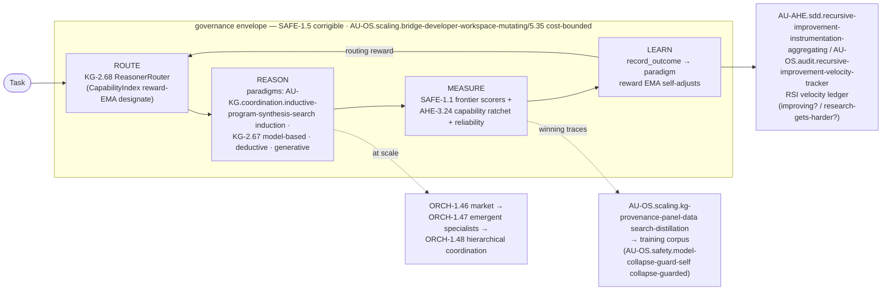
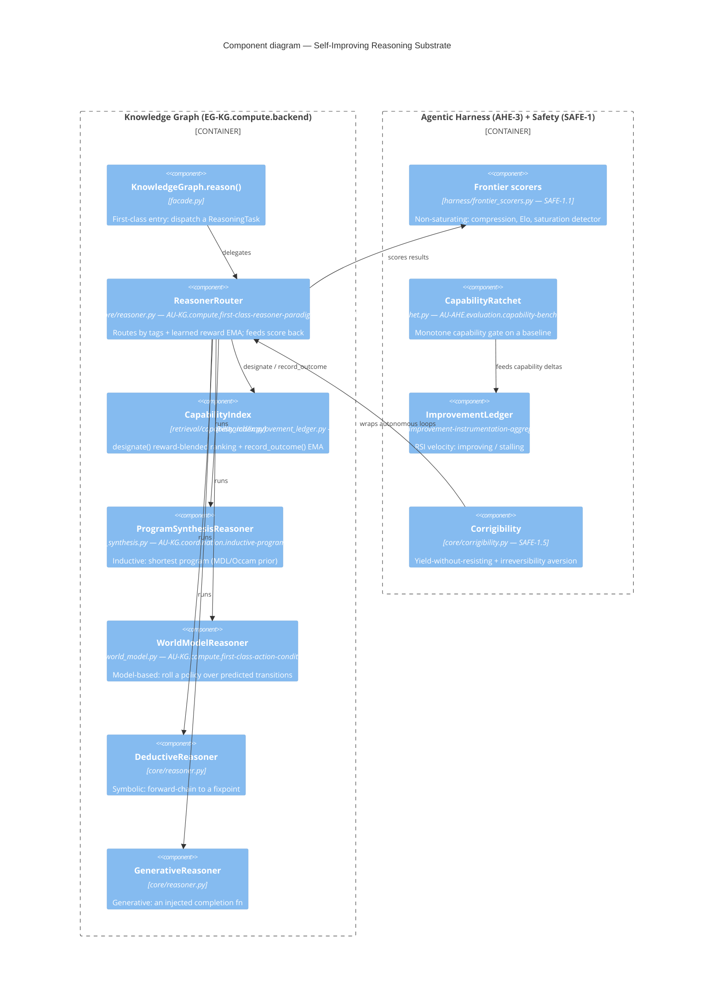
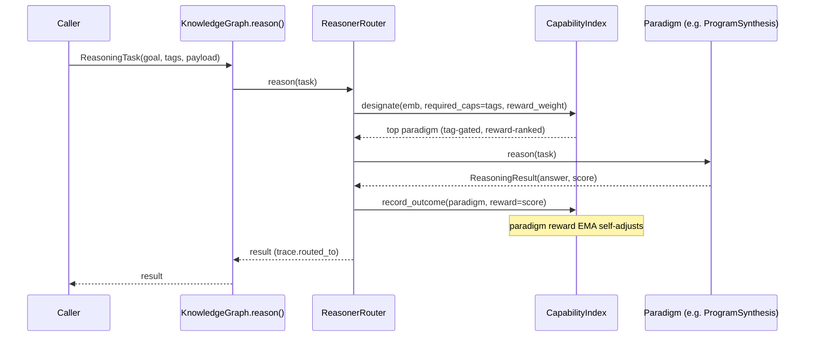

# Self-Improving Reasoning Substrate

> The unified loop that ties the AGI→ASI work (arXiv:2606.12683 gap analysis) into one
> native system: **route → reason → measure → learn**, wrapped in corrigible,
> cost-bounded, capability-ratcheted governance, and — at scale — a market of
> specialist reasoner-agents whose winning traces distil back into training data.

This document is the architecture view of the concepts implemented from the
"From AGI to ASI" gap analysis (`reports/agi-to-asi-gap-analysis-2026-06-13.md`). The
insight: these are not independent features — they compose into a single feedback loop
where **the system improves how it thinks, measures whether it improved, and bounds the
cost and the risk of doing so.**

## The core loop

The loop is **closed**: a paradigm's measured score becomes its routing reward, so the
router learns which way of thinking works for which task class — the paper's
*recursive-improvement* pathway applied to reasoning itself.

## Why this is robust, not a switch

A naive paradigm selector is an `if task_is_logic: use_owl`. That cannot improve and
encodes a guess. Instead the router **reuses the proven reward-aware retrieval substrate**
(`CapabilityIndex.designate`, which already ranks candidates by similarity blended with a
learned reward EMA, and `record_outcome`, which updates it). Registering each paradigm as
a capability entity makes paradigm selection a *learned* designation — identical machinery
to how the platform already routes tools/agents, so it inherits the same calibration,
auditability, and tag-gating. The seam is at the **routing** layer, so the structurally
different engines (a generative LLM, an inductive synthesizer, a model-based planner, a
deductive chainer) never have to be forced under one implementation.

## C4 — Level 3: Reasoning Substrate components

## C4 — Dynamic: one routed reasoning step

## Concept → role map

| Concept | Module | Role in the loop |
|---|---|---|
| **AU-KG.compute.first-class-reasoner-paradigm** | `core/reasoner.py` | **ROUTE** — learning paradigm router (keystone) |
| **AU-KG.coordination.inductive-program-synthesis-search** | `harness/program_synthesis.py` | REASON — inductive paradigm + MDL/Occam selection prior |
| **AU-KG.compute.first-class-action-conditioned** | `core/world_model.py` | REASON — model-based planning paradigm |
| **SAFE-1.1** | `harness/frontier_scorers.py` | MEASURE — non-saturating progress signals |
| **AU-AHE.evaluation.capability-benchmark-regression-ratchet** | `research/capability_ratchet.py` | MEASURE — monotone capability gate (+ AHE-3.22/3.23 generate/verify) |
| **AU-AHE.sdd.recursive-improvement-instrumentation-aggregating / AU-OS.audit.recursive-improvement-velocity-tracker** | `research/improvement_ledger.py` | LEARN — RSI velocity / research-gets-harder signal |
| **AU-OS.scaling.bridge-developer-workspace-mutating / OS-5.35** | `orchestration/cost_governor.py` | ENVELOPE — cost/throughput bound on compute & scaling |
| **SAFE-1.5** | `core/corrigibility.py` | ENVELOPE — corrigible, irreversibility-averse autonomy |
| **AU-OS.scaling.kg-provenance-panel-data / AU-OS.safety.model-collapse-guard-self** | (search-distillation) | DISTIL — winning traces → guarded training corpus |
| **ORCH-1.46/47/48** | (multi-agent) | SCALE — market → emergent specialists → hierarchical coordination |

## Engineering around the weaknesses

The paper's recurring thesis — *for every friction, you need a countermeasure or a way to
measure whether it binds* — is the design rule here:

- **Paradigms don't unify** → unify at the routing layer, not the implementation.
- **Can't tell capability from metric saturation** → non-saturating frontier scorers (SAFE-1.1).
- **Self-improvement may degenerate / saturate** → capability ratchet (AU-AHE.evaluation.capability-benchmark-regression-ratchet) + RSI velocity
  ledger (AU-AHE.sdd.recursive-improvement-instrumentation-aggregating) that flags a non-positive derivative.
- **Autonomy is brittle as the human leaves the loop** → corrigibility + irreversibility
  aversion (SAFE-1.5) as objective-level, not just permission-level, safety.
- **The data wall** → distil the loop's own verified winning traces back into training data
  (AU-OS.scaling.kg-provenance-panel-data), guarded against model collapse (AU-OS.safety.model-collapse-guard-self).

## Status

Implemented + merged (local `main`): AU-KG.compute.first-class-action-conditioned, AU-KG.compute.first-class-reasoner-paradigm, AU-KG.coordination.inductive-program-synthesis-search, SAFE-1.1, AU-OS.audit.recursive-improvement-velocity-tracker, SAFE-1.5,
AHE-3.22, AHE-3.23, AU-AHE.evaluation.capability-benchmark-regression-ratchet, AU-AHE.sdd.recursive-improvement-instrumentation-aggregating, OS-5.35. The DISTIL and SCALE stages (AU-OS.scaling.kg-provenance-panel-data/AHE-3.25,
ORCH-1.46/47/48, AU-OS.safety.model-collapse-guard-self) extend the same loop and are tracked in the gap-analysis report.
