# Skills-over-MCP: One Ranked Capability Space (CONCEPT:AU-KG.retrieval.unified-capability-contract)

Before this program, skills and MCP tools were two separate universes: `find`
/`find_tools` ranked fleet **tools**; skills were discovered through a
filesystem/entry-point registry (`core/providers.py`) and executed in-loop by
`pydantic-ai-skills` (`SkillsToolset`). A caller resolving "what can do this
task" had to know in advance which universe held the answer, and delegation
(`graph_orchestrate`) exposed that split directly as two argument shapes
(`skill_name` vs `tool_server`+`allowed_tools`).

This program unifies them into **one ranked capability space** — a skill and a
tool are two implementations of one `Capability` contract, not two branches in
an if-statement — while keeping au's canonical graph resource model
independent of the upstream wire draft (MCP SEP-2640, "In Review").

## Runtime shape

```mermaid
flowchart LR
    subgraph Server["au-built MCP server (server_factory.create_mcp_server)"]
        SkillDirs["resolve_skill_provider_dirs()\n(core/providers.py)"] --> SkillProvider["SkillProvider\n(fastmcp>=4 — INERT today)"]
        SkillProvider -->|"skill://{name}/SKILL.md\nskill://{name}/_manifest"| Resources[MCP Resources]
    end

    Resources -->|"list_resources() —\nreadable by an mcp/fastmcp-3 client too"| Probe["MCPMultiplexer.probe_server\n(_probe_skills, _bounded_skill_catalog)"]
    Probe --> WriteNodes["_write_fleet_nodes\n(source_sync.py)"]
    WriteNodes -->|":Skill kind=mcp_skill\n:Tool kind=mcp_tool\nboth SERVES from :MCPServer"| KG[(Knowledge Graph)]

    KG --> Resolve["Orchestrator.resolve_capability\n(capability_kind_from_node)"]
    Probe --> Discover["MCPMultiplexer.discover_tools\n(find_tools)"]
    Discover --> Find["intent_tools._find_capability\n(find)"]

    Resolve --> Bind["Capability.to_binding()"]
    Find --> Bind
    Bind --> Orchestrate["graph_orchestrate /\nOrchestrator.execute_capability"]
```

## A — Server side: expose au's skills over MCP

`server_factory._register_skill_providers` (called at the end of
`create_mcp_server`) wires FastMCP-4's `SkillProvider` onto every directory
`core/providers.resolve_skill_provider_dirs()` already resolves — the SAME
discovery `pydantic-ai-skills`/`agent-utilities install` use, so a skill has
one discovery path with two projections (in-loop execution vs wire
distribution), never a second registry to keep in sync.

Degradation is explicit and observable, never a crash: a single bad provider
directory logs a `WARNING` and is skipped — it does not sink the others.

> **The server-side half is LIVE.** The `[mcp]` extra floors on
> `fastmcp>=4.0.0b1` (fastmcp 4 is the ecosystem default — see
> [`fastmcp4-default.md`](fastmcp4-default.md)), so `SkillProvider` /
> `add_provider` are always present and `_register_skill_providers` registers on
> every server it builds. The `hasattr(mcp, "add_provider")` gate that made this
> permanently inert under the old fastmcp-3 default (D-W15-7/D-W15-8 in
> `reports/deferred/waves1-5-gate.md`) is deleted along with that default. The
> live proof is `tests/integration/mcp/test_skill_provider_live_path.py`, which
> builds a real server through `create_mcp_server` and reads
> `skill://{name}/SKILL.md` back off it — the isolation tests in
> `tests/unit/mcp/test_skill_provider_wiring.py` use a `MagicMock` server and a
> fake `SkillProvider`, so they alone could not tell a live path from a dead one.

This is why the strategy works at all: a fastmcp-3 (or plain `mcp`) client can
already read a fastmcp-4 server's `skill://` resources — so upgrading
every au client is not a precondition for serving skills over the wire.

## B — Client side: ingest `skill://` resources into the KG

`MCPMultiplexer.probe_server` (`agent_utilities/mcp/multiplexer.py`) now
enumerates a probed server's Resources alongside its Tools:
`_probe_skills` calls `session.list_resources()` and `_bounded_skill_catalog`
extracts the `skill://{name}/SKILL.md` subset (bounded the same way the tool
catalog is bounded — a hostile/misbehaving child cannot force an unbounded
catalog into the KG). Both are best-effort: a server with no
`resources/list` support, or a malformed resource catalog, degrades to
`skills: []` without failing the tool probe that already succeeded.

`source_sync._write_fleet_nodes` writes each entry as a `:Skill` node
(`kind="mcp_skill"`, mirroring `:Tool`'s `kind="mcp_tool"`), linked to its
`:MCPServer` via the same `SERVES` edge Tool nodes use, batched into the SAME
`_ingest_graph_slice_via_envelope` call — so the existing whole-slice
content-hash idempotency (unchanged on re-probe → no-op) covers skills for
free; no second idempotency mechanism was introduced.

**Identity is deliberately namespaced away from the in-loop skill.** A
fleet-probed skill's node id is `skill_{server}_{name}` (parallel to
`tool_{server}_{name}`), NOT the canonical `skill:<slug>` id
`ingest_runnable_skill` (`knowledge_graph/ingestion/skill_workflow_ingest.py`)
writes for a richer, body-bearing in-loop skill. The engine's native typed
mutation path can replace a node's full property set on write, so reusing the
same id for a thin fleet-probe entity risked silently wiping a richer
`body`/`instruction` on the next re-sync. The fleet node still carries
`source_ref = skill_reference(name)` (the same `skill://<slug>` reference
scheme), so ranking/binding recognizes both as the same capability *kind*
without merging their identities.

**Tenancy:** this path carries no tenant/session stamp of its own — it flows
through the exact same `"fleet"` connector and `ingest_graph_slice` boundary
`:Tool`/`:MCPServer` nodes already use, so an ingested skill is visible to
whatever tenants the existing fleet-connector ACL/manifest already grants
`:Tool` visibility to. RLS is untouched, not bypassed.

## C — One ranked capability space + unified binding

`agent_utilities/core/capability_contract.py` (dependency-free — no KG/engine
imports, so both the fleet multiplexer and the orchestration layer can share
it without a new cross-layer dependency) defines:

- `Capability` — `kind` (`tool`/`skill`/`workflow`/`agent`), `id`, `name`,
  `description`, `score`, `server`, `source`, plus `to_binding()`: the exact
  `graph_orchestrate`/`execute_agent` keyword arguments
  (`skill_name`/`tool_server`/`allowed_tools`/`agent_name`) that already
  existed, computed once, not branched on at every call site.
- `capability_kind_from_node(node_type, resource_type, node_id)` — table-driven
  classification, shared by every ranking surface. Adding a new
  capability-bearing node type is one new predicate here, not a growing
  if/elif spread across `resolve_capability`/`find`/`find_tools`.

**Ranking.** `MCPMultiplexer.discover_tools` (`find_tools`) scores
`skill://`-derived entries with the SAME token-overlap + semantic backbone as
tools and merges both into one `results` list, each item carrying `kind` and a
ready-to-spread `bind` dict. `intent_tools._find_capability` (`find`) inherits
that unification through its existing `fleet_results` field — no separate
merge logic was needed there. `Orchestrator.resolve_capability`'s
`_search_hit_kind` now also classifies a bare `:Tool` hybrid-search hit
(previously silently dropped), carrying its owning `server` forward.

**Binding.** `Orchestrator.execute_capability` computes one binding regardless
of resolved kind: a `workflow` still dispatches through `execute_workflow`
(a genuinely different execution engine, not a naming difference); every other
kind — including a bare `tool` resolution with no caller-supplied
`skill_name`/`agent_name` — falls through to ONE `execute_agent` call, with
the tool case pre-computing `agent_name=<default expert>`,
`tool_server`/`allowed_tools` via `Capability.to_binding()` first. A caller
holding a ranked `find`/`find_tools` result never branches on `kind` before
delegating — it spreads `result["bind"]` into `graph_orchestrate` and it runs.

## Why not "reasonable per-kind branches"

The obvious alternative — an `if kind == "tool": ... elif kind == "skill":
...` at each of `resolve_capability`, `find`, `find_tools`, and
`graph_orchestrate` — is exactly the sprawl this design avoids. Each of those
four call sites now calls the SAME two functions
(`capability_kind_from_node`, `Capability.to_binding`) instead of
re-deriving the classification/binding rule locally; a fifth capability kind
(should one ever appear) is one new predicate + one new `to_binding()`
branch in `capability_contract.py`, not four.
