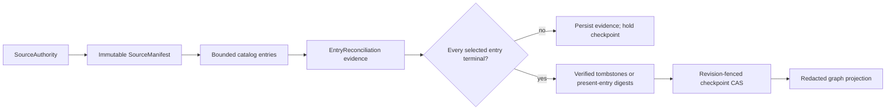

# Source authority and evidence-gated checkpoints

`agent_utilities.control_plane.sources` is the typed boundary between a source
adapter and the governed ingestion path. It records source identity, immutable
catalog entries, immutable manifests, per-entry evidence, and one CAS-managed
checkpoint per tenant-scoped authority. It never reads a filesystem, follows a
symlink, stores source bytes, or chooses a connector transport.

## Reconciliation flow

## Identity and immutability

An authority ID is derived from tenant, publisher, package, and source name.
Authority revisions are digest-bound into each manifest so a stale catalog
cannot be reconciled against a changed source definition. An entry ID is
derived from the authority and a validated repository-relative
POSIX path. Absolute paths, drive prefixes, `..`/`.`/empty segments, backslash
aliases, control characters, dirty manifests/entries, and symlinks are rejected. Authority
records, catalog entry versions, manifests, and reconciliation evidence carry
content digests and are frozen protocol models; repository adapters must retain
them idempotently instead of replacing history.

No model accepts raw bytes, payload bodies, inline errors, credentials, or URLs.
Artifacts and evidence are opaque controlled references plus SHA-256 digests.

## Checkpoint safety

Only a complete manifest can be reconciled. A partial, failed, or timed-out
manifest is never a successful empty snapshot. Each selected entry must have an
evidence reference and an explicit outcome. `failed`, `partial`, and `timeout`
outcomes are intentionally non-terminal, so they are retained for retry but
cannot advance a checkpoint. A tombstone requires the prior catalog digest,
matching path, and an explicit verified-absence evidence marker. An empty
manifest requires its own verified-empty evidence reference and digest.

Checkpoint changes supply the expected revision and prior checkpoint ID and are
applied only by repository CAS; an older manifest cannot move the watermark
backward. Reconciliation IDs and result digests are
deterministic, allowing a restarted worker to replay the same evidence without
creating a second checkpoint. A scope mismatch, digest drift, duplicate
identity, stale CAS, or repository contract violation fails closed.

Graph projections contain only bounded counts, statuses, IDs, and digests. Paths
are redacted to a stable digest in any per-entry projection; source bytes and
probe error bodies never enter the graph projection.
