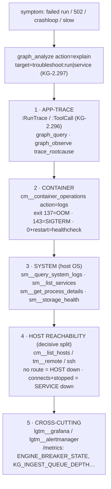

# Cross-layer deployment troubleshooting — the `troubleshoot` context provider

> CONCEPT:KG-2.297 (deployment-troubleshooting expertise — cross-layer diagnose
> provider + expert prompt). Builds on the universal context plane (KG-2.136), the
> `:RunTrace` / `:ToolCall` provenance (KG-2.296), and the ops diagnosis provider
> (KG-2.137).
> A per-layer diagnose playbook, surfaced as a **`troubleshoot` context provider** in the
> universal context plane: when a delegated run fails or a deployment misbehaves, the
> system **self-diagnoses across every layer — app trace → container → system →
> host reachability → cross-cutting** — *before* escalating to the human.

## What it is

`troubleshoot` is a **context-plane provider** (the same plane that serves
`code_context` / `ops`). It answers *"this agent run failed / this service is
unreachable / this container keeps crashing — what happened and how do I trace it?"* by

1. pulling whatever the KG already knows about the symptom — the run's `:RunTrace` +
   `:ToolCall` provenance (KG-2.296), or, when no run id is given, the recent **errored
   runs** to triage from — and
2. emitting the **layered troubleshooting playbook**: the exact existing tool to reach for
   at every layer of the stack.

It is deliberately **anti-sprawl**: it builds *no new log store*. It composes the KG
reads it can do itself with a precise map onto the **existing fleet tools** —
`cm__*` (container-manager), `sm__*` (systems-manager), `tm__*` (tunnel-manager), the
`lgtm__*` Grafana surface, and `graph_observe` — so the operator/agent runs the right next
call instead of guessing. All KG reads are best-effort Cypher (`read_rows` never raises),
so a degraded backend still yields the playbook even when the trace can't be fetched.

The implementation is `agent_utilities/knowledge_graph/retrieval/troubleshoot_context.py`
(`diagnose_symptom`), with the playbook table `_PLAYBOOK` as its load-bearing knowledge.

## Why

This is the **"resolve exceptions"** half of the operating model
([`delegation-first-operating-model.md`](delegation-first-operating-model.md)) turned into
a first-class capability. When a delegated run goes wrong, the worst outcome is a guess
("probably the model is down") that stops at the first layer. The platform runs on a real
homelab/cluster — graph-os (front + host), the redb-authoritative engine, the `*-mcp`
fleet behind the multiplexer, Postgres/pg-age mirrors, Vault/Keycloak/ingress — and a
symptom seen at one layer (a `502`, an `exit 137`) usually has its **root cause one or two
layers down**. The provider encodes the discipline of **tracing every layer until the
failure is grounded**, and the decisive **host-down vs service-down** split, so the system
self-diagnoses before escalating.

## How it works

### Registration into the context plane (zero dispatch edits)

`context_plane.py` registers the provider in two tables, so it is reachable with **no new
MCP action and no dispatch code**:

- `_BUILTIN_PROVIDERS["troubleshoot"] = (".troubleshoot_context", "diagnose_symptom")`
  — the plane lazily imports and calls it.
- `_DOMAIN_HINTS["troubleshoot"]` — symptom keywords (`error`, `crash`, `crashloop`,
  `unreachable`, `502`, `exit 137`, `oom`, `traceback`, `session terminated`, `no route`,
  `runtrace`, `toolcall`, `diagnose`, …) so `infer_domain()` routes a bare symptom query
  here automatically.

### Reached over graph-os (the explain action) + its REST twin

It is the universal `explain` action of `graph_analyze` (the same one that serves
`code`/`ops`). `graph_analyze action=explain` parses `target` as `domain:intent`:

```text
graph_analyze action=explain target="troubleshoot:run"     node_id="<run_id>" query="<symptom>"
graph_analyze action=explain target="troubleshoot:service" query="<host>.arpa returns 502"
```

`synthesize_context` (`context_plane.py`) routes `domain=troubleshoot` to
`diagnose_symptom`, passing `query`, `intent`, `node_id`, `top_k`. The REST twin is the
context-plane endpoint (`graph_analyze`'s `/graph/analyze` action route) — two surfaces,
one core, per the platform contract.

### What `diagnose_symptom` inspects and composes

- **Intents** (bias the synthesis, but the full ladder is always returned):
  `run` (a failed agent/delegation — the default), `service` (an endpoint is unreachable —
  host-vs-service), `health` (general posture). An out-of-range intent is inferred from
  the symptom text.
- **App-trace pull** — if a `node_id` is supplied (normalized to `trace:<run_id>`), it
  reads the `:RunTrace` row and its `(:RunTrace)-[:MADE_TOOL_CALL]->(:ToolCall)` chain
  (`tool_name`, `status`, `error`, `sequence`) — the same provenance the execution seam
  writes. The first **failing** `:ToolCall` is surfaced in the synthesized headline.
- **Triage list** — with no `node_id`, it surfaces recent `:RunTrace` rows with
  `status IN ['failed','error']` to start from.
- **Layer ranking** — `_classify` scores the symptom text against `_LAYER_HINTS` and
  orders the five layers by relevance (intent seeds the lead layer when the text is
  ambiguous), then always appends the rest so the **full ladder** is present.
- **Synthesis** — `_synthesize` writes the headline (the run's status + first failing
  tool, or the recent errored runs, or "diagnosing from the symptom text"), the decisive
  host-vs-service reminder when reachability leads, and the per-layer trace order; the
  full per-layer tool map is returned in `sections.playbook`. The result carries a
  `capability_id` (`troubleshoot:<intent>:<lead-layer>`) so it feeds the action-outcome
  loop like any other context answer.

## The layered playbook — triage order, healthy vs unhealthy signal

The provider always emits the whole ladder; the lead layer is biased by the symptom. Each
layer maps a question to the **exact existing tool** (no new logging):



| Layer | Question | Healthy signal | Unhealthy signal & next move |
|---|---|---|---|
| **1 · App / agent-run** | What did the delegated run actually do, and where did it fail? | `:RunTrace status=ok`; every `:ToolCall status=ok` | a failing `:ToolCall` — its `tool_name` + `args` + `error` are usually the root. `graph_query` the chain, or `graph_observe action=trace_rootcause` for the Trace/Span/Generation subgraph (OS-5.68); live queue/lane health via `graph_analyze action=explain target="ops:health"` (KG-2.137). |
| **2 · Container / service** | Is the container crashing, and why (exit code)? | running, healthcheck passing | `cm__container_operations action=logs host=<alias>` (Docker-over-SSH). **Exit 137 = OOM-killed, 143 = SIGTERM, 0-but-restarting = healthcheck failing.** On swarm: `docker service ps <svc> --no-trunc` + `docker service logs <svc>`. |
| **3 · System / host OS** | Is the host OS the cause (OOM-killer, disk full, failed unit)? | units active, disk healthy, no OOM in dmesg | `sm__query_system_logs` (journald by unit/priority), `sm__list_services` (a failed unit), `sm__get_process_details` (a runaway PID — e.g. an orphaned scanner at 900% CPU), `sm__storage_health` (disk). The dmesg OOM-killer line explains an exit-137 seen at layer 2. |
| **4 · Host reachability** | Is the **host** down, or only the **service**? (the decisive split) | SSH connects; container present | Resolve the host from the inventory (`cm__list_hosts` / `tm__*`) — an `.arpa` **502 means the edge is up but the upstream isn't**, so SSH the actual upstream, not the edge. Then `tm__remote` / `ssh`: **"No route to host" / timeout = HOST DOWN** (operator/infra — nothing to restart service-side); **connects but the container is stopped/absent/crash-looping = SERVICE DOWN** (restart it, then read layer 2 for the crash cause). |
| **5 · Cross-cutting** | Is this a fleet-wide pattern (latency, error spike, saturation)? | no firing alerts; breakers closed; queues drained | `lgtm__grafana` (Loki logs / Tempo traces / Mimir+Grafana metrics) + `lgtm__alertmanager`; the gateway `/metrics` series (OS-5.23) — `ENGINE_BREAKER_STATE`, `KG_INGEST_QUEUE_DEPTH`, `DISPATCH_QUEUE_DEPTH`, `MCP_CHILD_BREAKER_STATE` — show breaker/queue/child health at a glance. |

### The host-vs-service split (the most common mistake)

The single most valuable distinction the provider encodes: **a `.arpa` edge 502 is not a
host-down signal.** The edge is up; the upstream isn't. Resolve and SSH the *actual
upstream* host. If SSH gives "No route to host" or times out, the **host** is down — an
operator/infra problem, with nothing to restart service-side; do not chase the service. If
SSH connects but the container is stopped/absent/crash-looping, the **service** is down —
restart it and read the container layer for the crash cause. (Gotcha: `tm__remote bash -c`
breaks nested single-quotes.)

## One-shot triage: `agent-utilities-doctor`

The self-test across all layers is **`agent-utilities-doctor`** (CLI, or MCP
`graph_configure action=system_doctor`, or REST `/graph/configure/doctor`). Its checks —
`engine`, `graph_backend`, `graph_connections`, `mcp_fleet` (live-probing),
`ingestion_coverage` (OS-5.47), `skills` (OS-5.52), `bus`, `observability`, `secrets`,
`auth` — are the one-shot answer to *which layer is unhealthy*, each with a remediation +
the skill that fixes it. Run the doctor first, then drill into the failing layer with the
provider's per-layer tool.

## Operating notes — tie-in to the operating model

- **This is the exception-resolution loop, made native.** When a delegated run
  (`graph_orchestrate execute_agent`) fails or returns an ungrounded answer, pass its
  `run_id` to `target="troubleshoot:run"` — the app-trace layer pulls the exact
  `:ToolCall` chain (which tool, what args, what result) so you find **why**, fix the gap
  (a missing skill, an unbound tool, a prompt, missing ingestion), and re-delegate.
- **Trace every layer until grounded — don't stop at the first.** The provider always
  returns the full ladder for exactly this reason: a `502` at the app layer is grounded
  only at the host/container layer.
- **Harden after every resolution.** Capture the gotcha via `graph_feedback`, fix the
  binding, add the missing skill — so the system self-troubleshoots that case next time
  (the AHE-3.x hardening loop).
- The `agent-utilities-expert` persona (sections 10–11 of its prompt) drives this exact
  playbook, so a delegated expert run already troubleshoots itself across layers — see
  [`agent-utilities-expert.md`](agent-utilities-expert.md).
