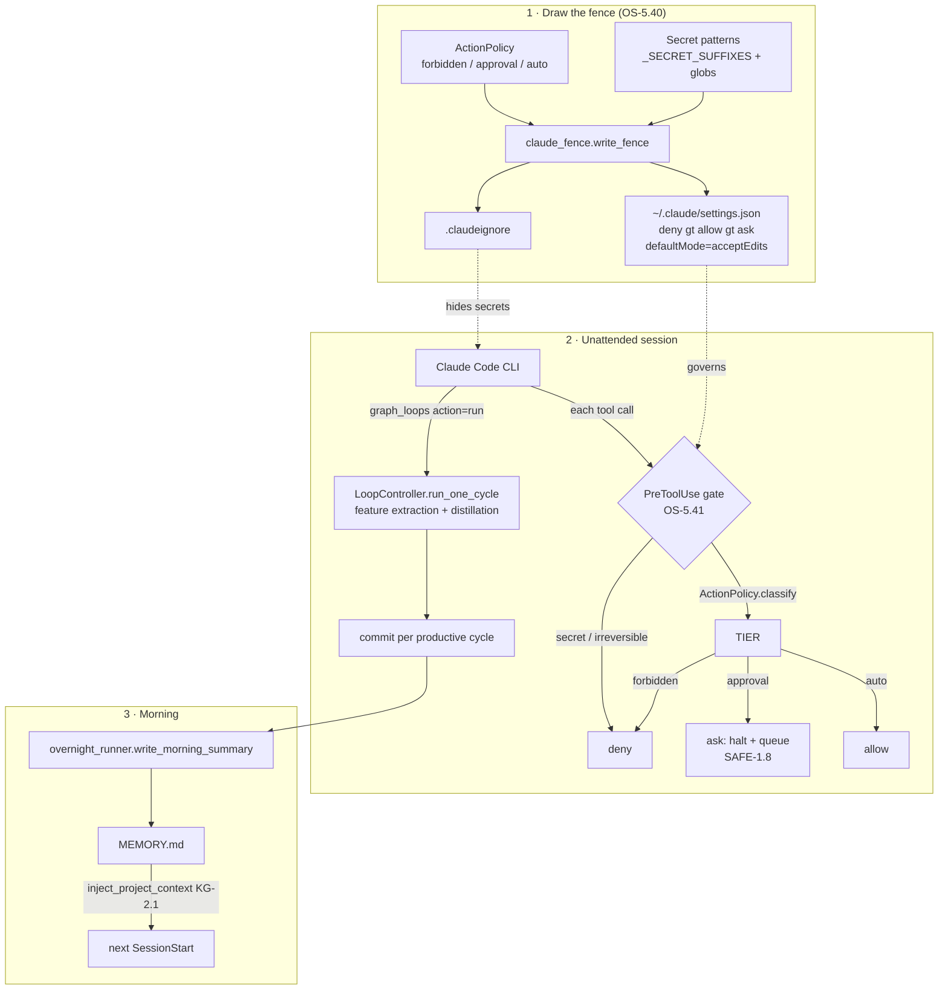

# Unattended Claude Code Harness

> Let the **Claude Code CLI itself** run unattended — driving the graph-os Loop
> engine while you sleep — behind a **governance-derived permission fence**.
> Pillar 5 (Agent OS) · Concepts **OS-5.40**, **OS-5.41**, **ECO-4.47**,
> **SAFE-1.8**.

The common "run Claude overnight" recipe is a hand-written `settings.json`
permission fence. We **derive** the fence from the same `ActionPolicy`
(`orchestration/action_policy`, OS-5.24) that gates fleet mutations, add a
**dynamic** PreToolUse gate that consults governance at decision time, and point
the unattended session at the existing **`LoopController`** (KG-2.78) — the
feature-extraction + innovation-distillation cycle — so the overnight worker is
genuinely productive, not just a faster autocomplete.

## Three layers

| Layer | Concept | Module | Role |
|---|---|---|---|
| Static fence | OS-5.40 | `claude_harness/claude_fence.py` | Generate `settings.json` (`allow`/`ask`/`deny` + `defaultMode=acceptEdits`) + `.claudeignore` from `ActionPolicy` + secret patterns. Self-updating: a new `forbidden` rule propagates on the next run. |
| Dynamic gate | OS-5.41 | `claude_harness/pretooluse_gate.py` | The PreToolUse hook body. Static secret/irreversible deny first (daemon-independent), then `ActionPolicy.classify()` for the governed verdict. Fail-closed. |
| Loop driver | ECO-4.47 / SAFE-1.8 | `claude_harness/overnight_runner.py` | Drive `LoopController` cycles, commit per productive cycle, halt on `ask`, write the `MEMORY.md` morning summary. |

`deny > allow > ask` (Claude's own precedence); we additionally de-dup so
`allow`/`ask` never shadow a `deny`. `defaultMode` is hard-pinned to
`acceptEdits` — `bypassPermissions` is **never** emitted.

## Surfaces

- **CLI** — `setup-config harness-fence`, `agent-utilities harness-gate`
  (the hook command), `agent-utilities sleep-run`.
- **MCP** — `graph_configure(action="harness_fence")`.
- **Skill** — `unattended-loop-driver` (universal-skills).
- **Install** — `scripts/install.sh` step 4.5 + `genesis.yaml` `ide_targets.harness_fence`.

## Flow

## Guarantees

- **Fail-closed** — any error, unparseable hook input, or engine-down denies;
  the static secret/irreversible floor works even with the graph-os daemon down.
- **`ask` = halt, never auto-approve** — an unattended session has no human, so
  an `ask` verdict stops the action and queues it for review (SAFE-1.8).
- **Propose-only loop** — `LoopController` writes proposals (specs, skill
  candidates, teams); it never auto-merges or executes high-stakes actions.
- **Idempotent** — `write_fence` deep-merges and is a no-op on an unchanged
  policy, preserving operator hand-edits in `allow`/`ask`.

## Related

- [Fleet Autonomy](fleet_autonomy.md) — the `ActionPolicy` decision point (OS-5.24).
- [Observational Memory Bridge](../pillars/memory_architecture.md) — the
  `MEMORY.md` ↔ KG bridge (KG-2.1) the morning summary rides on.
- [Trigger the Loop engine](../guides/loop-engine.md) — `graph_loops`/`LoopController`.
