# Universal external graph connectors

Agent Utilities can consume a foreign graph without treating it as a second
operational authority. Neo4j/openCypher, Apache AGE, LadybugDB/Kuzu, remote
epistemic-graph, and GraphQL sources use the same governed lifecycle:

1. Register a neutral connection alias whose runtime transport is an encrypted
   `connection_profile_ref`.
2. Run bounded, read-only schema discovery.
3. Generate a deterministic ontology-mapping proposal. For property graphs,
   optional `semantic_mapping=true` sends only a privacy-filtered,
   policy-compiled `ContextBundle` through the existing configured `lite` model
   transport. The call has a 30-second/no-retry request bound, a 512-token output
   bound, and a 64-KiB strict-JSON parser bound. It may add allowlisted suggestions
   only; it cannot approve or ingest anything. A model or transport failure aborts
   the proposal before storage.
4. Review and approve the exact proposal version, schema digest, and mapping-policy
   digest.
5. Dry-run, then ingest through native `ChangeEnvelope` transactions. Stable
   HMAC material versions include both approved properties and outgoing links,
   so unchanged records deduplicate while edge-only changes remain real deltas.
6. Rediscover and re-hash the external mapping policy on every ingest. Any schema
   or mapping-policy digest change fails closed and requires a new proposal and
   approval. A rediscovery marked partial also fails closed even when its visible
   schema digest happens to match the last complete discovery.

```mermaid
flowchart LR
    REFS["AgentConfig aliases<br/>runtime secret + TLS refs"] --> ADAPTER["Read-only source adapter"]
    ADAPTER --> DISCOVER["Bounded schema discovery"]
    DISCOVER --> DIGEST["Opaque schema digest"]
    DIGEST --> PROPOSE["Generated mapping proposal"]
    PROPOSE --> APPROVE["Explicit approval"]
    APPROVE --> DRIFT["Re-discover + fail-closed drift check"]
    DRIFT --> READ["Bounded incremental read"]
    READ --> ENVELOPE["ChangeEnvelope / MutationBatch<br/>provenance · ACL · idempotency"]
    ENVELOPE --> EG["epistemic-graph authority"]
```



No bundled profile describes a particular environment. Endpoints, authentication,
TLS trust, GraphQL operations, database names, discovered schema, source labels,
queries, and raw identifiers are runtime secret material. GraphOS responses,
doctor output, logs, traces, and reports contain only aliases, counts, capability
flags, digests, and HMAC pseudonyms.

## Backend discovery contracts

| Adapter | Preferred discovery | Bounded fallback | Stable identity |
| --- | --- | --- | --- |
| Neo4j/openCypher | Standard read-only schema procedures | `MATCH`/`keys`/`type` scans with hard limits | A common `id`, `uuid`, `key`, `slug`, or explicit runtime property |
| Apache AGE | openCypher schema queries | Bounded label, relationship, and property scans | Same common stable-property rule |
| LadybugDB/Kuzu | Catalog/table procedures | Bounded Cypher scan where supported | Required common schema property |
| Remote epistemic-graph | Native Cypher-subset read client | Bounded native scans | Required common or explicit property |
| GraphQL | Minimal standard introspection after explicit `allow_introspection` | A secret-provided read operation that binds `$limit` or `$first`; only response field shape is retained | A stable scalar field selected by the approved structural mapping |

The GraphQL schema digest covers type kinds, field and argument types, input
fields, enum members, union members, and hashed default values. Those signatures
remain transient; public discovery returns counts and the digest only. A field
type change therefore invalidates approval even when every field name is
unchanged.

Neo4j `elementId()` and AGE `id(n)` are deliberately not accepted as durable
identity because restore/recreation can change them. Discovery fails closed when
it cannot prove or receive an explicit stable property.
Each catalog or scan asks for one bounded sentinel beyond its advertised limit;
seeing that sentinel marks discovery partial and prevents proposal approval.

The remote epistemic-graph adapter is a non-authoritative, role=`read` connector
client. It does not enter `GraphComputeEngine`'s process-authority singleton and
cannot replace GraphOS's routed authority client. Its separate source transport
can be opened only by the central graph transport bootstrap, so connector feature
code cannot create an unmanaged engine socket or bypass the shared TLS policy.

## GraphOS workflow

All payloads below contain aliases and policy choices only. Runtime connection and
mapping profiles are secret references.

```text
graph_configure action=add_connection
graph_configure action=discover_connection_schema
graph_configure action=propose_connection_mapping
graph_configure action=approve_connection_mapping
graph_configure action=connection_mapping_status
graph_configure action=external_graph_doctor
graph_configure action=ingest_connection
```

`external_graph_doctor` reports adapter capabilities, whether discovery completed,
approval state, schema drift, runtime mapping-policy drift, and readiness. A changed
secret mapping policy is not silently ignored: doctor marks the source unready and
ingestion requires a new proposal and approval. It never returns a remote error
message or raw transport/schema material.

## Runtime configuration

`AgentConfig.external_graph_connectors` defines neutral aliases and policy bounds.
Each entry uses a secret-backed `connection_profile_ref` and may use a
`mapping_policy_ref`, separate `tls_profile_ref`,
`auth_profile_ref`, and `variables_ref` values. The canonical `graphql` backend
accepts either a mapping-policy reference or explicit `allow_introspection=true`;
it never accepts an endpoint, header,
query, mapping, variables object, or TLS file in a GraphOS action. Discovery is
bounded by `discovery_max_types` (maximum 500) and `discovery_max_depth`
(maximum 12); ingestion is bounded by `ingest_max_records` (maximum 10,000).
`ingest_operation` is only a neutral operation alias. Approval and fail-closed
drift are mandatory, and semantic mapping defaults off.

`semantic_mapping` is a property-graph proposal feature. Setting it for GraphQL
is rejected during `AgentConfig` and durable-registration validation rather than
being accepted as an inert option. GraphQL uses deterministic structural mapping
from its configured policy or explicitly approved introspection instead.

Property-graph declarations additionally set `ingest_page_size` (default 500),
`ingest_max_pages` (default 100), `sync_mode` (`auto`, `cdc`, or `snapshot`),
`reconcile_deletions`, the fail-closed `allow_empty_snapshot` safeguard, and
structural read budgets: `ingest_max_row_bytes` (default 1 MiB, maximum 8 MiB),
`ingest_max_total_bytes` (default 16 MiB, maximum 64 MiB),
`ingest_max_nesting_depth` (default 16, maximum 64), and
`ingest_max_collection_items` (default 10,000, maximum 100,000). The cumulative
byte bound must cover at least one row. Page values cannot exceed 1,000. These
neutral controls are included in the
mapping-policy digest, so a reconciliation or sync-mode change requires a new
proposal and approval. Actions cannot override them inline.
Connection names and source aliases are mandatory and independently unique across
the configured connector list; a name cannot ambiguously resolve two transports,
and the same source alias cannot share pseudonymous IDs, cursor partitions, or
tombstone scope between two sources. Every nonempty native-CDC page must also
return a strictly advancing persistence-safe cursor, including the terminal page,
or the entire batch is rejected before materialization.

The property-graph approval digest also binds the complete node selector
(`id_path`, `type_path`, `version_path`, and `properties_path`), the complete
edge selector (`source_path`, `target_path`, `type_path`, and
`properties_path`), generated read queries, type maps, ACL policy, backend and
schema metadata, source alias, and the canonical identity-key secret reference.
Resolved HMAC key material is never placed in the profile or digest. Changing a
selector or secret reference after approval invalidates the profile before any
source read.

Property-graph mapping-policy documents accept only `access`, privacy-safe node
and edge property allowlists, type overrides, edge-type overrides, and a stable
identity-property selector. That exact runtime document is canonically hashed at
proposal time and re-hashed by doctor and every ingest. Unknown fields fail closed;
an endpoint, query, variable object, ontology document, identity, credential, or
filesystem path cannot ride inside a public action or durable declaration.

An approved private/intranet GraphQL hostname must also appear as an exact entry
in `SOURCE_HTTP_ALLOWED_PRIVATE_HOSTS`. Wildcards, URL-shaped entries, embedded
credentials, redirects, and implicit trust of private DNS are rejected. This
egress decision is independent of TLS trust: a valid CA profile does not grant
network reach, and an allowed hostname does not disable certificate validation.
The shared transport pins every validated DNS hop to one approved address while
retaining the logical hostname for Host, SNI, and certificate verification. It
revalidates every redirect and rejects HTTPS-to-HTTP downgrade. Proxy, CA, and
mTLS inputs remain runtime TLS-profile concerns; proxy modes that cannot retain
both target pinning and the original TLS identity fail closed.

The connection profile is resolved only while constructing the read adapter. Its
endpoint, credentials, database, and TLS configuration are never exported back to
`config.json`. The generated mapping profile lives only in the encrypted secret
backend; its public status is pseudonymous.

For GraphQL, the references resolve to independent, source-owned documents:

```json
{
  "connection_profile_ref": "secret://external-source/connection",
  "allow_introspection": true,
  "auth_profile_ref": "secret://external-source/auth",
  "tls_profile_ref": "secret://external-source/tls",
  "variables_ref": "secret://external-source/variables"
}
```

All three GraphQL runtime documents are explicitly versioned. Missing or unknown
formats fail in both doctor and runtime; they are never interpreted as a legacy
shape:

```json
{
  "profile_format": "graphql-connection/v1",
  "endpoint": "<runtime endpoint>"
}
```

```json
{
  "profile_format": "graphql-auth/v1",
  "headers": {"<approved header>": "<runtime secret value>"}
}
```

The connection document contains no fields beyond `profile_format` and
`endpoint`. The auth document contains no fields beyond `profile_format` and a
bounded `headers` object; CR/LF injection, host framing, proxy authorization,
and hop-by-hop transport headers are rejected. The generic TLS document uses the
shared named-profile schema and is fully parsed by doctor, so malformed trust
material is not reported as ready merely because its reference resolved. The
variables document is either one flat JSON object or
`{"discovery": {...}, "operations": {"operation_alias": {...}}}` when operations
need different variables. The document-policy schema is:

When no mapping policy is referenced, explicit introspection lets
`propose_connection_mapping` synthesize read operations and entity mappings from
the query root. Generation selects only stable scalar identities and privacy-safe
scalar/enum properties. Required selector arguments and unbounded list roots are
rejected. Direct-object reads are single-row bounded; list reads must bind
`$limit` or `$first`; cursor connections must expose `pageInfo` and are capped by
page, row, depth, and byte limits. Multiple safe roots become a tokenized,
privacy-compiled ambiguity proposal. They are never auto-approved: the exact
schema digest, mapping digest, and proposal version must be approved. Structural
introspection may be retained only inside the encrypted proposal; response values
and raw samples are never retained. Generated source ontology and query material
never enter the repository, AgentConfig, public status, logs, or traces.

```json
{
  "profile_format": "graphql-document-policy/v1",
  "default_operation": "document_read",
  "discovery": {
    "enabled": true,
    "allow_introspection": false,
    "probe_query": "<bounded read query using $limit or $first>",
    "accept_bounded_probe": true,
    "max_depth": 6
  },
  "operations": {
    "document_read": {
      "query": "<read query>",
      "root_path": "<response root>",
      "id_path": "<stable identity field>",
      "mappings": {
        "documents": {
          "records_path": "<document records>",
          "id_path": "<stable identity field>",
          "property_allowlist": ["<approved field>"]
        }
      }
    }
  },
  "governance": {
    "classification": "confidential",
    "retention": "P30D",
    "access": {"markings": ["external-import"]}
  },
  "limits": {"max_pages": 25, "max_entities": 2000}
}
```

This is a schema contract, not a bundled source profile. Actual endpoints,
headers, operations, variables, schema bindings, and environment-specific
ontology remain in the operator's secret backend. Introspection must be enabled
explicitly. When it is unavailable, a bounded probe is accepted for proposal
only when `accept_bounded_probe` is also explicit. Probe and ingest variables
come only from `variables_ref`; a variables object in the mapping policy or MCP
payload is rejected. Every ingest repeats the same
discovery and rejects partial/unacknowledged discovery, changed schema digests,
unapproved policies, mutation/subscription operations, redirects, unsafe egress,
oversized responses, and inline variables.

A bounded GraphQL discovery probe must pass an AST check proving that its
declared `$limit` or `$first` variable is used by a `limit:` or `first:` argument.
Merely naming that variable, using it as an offset/filter, or mentioning it in a
comment does not establish a row bound.

GraphQL polling carries a versioned, bounded HMAC-identity map and the prior
governance tuple in the engine-owned connector checkpoint. An approved
authoritative snapshot emits one native delete envelope for every previously
known entity now absent, preserving its prior ACL, tenant, classification,
retention, legal hold, and provenance. A truncated scan, invalid record, or
allowlisted partial error cannot reconcile or advance an authoritative snapshot.
An empty authoritative GraphQL result cannot tombstone a non-empty baseline
unless the approved operation explicitly sets `allow_empty_snapshot=true`.
Mapping-free generation takes that decision from AgentConfig and embeds it in the
generated operation, so the exact mapping digest covers the approval. Resulting
tombstones record the explicit empty-snapshot approval in provenance.
Property-graph imports use bounded deterministic pages and prefer a discovered
source-native change feed. When none is available, a complete snapshot produces
deterministic snapshot-diff tombstones; truncation or a failed page suppresses
reconciliation. An empty snapshot is never authoritative unless the approved
declaration explicitly enables it. Imports derive an opaque material version from
the approved record and its outgoing links; native ChangeEnvelope idempotency
skips unchanged upserts and applies edge-only changes.
Offset paging is accepted only through a backend snapshot-page contract that
holds one persistence-safe snapshot token (or an equivalent repeatable-read
transaction) across every node and edge page. A tokenless backend instead performs
one read transaction per approved query with `offset=0` and a sentinel limit of
`ingest_max_records + 1`; it does not issue independent offset pages. Up to the
approved maximum is therefore one stable query result, while the sentinel row
fails the snapshot before any write. A snapshot-token change also rejects the
entire batch. Every row is measured at the read boundary, before mapping or
sanitization, against the approved per-row, cumulative byte, depth, and collection
limits. A snapshot row missing the approved mapped identity makes the snapshot
non-authoritative: valid rows may still be materialized, but the result is partial
and the reconciliation marker has no live-ID set, so no tombstones can be produced.
Neither path keeps a second Python watermark or stores upstream identifiers or
raw samples in a checkpoint.

Before resolving a mapping profile or opening a source connection, direct
property-graph ingestion runs the same signed connector-manifest activation gate
as source connectors. The fixed `external_graph` activation surface is pinned to
the deterministic local dependency closure of the importer module in the bundled
`native-source-connectors` capability bundle. The fingerprint therefore binds the
critical transitive governance, envelope, privacy, configuration, and registry
code used by activation rather than only the top-level module. The manifest
selector is not configurable and carries no endpoint, source schema, query,
credential, ontology, or filesystem path.
