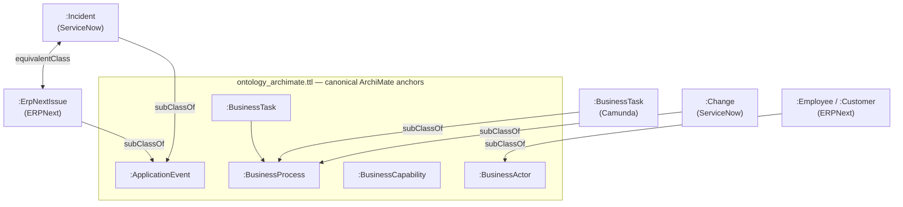
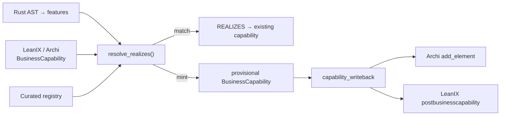
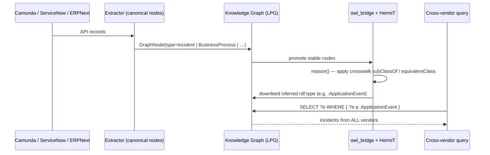

# Vendor-Neutral Enterprise Ontology

> **Pillar 2 — Epistemic Knowledge Graph** · Concepts: `KG-2.9` (Enterprise OS),
> `KG-2.8` (Enrichment & Interlinking), `KG-2.1` (External Graph Federation)

## Why this exists

An enterprise rarely runs one vendor per capability. One client runs **ServiceNow**
for ITSM; another runs **ERPNext**. One models processes in **Camunda**; another
documents them in **Archi**; another inventories them in **LeanIX**. The work the
business does is the same — the tools are interchangeable implementation details.

This layer makes the *reasoning* vendor-neutral. Every system maps to **one
canonical ArchiMate-aligned upper ontology**, so a single query answers a business
question regardless of which product produced the data:

```sparql
# "Show every IT service event, whoever's tool raised it."
SELECT ?e WHERE { ?e a :ApplicationEvent }
# → ServiceNow incidents + ERPNext issues + Camunda process incidents, unified.
```

Swapping ServiceNow for ERPNext means changing an *adapter*, not the reasoning
layer. The ontology is the single source of truth; the tools are pluggable.

## The four moving parts

| Part | Role | Concept | Code |
|------|------|---------|------|
| **Canonical crosswalk** | One ArchiMate concept per business idea; each vendor class subclasses it | `KG-2.9` | `knowledge_graph/ontology_archimate.ttl` |
| **Vendor adapters** | Self-registering extractors lift each system's API into canonical nodes | `KG-2.9` | `knowledge_graph/enrichment/extractors/*.py` |
| **Code→capability bridge** | Links source code to the `BusinessCapability` it realizes | `KG-2.8` | `knowledge_graph/enrichment/realizes.py` |
| **Virtual REST federation** | Query live system data on-demand without re-materializing | `KG-2.1` | `knowledge_graph/orchestration/engine_federation.py` |

---

## 1. The canonical crosswalk (keystone)

All ontologies share one namespace (`http://knuckles.team/kg#`), so a class IRI is
global. The crosswalk **never redefines** vendor classes — it relates them to
canonical anchors with `rdfs:subClassOf` / `owl:equivalentClass`, and reasoning
(owlready2 / HermiT, driven by `core/owl_bridge.py`) propagates `rdf:type` up to
the canonical concept.



Worked example — ServiceNow ↔ ERPNext interchangeability:

```turtle
# ontology_archimate.ttl  (crosswalk axioms only; classes live in vendor TTLs)
:Incident       rdfs:subClassOf :ApplicationEvent .   # ServiceNow incident table
:ErpNextIssue   rdfs:subClassOf :ApplicationEvent .   # Frappe Issue doctype
:Incident       owl:equivalentClass :ErpNextIssue .   # full interchangeability
:Change         rdfs:subClassOf :BusinessProcess .
```

After reasoning, an individual typed `:Incident` (from ServiceNow) and one typed
`:ErpNextIssue` (from ERPNext) **both gain inferred `rdf:type :ApplicationEvent`**.

> **Design note.** A literal RML/Morph-KGC engine was deliberately *not* added — it
> would mean a new mapping language and a second materialization path. The existing
> self-registering extractors already emit uniform nodes, and the OWL crosswalk +
> reasoner already exist. A thin RML adapter remains a documented future option for
> spreadsheet/CSV-like sources where a declarative mapping file beats Python.

New canonical classes introduced: `:ApplicationEvent`, `:BusinessTask`,
`:BusinessActor`. Reused (never redefined): `:BusinessProcess`,
`:ApplicationComponent`, `:BusinessCapability`, `:Module`, `:realizes`,
`:Incident`, `:Change`, `:Person`.

---

## 2. Vendor adapters (self-registering extractors)

Each enterprise system has an extractor under `enrichment/extractors/` that lifts
its API into the uniform `ExtractionBatch` of canonical `GraphNode` + `EnrichmentEdge`
objects. They self-register via `registry.register_source` at import time — adding a
source touches **no shared hub file**.

| System | Extractor | Canonical nodes emitted |
|--------|-----------|-------------------------|
| ServiceNow | `extractors/servicenow.py` | `Incident`, `Change`, `ConfigurationItem` |
| ERPNext | `extractors/erpnext.py` | `Employee`, `Customer`, `SalesOrder`, `Item`, `ErpNextIssue` |
| Camunda | `extractors/camunda.py` | `BusinessProcess`, `BusinessTask`, `Incident` |
| LeanIX | `extractors/leanix.py` | `BusinessCapability`, `Application`, `ITComponent` |

Every extractor is duck-typed (`config["client"]`), performs **no network I/O
itself**, and tolerates missing fields and Camunda 7 vs 8 client differences. The
API clients themselves are the existing MCP packages (`camunda-mcp`,
`servicenow-api`, `erpnext-agent`, `leanix-agent`, `archimate-mcp`).

The Camunda contract, for example:

```python
list_process_definitions() → GraphNode(type="BusinessProcess", id="bpmn_process:{id}")
list_tasks()               → GraphNode(type="BusinessTask")  +  PART_OF → process
list_incidents()           → GraphNode(type="Incident")      +  AFFECTS → process
```

Because Camunda incidents are emitted as the canonical `Incident` type, they fold
into the same `:ApplicationEvent` crosswalk as ServiceNow and ERPNext.

---

## 3. Code → capability realization (`KG-2.8`)

The epistemic-graph Rust engine parses code into `SYMBOL`/`FILE` nodes and clusters
them into **features**. `realizes.py` bridges those features to ArchiMate
`BusinessCapability` nodes, emitting `REALIZES` edges — so you can ask
"show all code that implements the Order Fulfillment capability" even when names
don't match. It stays in Python; the Rust engine remains purely syntactic.

Three modes, unified in one call (`resolve_realizes`):

1. **Match existing** — semantic (embedding) or token-overlap match against
   `BusinessCapability` nodes already ingested from LeanIX/Archi.
2. **Mint bottom-up** — when nothing matches (e.g. an acquired codebase with a
   sparse EA catalog), derive a provisional `BusinessCapability` from the feature.
3. **Curated registry** — match strictly against an authored capability catalog
   (`mint_missing=False`).

Provisional/curated capabilities can be **pushed back to the EA tools** via
`capability_writeback.py` — Archi (`add_element(type="Capability", …)`) and LeanIX
(`postbusinesscapability(…)`) — closing the loop so the architecture catalog is
enriched from the code an acquisition brought in. Write-back is opt-in, idempotent
(skips names already upstream), and fault-tolerant (one failing client never aborts
the batch).



---

## 4. Virtual REST federation (`KG-2.1`)

`engine_federation.py` already federates external **SPARQL/Cypher** endpoints. For
systems that speak **REST/JSON** (Camunda, ServiceNow, ERPNext), querying live data
without re-ingesting everything is done by invoking the *existing extractor* on
demand — no new mapping language, no Ontop-grade subsystem.

```python
engine.register_rest_source("rest:camunda", "camunda", camunda_client, ttl_seconds=60)

# Query-time: fetch fresh (TTL-cached), filter to a canonical type
engine.query_rest_source("rest:camunda", node_type="Incident")

# Union live REST records with locally materialized ones (local wins on id)
engine.query_rest_union("rest:camunda", local_records, node_type="Incident")
```

**Trade-off (documented in the module):** reasoning applies only over the fetched
slice. For full cross-source reasoning, materialize via the ingestion pipeline and
let the OWL crosswalk run. Use virtualization for "must-be-live, never-stale" reads.

---

## End-to-end flow



## Query cookbook

```sparql
# All IT service events, any vendor
SELECT ?e WHERE { ?e a :ApplicationEvent }

# Every process — Camunda BPMN + ServiceNow changes
SELECT ?p WHERE { ?p a :BusinessProcess }
```

```cypher
// Trace a capability down to the code that realizes it
MATCH (m:Module)-[:REALIZES]->(c:BusinessCapability {name: "Order Fulfillment"})
RETURN c, m
```

## File map

```
agent_utilities/knowledge_graph/
├── ontology_archimate.ttl              # canonical anchors + crosswalk (KG-2.9)
├── ontology_servicenow.ttl             # :Incident, :Change, :ConfigurationItem
├── ontology_erpnext.ttl                # + :ErpNextIssue
├── enrichment/
│   ├── extractors/camunda.py           # BPMN → canonical nodes (KG-2.9)
│   ├── extractors/erpnext.py           # + Issue → :ErpNextIssue
│   ├── realizes.py                     # code → capability REALIZES (KG-2.8)
│   ├── capability_writeback.py         # push capabilities back to Archi/LeanIX
│   └── pipeline.py                     # wires resolve_realizes into enrichment
├── backends/owl/owlready2_backend.py   # _NODE_TYPE_TO_OWL_CLASS / _EDGE_TYPE_TO_OWL_PROP
├── core/owl_bridge.py                  # PROMOTABLE_NODE_TYPES; promote→reason→downfeed
└── orchestration/engine_federation.py  # register_rest_source / query_rest_source (KG-2.1)
```

## Verification

| Concern | Test |
|---------|------|
| Crosswalk reasoning (keystone) | `tests/unit/knowledge_graph/test_crosswalk_reasoning.py` |
| Camunda extractor | `tests/unit/knowledge_graph/enrichment/test_camunda_extractor.py` |
| ERPNext Issue mapping | `tests/unit/knowledge_graph/enrichment/test_erpnext_extractor.py` |
| Code→capability resolution | `tests/unit/knowledge_graph/enrichment/test_realizes.py` |
| Capability write-back | `tests/unit/knowledge_graph/enrichment/test_capability_writeback.py` |
| REST virtualization | `tests/unit/knowledge_graph/test_federation.py` |

```bash
# Keystone: ServiceNow Incident + ERPNext Issue both resolve to :ApplicationEvent
pytest tests/unit/knowledge_graph/test_crosswalk_reasoning.py -q
```

## Adding a new vendor

1. Write `enrichment/extractors/<vendor>.py` emitting **canonical** node types
   (reuse `:Incident`, `:BusinessProcess`, … where they fit), `register_source(...)`.
2. If it introduces a genuinely new vendor class, declare it in that vendor's TTL
   and add one `rdfs:subClassOf <canonical>` line in `ontology_archimate.ttl`.
3. Register lowercase node types in `_NODE_TYPE_TO_OWL_CLASS` and
   `PROMOTABLE_NODE_TYPES`.

No reasoning code changes. That is the whole point.
