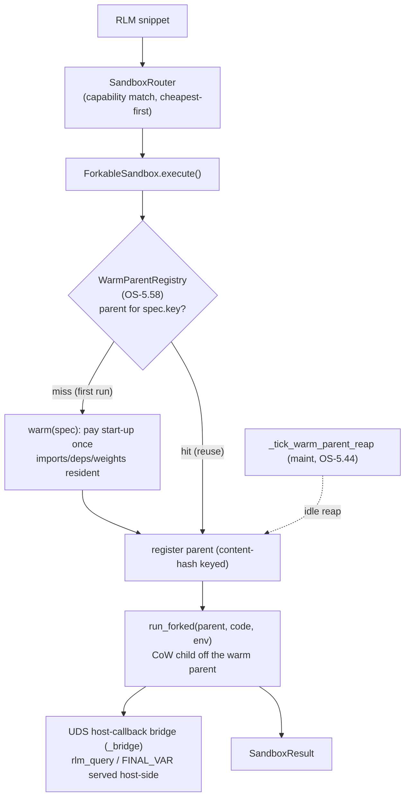

# Native Warm-Fork Sandboxes

**Concepts:** ORCH-1.83 (`:WarmForkFanoutCapability` — the abstract node), ORCH-1.86
(the `ForkableSandbox` protocol + snapshot chain), ORCH-1.87 (`forkserver` rung),
ORCH-1.88 (`wasm` Wizer warm payload), ORCH-1.89 (`container_fork` rung), ORCH-1.90
(`firecracker` rung), OS-5.58 (`WarmParentRegistry` + reaper tick), OS-5.59 (doctor check).
Builds on ORCH-1.38 (the capability-routed RLM sandbox tier) and OS-5.33 (the dev-workspace
warm-pool pattern this generalizes).

## The problem

Nothing in agent-utilities warm-started. The RLM `docker` sandbox span a fresh `--rm`
container *per snippet* (`rlm/sandboxes/docker_backend.py`); the `wasm` backend re-booted
CPython-WASI cold every run; heavy ML deps were kept out of core partly *because* there was no
shared warm interpreter to amortise their import across a fan-out cohort. forkd
(Firecracker microVM) proved the cure — **boot a runtime warm once, fork children from
copy-on-write state** — but it is x86_64+KVM and single-host only, so wiring it via MCP would
bolt one hypervisor onto one box rather than making warm-fork a native property of the system.

## The model — warm-fork as a protocol on the existing ladder

forkd's value is a substrate-agnostic lifecycle, not Firecracker. Stripped down it is:
**warm once → fork CoW children → (microVM only) branch mid-execution**. Every execution tier
we already run has a native copy-on-write primitive to implement it, so warm-fork becomes one
protocol layered onto the `Sandbox` contract (`rlm/sandboxes/base.py`):

```python
class ForkableSandbox(Sandbox):
    def  warm_spec(self) -> WarmSpec                         # content-hash key for the parent
    async def warm(self, spec) -> ParentHandle               # pay start-up once
    async def run_forked(self, parent, code, env) -> Result  # fork ONE CoW child, run, return
    # concrete execute() = registry.get-or-warm(spec) -> run_forked   (inherited, free)
```

A rung implements `warm` + `run_forked` + `warm_spec` and advertises `warm_fork=True` on
`SandboxCapabilities`; it gets a registry-backed `execute()` for free. The deterministic
router (`rlm/sandboxes/router.py`) is unchanged — warm-fork is a property of *how* a backend
spawns, not a routing filter. Fan-out is just many concurrent `execute`/`run_forked` calls,
each forking its own child off the **one** warm parent (the CoW amortisation).

### The ladder (isolation / cost / platform spread)

| rung | native CoW primitive | isolated | host-callbacks | platform | rank |
|------|----------------------|----------|----------------|----------|------|
| `forkserver` (ORCH-1.87) | `os.fork` from a preloaded `multiprocessing` forkserver | process | ✓ (UDS bridge) | any Unix incl. ARM | 15 |
| `wasm` (ORCH-1.88) | Wizer-preinitialized `.wasm` (warm heap baked at build time) | WASI | ✗ (v1) | any incl. ARM | 10 |
| `container_fork` (ORCH-1.89) | warm `sleep infinity` pool / CRIU restore-many | container | ✓ (UDS bridge) | any Linux | 18 |
| `firecracker` (ORCH-1.90) | forkd snapshot `mmap MAP_PRIVATE` | microVM/KVM | ✗ (v1; needs vsock bridge) | x86_64+KVM | 25 |
| `local` / `monty` | unchanged (floor / fast in-proc subset) | — / in-proc | ✓ | any | 30 / 0 |

`forkserver` is the flagship: zero infra, cross-platform, and a *cheaper isolated tier than
cold docker*, so for the common case (third-party libs **and** host callbacks) the router now
prefers a warm fork over a fresh container. Measured: cold warm-up ~7.4 s (numpy/pandas
resident) → subsequent warm fork-reuse ~0.04 s; `container_fork` cold ~15 s → warm reuse ~0.4 s.



## Shared infrastructure

- **`rlm/sandboxes/_bridge.py`** — the framed-JSON UDS host-callback bridge, extracted from
  `docker_backend` so every isolated rung serves `rlm_query`/`FINAL_VAR` identically (the host
  awaits coroutine helpers; `FINAL_VAR` round-trips vars). Two child forms share one wire
  format: an importable `run_child` (forkserver, which inherits the package) and a self-contained
  `make_runner_script` (containers/guests that cannot import the package).
- **`runtime/warm_registry.py` — `WarmParentRegistry` (OS-5.58)** — a dependency-light host
  singleton pooling warm parents by `WarmSpec.key` (content hash), borrow-touched, idle-reaped,
  auto-sized to host RAM/CPU via `compute_warm_parent_count` (mirrors
  `compute_ingest_worker_count`). It stores opaque parents + a sync `close`, so it never imports
  the sandbox layer (no cycle) and reaps from a synchronous maintenance tick. Owned by the host
  daemon (`gateway/daemon.py`), drained on shutdown.
- **`_tick_warm_parent_reap` (OS-5.58)** — a background `maint` schedule
  (`engine_tasks._register_maintenance_schedules`) that reaps idle warm parents and also adopts
  the previously-orphaned `DockerWorkspace.reap_idle` (OS-5.33).
- **Snapshot chain (KG)** — `ontology_capability.ttl` models `:WarmSnapshot` +
  `:derivedFrom` (transitive), so warm-parent reuse ("is there a snapshot that is a superset of
  what I need?") is a graph query — the KG-native replacement for forkd's flat hub index.

## Observability & visibility

`agent-utilities-doctor`'s `warm_fork` check (OS-5.59) reports per-rung availability and the
live pooled-parent count: `ok` when any warm rung is up (forkserver everywhere), `warn` + a fix
hint otherwise. forkd's report (`reports/forkd-comparative-analysis-2026-06-22.md`) holds the
comparative analysis that motivated this.

## Status & remaining work

Landed: the protocol + registry + bridge + reaper tick + ontology (Phase 0); the `forkserver`,
`wasm`-Wizer, and `container_fork` rungs (Phases 1–3); the doctor check. Remaining (each gated
or invasive, tracked in the plan): the `firecracker` rung behind a one-host KVM spike (Phase 4);
reward-EMA adaptive tier selection via `CapabilityIndex.record_outcome` (Phase 5); dispatch-tier
warm-fork — forking a warmed agent-parent in `parallel_engine`/`agent_dispatch_worker` instead of
cold `create_agent` (Phase 6); and the `graph_sandbox` MCP+REST operator surface (Phase 7).
