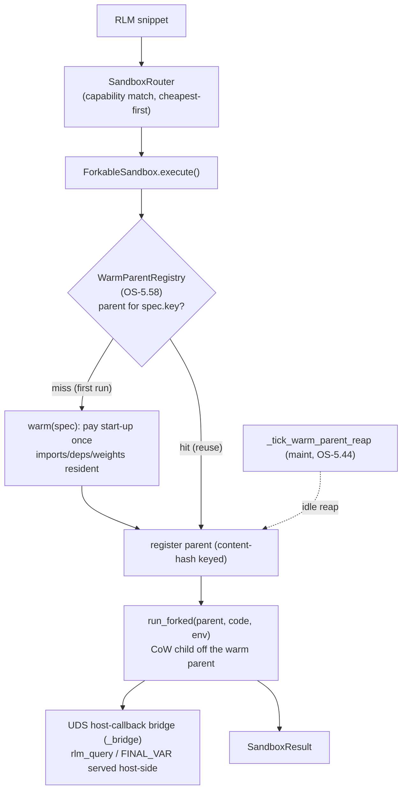
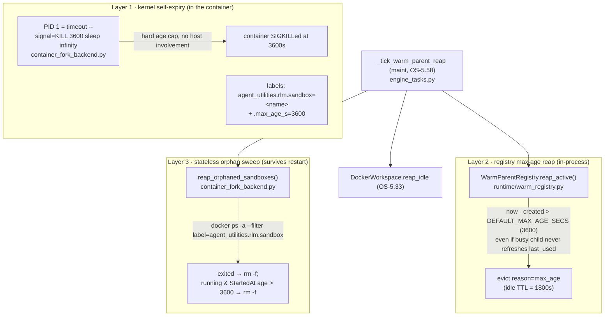

# Native Warm-Fork Sandboxes

**Concepts:** ORCH-1.83 (`:WarmForkFanoutCapability` — the abstract node), ORCH-1.86
(the `ForkableSandbox` protocol + snapshot chain), ORCH-1.87 (`forkserver` rung),
ORCH-1.88 (`wasm` Wizer warm payload), ORCH-1.89 (`container_fork` rung), ORCH-1.90
(`firecracker` rung), OS-5.58 (`WarmParentRegistry` + reaper tick), OS-5.59 (doctor check).
Builds on ORCH-1.38 (the capability-routed RLM sandbox tier) and OS-5.33 (the dev-workspace
warm-pool pattern this generalizes).

## The problem

Nothing in agent-utilities warm-started. The RLM `docker` sandbox span a fresh `--rm`
container *per snippet* (`rlm/sandboxes/docker_backend.py`); the `wasm` backend re-booted
CPython-WASI cold every run; heavy ML deps were kept out of core partly *because* there was no
shared warm interpreter to amortise their import across a fan-out cohort. forkd
(Firecracker microVM) proved the cure — **boot a runtime warm once, fork children from
copy-on-write state** — but it is x86_64+KVM and single-host only, so wiring it via MCP would
bolt one hypervisor onto one box rather than making warm-fork a native property of the system.

## The model — warm-fork as a protocol on the existing ladder

forkd's value is a substrate-agnostic lifecycle, not Firecracker. Stripped down it is:
**warm once → fork CoW children → (microVM only) branch mid-execution**. Every execution tier
we already run has a native copy-on-write primitive to implement it, so warm-fork becomes one
protocol layered onto the `Sandbox` contract (`rlm/sandboxes/base.py`):

```python
class ForkableSandbox(Sandbox):
    def  warm_spec(self) -> WarmSpec                         # content-hash key for the parent
    async def warm(self, spec) -> ParentHandle               # pay start-up once
    async def run_forked(self, parent, code, env) -> Result  # fork ONE CoW child, run, return
    # concrete execute() = registry.get-or-warm(spec) -> run_forked   (inherited, free)
```

A rung implements `warm` + `run_forked` + `warm_spec` and advertises `warm_fork=True` on
`SandboxCapabilities`; it gets a registry-backed `execute()` for free. The deterministic
router (`rlm/sandboxes/router.py`) is unchanged — warm-fork is a property of *how* a backend
spawns, not a routing filter. Fan-out is just many concurrent `execute`/`run_forked` calls,
each forking its own child off the **one** warm parent (the CoW amortisation).

### The ladder (isolation / cost / platform spread)

| rung | native CoW primitive | isolated | host-callbacks | platform | rank |
|------|----------------------|----------|----------------|----------|------|
| `forkserver` (ORCH-1.87) | `os.fork` from a preloaded `multiprocessing` forkserver | process | ✓ (UDS bridge) | any Unix incl. ARM | 15 |
| `wasm` (ORCH-1.88) | Wizer-preinitialized `.wasm` (warm heap baked at build time) | WASI | ✗ (v1) | any incl. ARM | 10 |
| `container_fork` (ORCH-1.89) | warm `sleep infinity` pool / CRIU restore-many | container | ✓ (UDS bridge) | any Linux | 18 |
| `firecracker` (ORCH-1.90) | forkd snapshot `mmap MAP_PRIVATE` | microVM/KVM | ✗ (v1; needs vsock bridge) | x86_64+KVM | 25 |
| `local` / `monty` | unchanged (floor / fast in-proc subset) | — / in-proc | ✓ | any | 30 / 0 |

`forkserver` is the flagship: zero infra, cross-platform, and a *cheaper isolated tier than
cold docker*, so for the common case (third-party libs **and** host callbacks) the router now
prefers a warm fork over a fresh container. Measured: cold warm-up ~7.4 s (numpy/pandas
resident) → subsequent warm fork-reuse ~0.04 s; `container_fork` cold ~15 s → warm reuse ~0.4 s.



## Shared infrastructure

- **`rlm/sandboxes/_bridge.py`** — the framed-JSON UDS host-callback bridge, extracted from
  `docker_backend` so every isolated rung serves `rlm_query`/`FINAL_VAR` identically (the host
  awaits coroutine helpers; `FINAL_VAR` round-trips vars). Two child forms share one wire
  format: an importable `run_child` (forkserver, which inherits the package) and a self-contained
  `make_runner_script` (containers/guests that cannot import the package).
- **`runtime/warm_registry.py` — `WarmParentRegistry` (OS-5.58)** — a dependency-light host
  singleton pooling warm parents by `WarmSpec.key` (content hash), borrow-touched, idle-reaped,
  auto-sized to host RAM/CPU via `compute_warm_parent_count` (mirrors
  `compute_ingest_worker_count`). It stores opaque parents + a sync `close`, so it never imports
  the sandbox layer (no cycle) and reaps from a synchronous maintenance tick. Owned by the host
  daemon (`gateway/daemon.py`), drained on shutdown.
- **`_tick_warm_parent_reap` (OS-5.58)** — a background `maint` schedule
  (`engine_tasks._register_maintenance_schedules`) that reaps idle warm parents and also adopts
  the previously-orphaned `DockerWorkspace.reap_idle` (OS-5.33).
- **Snapshot chain (KG)** — `ontology_capability.ttl` models `:WarmSnapshot` +
  `:derivedFrom` (transitive), so warm-parent reuse ("is there a snapshot that is a superset of
  what I need?") is a graph query — the KG-native replacement for forkd's flat hub index.

## Observability & control

`agent-utilities-doctor`'s `warm_fork` check (OS-5.59) reports per-rung availability and the
live pooled-parent count: `ok` when any warm rung is up (forkserver everywhere), `warn` + a fix
hint otherwise. The **`graph_sandbox`** tool (CONCEPT:ORCH-1.93) exposes the same runtime on both
operator surfaces (MCP `graph_sandbox` + REST `POST /graph/sandbox`, dispatching through the one
`_execute_tool` core): `status` (per-rung availability + pooled-parent count + per-rung reward
EMA), `reap` (close idle warm parents + idle dev-workspaces now), `warm` (pre-pay a named rung's
start-up so the next fan-out forks cheaply). Code execution itself stays inside the governed RLM
loop — the surface is lifecycle + visibility only. forkd's report
(`reports/forkd-comparative-analysis-2026-06-22.md`) holds the comparative analysis that
motivated this.

## Adaptive tier selection (ORCH-1.91)

The router is reward-aware: `SandboxRewardTracker` (`rlm/sandboxes/reward.py`) keeps a per-rung
success/failure EMA (the reward-EMA pattern of `CapabilityIndex.record_outcome`, applied to the
sandbox-routing domain without coupling the hot path to the KG retrieval layer). `repl.execute`
records success per run and failure on `SandboxFatalError`; `SandboxRouter` orders the capable
chain by a **bounded** reward-nudged score (`rank - 10*(reward-0.5)`), so a persistently failing
rung drops by ~one tier and a healthy one rises by ~one, while steady-state preserves the
deterministic rank order (and no `reward_fn` ⇒ pure rank, unchanged). This matters because a
`SandboxFatalError` fast-fails the whole run — routing around a wedged rung avoids that.

## Dispatch-tier warm-fork (ORCH-1.92)

When a swarm fans out (`graph/parallel_engine.py`) or a worker handles many same-config turns,
`create_agent` rebuilds the **SkillsToolset** (a directory scan + `SKILL.md` parse) every time.
That artifact is deterministic per skill-dir set and connection-free, so it is built **once** and
warm-shared across the cohort via the same `WarmParentRegistry` (`agent/warm_skills.py`,
pooled under `kind="skills_toolset"`); each agent still opens its own per-run MCP connections.
Forking the orchestrator process itself is deliberately **not** done — it holds a live asyncio
loop + open MCP/stdio fds (unsafe), and the in-process worker already amortises imports — so the
honest, safe win is warm-sharing the reusable construction artifacts, not `os.fork`.

## Firecracker microVM rung (ORCH-1.90)

The strongest-isolation rung: each child is its own Firecracker microVM (KVM hardware isolation).
`firecracker_backend.py` is the peer-backend wrapper around **forkd**, driving its controller REST
API with stdlib `urllib` only (no new dependency). The warm parent is a forkd *snapshot* (booted
+ warmed out-of-band via `forkd from-image`/`forkd pull`); `run_forked` spawns one microVM child
from it, evals the snippet, and tears it down. It carries the microVM-only `branch` verb —
snapshot a *running* child into a new parent (fork mid-execution), which `os.fork`/container rungs
cannot do. It is **detection-gated**: `is_available()` is true only where a reachable
`forkd-controller` exists (implies x86_64+KVM+forkd), so on every other host it never registers
and the router uses a cheaper rung. `host_callbacks=False` in v1 (the microVM guest can't reach
the host UDS bridge without a vsock/TCP bridge — future work), rank 25. Config: `FORKD_URL`,
`FORKD_TOKEN`, `FORKD_SNAPSHOT_TAG`.

## Zombie protection — three independent reapers (ORCH-1.94)

A warm parent that the orchestrator never `close()`s — or that a **daemon restart
drops from the in-memory registry** while its forked child keeps spinning — becomes
a zombie. A real incident left five `container_fork` sandboxes pinning ~5 cores at
~98% CPU for days. The defence is **three layers that do not depend on each other**,
all hard-capped at `WARM_CONTAINER_MAX_AGE_S = 3600`s (no env knob), so a failure in
any one is still caught by the next.



- **Layer 1 — kernel self-expiry + labels.** `warm()` runs the pool container with
  PID 1 = `timeout --signal=KILL 3600 sleep infinity`, so the kernel inside the
  container SIGKILLs it at the hard age cap with zero host involvement. It also
  stamps two labels (`agent_utilities.rlm.sandbox` = backend name, and
  `…​.max_age_s` = 3600) that the stateless sweep keys on.
- **Layer 2 — registry max-age reap.** `WarmParentRegistry.reap_active` evicts not
  just idle parents (TTL 1800s) but any parent whose **`created` age exceeds 3600s**
  — the case a busy forked child causes, because it never refreshes `last_used` so
  idle-reaping alone can't see it.
- **Layer 3 — stateless orphan sweep.** `reap_orphaned_sandboxes` lists
  `docker/podman ps -a --filter label=agent_utilities.rlm.sandbox`, always removes
  exited/dead containers, and `rm -f`s running ones whose inspected `StartedAt` age
  exceeds the cap. Because it works purely from container labels + the runtime, it
  catches zombies the in-memory registry can no longer see (the daemon-restart
  case).

All three run on the same `_tick_warm_parent_reap` maintenance tick (OS-5.58),
each in its own best-effort `try/except`.

## Status

All rungs landed: the protocol + registry + bridge + reaper tick + ontology (Phase 0); the
`forkserver`, `wasm`-Wizer, and `container_fork` rungs (Phases 1–3); reward-EMA adaptive routing
(Phase 5); dispatch-tier SkillsToolset warm-share (Phase 6); the `graph_sandbox` MCP+REST operator
surface (Phase 7); the `firecracker` microVM rung (Phase 4); plus the doctor check. **Open item:**
the firecracker rung's *live* microVM forking is exercised only on an x86_64+KVM host running
forkd (run `forkd doctor` on an R-series Swarm worker, build a snapshot, point `FORKD_URL` at the
controller) — the backend ships detection-gated and unit-verified against the forkd REST contract;
standing up forkd on a KVM host is the remaining operator step.
