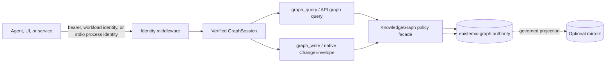

# Centralized knowledge-graph coordination

GraphOS exposes one authenticated, tenant-aware graph boundary over MCP and the
API gateway. The Rust epistemic-graph engine is the durable authority; optional
databases are interoperability mirrors or governed external read sources, never
alternate authorities.

## Request and mutation authority

```mermaid
flowchart LR
    Client[Agent, UI, or service]
    Identity[Identity middleware]
    Session[Verified GraphSession]
    Query[graph_query / API graph query]
    Write[graph_write / native ChangeEnvelope]
    Facade[KnowledgeGraph policy facade]
    Engine[(epistemic-graph authority)]
    Mirror[(Optional mirrors)]

    Client -->|bearer, workload identity, or stdio process identity| Identity
    Identity --> Session
    Session --> Query --> Facade --> Engine
    Session --> Write --> Facade --> Engine
    Engine -. governed projection .-> Mirror
```

The identity layer validates the caller and mints the immutable
`GraphSession`. Tenant, graph, scopes, audience, policy revision, placement
epoch, and trace context come from that server-controlled session. Request
payloads cannot assert or override them.

Reads use MCP `graph_query` or `/api/graph/query`. A caller may select a
supported query language—including native Cypher—inside that typed operation;
the facade still applies scope, tenant, policy, snapshot, redaction, and audit
rules. There is no public raw-Cypher HTTP route and no backend-specific HTTP
forwarding from LadybugDB or another embedded database.

Mutations use `graph_write`, governed ingestion, or native
`ApplyChangeEnvelope`. Query-language writes compile onto the same guarded
mutation authority; no direct backend route receives separate durability or
authorization semantics. A successful response therefore means the engine has
accepted the operation under the verified session and its durability contract.

## Concurrency and backpressure

GraphOS reuses the process-owned engine transport and bounds work before it
reaches the engine. The engine owns transaction serialization, placement,
fencing, WAL/Raft durability, and snapshot visibility. Queue workers use
`WorkItem` leases and fenced commits; connector workers use native
`ChangeEnvelope` application and engine-owned cursors.

This design avoids per-agent database writers and per-agent broker consumers.
Registered agents are durable graph identities; only active work is leased to a
bounded executor fleet. Backpressure propagates through typed tool/API outcomes
rather than silently falling back to a local database.

## Cache identity

Any served read cache must bind all authority-changing inputs:

- tenant and actor authorization fingerprint;
- policy and redaction revisions;
- named graph, placement/catalog epoch, and graph snapshot;
- clearance and requested projection.

If an authoritative revision is unavailable, the read bypasses cache. Cached
post-policy rows are never shared across tenants or authorization contexts.

## External graph systems

Neo4j, PG-AGE, LadybugDB, GraphQL APIs, and other epistemic-graph deployments
connect through the external-graph ingestion contract. The connector discovers
schema metadata using bounded read-only operations, produces an opaque schema
snapshot, and waits for approval of a generated mapping policy. Connection
locations, credentials, TLS profiles, and customized ontologies remain runtime
references outside the repository.

Approved ingestion translates source records into governed `ChangeEnvelope`
objects with tenant, ACL, provenance, mapping version, and cursor evidence. The
engine commits object, policy, lineage, cursor, and outbox effects together.

## Operations

Use `agent-utilities-doctor` (or `graph_configure action=system_doctor`) to
inspect redacted readiness. Network deployments require verified identity,
HTTPS/native TLS, audience and policy binding, and ACL enforcement. Local
development uses stdio process identity or the same authenticated network
boundary; there is no anonymous served profile.

For implementation details, see:

- [Graph authority convergence](architecture/graph-authority-convergence.md)
- [Identity inheritance](architecture/identity-inheritance.md)
- [Connectors and ingestion](architecture/kg_connectors_and_ingestion.md)
- [Privacy-safe external ingestion](architecture/privacy-safe-external-ingestion.md)
