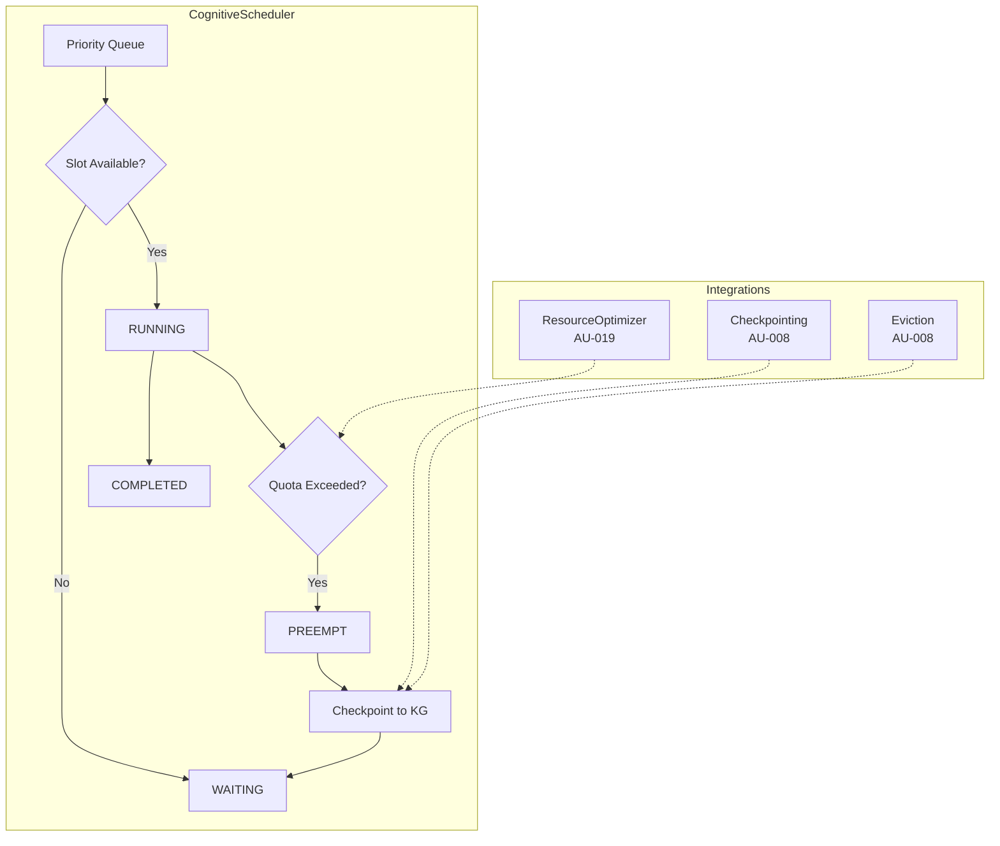
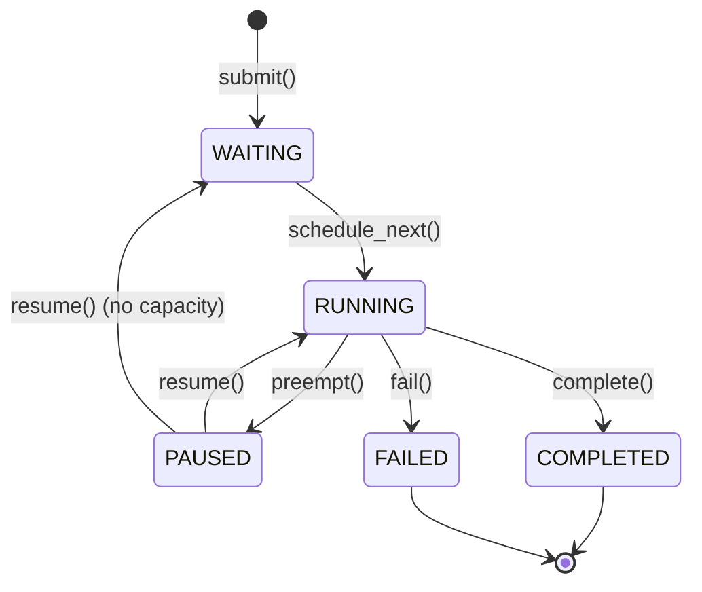

# CONCEPT:OS-5.2 — Cognitive Scheduler

> Priority-aware preemptive scheduling with context paging and token quota enforcement.

## Overview

The Cognitive Scheduler (`agent_utilities/core/cognitive_scheduler.py`) manages competing agent demands in real-time. Unlike the existing cron-based `scheduler.py` (which runs periodic jobs), the Cognitive Scheduler manages **live agent processes** — tracking their priority, token usage, and execution state.

It composes three existing primitives into a kernel-level orchestration layer:
- **AU-019 (Resource Optimizer)**: Token budget tracking per specialist
- **AU-008 (Checkpointing)**: Context snapshot/restore for preempted agents
- **AU-008 (Eviction)**: Context paging under memory pressure

## Architecture



## Priority Levels

| Level | Name | Value | Use Case |
|:---|:---|:---|:---|
| **CRITICAL** | `SchedulerPriority.CRITICAL` | 0 | `systems-manager` kernel operations |
| **HIGH** | `SchedulerPriority.HIGH` | 1 | User-facing interactive queries |
| **NORMAL** | `SchedulerPriority.NORMAL` | 2 | Background agent tasks |
| **LOW** | `SchedulerPriority.LOW` | 3 | Maintenance, cron jobs, cleanup |

## Process States



## Configuration

| Variable | Default | Description |
|:---|:---|:---|
| `COGNITIVE_SCHEDULER_ENABLED` | `True` | Enable/disable the scheduler |
| `MAX_CONCURRENT_AGENTS` | `5` | Maximum simultaneously running agents |
| `AGENT_TOKEN_QUOTA` | `100000` | Default per-agent token budget |
| `PREEMPTION_THRESHOLD_PCT` | `0.85` | Quota fraction triggering warning |

## Usage

```python
from agent_utilities.core.cognitive_scheduler import (
    CognitiveScheduler,
    SchedulerPriority,
)

scheduler = CognitiveScheduler(
    max_concurrent=5,
    default_token_quota=100_000,
)

# Submit a high-priority user query
proc = await scheduler.submit(
    agent_id="gitlab-specialist",
    priority=SchedulerPriority.HIGH,
    task="List all open merge requests",
)

# Record token usage
scheduler.record_tokens(proc.id, 5000)

# Preempt if over budget
preempted = await scheduler.enforce_quotas()

# Complete when done
await scheduler.complete(proc.id)
```

## KG Persistence

Each `AgentProcess` is persisted as an `AgentProcessNode` in the Knowledge Graph, linked to the parent agent via `EXECUTED_BY` edges and to checkpoints via `CHECKPOINTED_TO` edges. This enables:
- **Observability**: Monitor all running and historical processes
- **Auditing**: Track token usage and preemption events
- **Analytics**: Identify bottleneck agents and quota patterns
