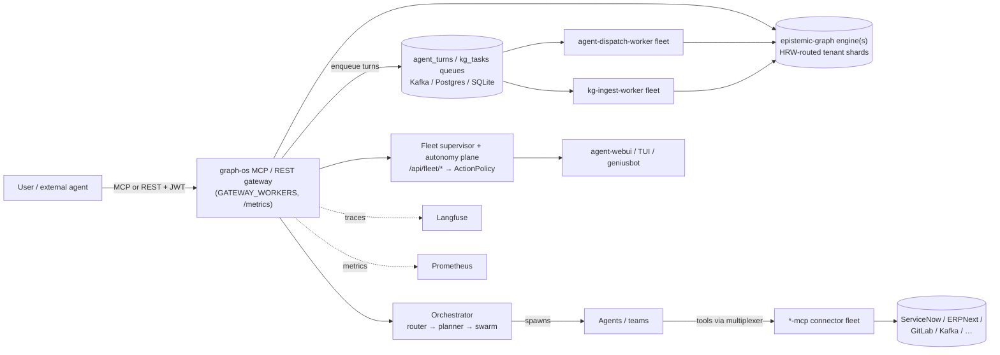

# The Ecosystem — How agent-utilities Fits

agent-utilities is the **spine** of a larger `agent-packages/*` ecosystem: the
shared library + knowledge graph + orchestration that every other piece builds
on. This page maps the pieces and how a request flows through them.

> Hostnames below are generalized placeholders (`*.example.arpa`). Substitute
> your own. No secrets or real endpoints appear here.

## The pieces (one-liners)

### Core
| Project | Role |
|---|---|
| **agent-utilities** | The foundational library: Pydantic-AI harness, graph orchestration, KG facades, ontology, config, MCP server infra (`graph-os`, `mcp-multiplexer`, REST gateway). |
| **epistemic-graph** | The Rust-native graph compute engine (L1 working store + OWL/Datalog reasoning), reached out-of-process over MessagePack/UDS — **no PyO3**. Durable tiers: Postgres/pg-age, with LadybugDB/Neo4j/FalkorDB available. |

### Frontends (all consume the agent-utilities REST gateway / MCP)
| Project | Role |
|---|---|
| **agent-webui** | React web dashboard — chat, graph explorer, ontology Object/Vertex views, and the **Fleet Supervisor** (swarm health, topology, pause/kill, approvals). |
| **agent-terminal-ui** | Textual TUI — sessions, goals, durable task queue, multi-session agent view. |
| **geniusbot** | PySide6 desktop cockpit — service/finance/infra dashboards + embedded terminal. |

### Capabilities & connectors
| Project | Role |
|---|---|
| **agents/&ast;** (the `*-mcp` fleet) | ~50 MCP connectors to enterprise systems (ServiceNow, ERPNext, GitLab/GitHub, LeanIX, Archi, Twenty CRM, Camunda, Keycloak, OpenBao, Technitium DNS, Portainer, Kafka, …). Each runs as a streamable-http container; all template off `create_mcp_server()`. |
| **universal-skills** | 40+ reusable agent skills (deployment, infra, security, workflows) — including the day-0 bootstrap workflow. |
| **skill-graphs** | Generates skill-graph definitions and capability composition. |

### Enterprise service layer (optional, à-la-carte)
| Service | Role | When |
|---|---|---|
| **Keycloak** | OIDC/SAML SSO — root of auth trust | enterprise |
| **OpenBao** | Secrets engine / vault | single-node prod + enterprise |
| **Technitium DNS** | Authoritative `.arpa` zone | enterprise (swarm) |
| **Caddy** | HTTPS ingress / reverse proxy | single-node prod + enterprise |
| **Langfuse** | LLM observability / tracing | any (optional) |
| **LGTM** | Prometheus/Loki/Grafana/Tempo observability | enterprise |
| **Postgres/pg-age** | Durable KG L2 tier; also the shared fleet state store (`STATE_DB_URI`) | single-node prod + enterprise |
| **Kafka** | Event backbone + `kg_tasks`/`agent_turns` work queues for ingest and dispatch workers | enterprise (optional) |

### Scale-out workers (optional, any host)

| Process | Role | Flag |
|---|---|---|
| **engine shards** | Tenant-partitioned `epistemic-graph` engines; clients route graphs by HRW hash | `GRAPH_SERVICE_ENDPOINTS` (see `docker/engine-shards.compose.yml`) |
| **kg-ingest-worker** | Joins the `kg-ingest` consumer group and drains the ingest task queue as an engine client | `TASK_QUEUE_BACKEND=kafka` (or `postgres`) |
| **agent-dispatch-worker** | Claims session-keyed agent turns and executes them with durable write-back | `AGENT_DISPATCH_BACKEND=queue` |

## How a request flows

1. A user or external agent calls **graph-os** (MCP) or the **REST gateway**;
   requests are scoped to a server-minted `ActorContext` (JWT identity,
   OS-5.14) and rate-limited per tenant.
2. The engine tier handles KG reads/writes — one local engine by default, or
   tenant-sharded engines behind client-side HRW routing at scale; the
   **orchestrator** decomposes goals into teams/swarms. In queue mode, agent
   turns and ingest tasks flow through durable queues to stateless
   **dispatch/ingest worker fleets** on any host.
3. Spawned agents reach external systems through the **`*-mcp` fleet**, federated
   by the **multiplexer** (per-child limits, circuit breakers, restart-on-crash).
4. The **fleet supervisor** surfaces health/topology/events/approvals to the
   UIs, and the opt-in **autonomy control plane** (ActionPolicy-gated
   reconciler, playbooks, deploy watch, autoscaler) acts on them; traces flow
   to **Langfuse** and metrics to **Prometheus** when configured.

## Deploying the ecosystem

The connector fleet and the backend are deployed by tier — see
[Day-0 Deployment](guides/day0.md) and the recipes
([tiny](recipes/tiny.md) · [single-node prod](recipes/single-node-prod.md) ·
[enterprise](recipes/enterprise.md)). The canonical service list lives in the
generated `mcp-fleet.registry.yml`.
